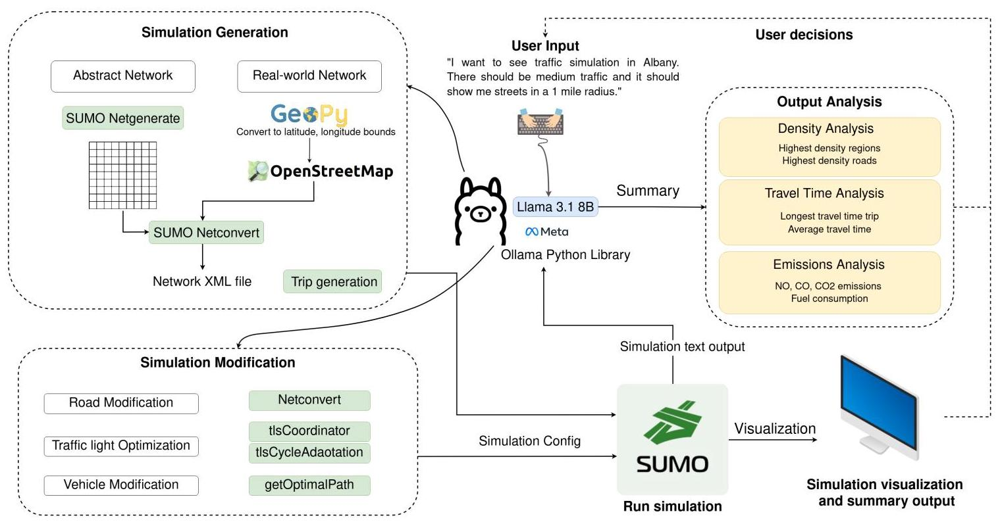
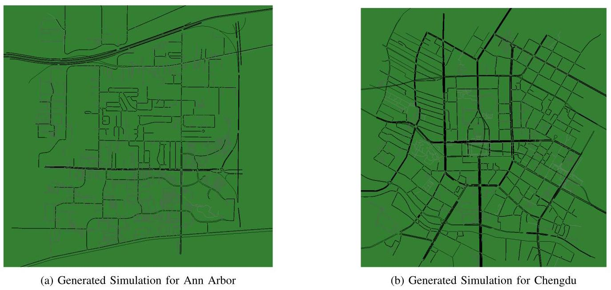
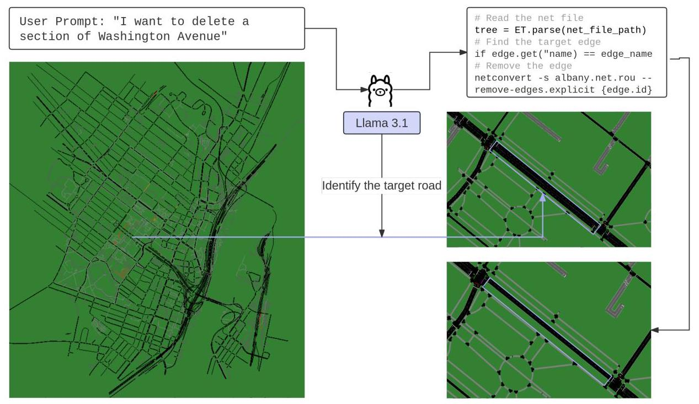
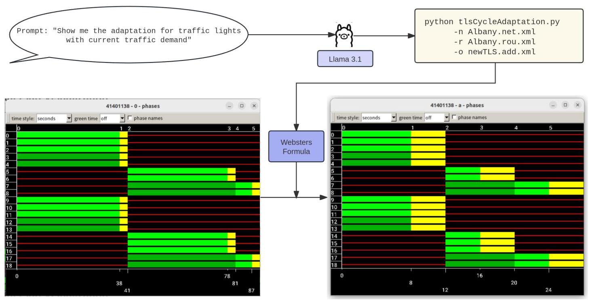
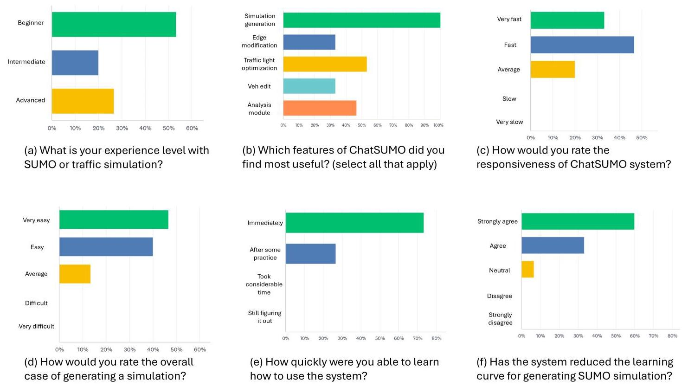

# ChatSUMO: Large Language Model for Automating Traffic Scenario Generation in Simulation of Urban MObility

Shuyang Li, Talha Azfar, and Ruimin Ke, Member, IEEE

Abstract-Large Language Models (LLMs), capable of handling multi-modal input and outputs such as text, voice, images, and video, are transforming the way we process information. Beyond just generating textual responses to prompts, they can integrate with different software platforms to offer comprehensive solutions across diverse applications. In this paper, we present ChatSUMO, an LLM-based agent that integrates language processing skills to generate abstract and real-world simulation scenarios in the widely-used traffic simulator - Simulation of Urban MObility (SUMO). Our methodology begins by leveraging the LLM for user input, which adapts it to relevant keywords needed to run python scripts. These scripts are designed to convert specified regions into coordinates, fetch data from OpenStreetMap, transform it into a road network, and subsequently run SUMO simulations with the designated traffic conditions. The outputs of the simulations are then interpreted by the LLM resulting in informative comparisons and summaries. Users can continue the interaction and generate a variety of customized scenarios without prior traffic simulation expertise. Any city available from OpenStreetMap can be imported, and for demonstration, we created a real-world simulation for the city of Albany. ChatSUMO also allows simulation customization capabilities of edge edit, traffic light optimization, and vehicle edit by users through the web interface.

Index Terms-Traffic simulation, Large Language Model, Simulation scenario generation, Simulation automation, SUMO

## I. INTRODUCTION

THE increasing complexity of modern transportation systems, with diverse vehicle types and traffic patterns, poses significant challenges for traffic management and forecasting [1], [2]. This complexity not only escalates transportation costs but also contributes to environmental pollution. The need for improved traffic planning and operation has led to a surge in studies focused on optimizing transportation systems, e.g., the strategic reconstruction of road infrastructure [3], [4]. Traffic simulation has emerged as a powerful tool for modeling current traffic scenarios, predicting future conditions, and mitigating negative impacts, all while reducing the costs associated with real-world traffic planning implementations [5]. Simulation tools, integrated with scenario engineering and transfer learning, could also enhance learning tasks through synthetic data generation [6]. Among these tools, SUMO (Simulation of Urban MObility) stands out as a versatile, open-source platform for traffic simulation, used widely for urban mobility research, operations, and planning [7].

Despite its effectiveness, creating traffic simulation scenarios remains a time-consuming and complex process that typically requires specialized traffic-related knowledge and technical expertise [8]. Most mainstream simulation software, such as VISSIM, MATSim, and SUMO, demands that users define intricate parameters, including road networks, vehicle types, routes, traffic flows, and signal configurations [9], [10]. This requirement poses a significant barrier to entry, particularly for beginners who may lack professional experience in traffic modeling or technical expertise in the software itself. Even experienced transportation researchers may encounter a steep learning curve when working with unfamiliar simulation tools, limiting their ability to rapidly configure scenarios or perform quick modifications. Additionally, the setup process can be especially prohibitive for those who need quick and flexible access to results, such as urban planners, policymakers, or researchers conducting exploratory analyses. These users often seek a more streamlined and accessible approach, one that minimizes setup time and avoids extensive configuration.

The advent of Large Language Models (LLMs), trained on vast datasets, offers a promising solution by facilitating a more intuitive human-machine interaction. LLMs can interpret a wide range of inputs, including text, images, and videos, and generate corresponding outputs [11]. SUMO, a popular open-source traffic simulation software, requires users to either code networks from scratch or convert them from other platforms [12]. Additionally, users must manually define traffic flows or run Python scripts with specific parameters, adding to the software's learning curve [13].

To address these challenges, we present ChatSUMO, a cutting-edge LLM-based assistant designed to streamline the use of SUMO simulations. Powered by the Llama 3.1 model [14], [15], ChatSUMO enables users to generate and modify traffic simulation scenarios through simple textual inputs. This framework transforms user descriptions into executable SUMO simulations using Python scripts, effectively lowering the barrier for those without specialized knowledge. ChatSUMO operates by leveraging a multi-module architecture to facilitate user interaction and simulation generation. The system begins with an Input Module, which processes user inputs and converts them into relevant keywords. These keywords are then used by the Simulation Generation Module to create either abstract or real-world traffic scenarios in SUMO. ChatSUMO incorporates real-world traffic scenarios by using OpenStreetMap data to generate accurate road networks and traffic conditions. This ensures that simulations are representative of actual urban environments, providing users with realistic traffic management insights. Users can customize these scenarios using the Customization Module, which supports a range of modifications, including edge and lane edits, traffic light optimization, and vehicle route adjustments. The Analysis Module interprets the simulation outputs, providing detailed reports on traffic density, travel time, emissions, and more. The contributions are summarized as follows:

---

S. Li was with the Department of Civil and Environmental Engineering, University of Michigan, Ann Arbor, MI, 48109.

Talha Azfar and Ruimin Ke (e-mail: ker@rpi.edu) are with the Department of Civil and Environmental Engineering, Rensselaer Polytechnic Institute, Troy, NY, 12180.

Manuscript received xxx, 2024; revised xxx.

---

- LLM Integration: ChatSUMO leverages a Large Language Model (LLM) to automate simulation generation in SUMO, allowing users to create scenarios with natural language commands, removing the need for coding or specialized traffic expertise.

- Text-to-Simulation for Accessibility: By converting text inputs into simulation scenarios, ChatSUMO enables a wide range of users to quickly generate simulations, making it valuable for agencies, institutions, and engineers involved in transportation planning.

- Modular Framework: ChatSUMO's four-module design (Input, Simulation Generation, Customization, and Analysis) allows for efficient scenario creation, customization, and analysis, and is adaptable for future enhancements.

- Interactive Customization: Users can adjust simulations iteratively, modifying roads, traffic lights, or vehicle types via text commands, offering a more flexible, dynamic alternative to static simulation setups.

- Real-World Data Integration: ChatSUMO imports data from real-world sources, e.g., OpenStreetMap, to create realistic traffic scenarios, providing users with accurate, location-specific simulations with minimal setup.

The rest of the paper is structured as follows: we first review related literature on traffic simulation and the application of LLMs in this domain. We then detail the methodology behind ChatSUMO's design and functionality, followed by an experimental evaluation of its performance in generating and modifying traffic simulations. Finally, we discuss potential applications and conclude with future work directions aimed at enhancing the system's capabilities.

## II. LITERATURE REVIEW

LLM research is focused on enhancing natural language processing objectives including text classification, language inference, and semantic understanding. While they face challenges in reasoning, ethics, and conflict resolution, they have proven to be excellent tools for summarization, contextual comprehension, and question answering [11]. The term 'large language model' generally refers to transformer architecture based language models consisting of billions of parameters and trained on extensive text data [16]. Notable early examples include GPT-1 from OpenAI [17] and the T5 model from Google [18], which drastically outperformed prevailing architectures such as Multi-range reasoning BiLSTM [19]. Modern LLMs such as GPT-4 [20], LLAMA 3 [15], and Gemini [21] have undergone training on vast quantities of data and their behavior has been fine tuned by human feedback, such that the most competitive models excel at following instructions and remaining focused towards specified tasks [22]. Due to their breadth of knowledge and ability to provide tailored, instant feedback, these LLMs show great promise in the enhancement of education where precise answers or subject matter experts may not be easily accessible [23]. Wang et al. propose a framework called TAO (Text, Audio, and Output) to enhance AI's capabilities in producing imaginative scenarios; the paper emphasizes the importance of integrating multimodal data and advanced scenario engineering to achieve this goal, which could be a fugure direction of ChatSUMO [24].

There are various general and task specific benchmarks available for LLM evaluation such as the Open LLM Leader-board [25] and Livebench [26], which show that the top performing LLMs from OpenAI, Meta, Anthropic, and Google do not have major differences in reasoning and analysis. This makes the choice of LLM for a particular task an arbitrary one, especially if it involves simple prompts requiring no creativity or in-depth reasoning.

In the transportation field some LLM related work has emerged recently, focusing primarily on safety. TrafficSafe-tyGPT [27] finetuned Llama on a custom dataset curated from NSTHA Model Minimum Uniform Crash Criteria guidelines, FHWA Highway Safety Manual, and ChatGPT generated data. The model learned domain specific concepts allowing it to accurately answer challenging transportation safety questions with concise answers. ChatScene [28] was developed to generate safety-critical scenarios for autonomous vehicles as text descriptions which are then broken down into sub-descriptions that can be used to instantiate the scenario in CARLA. A database of scene components and descriptions was created that enabled ChatScene to assemble scene scripts from LLM output. AccidentGPT [29] combines scene perception and trajectory prediction using computer vision on camera views from multiple vehicles and roadside units for environmental understanding and collision avoidance. A GPT4 based reasoning module is then used to provide proactive cues for human drivers and traffic management authorities. It also stores key moments and uses them for later analysis to improve future autonomous driving decisions. Traffic Performance GPT (TP-GPT) proposes an intelligent chatbot designed to aid in transportation analytics. The TP-GPT utilizes LLMs to generate accurate SQL queries and interpret traffic data, leveraging a real-time database of traffic information [30].

Language models have been used in combination with computer vision for scene understanding for autonomous driving in a variety of techniques [31]. ADAPT (Action-aware Driving cAPtion Transformer) [32] provides an innovative end-to-end transformer-based approach for generating action narration and reasoning in self-driving vehicles. ADAPT employs multitask joint training to bridge the gap between driving action captioning and control signal prediction. ChatGPT was used as a co-pilot for assisted driving in [33] by converting vehicle telemetry, road state, human intention, and descriptions of the available controllers into a combined prompt. The response from the LLM determines the course of action most appropriate for those conditions. The system can switch between aggressive and gentle controllers, and handle lane changes and overtaking. The DiLu framework [34] incorporates GPT based reasoning and reflection modules to perform decision making for an autonomous vehicle and has the ability to learn continuously. The system is able to use LLM common sense chain of thought reasoning from prompts tailored to the scenario which generates the final decision. Meanwhile the decision sequences stored to memory can be reflected upon by the LLM to find mistakes and correct them. Similarly, LanguageMPC [35] used an LLM for high level autonomous driving decision making, converting text descriptions to mathematical representations to be used by the model predictive controller. It was able to handle multi-vehicle coordinated control by generating a convoy level decision that each vehicle interprets according to its internal state. BEVGPT is a generative pre-trained model that integrates driving scenario prediction, decision-making, and motion planning into a minimalist autonomous driving framework using only bird's-eye-view images, outperforming previous methods in key metrics and pioneering long-term BEV image generation for autonomous driving [36].

Microscopic traffic simulations such as VISSIM, SUMO, and MATSim are the basis of planning and optimization studies for traffic networks [37] and a few recent works have incorporated LLMs with microsimulation tools. PromptGAT [38] leverages LLM inference to understand how weather conditions, traffic states, and road types influence traffic dynamics, which is used to inform policy in reinforcement learning for traffic signal control. This additional information about real-world conditions helps to reduce the simulation to reality gap. In a similar vein, language assisted traffic light control in [33] employs an LLM to understand the traffic observations and recommended actions from reinforcement learning, which then generates a justification for the action using chain of thought reasoning. Anomalous traffic conditions like blockages, and the presence of emergency vehicles are some of the factors the LLM takes into consideration before selecting the appropriate action. Li et al. introduces a framework called SeGPT for scenario generation, which utilizes prompts and trajectory definitions to create complex driving scenarios; this framework combines parallel driving, LLM, and real-world data [39]. In [40], natural language queries are translated into differentiable loss functions for specified vehicle trajectories in order to facilitate scenario based traffic simulations. These scenarios include car following and collision trajectories for a few vehicles which are compared to ground truth from nuScenes dataset. There have also been advances in using LLM for microscopic traffic behavior modeling, such as in [41], Chen et al. proposes a LLM-based method for car following behavior modeling; however, they do not necessarily include microscopic traffic simulations.

A combination of multiple LLMs and traffic foundation models called TrafficGPT [42] was used to analyze traffic data and provide insights to decision makers for urban transportation system management. It has enabled the thoughtful breakdown of complex and detailed tasks, making it possible to complete abstract assignments progressively through the step-by-step use of foundation models. A spatio-temporal LLM called UrbanGPT [43] was used to learn various urban data such as the flow of taxis in a region over time. The temporal and spatial details were used as input and the LLM generated tokens were passed through a regression layer for precise predictions.

To summarize, the use of LLMs in transportation has focused on descriptions related to traffic safety, transportation analytics, scene understanding, and decision making support for autonomous vehicles. The combination of microsimulation and LLMs has empowered planning and optimization by including descriptions for both input and output analysis, which enables clearer reasoning and explainable decisions. However, the natural language interaction with LLMs provides an unexplored opportunity to increase accessibility to simulation tools, including generation, modification, and analysis, which ChatSUMO accomplishes.

## III. METHODOLOGY

## A. Overview

The overview of ChatSUMO, as Figure 1, presents a structure of the proposed system. The framework is designed to assist traffic simulation generation. ChatSUMO integrates advanced chat model capabilities into the SUMO platform to enhance the efficiency and accuracy of traffic simulation and modification. This integration leverages the power of the LLM to define, modify, and analyze traffic scenarios, providing real-time insights and dynamic adjustments. Our methodology begins by utilizing the LLM for user input, which it converts to relevant keywords needed to run python scripts. These scripts are designed to create an abstract network or convert specified real-world regions into geographic coordinates, fetch data from OpenStreetMap, transform it into a road network, and subsequently run a SUMO simulation with the designated traffic conditions. We use Llama 3.1 8B, an open-source model, to parse the inputs and provide a summary of the output. This particular model is chosen as it is the newly released version from Meta and performs competitively in benchmarks. The 8B version of this model responds very quickly on even modest computer hardware, allowing for more accessibility. Since there are no code generation or problem solving tasks being performed by the LLM, a quantized version of the model may be used instead for more efficient deployment on a web server.

The user can then request another simulation with some modifications which create different traffic conditions while the LLM retains context for continued interaction. The core component of this methodology is the LLM-reasoning framework, which is responsible for three critical modules: Input Module, Simulation Generation Module, Simulation Customization Module, and Simulation Analysis Module.

## B. LLM-reasoning

The LLM-reasoning framework serves as the core element of ChatSUMO's functionality. The process of our reasoning module is illustrated in Figure 1, encompassing input, simulation generation, modification, and analysis modules. In this work, we consistently use Llama 3.1 to decode the user input. It first analyzes the input text to look for requirements (type of network, city for simulation, traffic volume) needed to generate the simulation scenario. Based on this input, it generates a python dictionary to control functions that can run the simulation. The temperature parameter of the LLM is set to zero for this purpose, ensuring that only the required output is generated with no creative input from the LLM. After running the initial simulation, the LLM analyzes the simulation output, producing a summary report for the user. Then ChatSUMO asks the user what modification they want to make to the simulation, and the modification module will comprehend the user's needs and change the simulation scenario based on the specific commands. Finally, the analysis module analyzes the results of each simulation, and the user can choose to compare the output from each step of the modification process, which includes information like traffic density, average travel time, emissions, and fuel consumption.

Fig. 1: ChatSUMO Framework

Input Module. The Input Module deals with all the input information from users at every stage of the process. In order to reduce the difficulty of creating traffic simulation scenarios, we have simplified the user input as much as possible, so that the user can create the desired simulation scenarios using natural language without entering technical descriptions. Based on the Meta Llama3.1 model, we create SUMOInput as the traffic scenario identification model for analyzing users input. In this model, we customize it with some specified prompts, e.g., "You are taking user input to generate keywords for a transportation simulation. Analyze the user input and give a python dictionary with these keywords ...". To generate the initial simulation scenario, an example of user input can be: "Generate a simulation in city Albany with a radius of 3 miles, and the volume of traffic should be medium." After being parsed by ChatSUMO, the natural language input is transformed into a python dictionary. There are different dictionaries for different modules of the program, for example in the modification module python dictionaries include three parts: the decision, types, and the specific requirement. The decision input simply requires a yes or no answer from the user indicating whether to proceed with modification or not. For the input of types, SUMOInput is expected obtain the type of the decision question (type of network, kind of modification). The specific requirement inputs contain the user's detailed requests about the simulation or its modification (number of grids, which street to be removed). The generation module also requires a simple three element dictionary. Continuing the example above, the dictionary created from user input would be "\{city: Albany, radius: 3 miles, traffic_condition: medium\}".

Generation Module. To generate the initial scenario of the simulation, we build the scenarios in SUMO by inputting the desired requirements from the user. Currently, we can generate two types of simulation networks: abstract scenarios (e.g., spider, grid networks) and real-world networks. For real-world networks, users can enter the name of the city, size as radius, and the condition of traffic (e.g., light, medium, heavy). After the user inputs a simulation scenario, the input is analyzed and understood by Llama, and then it is extracted to keywords as a python dictionary. These keywords are not directly transmitted to python, as ChatSUMO will analyze the user input and provide feedback on whether the input is sufficient to construct the simulation scenario.

After the simulation generation module gets sufficient information, these keywords are processed by a python script which executes commands for generating the simulation. To download the OSM (OpenStreetMap) of the required region of city, ChatSUMO executes "osmGet.py" to obtain the osm map in the defined region. Then it executes "netconvert" commands which convert the OSM map to a network file in SUMO. After conversion, it utilizes "randomTrips.py" to generate random trips in the converted network with the required traffic volume. Finally, it creates the configuration file which can be executed by SUMO.

Fig. 2: Simulation Generation

Customization Module. Based on the generated simulation, ChatSUMO supports the customization of simulation from the user's text descriptions by utilizing multiple customizing modules. After users enter their modification, the input module analyzes and matches the keywords with some predefined customizing API. Through these APIs, users can remove edges, optimize traffic lights, and add vehicles to the simulation.

Edge and Lane Edit: Users can make modifications to the roads in the simulation by simply telling ChatSUMO which lanes to remove, e.g., "I want to remove Madison Avenue" or "I'd like to remove the first lane in Madison Avenue". To realize this function, ChatSUMO first checks whether the modified road is in the generated simulation, if so, the edit module obtains the modification type for the road. Then the module extracts the name of road as "Madison Avenue", and generates the terminal command for the SUMO tool netconvert through a python script to finally modify the network. As the user only inputs the name of the removed street, multiple edges might be found corresponding to that name. In that case, ChatSUMO asks for the user's decision as to which edge should be removed.

Traffic Light Offset: Traffic light offsets are useful at dealing with multiple sequential traffic lights to increase the efficiency of traffic flow. Users can enter commands like "I want to set offsets to all the traffic light in the simulation". With the traffic light offsets, intersections are capable of green wave control. To implement this function, once ChatSUMO receives the key word "traffic light offset", it will generate a terminal command to call the tlsCoordinator.py python script. This modifies the traffic light offsets to coordinate them based on the current traffic demand, and generates a tlsOffstes.add.xml file which can be loaded into SUMO.

Traffic Light Adaptation: Users can enter a command such as "Please perform traffic light adaptation" to optimize the traffic-light cycle in the simulation with the traffic light adaptation script. To implement this function, ChatSUMO will call the tlsCycleAdaptation.py python script to generate an additional newTLS.add.xml file to the SUMO configuration, which modifies the signal cycle length and the duration of green phases according to Webster's formula to best accommodate a given traffic demand.

Vehicle Generation: The vehicle generation API is used to generate a vehicle with a given departure and arrival edge-pair. After the user has entered the origin and destination, ChatSUMO first checks whether these roads are contained in the network, if not, it informs the user, "Entered Roads are not in the current network". To generate a route for the vehicle, the module calls getOptimalPath to find the optimal (shortest or fastest) path from the depart edge to the arrival edge by using Dijkstra's algorithm. Then, a vehicle with the assigned route is added into the cityname.rou.xml file, which would be loaded into SUMO simulation later.

Vehicle Type Edit: In the initial traffic simulation settings, both gas vehicles and electric vehicles are generated, and the proportion of them is 0.3 and 0.7 . To change the proportion of vehicle types, users can utilize the vehicle type edit module. In this customization, ChatSUMO creates a vehicle type dictionary which stores the proportion for each vehicle type. After the user has entered the modified proportions, ChatSUMO utilizes RandomTrips.py to generate the new route file, including the customized vehicle proportions.

Analysis Module. This module processes data from the output xml file generated by the simulation and interprets it into an analysis report, which involves density analysis, travel time analysis, and emission analysis. Based on the output of simulation, ChatSUMO can identify the top 10 congested roads, average travel time, the quantity of emitted pollutants, including \( {\mathrm{{CO}}}_{2},\mathrm{{CO}} \) , PMx, and the fuel consumption. Every time a customization is made, ChatSUMO runs the new configuration, and the output of the simulation is stored into a database. Afterwards, ChatSUMO asks the user if they want to make a comparison with any previous simulation, giving a more intuitive summary of how effective the modifications were.

## IV. EXPERIMENTAL RESULTS

ChatSUMO with interactive web interface has been developed using the Streamlit framework in Python. An example for simulation generation with the interface is visualized in Figure 6. Interaction with each of the modules can be done in the same manner, and the results of various experiments are presented. Furthermore, to gauge the usefulness of the interface, users of various experience levels were asked to evaluate ChatSUMO and give their feedback.

## A. Setup

The experiments were performed on Ubuntu 22.04 running on an Intel Core i9 13900K with NVIDIA 4090 GPU and 16GB RAM. We utilized the Ollama library to run Meta's Llama3.1 for parsing text input by users. In the experimental part, we evaluate its performance in two different types of road networks, an abstract network and a real-world network. We focus on the metrics of average traffic density, average travel time (TT), \( {\mathrm{{CO}}}_{2} \) emission and fuel consumption (Fuel Cons) for evaluation. Due to the significant variation in vehicle distribution across different road types, we calculated the average traffic density by summarizing the density of the top 10 most congested roads and computing the mean of this list.

## B. Simulation Generation

The accuracy of simulation generation is fundamental to the overall process and is critical to the performance of ChatSUMO. To assess the accuracy and effectiveness of the simulation generation, we created two types of networks. For the real-world network, we generated a simulation of a 1 mile radius around downtown Albany, New York. To ensure comparability in size and street density, we also created a synthetic spider-like network, consisting of 20 radial arms, 10 concentric circles, with a 150 meter distance between the circles. The setup for traffic condition for both simulations is "medium", which is predefined as 2000 vehicles per hour. To meet these requirements, the user input is "I want to see a traffic simulation in Albany. There should be medium traffic and it should show me streets in a 1 mile radius.". The generated real-world simulation is shown in Figure 4. To validate the accuracy of the real-world network, we calculate the number of edges in the network created by ChatSUMO and the network manually downloaded from OSM. The number of the former is 30570 and the that of the latter is 29325, indicating that the difference is \( {4.2}\% \) , which shows that no further manual adjustment needs to be performed on the output of the generation module. Generating a simulation using the system takes approximately one minute from user input to the final summary. In contrast, manually constructing the same simulation from scratch can take around 15 minutes. Given the expertise required to effectively use SUMO, beginners in traffic simulation may take even longer to develop a complete simulation. This highlights the significant time-saving contribution of ChatSUMO, particularly for novice users.

To further verify the reliability of ChatSUMO simulation generation, in addition to Albany, we also generated simulation scenarios for Ann Arbor, Michigan, and Chengdu, China, using ChatSUMO. The generated SUMO simulations are shown in Figure 3. Through these two figures, we can find that ChatSUMO successfully generates traffic simulations for these two city centers, and by comparing the edges as mentioned before, the accuracy of the generated road network in these two cities is 96% and 95%, respectively.

To evaluate how well the system handles different scales of simulations, we conduct another experiment to record the processing time for simulation generation in different scales, from small-scale intersections to city-wide traffic networks. In this experiment, we set the scale of the network at three levels (0.5 mile, 1 mile, 3 miles) to simulate different traffic conditions in central Albany. The experiment result is shown in Table I. It can be observed that for small-scale intersections, the traffic simulation can be generated by ChatSUMO in 10 seconds, regardless of the traffic conditions. On a modest scale of 1 mile, a traffic simulation can be generated in under 30 seconds. However, for city-wide traffic simulations, the processing time increases significantly due to the complexity of the larger network and the higher volume of vehicles. Thus, the time required for simulation generation is influenced by the scale of the simulation, traffic conditions, and the CPU performance of the machine used.

TABLE I: Simulation Generation Experiment

<table><tr><td>Traffic condition</td><td>Range (mile)</td><td>Processing Time (s)</td></tr><tr><td rowspan="3">Medium</td><td>0.1</td><td>8.64</td></tr><tr><td>1</td><td>19.68</td></tr><tr><td>3</td><td>99.37</td></tr><tr><td rowspan="3">Heavy</td><td>0.1</td><td>9.49</td></tr><tr><td>1</td><td>23.38</td></tr><tr><td>3</td><td>174.3</td></tr></table>

## C. Edge Modification

Blocking major streets due to events such as construction or traffic accidents can significantly disrupt urban traffic, altering the overall flow and causing congestion. To assess the performance of edge editing, we implement the edit prompt in the real-world network. In this experiment, we remove three different edges in the simulation of Albany, which are Washington Avenue, Lark Street, and Orange Street. At the same time, we compare these changes in two different traffic conditions, with volumes of 2000 and 3000 vehicles per hour, to evaluate the impact of the modifications. The visualization of this modification is presented in Figure 4, which shows that our text commands successfully modified the specified street in the simulated network.

The simulation results of this experiment are shown in Table II. For medium traffic, the removal of streets increases the average density of main streets, e.g. removing Washington Avenue leads to a increase of \( {3.32}\% \) on density. Similarly, this removal increases the average travel time slightly and also boosts the \( {\mathrm{{CO}}}_{2} \) emission and fuel consumption. However, as the original traffic level of removed streets decreases, the impact on different metrics gets smaller. For Heavy traffic, interestingly, the modification of streets decreases the average density of main streets.

Fig. 3: Effectiveness Verification of the Simulation Generation Module

Fig. 4: Edge Customization Experiment

TABLE II: Edge Edit

<table><tr><td>Traffic condition</td><td>Blocked Road</td><td>Density(veh/km)</td><td>TT(s)</td><td>\( {\mathrm{{CO}}}_{2} \) Emission(t)</td><td>Fuel Cons(t)</td></tr><tr><td rowspan="4">Medium</td><td>Initial Network</td><td>195.90</td><td>287.62</td><td>1.60</td><td>0.51</td></tr><tr><td>Washington Avenue</td><td>202.48</td><td>291.44</td><td>1.63</td><td>0.52</td></tr><tr><td>Lark Street</td><td>204.76</td><td>289.29</td><td>1.61</td><td>0.51</td></tr><tr><td>Orange Street</td><td>203.67</td><td>286.77</td><td>1.60</td><td>0.51</td></tr><tr><td rowspan="4">Heavy</td><td>Initial Network</td><td>220.61</td><td>293.06</td><td>2.44</td><td>0.78</td></tr><tr><td>Washington Avenue</td><td>212.06</td><td>302.69</td><td>2.52</td><td>0.80</td></tr><tr><td>Lark Street</td><td>212.92</td><td>297.22</td><td>2.47</td><td>0.79</td></tr><tr><td>Orange Street</td><td>217.12</td><td>294.25</td><td>2.45</td><td>0.78</td></tr></table>

The possible explanation of this result is that in heavy traffic conditions, the density of main streets is already at a high level, and deleting an edge may reroute traffic flow to another direction, decreasing the traffic load for main streets. Unsurprisingly, the removal of roads also leads to a longer travel time in heavy traffic conditions. Compared to average density and travel time, \( {\mathrm{{CO}}}_{2} \) emission changed significantly when vehicles increase from 2000 to 3000, with an increase about 53.1%. Correspondingly, higher travel times lead to obviously higher fuel consumption. In summary, removing lanes of different density levels affects traffic, but the lower the original density of the removed lanes, the smaller the impact on overall traffic.

## D. Traffic Light Optimization

To optimize urban traffic signals, we have integrated two traffic light modules in ChatSUMO: one for setting signal offsets and another for adjusting the duration of the green light phase, which are designed for both multiple and single traffic light optimization. Traffic light offsets are a powerful tool when dealing with multiple traffic light coordination in urban traffic, creating a green wave for the traffic flow in a corridor, and increasing the efficiency of the network. To evaluate the impact of traffic light offsets on the two different networks, we run the simulation again with traffic light offset optimization using the command: "I want to set traffic light offsets for the simulation". Similarly, to optimize individual traffic signals, the traffic light adaptation module in ChatSUMO is utilized as shown in Figure 5. The traffic signal program shown in the figure is implemented at the intersection of Madison Avenue and South Pearl Street. As we can see from the figure, after the user inputs the prompt, Llama3.1 processes the text information and generates a command creating the newTLS.add.xml file to modify the signal phases in SUMO simulation.

To verify the effectiveness of traffic light offsets and adaptation, we compare traffic flow density, travel times, \( {\mathrm{{CO}}}_{2} \) emission, and fuel consumption (Fuel Cons) of the whole simulation. The experiment results are shown in Table III. We conducted tests and validations by utilizing the traffic light offset first and adapting traffic signals based on different traffic conditions (medium and heavy traffic condition). In medium traffic condition, it is evident that traffic light offsets significantly decrease the average density of top 10 roads by 11.64%, and it also reduces the average travel time by around 10 seconds. After utilizing traffic signal adaptation, however, the average density is even higher than the initial condition. On the contrary, the average travel time is reduced by 40 seconds, which is 15.68% shorter than the initial one. The probable explanation for the result is that the signal adaptation is designed to optimize each intersection individually without considering the coordination of intersections. At the same time, \( {\mathrm{{CO}}}_{2} \) emission is decreased by \( {0.2}\mathrm{t} \) and fuel consumption is decreased by 0.06t.

## E. Vehicle Edits

To compare the effectiveness of vehicle type customization, we prompt the proportion of electric vehicles to change from the default 0.3 to 0.5 , aiming to observe the difference of pollutant emissions and fuel consumption. We created a simulation of Paris with heavy traffic and then used the text input, "Half of the vehicles should be electric and the other half should be gas". ChatSUMO then modifies the vehicle type proportions, as shown in Figure 6. These figures also illustrate the interactions with the ChatSUMO interface, as well as the output generated by Llama 3.1. The interface provides an intuitive way for users to view the simulation summaries. After implementing the vehicle type changes, the analysis module compares two simulations, and also generates a brief summary about general traffic, traffic density, pollutant emission and fuel consumption. It is obvious that the emission of \( {\mathrm{{CO}}}_{2} \) and fuel consumption has fallen by a noticeable amount with the increase of electric vehicles. However, the traffic density does not vary a lot due to the vehicle dynamic parameters being quite similar for both vehicle types.

To see the impact on \( {\mathrm{{CO}}}_{2} \) and electricity usage trends from a change of vehicle proportion by ChatSUMO and traffic light adaptation, we conducted an experiment with five different proportions of gasoline vehicles \( \left( {0,{0.25},{0.5},{0.75},1}\right) \) . All five simulation runs were automatically generated by ChatSUMO. The result of the experiment is shown in Figure 7. It can be seen that, as expected, \( {\mathrm{{CO}}}_{2} \) emission increases and electricity usage declines with the rise of gasoline vehicle proportion. However, after employing the traffic light adaptation, although the emission of \( {\mathrm{{CO}}}_{2} \) decreases compared to the previous one, the electricity consumption is not changed according to the curve in the figure. This implies that electric vehicle power consumption is not affected by congestion or waiting at traffic lights.

## F. Discussion and Potential Application

Through the experiments above, we have tested the ability of ChatSUMO in multiple fundamental functions, and the results of these experiments shows that ChatSUMO plays an active role not only in simulation generation but also in human and machine interaction. When conducting these experiences, thanks to ChatSUMO's excellent human-computer interaction experience, even though we made dozens of modifications to the simulation, the experiment itself did not take too long. Additionally, due to the involvement of the LLM, the results of each simulation were very intuitive, saving us a lot of effort in the interpretation of our experiments.

We demonstrated ChatSUMO to 15 individuals with a background in transportation engineering, allowing them to use the tool and then complete a survey to record their experiences. Of the respondents, 53% were unfamiliar with SUMO, while the rest identified as intermediate or advanced users. ChatSUMO was rated as easy or very easy to use by 87% of users, and 80% reported the system's performance as fast or very fast. Additionally, 33% found the system to be very accurate, and 53% rated it as accurate. All users were able to operate the system immediately or with minimal practice, and 93% felt that ChatSUMO effectively reduced the learning curve for generating SUMO simulations. The most common constructive feedback was a request for more guidance and examples in the interface. The results of some of the survey questions are presented in Figure 8.

Fig. 5: Traffic Light Adaptation

Fig. 6: The ChatSUMO interface showing the simulation generation of Paris and changing the proportion of electric vehicles

TABLE III: Traffic Light optimization performance

<table><tr><td>Traffic condition</td><td>Modification</td><td>Density(veh/km)</td><td>TT(s)</td><td>\( {\mathrm{{CO}}}_{2} \) Emission(t)</td><td>Fuel Cons(t)</td></tr><tr><td rowspan="3">Medium</td><td>Initial</td><td>195.90</td><td>287.62</td><td>1.60</td><td>0.51</td></tr><tr><td>Traffic light offset</td><td>173.08</td><td>275.04</td><td>1.53</td><td>0.49</td></tr><tr><td>Traffic light adaptation</td><td>199.13</td><td>242.53</td><td>1.39</td><td>0.44</td></tr><tr><td rowspan="3">Heavy</td><td>Initial</td><td>220.61</td><td>293.06</td><td>2.44</td><td>0.78</td></tr><tr><td>Traffic light offset</td><td>205.37</td><td>315.23</td><td>2.60</td><td>0.83</td></tr><tr><td>Traffic light adaptation</td><td>225.75</td><td>246.20</td><td>2.12</td><td>0.68</td></tr></table>

Fig. 7: Emission trend with different vehicle proportion and traffic light adaptation supported by ChatSUMO

The ease of use and natural interactive experience of ChatSUMO provides it with great potential for application. For instance, ChatSUMO can be easily deployed as an online application, similar to ChatGPT, giving an approach for inexperienced users to generate their own traffic simulation without having to learn the details of SUMO. Users can conduct preliminary tests on ChatSUMO by configuring simulation scenarios through text-based descriptions and further customize these scenarios using the same interface. By adding new modules for real-world traffic integration, ChatSUMO can potentially be used to build simulations incorporating real-time traffic data via a database API, and simulate events such as disaster evacuations or popular sports events. With such customized simulations and predefined metrics, users can also explore planning strategies and estimate the impacts of climate-related events.

There are several limitations to the current version of ChatSUMO. Its dependency on data from OpenStreetMap may lead to inaccuracies in simulations if the input data is incomplete or outdated. Moreover, while the system is capable of generating realistic traffic simulations, its handling of dynamic, unpredictable events is limited by the static nature of the predefined parameters. The trustworthiness of such system will also need to be verified though a theoretical trustworthy AI framework [44].

## V. CONCLUSION AND FUTURE WORK

In this paper, we have presented a comprehensive approach to generating SUMO simulations based on LLM interaction. Our system, designed with the aim of democratizing access to traffic simulation tools, includes four key modules: user input, simulation generation, simulation modification, and output analysis. These modules work in concert to simplify and accelerate the process of creating and refining traffic simulations, making it accessible to users with little to no prior experience in traffic modeling. The user input module ensures that users can easily specify their requirements and parameters without needing to understand the complexities of traffic simulation syntax. Through this integrated approach, we have demonstrated that complex traffic simulations can be generated, modified, and analyzed with minimal user intervention and expertise. The Llama3.1-based system not only reduces the barrier to entry for traffic simulation but also enhances the overall user experience by providing a seamless and intuitive interface. To the best of our knowledge, we are the first to implement a large-language model with SUMO, integrating human understanding into simulation generation and modification. Future work will focus on further enhancing the system's capabilities, including the incorporation of more advanced simulation features and improved user support tools, to continue expanding the accessibility and utility of traffic simulation technologies. While the current focus of Chat-SUMO is on user-friendly simulation generation using Open-StreetMap, future work will incorporate publicly available datasets such as nuScenes to test the system's performance in handling edge cases and more complex traffic conditions. We also aim to generate more comprehensive and complicated scenarios efficiently with more functional tools.

Fig. 8: User experience survey results

## REFERENCES

[1] Z. Cui, K. Henrickson, R. Ke, and Y. Wang, "Traffic graph convolutional recurrent neural network: A deep learning framework for network-scale traffic learning and forecasting," IEEE Transactions on Intelligent Transportation Systems, vol. 21, no. 11, pp. 4883-4894, 2019.

[2] R. Ke, Y. Zhuang, Z. Pu, and Y. Wang, "A smart, efficient, and reliable parking surveillance system with edge artificial intelligence on iot devices," IEEE Transactions on Intelligent Transportation Systems, vol. 22, no. 8, pp. 4962-4974, 2020.

[3] Y. Wang, Z. Cui, and R. Ke, Machine learning for transportation research and applications. Elsevier, 2023.

[4] S. Dorokhin, A. Artemov, D. Likhachev, A. Novikov, and E. Starkov, "Traffic simulation: an analytical review," IOP Conference Series: Materials Science and Engineering, vol. 918, no. 1, p. 012058, sep 2020.

[5] S. Kim and W. Suh, "Modeling traffic congestion using simulation software," in 2014 International Conference on Information Science & Applications (ICISA), 2014, pp. 1-3.

[6] X. Li, X. Wang, F. Deng, and F.-Y. Wang, "Scenarios engineering for trustworthy ai: Domain adaptation approach for reidentification with synthetic data," IEEE Transactions on Systems, Man, and Cybernetics: Systems, 2024.

[7] D. Krajzewicz, G. Hertkorn, C. Rössel, and P. Wagner, "Sumo (simulation of urban mobility)-an open-source traffic simulation," in Proceedings of the 4th middle East Symposium on Simulation and Modelling (MESM20002), 2002, pp. 183-187.

[8] T. Azfar, J. Weidner, A. Raheem, R. Ke, and R. L. Cheu, "Efficient procedure of building university campus models for digital twin simulation," IEEE Journal of Radio Frequency Identification, vol. 6, pp. 769-773, 2022.

[9] P. M. Ejercito, K. G. E. Nebrija, R. P. Feria, and L. L. Lara-Figueroa, "Traffic simulation software review," in 2017 8th International Conference on Information, Intelligence, Systems & Applications (IISA). IEEE, 2017, pp. 1-4.

[10] J. Nguyen, S. T. Powers, N. Urquhart, T. Farrenkopf, and M. Guckert, "An overview of agent-based traffic simulators," Transportation research interdisciplinary perspectives, vol. 12, p. 100486, 2021.

[11] Y. Chang, X. Wang, J. Wang, Y. Wu, L. Yang, K. Zhu, H. Chen, X. Yi, C. Wang, Y. Wang et al., "A survey on evaluation of large language models," ACM Transactions on Intelligent Systems and Technology, vol. 15, no. 3, pp. 1-45, 2024.

[12] P. A. Lopez, M. Behrisch, L. Bieker-Walz, J. Erdmann, Y.-P. Flötteröd, R. Hilbrich, L. Lücken, J. Rummel, P. Wagner, and E. Wiessner, "Microscopic traffic simulation using sumo," in 2018 21st International Conference on Intelligent Transportation Systems (ITSC), 2018, pp. 2575-2582.

[13] S. Wu, H. Fei, L. Qu, W. Ji, and T.-S. Chua, "Next-gpt: Any-to-any multimodal llm," 2024. [Online]. Available: https://arxiv.org/abs/2309.05519

[14] H. Touvron, T. Lavril, G. Izacard, X. Martinet, M.-A. Lachaux, T. Lacroix, B. Rozière, N. Goyal, E. Hambro, F. Azhar et al., "Llama: Open and efficient foundation language models," arXiv preprint arXiv:2302.13971, 2023.

[15] L. team, "The llama 3 herd of models." Meta, 2024. [Online]. Available: https://ai.meta.com/research/publications/the-llama-3-herd-of-models/

[16] M. Shanahan, "Talking about large language models," Communications of the ACM, vol. 67, no. 2, pp. 68-79, 2024.

[17] A. Radford, K. Narasimhan, T. Salimans, and I. Sutskever, "Improving language understanding by generative pre-training," 2018.

[18] R. Colin, "Exploring the limits of transfer learning with a unified text-to-text transformer," J. Mach. Learn. Res., vol. 21, pp. 140-1, 2020.

[19] Y. Tay, L. A. Tuan, and S. C. Hui, "Multi-range reasoning for machine comprehension," arXiv preprint arXiv:1803.09074, 2018.

[20] OpenAI, "Gpt-4 technical report," 2023.

[21] G. Team, T. Mesnard, C. Hardin, R. Dadashi, S. Bhupatiraju, S. Pathak, L. Sifre, M. Rivière, M. S. Kale, J. Love et al., "Gemma: Open models based on gemini research and technology," arXiv preprint arXiv:2403.08295, 2024.

[22] L. Ouyang, J. Wu, X. Jiang, D. Almeida, C. Wainwright, P. Mishkin, C. Zhang, S. Agarwal, K. Slama, A. Ray et al., "Training language models to follow instructions with human feedback," Advances in neural information processing systems, vol. 35, pp. 27730-27744, 2022.

[23] E. Kasneci, K. Sessler, S. Küchemann, M. Bannert, D. Dementieva, F. Fischer, U. Gasser, G. Groh, S. Günnemann, E. Hüllermeier, S. Krusche, G. Kutyniok, T. Michaeli, C. Nerdel, J. Pfeffer, O. Poquet, M. Sailer, A. Schmidt, T. Seidel, M. Stadler, J. Weller, J. Kuhn, and G. Kasneci, "Chatgpt for good? on opportunities and challenges of large language models for education," Learning and Individual Differences, vol. 103, p. 102274, 2023.

[24] F.-Y. Wang, Q. Miao, L. Li, Q. Ni, X. Li, J. Li, L. Fan, Y. Tian, and Q.-L. Han, "When does sora show: The beginning of tao to imaginative intelligence and scenarios engineering," IEEE/CAA Journal of Automatica Sinica, vol. 11, no. 4, pp. 809-815, 2024.

[25] E. Beeching, C. Fourrier, N. Habib, S. Han, N. Lambert, N. Rajani, O. Sanseviero, L. Tunstall, and T. Wolf, "Open llm leaderboard (2023-2024)," https://huggingface.co/spaces/open-llm-leaderboard-old/open_llm_leaderboard, 2023.

[26] C. White, S. Dooley, M. Roberts, A. Pal, B. Feuer, S. Jain, R. Shwartz-Ziv, N. Jain, K. Saifullah, S. Naidu, C. Hegde, Y. LeCun, T. Goldstein, W. Neiswanger, and M. Goldblum, "Livebench: A challenging, contamination-free llm benchmark," 2024. [Online]. Available: arXiv preprint arXiv:2406.19314

[27] O. Zheng, M. Abdel-Aty, D. Wang, C. Wang, and S. Ding, "Trafficsafe-tygpt: Tuning a pre-trained large language model to a domain-specific expert in transportation safety," arXiv preprint arXiv:2307.15311, 2023.

[28] J. Zhang, C. Xu, and B. Li, "Chatscene: Knowledge-enabled safety-critical scenario generation for autonomous vehicles," in Proceedings of the IEEE/CVF Conference on Computer Vision and Pattern Recognition, 2024, pp. 15459-15469.

[29] L. Wang, Y. Ren, H. Jiang, P. Cai, D. Fu, T. Wang, Z. Cui, H. Yu, X. Wang, H. Zhou, H. Huang, and Y. Wang, "Accidentgpt: A v2x environmental perception multi-modal large model for accident analysis and prevention," in 2024 IEEE Intelligent Vehicles Symposium (IV), 2024, pp. 472-477.

[30] B. Wang, M. M. Karim, C. Liu, Y. Wang et al., "Traffic performance gpt (tp-gpt): Real-time data informed intelligent chatbot for transportation surveillance and management," arXiv preprint arXiv:2405.03076, 2024.

[31] X. Zhou, M. Liu, E. Yurtsever, B. L. Zagar, W. Zimmer, H. Cao, and A. C. Knoll, "Vision language models in autonomous driving: A survey and outlook," IEEE Transactions on Intelligent Vehicles, pp. 1-20, 2024.

[32] B. Jin, X. Liu, Y. Zheng, P. Li, H. Zhao, T. Zhang, Y. Zheng, G. Zhou, and J. Liu, "Adapt: Action-aware driving caption transformer," in 2023 IEEE International Conference on Robotics and Automation (ICRA), 2023, pp. 7554-7561.

[33] S. Wang, Y. Zhu, Z. Li, Y. Wang, L. Li, and Z. He, "Chatgpt as your vehicle co-pilot: An initial attempt," IEEE Transactions on Intelligent Vehicles, vol. 8, no. 12, pp. 4706-4721, 2023.

[34] L. Wen, D. Fu, X. Li, X. Cai, T. Ma, P. Cai, M. Dou, B. Shi, L. He, and Y. Qiao, "Dilu: A knowledge-driven approach to autonomous driving with large language models," arXiv preprint arXiv:2309.16292, 2023.

[35] H. Sha, Y. Mu, Y. Jiang, L. Chen, C. Xu, P. Luo, S. E. Li, M. Tomizuka, W. Zhan, and M. Ding, "Languagempc: Large language models as decision makers for autonomous driving," arXiv preprint arXiv:2310.03026, 2023.

[36] P. Wang, M. Zhu, H. Lu, H. Zhong, X. Chen, S. Shen, X. Wang, and Y. Wang, "Bevgpt: Generative pre-trained large model for autonomous driving prediction, decision-making, and planning," arXiv preprint arXiv:2310.10357, 2023.

[37] A. O. Diallo, G. Lozenguez, A. Doniec, and R. Mandiau, "Comparative evaluation of road traffic simulators based on modeler's specifications: An application to intermodal mobility behaviors," in 13th International Conference on Agents and Artificial Intelligence. SCITEPRESS-Science and Technology Publications, 2021, pp. 265-272.

[38] L. Da, M. Gao, H. Mei, and H. Wei, "Prompt to transfer: Sim-to-real transfer for traffic signal control with prompt learning," in Proceedings of the AAAI Conference on Artificial Intelligence, vol. 38, no. 1, 2024, pp. 82-90.

[39] X. Li, E. Liu, T. Shen, J. Huang, and F.-Y. Wang, "Chatgpt-based scenario engineer: A new framework on scenario generation for trajectory prediction," IEEE Transactions on Intelligent Vehicles, 2024.

[40] Z. Zhong, D. Rempe, Y. Chen, B. Ivanovic, Y. Cao, D. Xu, M. Pavone, and B. Ray, "Language-guided traffic simulation via scene-level diffusion," in Proceedings of The 7th Conference on Robot Learning, ser. Proceedings of Machine Learning Research, J. Tan, M. Toussaint, and K. Darvish, Eds., vol. 229. PMLR, 06-09 Nov 2023, pp. 144-177. [Online]. Available: https://proceedings.mlr.press/v229/zhong23a.html

[41] X. Chen, M. Peng, P. Tiu, Y. Wu, J. Chen, M. Zhu, and X. Zheng, "Genfollower: Enhancing car-following prediction with large language models," arXiv preprint arXiv:2407.05611, 2024.

[42] S. Zhang, D. Fu, W. Liang, Z. Zhang, B. Yu, P. Cai, and B. Yao, "Trafficgpt: Viewing, processing and interacting with traffic foundation models," Transport Policy, vol. 150, pp. 95-105, 2024.

[43] Z. Li, L. Xia, J. Tang, Y. Xu, L. Shi, L. Xia, D. Yin, and C. Huang, "Urbangpt: Spatio-temporal large language models," in Proceedings of the 30th ACM SIGKDD Conference on Knowledge Discovery and Data Mining, 2024, pp. 5351-5362.

[44] X. Li, P. Ye, J. Li, Z. Liu, L. Cao, and F.-Y. Wang, "From features engineering to scenarios engineering for trustworthy ai: I&i, c&c, and v&v," IEEE Intelligent Systems, vol. 37, no. 4, pp. 18-26, 2022.

Shuyang Li is currently pursuing a Master of Engineering in Traffic System Engineering at the University of Michigan. He holds a Bachelor of Engineering in Traffic Engineering from Southeast University (2023). In the summer of 2024, Shuyang worked as a research intern in the Department of Civil and Environmental Engineering at the Rensselaer Polytechnic Institute (RPI). Shuyang was a contributor to the platform development of the Mcity Autonomous Vehicle Challenge.

Talha Azfar is a Ph.D. candidate in Transportation Engineering at Rensselaer Polytechnic Institute (RPI) since August 2023. He began his Ph.D. in the University of Texas at El Paso in 2022. His research focus lies in the intersection of computer vision, digital twins, edge computing, and intelligent transportation infrastructure. Talha holds a Masters degree in Systems Engineering from PIEAS, Islamabad (2016), and a Bachelors in Electrical Engineering from NUST, Islamabad (2014).

Ruimin Ke (Member, IEEE) is an Assistant Professor with the Department of Civil and Environmental Engineering at Rensselaer Polytechnic Institute (RPI), having joined in August 2023. Dr. Ke specializes in intelligent transportation systems (ITS), with a focus on developing machine learning algorithms and advanced computing techniques for ITS applications. He holds a Ph.D. and M.S. in Transportation Engineering from the University of Washington, an M.S. in Computer Science from the University of Illinois Urbana-Champaign, and a B.E. in Automation from Tsinghua University.