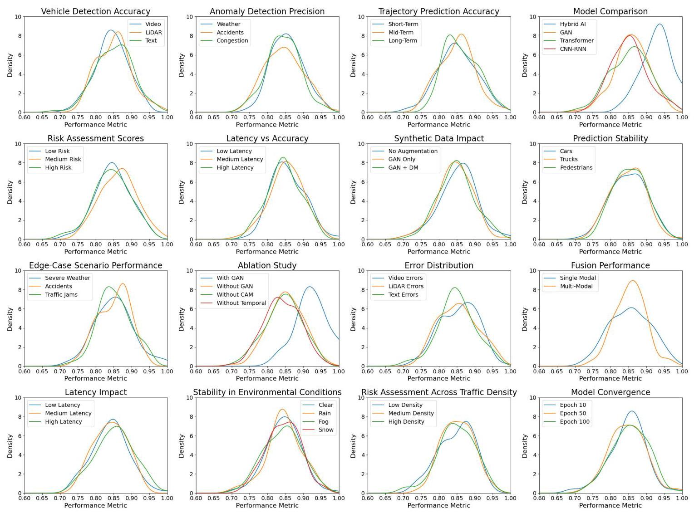
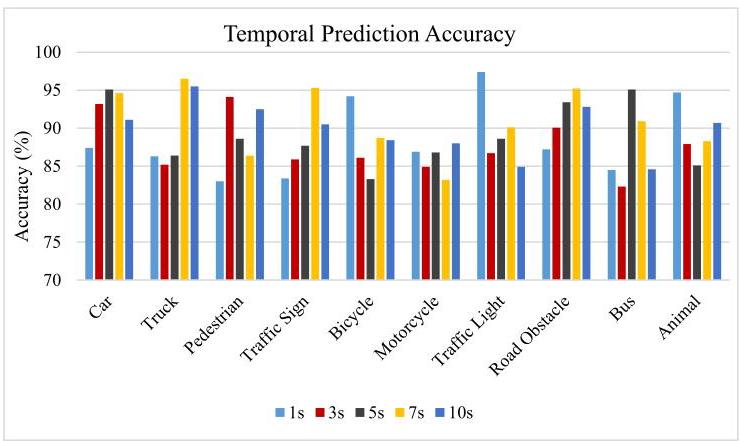
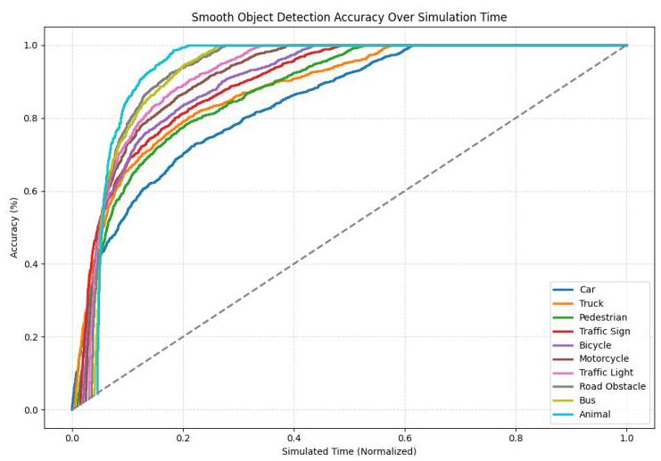
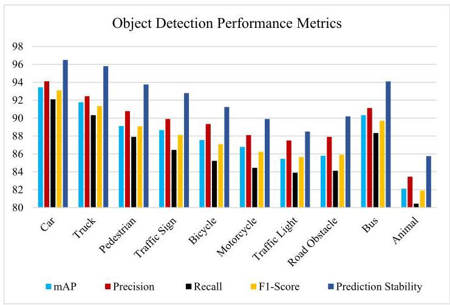
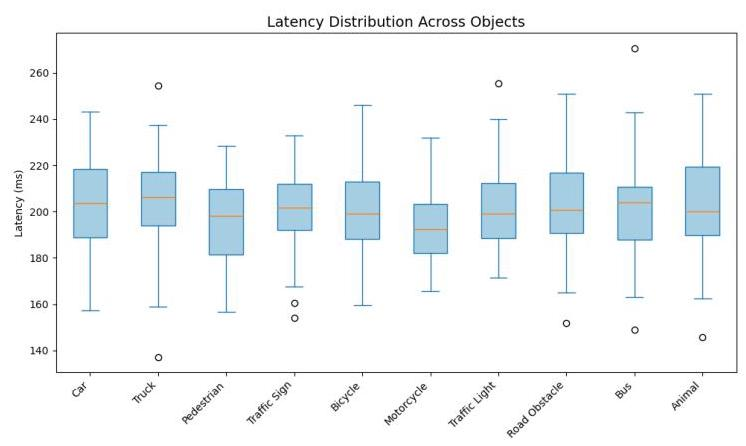
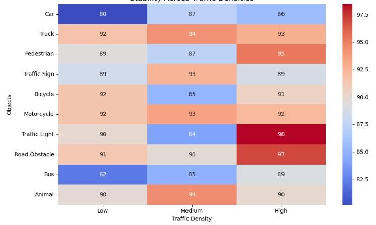
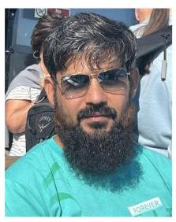

# Hybrid TrafficAI: A Generative AI Framework for Real-Time Traffic Simulation and Adaptive Behavior Modeling

Hazrat Bilal \( {}^{\text{ ⑩ }} \) , Member, IEEE, Abbas Rehman, Muhammad Shamrooz Aslam \( {}^{\circledR } \) , Inam Ullah \( {}^{\circledR } \) , Member, IEEE, Wen-Jer Chang \( {}^{\circledR } \) , Senior Member, IEEE, Neeraj Kumar \( {}^{\circledR } \) , Senior Member, IEEE, and Abdullah Mohammed Almuhaideb

Abstract-Traffic congestion, accidents, and unpredictable driver behaviour remain significant challenges in urban transportation systems. Traditional traffic simulation models often fail to adapt to dynamic environments and lack accuracy handling edge-case scenarios. To address these limitations, hybrid TrafficAI, an innovative Generative AI-based framework that integrates advanced modules for traffic simulation, behaviour modelling and anomaly detection. The framework incorporates several key components. First, an Adaptive Multi-Modal Fusion Engine (AMFE) seamlessly integrates video, LiDAR, and textual data. This is achieved through dynamic feature alignment layers and context-aware gating mechanisms. Second, an Edge-Case Generative Module (ECGM) augments synthetic edge-case scenarios. Third, a Temporal-Spatial Attention Network (TSAN) captures short-term and long-term traffic dependencies. Finally, large language model-driven semantic reasoning modules extract contextual insights from unstructured textual data, such as traffic reports and incident logs. The framework employs a hybrid dual-stage optimization process, combining unsupervised generative pre-training with fine-tuned supervised calibration to ensure efficient convergence and reduced latency. By fusing multi-modal data, enhancing anomaly robustness with synthetic edge-case scenarios, and interpreting contextual semantics with LLM, hybrid TrafficAI achieves precise anomaly detection, trajectory prediction and adaptive decision-making. Experimental evaluations demonstrate significant performance improvements, including 91.45% accuracy, 93.45% mean Average Precision

(mAP) for vehicle detection and a 0.910 Normalized Risk Score (NRS) for anomaly detection, consistently outperforming state-of-the-art benchmarks across latency, precision, recall and stability metrics. This framework sets a new benchmark for intelligent transportation systems (ITS) and real-time traffic management.

Index Terms-Hybrid TrafficAI, multi-modal fusion, edge-case scenario augmentation, temporal-spatial attention, adaptive traffic behavior modeling.

## I. INTRODUCTION

TRAFFIC congestion and growing demand for transportation that works have emerged as global problems. The proliferation of ITS [1], [2] and the developmental progress of artificial intelligence (AI) have made traffic flow simulation an essential tool for infrastructure planning, traffic control and traffic optimization of urban as well as interurban networks [3]. Most existing formulations of traffic flow simulation are based on mathematical models [4] and manually prescribed parameters, which usually fail to capture the complexity of real-world traffic situations. Two main problems for traffic simulation systems are still vehicle detection and vehicle behaviour modelling. Reliable data input into the simulation models requires accurate vehicle detection, while effective behaviour modelling should provide realistic vehicle driving dynamics and interaction behaviour [5], [6], [7]. Despite being capable, former approaches are limited by real-world challenges, including occlusions, varying lighting conditions and dynamic traffic patterns that hinder the robustness of conventional AI. These limitations highlight the need for a GAI-based approach capable of addressing these limitations by providing scalable solutions for dynamic traffic flow simulation [8]. Traditional traffic flow simulations rely heavily on mathematical models and predefined rules, effective in controlled settings but less in unpredictable real-world scenarios. Deep learning models like CNN [9], RNN [10], and GAN [11] have been applied for tasks such as vehicle detection, traffic density forecasting, and behaviour modelling. However, they face challenges in dynamic environments with occlusions, weather variations, low visibility, and limited training data for rare events [12], [13]. CNNs excel at static image analysis but struggle with temporal dependencies, while RNNs suffer from vanishing and exploding gradient issues. Both models also face difficulties integrating multimodal data (e.g., camera feeds, LiDAR [14], [15], textual reports) and depend heavily on large labelled datasets, which are often unavailable or time-consuming to produce. Additionally, they lack adaptability to new traffic rules, road geographies, or vehicle behaviours, and their computational inefficiency hinders real-time applications like emergency traffic management and dynamic rerouting systems [16].

---

Received 29 January 2025; revised 26 March 2025 and 10 May 2025; accepted 14 May 2025. The Associate Editor for this article was T. R. Gadekallu. (Corresponding authors: Wen-Jer Chang; Muhammad Shamrooz Aslam.)

Hazrat Bilal and Abbas Rehman are with the School of Information Science and Technology, University of Science and Technology of China, Hefei, Anhui 230052, China (e-mail: hbilal@mail.ustc.edu.cn; abbasrehman@mail.ustc.edu.cn).

Muhammad Shamrooz Aslam is with the Artificial Intelligence Research Institute, China University of Mining and Technology, Xuzhou 2211106, China (e-mail: shamroz_aslam@cumt.edu.cn).

Inam Ullah is with the Department of Computer Engineering, Gachon University, Seongnam 13120, Republic of Korea (e-mail: inam@gachon.ac.kr).

Wen-Jer Chang is with the Department of Marine Engineering, National Taiwan Ocean University, Keelung 202301, Taiwan (e-mail: wjchang@mail.ntou.edu.tw).

Neeraj Kumar is with the Department of Computer Science and Engineering, Thapar University, Patiala 147004, India, and also with UEHS, 01-043 Warsaw, Poland (e-mail: neeraj.kumar@thapar.edu).

Abdullah Mohammed Almuhaideb is with the Department of Networks and Communications, College of Computer Science and Information Technology, Imam Abdulrahman Bin Faisal University, Dammam 31441, Saudi Arabia (e-mail: amAlmuhaideb@iau.edu.sa).

Digital Object Identifier 10.1109/TITS.2025.3571041

---

Recently, there has been some traction around Generative AI (GAI) for modelling complex [17], nonlinear relationships [18], [19] in large datasets. In the past few years, LLM [20], initially intended for natural language processing tasks, have shown their capacity to learn and synthesize complicated patterns across various data domains. Their ability to analyse relationships, make context-aware predictions and simulate scenarios has led to the possibility of solving problems in traffic flow simulation and management [21], [22]. With a capacity to process and synthesize complex contextual data, LLM addresses these limitations in a new way. They frame traffic flow simulation as a sequence generation or pattern prediction problem to model temporal dependencies [23] for predicting vehicle trajectories and simulating dynamic traffic conditions. Moreover, they leverage multimodal data sources often involved in autonomous navigation, such as textual traffic reports, numerical sensor data measured during travel, and visual inputs on the road. LLM-based GAI overcomes the shortcomings of CNN, RNN, and GAN on traffic flow simulation, namely, the ability to comprehensively take in multi-modal data sources, analyse long-term dependency and eliminate dependence on a large amount of labelled data [24].

The proposed hybrid TrafficAI framework integrates GAN, Transformers, and LLM to address challenges in multi-modal traffic simulation, vehicle behaviour modelling, and anomaly detection. The framework begins with data preprocessing, including noise filtering, normalization, and spatial-temporal alignment of video, LiDAR, and textual data. Feature extraction employs Vision Transformers (ViT) for video, spatiotemporal transformers for LiDAR, and BERT embeddings for textual data. A Context-Aware Attention Mechanism (CAM) aligns and fuses these features across modalities. To address data scarcity and edge-case scenarios, a custom ECGM generates synthetic traffic scenarios refined using Diffusion Models (DM) for enhanced realism. The refined multi-modal representation is processed by an LLM Decoder, producing high-level semantic insights. Finally, predictive modules deliver vehicle trajectory forecasts, behaviour analysis, and risk assessment. This cohesive integration enables robust predictions, real-time anomaly detection, and scalable traffic management solutions. The main contributions of this paper are:

- An innovative Generative AI-based framework, Hybrid TrafficAI, is proposed, integrating GAN for synthetic edge-case scenario augmentation, transformers for multi-modal feature extraction, and LLM for contextual semantic reasoning. This unified architecture addresses the challenges of real-time traffic simulation, anomaly detection, and adaptive behaviour modelling.

- An Adaptive AMFE is introduced to dynamically integrate video, LiDAR, and textual data using context-aware alignment layers and attention mechanisms. This approach ensures seamless cross-modal interaction, preserving spatial-temporal relationships and improving anomaly detection accuracy.

- A custom ECGM powered by refined GAN and DM generates highly realistic synthetic traffic scenarios. This augmentation improves dataset diversity, enhances robustness in anomaly detection, and addresses data scarcity in rare and complex traffic events.

- A TSAN is developed to capture short-term vehicle dynamics and long-term traffic flow patterns. This module models sequential dependencies, enabling accurate trajectory prediction and adaptive behaviour analysis across varying traffic conditions.

- The proposed framework employs a hybrid dual-stage optimization process, combining unsupervised generative pre-training with fine-tuned supervised calibration to ensure efficient convergence, low latency, and scalability in real-time traffic management applications.

The paper is structured as follows: Section II reviews related literature. Section III introduces the Hybrid TrafficAI framework. Section IV describes the dataset, preprocessing, and augmentation. Section V outlines the experimental setup and evaluation. Section VI presents results, including edge-case handling and anomaly detection. Section VII discusses findings, limitations, and future work. Finally, Section VIII concludes with key contributions and research directions.

## II. RELATED WORK

By utilizing advanced deep learning techniques, GAI has introduced a new air breeze in dynamic traffic flow simulation while improving vehicle detection and behaviour modelling in a more advanced version. Then, with data scarcity, anomaly detection, and other spatial-temporal dependencies, many scholars approach this problem differently, much like the work done in hybrid frameworks, diffusion models, and spatiotemporal attention mechanisms. Some studies about vehicle detection and anomaly prediction made by the authors have shown significant achievements in solving problems such as sensor noise, data flaws and imbalanced data distribution. To tackle C-V2X frameworks, Zhao et al. [25] proposed CoGAN, a hybrid model with a mixture of GAN and Variational Autoencoder (VAE). CoGAN can identify anomalies induced by sensor noise and data faults through standard vehicle behaviour pattern capture and feature representation refinement, contributing to reliable traffic data integrity. SNIPER, a spatio-temporal traffic anomaly prediction model in [26], copes with imbalanced data and feature heterogeneity. To capture complex relations in traffic data, SNIPER employs spatio-temporal encoders to get dynamic embeddings and uses an attention-based graph convolutional network. FC-LSTM is used as a feature aggregation model, and a custom loss function is used to increase prediction accuracy. In [27], Sai et al. have illustrated a data augmentation technique building on a diffusion model in vehicular networks, including using random prompts and canny edge features to improve image semantics. The technique increased MobileNet's vehicle detection accuracy on an accident dataset by 3%.

Fig. 1. Overview of generative AI applications in autonomous driving.

Building upon these critical studies for behaviour modelling and interaction simulation, the authors present significant studies on the modelling and simulation of human vehicle and vehicle interactions in dynamic traffic environments with reasonable accuracy. Later, Li et al. [28] introduced G-GAIL (approximating the iterated GT process sequentially), a hybrid model of game theory (GT) and Generative Adversarial Imitation Learning (GAIL) for pedestrian-vehicle interaction simulation. A Markov decision process is utilized as the system model, upon which game dynamics are inferred using accurate trajectory data, and pedestrian behaviour is replicated with high accuracy to support autonomous driving simulations. SSTAttGAN, a safety-aware trajectory prediction model for hybrid traffic systems comprising Human Driven Vehicles (HDVs) and Connected Automated Vehicles (CAVs), was developed by Huo et al. [29]. Spectral clustering for driving patterns and a spatio-temporal attention mechanism in the GAN generator yields high prediction accuracy across NGSIM and HighD datasets. In [30], Zhang et al. introduced a Data-Driven Simulator, D2Sim, to model human driving behaviours and help automate vehicle training and testing. D2Sim simulates stochastic driving action, generates high-resolution trajectories with rich environmental data, handles corner cases effectively and provides realistic interaction scenarios using adversarial learning.

The authors have demonstrated significant advancements in traffic flow simulation and prediction that address the challenges of spatiotemporal dependencies, data scarcity, and computational efficiency. Kong et al. [31] presented a hybrid traffic trajectory generation model integrating data-driven and knowledge-driven approaches. TD-GAN integrates travel demand knowledge, reduces learning complexity through nonstandard convolutional and multi-headed self-attention modules, and captures more spatial-temporal correlations for better trajectory generation accuracy. While Ye et al. [32] have proposed a distributed traffic flow prediction architecture incorporating GAI and hierarchical federated learning, the study is based on considering its nodes' roles as producers or consumers within potential IoTs. The architecture integrates spatial self-attention and traffic delay-aware feature transformation to enhance efficiency, data privacy, and cost optimization. In Intelligent ITS, ChatTraffic is a diffusion model for Text-to-Traffic Generation (TTG) that has been introduced in [33]. It combines diffusion modelling with Graph Convolutional Networks (GCN) to guarantee spatial consistency of traffic scenarios generated from textual descriptions, enabling fast, realistic, yet large-scale text traffic dataset-based scenario simulation.

GAI is embedded into simulation tools and edge intelligence frameworks to build resilient and real-time traffic management solutions. Li et al. [34] introduced ChatSUMO, an LLM agent that uses the SUMO platform for traffic simulation. User inputs are processed, OpenStreetMap data is processed to generate road networks, traffic simulations are run, and results are interpreted. Users may customize such scenarios as traffic light optimization and vehicle adjustments, represented well in the Albany city simulation. To achieve smart mobility, Shu et al. [35] have proposed the development of a Digital Twin (DT), integrating real-time data, Machine Learning (ML) and GAI to optimize parking management and simulate urban scenarios. By using visualization tools, urban planners can explore strategies in a virtual environment to increase resource utilization and user experience. GAI-IoV: an edge intelligence-enabled GAI framework for vehicular networks was introduced by Xie et al. [36]. GAI-IoV improves efficiency, privacy, and content generation through SGHS and the backward induction of federated fine-tuning (FFT) and inference splitting.

GAI has emerged as a transformative force in advancing dynamic traffic flow simulation, vehicle detection, and behaviour modelling, addressing critical limitations such as data scarcity, anomaly detection, and spatial-temporal dependencies. Recent studies emphasize the efficacy of hybrid frameworks, diffusion models, and spatio-temporal attention mechanisms in achieving robust and scalable solutions. Techniques such as federated fine-tuning, self-attention modules, and domain adversarial learning have significantly improved accuracy, adaptability, and computational efficiency across diverse and complex traffic scenarios. Furthermore, integrating multi-modal data sources (video, LiDAR, textual logs) with context-aware learning mechanisms enables precise trajectory prediction, anomaly detection, and scenario simulation. These advancements underscore GAI as a foundational technology for building scalable, efficient ITS capable of real-time adaptability to evolving urban traffic environments. This paper builds upon these innovations to propose a Hybrid TrafficAI framework, offering a cohesive architecture that addresses these challenges with precision and technical robustness.

## III. HYBRID TRAFFICAI FOR REAL-TIME TRAFFIC SIMULATION AND ADAPTIVE MODELING

## A. Dataset Description

The dataset utilized in this research combines multi-modal data sources, including real-time video feeds, LiDAR point clouds, and textual traffic incident reports, to create a Hybrid Multi-Modal Dataset (HMD). Existing benchmark datasets, including KITTI [37], Waymo Open Dataset [38], NGSIM [39], and HighD Dataset [40] are adopted as foundations. However, such datasets tend to be limited in providing accurate features of rare events such as accidents, emergency rerouting, or severe weather conditions. GAN and diffusion models synthesize additional synthetic scenarios with various edge-case traffic scenarios to overcome this limitation [41]. The resulting hybrid dataset aims to capture spatio-temporal relationships between vehicles and pedestrians in dynamic urban environments and traffic anomalies and behavioural patterns. This overview describes key attributes and how they are represented across multiple modalities (video, LiDAR, textual reports, and synthetic scenarios) using the dataset used in the study, summarised in Table I. The dataset size, coverage, resolution, annotation quality, and preprocessing approach it provides make it worthwhile for researchers and practitioners using traffic flow simulation, vehicle detection, and behaviour modelling.

## B. Context-Aware Spatio-Temporal Data Augmentation

This work proposes an advanced context-aware spatiotemporal data augmentation pipeline to overcome limitations in standard GAN-based [42] approaches for dynamic traffic scenarios. Conventional GAN architectures often fail to capture the complex interplay between spatial correlations in LiDAR and video data and temporal dependencies across sequential frames. To address this, fine-tuning of the Generator \( \left( G\right) \) was performed by integrating spatio-temporal attention layers, allowing for dynamic computation of temporal attention scores while maintaining spatial feature alignment. Unlike traditional generators, a temporal decay factor \( {\gamma }_{t} \) was incorporated, which dynamically adjusts historical state contributions and historical state weight matrices \( {W}_{i} \) to reinforce temporal continuity across sequential synthetic frames, as shown in Eq. (1). Additionally, a context embedding layer processes textual data from traffic reports to inject contextual semantics into the generator pipeline, enabling it to adapt edge-case scenarios such as abrupt braking, multi-lane congestion, and weather-induced hazards Eq. (2).

\[
{F}_{t} = \operatorname{Softmax}\left( \frac{{Q}_{t}{K}_{t}^{T} + {B}_{t}}{\sqrt{{d}_{k}}}\right) {V}_{t} + {\gamma }_{t}\mathop{\sum }\limits_{{i = 1}}^{n}{W}_{i}{F}_{t - i} \tag{1}
\]

\[
{L}_{\text{ att }} = \mathop{\sum }\limits_{{t = 1}}^{T}{\begin{Vmatrix}{F}_{t} - {\widehat{F}}_{t}\end{Vmatrix}}_{2}^{2} + \lambda \mathop{\sum }\limits_{{j = 1}}^{m}{\begin{Vmatrix}{W}_{j}\end{Vmatrix}}_{2}^{2} + \delta {\begin{Vmatrix}{C}_{\mathrm{{emb}}} - {C}_{\text{ real }}\end{Vmatrix}}_{2}^{2}
\]

(2)

A context-aware validation mechanism was introduced to improve the Discriminator \( \left( D\right) \) that evaluates visual realism and semantic alignment across the generated data. The discriminator uses multi-modal embeddings from LiDAR, video, and textual data, ensuring a synchronized evaluation across modalities. A domain adaptation module was added, which aligns the latent feature distributions of synthetic and real-world samples. The discriminator loss function incorporates an adversarial loss \( {L}_{adv} \) for statistical alignment Eq. (3) and a domain adaptation loss \( {L}_{da} \) for reducing cross-domain discrepancies Eq. (4). This dual-validation approach ensures the discriminator operates across pixel-level and semantic domains, enhancing robustness against artifacts in synthetic samples.

\[
{L}_{\text{ adv }} = {\mathbb{E}}_{x \sim  {p}_{\text{ data }}}\left\lbrack  {\log \left( {D\left( x\right) }\right) }\right\rbrack   + {\mathbb{E}}_{x \sim  p\left( z\right) }\left\lbrack  {\log \left( {1 - D\left( {G\left( z\right) }\right) }\right) }\right\rbrack
\]

\[
+ {\lambda }_{\mathrm{{da}}}{\begin{Vmatrix}{F}_{\text{ synthetic }} - {F}_{\text{ real }}\end{Vmatrix}}_{2}^{2} \tag{3}
\]

\[
{L}_{\mathrm{{da}}} = \mathop{\sum }\limits_{{i = 1}}^{k}{\begin{Vmatrix}{F}_{\text{ synthetic }}^{i} - {F}_{\text{ real }}^{i}\end{Vmatrix}}_{2}^{2} + \eta {\begin{Vmatrix}\mathop{\sum }\limits_{\text{ synthetic }} - \mathop{\sum }\limits_{\text{ real }}\end{Vmatrix}}_{F}^{2}
\]

\[
+ \alpha {\begin{Vmatrix}{H}_{\text{ synthetic }} - {H}_{\text{ real }}\end{Vmatrix}}_{2}^{2} \tag{4}
\]

Fig. 2. Overview of the GAN generator and context-aware discriminator network with diffusion model refinement, illustrating the workflow from input images to refined outputs through multi-stage processing.

Optimization of the DM was performed to serve as a refinement module for the synthetic data generated by the cGAN. Unlike conventional refinement techniques, the proposed diffusion model integrates a noise decay scheduler \( {\beta }_{t} \) to reduce Gaussian noise across time steps iteratively, as illustrated in Eq. (5). A temporal residual smoothing mechanism ensures fine-grained alignment of refined data across time steps while reducing high-frequency artifacts. The diffusion loss function includes noise refinement loss \( {L}_{dm} \) and temporal consistency penalties to maintain alignment across frame sequences as demonstrated in the Eq. (6). The overview of the GAN generator and context-aware discriminator network with diffusion model refinement are depicted in Figure 2.

\[
{X}_{t} = \sqrt{1 - {\beta }_{t}}{X}_{t - 1} + \sqrt{{\beta }_{t}}{\epsilon }_{t} + {\alpha }_{t}\mathop{\sum }\limits_{{k = 1}}^{K}{W}_{k}{X}_{t - k} \tag{5}
\]

\[
{L}_{\mathrm{{dm}}} = \mathop{\sum }\limits_{{t = 1}}^{T}{\begin{Vmatrix}{X}_{t} - {X}_{t - 1}\end{Vmatrix}}_{2}^{2} + \mu \mathop{\sum }\limits_{{i = 1}}^{p}{\begin{Vmatrix}{\epsilon }_{i}\end{Vmatrix}}_{2}^{2} + \xi {\begin{Vmatrix}{R}_{t} - {R}_{t - 1}\end{Vmatrix}}_{2}^{2}
\]

(6)

The CAM dynamically computes attention weights \( {A}_{i, j} \) between the query vector \( {Q}_{i} \) and the key vector \( {K}_{j} \) as shown in Eq. (7). Before calculating their alignment, these vectors are transformed through weight matrices \( {W}_{q} \) and \( {W}_{k} \) . The attention weight is then normalized across all keys \( \left( N\right) \) , ensuring that significant spatial-temporal patterns in video feeds, structural data from LiDAR [42], and semantic insights from the text are prioritized. The resulting attention map guides feature fusion, improving cross-modal alignment and enhancing downstream tasks such as anomaly detection and trajectory prediction [43].

\[
{A}_{i, j} = \frac{\exp \left( {{W}_{q}{Q}_{i} \cdot  {W}_{k}{K}_{j}}\right) }{\mathop{\sum }\limits_{{j = 1}}^{N}\exp \left( {{W}_{q}{Q}_{i} \cdot  {W}_{k}{K}_{j}}\right) } \tag{7}
\]

Eq. (7) defines the attention mechanism used for cross-modal alignment, where \( {A}_{i, j} \) represents the attention weight between feature \( i \) and feature \( j \) . This allows the model to focus on relevant features from different modalities during fusion selectively.

TABLE I

COMPREHENSIVE DATASET CHARACTERISTICS AND STATISTICS

<table><tr><td colspan="3">General Overview</td></tr><tr><td>Attribute</td><td>Description</td><td>Details</td></tr><tr><td>Total dataset size</td><td>Overall storage size</td><td>500 GB</td></tr><tr><td>Data modalities</td><td>Types of data collected</td><td>Video, LiDAR, Textual reports, GPS Logs</td></tr><tr><td>Geographical coverage</td><td>Regions represented</td><td>25 zones (Urban, Suburban, Highway)</td></tr><tr><td>Time span</td><td>Historical data coverage</td><td>5 years of data</td></tr><tr><td>Real-time frequency</td><td>Data snapshot interval</td><td>1-second intervals</td></tr><tr><td colspan="3">Video Data</td></tr><tr><td>Resolution</td><td>Video quality</td><td>1080p (HD)</td></tr><tr><td>Frame rate</td><td>Frames per second</td><td>10 FPS</td></tr><tr><td>Total duration</td><td>Total hours of footage</td><td>100 hours</td></tr><tr><td>Content</td><td>Focus of video feeds</td><td>Traffic patterns, intersections, emergency routes</td></tr><tr><td colspan="3">LiDAR Data</td></tr><tr><td>Point cloud density</td><td>Number of points per second</td><td>50 million points</td></tr><tr><td>Spatial resolution</td><td>Precision in point cloud data</td><td>5 cm</td></tr><tr><td>Data frequency</td><td>Data refresh rate</td><td>10 Hz</td></tr><tr><td>Content</td><td>Focus of LiDAR data</td><td>Road structures, vehicle positions, pedestrian paths</td></tr><tr><td colspan="3">Textual Reports</td></tr><tr><td>Source</td><td>Origins of textual data</td><td>Traffic control logs, user reports</td></tr><tr><td>Incident types</td><td>Types of incidents covered</td><td>Accidents, Road closures, congestion</td></tr><tr><td>Average length</td><td>Average token count per report</td><td>250 tokens</td></tr><tr><td>Weather logs</td><td>Weather scenarios captured</td><td>Rain, Fog, Snow, Clear</td></tr><tr><td colspan="3">Synthetic Scenarios</td></tr><tr><td>Scenario types</td><td>Types of synthetic scenarios generated</td><td>Edge-cases (Accidents, weather hazards)</td></tr><tr><td>Generation model</td><td>Models used for scenario generation</td><td>GAN + Diffusion models</td></tr><tr><td>Total Scenarios</td><td>Total number of synthetic cases</td><td>1,000 scenarios</td></tr><tr><td>Purpose</td><td>Objective of synthetic scenarios</td><td>Edge-case handling, anomaly prediction</td></tr><tr><td colspan="3">Annotations and Labels</td></tr><tr><td>Bounding boxes</td><td>Labels for vehicle and pedestrian objects</td><td>Fully annotated</td></tr><tr><td>Trajectory labels</td><td>Sequential vehicle trajectory paths</td><td>Temporal path predictions</td></tr><tr><td>Weather labels</td><td>Environmental conditions labeled</td><td>Fog, rain, snow, clear</td></tr><tr><td>Metadata format</td><td>Annotation file formats</td><td>.xml, .json</td></tr><tr><td colspan="3">Environmental Factors</td></tr><tr><td>Weather conditions</td><td>Different weather types represented</td><td>Clear, rain, fog, snow</td></tr><tr><td>Extreme scenarios</td><td>Percentage of extreme weather events</td><td>5%</td></tr><tr><td>Infrastructure</td><td>Types of physical infrastructure</td><td>Bridges, tunnels, intersections</td></tr><tr><td>Lighting conditions</td><td>Variations in lighting captured</td><td>Daylight, night, shadows</td></tr><tr><td colspan="3">Preprocessing Techniques</td></tr><tr><td>Normalization</td><td>Standardization across data modalities</td><td>Applied</td></tr><tr><td>Noise filtering</td><td>Reduction of noise in LiDAR data</td><td>Enabled</td></tr><tr><td>Data augmentation</td><td>Synthetic enhancement via GAN models</td><td>Applied</td></tr><tr><td>Compression</td><td>Dataset storage optimization</td><td>Lossless compression applied</td></tr></table>

## C. Hybrid TrafficAI Framework for Multi-Modal Traffic Simulation

In this study, an innovative hybrid GAI framework for multi-modal traffic simulation, vehicle behaviour modelling, and anomaly detection is proposed. The framework addresses challenges posed by diverse data modalities, edge-case scenarios, and real-time operational requirements. It integrates data preprocessing, feature extraction, and behaviuor prediction in a cohesive pipeline, leveraging advanced GAN for synthetic data augmentation, Transformer Encoders (TE) for feature extraction, and LLM for contextual interpretation and decision-making as shown in Figure 3. The architecture processes multi-modal inputs ( \( V \) : Video, \( L \) : LiDAR, \( T \) : Text) through three main stages, i.e., enhanced data preprocessing and augmentation, multi-modal feature extraction and contextual understanding, and behaviour modelling, prediction, and real-time outputs. Each stage is carefully optimized using mathematical formulations, architecture-level modifications, and hyperparameter tuning, ensuring high accuracy, robustness, and scalability in dynamic traffic scenarios.

The hybrid GAI framework includes a 10-layer architecture suited for dynamic traffic flow simulation, anomaly detection, and vehicle behaviour modelling. Starting from a convolutional layer (layer 1), which takes in \( {2048} \times  {2048} \times \) 3 high-resolution input and processes it with filters of size \( {35} \times  {35} \times  3 \) , stride 1 for fine-grained spatial feature extraction. Next, a pooling layer (layer 2) is introduced, utilizing a filter size of \( 9 \times  9 \) , with a stride of 2, to reduce dimensions to \( {1024} \times  {1024} \times  {128} \) to retain the significant traffic patterns. Then, a spatiotemporal transformer layer (layer 3) works on \( {512} \times  {512} \times  {256} \) sized input with 8 attention heads to catch long-range spatial and temporal dependencies. To refine localized feature maps, sliding convolution processes the inputs in layer 4, which has dimensions of \( {256} \times  {256} \times  {384} \) and filters \( {12} \times  {12} \times  {192} \) . Layer 5, the multi-modal fusion layer, uses a context-aware attention mechanism to align across video, LiDAR, and textual data modalities.

To refine synthetic traffic scenarios, data are processed in layer 6, a diffusion model layer, at \( {128} \times  {128} \times  {256} \) with a filter size of \( {16} \times  {16} \) . The output of this is a 256d feature vector (fully connected layer 7) that is prepared to feed embeddings to downstream tasks. Layer 8, the LLM decoder, applies 12 transformer layers of 768 hidden size to process embeddings to produce context-aware insights. For real-time vehicle movement prediction, the trajectory prediction layer (layer 9) uses a GRU with an attention mechanism operating on \( 1 \times  1 \times  {512} \) embeddings. Finally, the anomaly detection layer (layer 10) assesses risk and classifies anomalies using a specialized risk assessment layer. This numerically detailed pipeline integrates convolutional filters, attention mechanisms, and large-scale multi-modal fusion to deliver scalable, accurate, and context-aware predictions for intelligent traffic systems. The enhanced multi-modal hybrid GAI model architecture is demonstrated in the Table II.

Fig. 3. Proposed hybrid generative AI framework Integrates data preprocessing, feature extraction, and GAN-based augmentation with transformer and LLM modules for accurate traffic simulation and anomaly detection.

Several temporal factors that engage traffic conduct are predicted with hidden states \( {h}_{t} \) , which change from the previous hidden state \( {h}_{t - 1} \) and the current input \( {x}_{t} \) . Weights \( {W}_{h} \) and \( {W}_{x} \) control temporal and current inputs, and a bias determination (b) factors stability of updates. This recursive relationship helps identify sequential patterns that define accurate predictions of vehicle trajectories and dynamic behavior modeling across time horizons.

\[
{h}_{t} = \tanh \left( {{W}_{h}{h}_{t - 1} + {W}_{x}{x}_{t} + b}\right) \tag{8}
\]

During the multi-modal fusion stage, the alignment of fused features \( {F}_{i} \) with the target representations \( {T}_{i} \) is also found in Eq. (9). The importance of each modality is regulated with modality-dependent weights \( {\alpha }_{i} \) to balance between modalities. The fusion objective also reduces the mismatch between the fused representation and the expected target patterning to produce a concise multimodal feature space.

\[
{L}_{\text{ fusion }} = \mathop{\sum }\limits_{{i = 1}}^{N}{\alpha }_{i}{\begin{Vmatrix}{F}_{i} - {T}_{i}\end{Vmatrix}}^{2} \tag{9}
\]

To improve synthetic scenarios, thus, the Diffusion Model distills the difference between the forecasted noise \( {\epsilon }_{\theta }\left( {{x}_{t}, t}\right) \) and the actual Gaussian noise \( \epsilon \) of the data sample \( {x}_{t} \) at the time-step \( \left( t\right) \) Eq. (10). This loss ensures that synthetic data distributions remain consistent with real-world patterns, improving the quality of augmentations at the edges of actual distributions.

\[
{L}_{\text{ diffusion }} = {\mathbb{E}}_{t,{x}_{t},\epsilon }\left\lbrack  {\begin{Vmatrix}\epsilon  - {\epsilon }_{\theta }\left( {x}_{t}, t\right) \end{Vmatrix}}^{2}\right\rbrack \tag{10}
\]

TABLE II

ENHANCED MULTI-MODAL HYBRID GENERATIVE AI MODEL ARCHITECTURE

<table><tr><td>Layer</td><td>Operator</td><td>Input Size</td><td>Filter/Parameter Size</td><td>Stride</td><td>Description</td></tr><tr><td>1</td><td>Convolution</td><td>\( {2048} \times  {2048} \times  3 \)</td><td>\( {35} \times  {35} \times  3 \)</td><td>1</td><td>High-resolution feature extraction with enhanced spatial filters.</td></tr><tr><td>2</td><td>Pooling</td><td>\( {1024} \times  {1024} \times  {128} \)</td><td>\( 9 \times  9 \)</td><td>2</td><td>Reduces spatial dimensions while retaining key patterns.</td></tr><tr><td>3</td><td>Spatio-Temporal Transformer</td><td>\( {512} \times  {512} \times  {256} \)</td><td>Multi-Head Attention (8 heads)</td><td>-</td><td>Captures spatial and temporal dependencies in traffic data.</td></tr><tr><td>4</td><td>Sliding Convolution</td><td>\( {256} \times  {256} \times  {384} \)</td><td>\( {12} \times  {12} \times  {192} \)</td><td>1</td><td>Detects local patterns across dynamic data streams.</td></tr><tr><td>5</td><td>Multi-Modal Fusion</td><td>\( {256} \times  {256} \times  {192} \)</td><td>Context-Aware Attention</td><td>-</td><td>Aligns and fuses features from video, LiDAR, and text.</td></tr><tr><td>6</td><td>Diffusion Model</td><td>\( {128} \times  {128} \times  {256} \)</td><td>\( {16} \times  {16} \)</td><td>-</td><td>Refines synthetic edge-case traffic scenarios.</td></tr><tr><td>7</td><td>Fully Connected</td><td>256</td><td>-</td><td>-</td><td>Outputs high-dimensional embeddings for interpretation.</td></tr><tr><td>8</td><td>LLM Decoder</td><td>\( 1 \times  1 \times  {768} \)</td><td>12 Transformer Layers</td><td>-</td><td>Contextual interpretation and scenario reasoning.</td></tr><tr><td>9</td><td>Trajectory Prediction</td><td>\( 1 \times  1 \times  {512} \)</td><td>GRU with Attention</td><td>-</td><td>Predicts short-to-long-term vehicle movements.</td></tr><tr><td>10</td><td>Anomaly Detection</td><td>\( 1 \times  1 \times  {256} \)</td><td>Risk Assessment Layer</td><td>-</td><td>Classifies and scores edge-case anomalies.</td></tr></table>

1) Enhanced Multi-Modal Data Preprocessing and Refinement: Let the raw dataset be represented as \( \mathcal{D} = \left\{  {{D}_{v},{D}_{l},{D}_{t}}\right\} \) , where \( {D}_{v},{D}_{l},{D}_{t} \) correspond to video feeds, LiDAR point clouds, and textual traffic reports, respectively. Each modality undergoes a series of specialized preprocessing steps tailored to preserve critical information while reducing noise and optimizing resource utilization [44]. Noise filtering is performed using Gaussian Filters with a kernel size of \( k = 5 \times  5 \) for video data \( {F}_{\text{ noise }}\left( v\right) \) , Statistical Outlier Removal (SOR) for LiDAR with a neighbourhood size of \( k = {50}{F}_{\text{ noise }}\left( l\right) \) , and text normalization techniques such as stopword removal and TF-IDF encoding \( {F}_{\text{ noise }}\left( t\right) \) . Data normalization follows, employing Min-Max Scaling and Z-Score Normalization, expressed as:

\[
{D}_{\text{ norm }} = \frac{D - {D}_{\min }}{{D}_{\max } - {D}_{\min }} \tag{11}
\]

Temporal and spatial alignment ensure consistency across datasets using timestamp interpolation \( {A}_{\text{ temp }}\left( {{t}_{1},{t}_{2}}\right) \) and spatial alignment matrices \( {A}_{\text{ spat }}\left( {x, y, z}\right) \) . Following alignment, data compression reduces storage overhead using H.265 Codec for video streams and GZIP compression for textual data \( {C}_{\text{ lossless }}\left( \mathcal{D}\right) \) Eq. (13). A GAN architecture is introduced to address data imbalance and edge-case scenario representation. The Generator (G) synthesizes edge-case traffic scenarios from random noise vectors \( \left( z\right) \) of size 128 . Each layer in the generator contains 256 neurons, employing LeakyReLU activation functions. The Discriminator (D) validates generated data using a CAM to assess visual realism and semantic coherence. The GAN objective is expressed as:

\[
\mathop{\min }\limits_{G}\mathop{\max }\limits_{D}V\left( {G, D}\right)  = {\mathbb{E}}_{x \sim  {p}_{\text{ real }}}\left\lbrack  {\log \left( {D\left( x\right) }\right) }\right\rbrack
\]

\[
+ {\mathbb{E}}_{x \sim  p\left( z\right) }\left\lbrack  {\log \left( {1 - D\left( {G\left( z\right) }\right) }\right) }\right\rbrack \tag{12}
\]

\[
{L}_{\mathrm{{adv}}} = {\mathbb{E}}_{x \sim  {p}_{\text{ data }}}\left\lbrack  {\log \left( {D\left( x\right) }\right) }\right\rbrack
\]

\[
+ {\mathbb{E}}_{x \sim  p\left( z\right) }\left\lbrack  {\log \left( {1 - D\left( {G\left( z\right) }\right) }\right) }\right\rbrack \tag{13}
\]

A DM is employed to refine synthetic data over \( N = \) 1000 steps with a learning rate of \( \eta  = {0.001} \) . This preprocessing and augmentation pipeline ensures a high-quality, balanced, and diverse dataset, preparing it for downstream feature extraction and contextual analysis.

2) Multi-Modal Feature Extraction and Contextual Understanding: The multi-modal feature extraction module is designed to process and integrate video, LiDAR, and textual traffic data using a specialized architecture optimized for each modality. A 12-layer ViT architecture is employed for video data. Video frames are divided into \( {16} \times  {16} \) -pixel patches, embedded into feature vectors, and processed through layers of multi-head self-attention. These attention heads dynamically capture spatial dependencies within individual frames and temporal patterns across sequential frames. Temporal embed-dings and normalization layers ensure consistent alignment across frames, allowing the transformer to prioritize critical regions of interest, such as abrupt lane changes, vehicle clustering, or pedestrian crossings. ViT uniquely combines spatial granularity with temporal coherence, providing refined feature maps encapsulating high-resolution static details and dynamic interactions over time. An 8-head spatiotemporal transformer with a hidden size of 512, designed to handle sparse, high-dimensional point cloud data, is adopted for LiDAR point cloud data. The transformer extracts local spatial structures, such as vehicle boundaries, pedestrian positions, and object contours, while simultaneously capturing temporal trajectories and movement vectors across consecutive frames. The attention heads are trained to focus on high-density clusters and regions exhibiting rapid motion changes, ensuring that fine-grained spatial and temporal patterns are preserved. Normalization and temporal smoothing layers are incorporated to address inconsistencies arising from varying point cloud densities, stabilizing feature representations while maintaining alignment across different LiDAR sequences.

A 12-layer BERT-based transformer, optimized for extracting context-aware embeddings from unstructured textual data, is integrated for textual traffic reports. The raw traffic text is tokenized, segmented, and passed through the transformer layers, where multi-head self-attention mechanisms dynamically capture relationships between tokens. The architecture emphasizes semantic consistency across key textual data elements, such as traffic alerts, event reports, and environmental descriptions. Each layer refines token embeddings, ensuring that critical traffic cues, such as congestion alerts, sudden braking instructions, or weather-related disruptions, are accurately captured and contextually aligned with spatial and temporal data from video and LiDAR modalities.

The extracted features from ViT, ST-Transformer, and BERT are integrated using a CAM. CAM serves as a dynamic fusion layer, assigning modality-specific attention weights to prioritize the most critical spatial, temporal, and semantic cues. This mechanism aligns cross-modal dependencies, resolves modality inconsistencies, and minimizes information loss during fusion. CAM dynamically adapts attention weights based on contextual importance, ensuring that temporal anomalies, spatial variations, and semantic cues are uniformly interpreted across modalities. Following feature fusion, the multi-modal representation is passed through a 12-layer LLM decoder, where cross-modal dependencies are refined and high-level semantic patterns are extracted. The decoder integrates temporal trajectories, spatial distributions, and textual insights to generate a cohesive representation of the traffic scenario. This stage ensures that spatial integrity from video and LiDAR data, temporal consistency across sequences, and contextual relevance from textual data are effectively unified. The output is a refined multi-modal embedding enriched with spatial-temporal semantics and optimized for downstream tasks such as behaviour modelling, anomaly detection, and predictive analysis.

3) Behaviuor Modelling, Prediction, and Real-Time Outputs: Finally, the fused multi-modal representation is used for behaviour modelling trajectory prediction and real-time anomaly detection. The trajectory prediction model predicts Vehicle movements using historical data patterns and real-time sensory inputs. It predicts vehicle trajectories for multiple time steps, which include factors such as velocity, road curvature, and surrounding vehicle behaviour. The hidden state size used in this prediction model is 512 neurons per layer, allowing us to use more neurons to produce highly accurate predictions and capture complex movement patterns. At the same time, the behaviour analysis module analyzes traffic behaviours, which corresponds to discovering traffic patterns and anomalies by spatio-temporal reasoning. This module can sense unusual pedestrian activity, sudden lane changes, and abrupt braking. It classifies behaviours into normal and abnormal categories using aggregated multi-modal embeddings and flags critical events for further analysis.

In parallel, the risk assessment layer quantifies the potential risks associated with the identified anomalies. This tool considers variables, including the proximity of objects to hazards, the likelihood of a crash, and the severity of traffic events. This module provides risk scores relative to the normalized range of 0 to 1 , with higher values indicating higher risk scenarios. These insights are folded into actionable insights for timely intervention in high-risk traffic events. These modules generate predicted vehicle trajectories, behavioural insights, and anomaly detection alerts as their outputs. These are packaged as final representations that can be used for real-time traffic management or visualization dashboards. The prediction engine outputs are carefully formatted to be easily consumed by intelligent traffic systems and deliver a smooth flow of communication between the prediction engine and the downstream applications. The system is optimized with numerical parameters tailored for each modality, i.e., the trajectory prediction model uses hidden states of 512 neurons, the behaviour analysis module uses spatiotemporal fusion layers, and the risk assessment layer normalizes its outputs to remain interpretable. The architecture is also a transformer-based design that takes advantage of the data across different scales, making predictions robust across different traffic densities and environmental conditions.

The risk assessment layer integrates multi-risk factors rating \( {r}_{i} \) into a normalized risk ratio (R) Eq. (14). Each factor’s importance \( {w}_{i} \) is also considered, and the final risk score is obtained by calculating the weighted mean. It makes sure that high-standing anomalies, including those due to sudden braking or proximity threats, are given primary importance during ongoing real-time anomaly identification and risk assessment.

\[
R = \frac{\mathop{\sum }\limits_{{i = 1}}^{N}{w}_{i} \cdot  {r}_{i}}{\mathop{\sum }\limits_{{i = 1}}^{N}{w}_{i}} \tag{14}
\]

This methodology is innovative in addressing dynamic traffic challenges by modifying GAN for refined synthetic data generation, enhancing transformer encoders for cross-modal feature extraction, and leveraging LLM for contextual scenario understanding. The proposed architecture improves the accuracy and robustness of traffic simulations and sets a foundation for future advancements in intelligent traffic management systems.

## D. Implementation Details

The hybrid GAI framework's design incorporates state-of-the-art tools and optimized computational pipelines to achieve scalability, efficiency, and robustness. Python 3.8 is the implementation framework with PyTorch 1.13 and Ten-sorFlow 2.9 as primary deep learning libraries. Moreover, CUDA 11.7 and cuDNN 8.4 are leveraged to accelerate GPU and improve the training and inference speed on NVIDIA A100 GPUs. For video processing, the ViT module is set up with 12 transformer layers, 16 attention heads and a hidden size of 768. The input video frames are resized to a standard size of \( {224}\mathrm{{px}} \times  {224}\mathrm{{px}} \) , segmented into patches of size \( {16}\mathrm{{px}} \times \) 16px. The proposed spatio-temporal transformer for LiDAR data uses eight attention heads with a hidden dimension of 512 and operates on point cloud data with a max of 100,000 points per sample. BERT-base tokenizer is used to tokenize textual data, with a maximum length of 256, and embedded in 12 layers of BERT-base with a hidden dimension of 768.

The GAN uses a generator with 5 hidden layers, each having 256 neurons and a Leaky-ReLU activation function. The discriminator consists of 4 hidden layers with 128 neurons per layer and utilizes binary cross-entropy loss for training. Synthetic data refinement is performed with a DM using 1000 diffusion steps and a learning rate of 0.001. Training is conducted in multiple stages. Initially, GANs are pre-trained for 50 epochs on a synthetic dataset before integrating real-world data for joint training. The transformer modules (ViT, spatio-temporal transformer, and BERT) are fine-tuned using a learning rate of 0.0001 with the AdamW optimizer. The LLM decoder undergoes additional fine-tuning for 20 epochs, focusing on cross-modal alignment tasks. Batch sizes of 64 for video frames, 32 for point clouds, and 128 for textual data are used to optimize GPU memory utilization and computational efficiency.

The ONNX runtime is used to optimize inference pipelines, which means less latency when making real-time predictions. As a pipeline, the system latencies of the output from both the wall follower and the lane tracker are under 200ms per sample, making the system appropriate for applications in real-time traffic management systems. Weights and Biases \( \left( {W\& B}\right) \) is used to log and monitor training, providing real-time access to training and validation metrics and loss values. Evaluation of models incorporates Mean Absolute Error (MAE) for trajectory predictions, Precision, Recall, and F1 score for behavioural analysis, and NRS for risk modelling. These metrics are tracked across validation and test datasets to understand their relevance to a practical driving problem and to ensure generalizability and robustness in unseen traffic scenarios. It optimally implements these, ensuring training stability, inference speed, and resource allocation computationally. A strong foundation for large-scale real-time traffic management and analysis is built by leveraging recent work in modern libraries, hardware acceleration, and deployment optimization.

Fig. 4. Detailed performance evaluation of the hybrid TrafficAI framework across diverse traffic simulation parameters. (a) Multi-modal vehicle detection accuracy, (b) Anomaly detection precision, (c) Trajectory prediction accuracy, (d) Model comparison, (e) Risk assessment scores, (f) Latency analysis, (g) Synthetic data augmentation impact, (h) Prediction stability, (i) Edge-case scenario performance, (j) Ablation study, (k) Input data error robustness, (l) Multi-modal fusion effectiveness, (m) Latency variation impact, (n) Environmental condition stability, (o) Traffic density impact on risk assessment, (p) Model convergence analysis.

## IV. EXPERIMENTAL RESULTS

This section comprehensively evaluates the hybrid GAI framework for dynamic traffic flow simulation, vehicle detection, and behaviour modelling across multiple dimensions. The evaluation includes multi-modal data integration, edge-case scenario handling, trajectory prediction accuracy, computational efficiency, and ablation studies. Metrics, including accuracy, precision, recall, F1-Score, MAE, and NRS are leveraged across varying datasets and testing conditions to ensure consistency and robustness. The following subsections provide detailed quantitative results with complex, structured tables for clarity.

## A. Multi-Modal Data Fusion Performance

The model is evaluated on single-modal and multi-modal configurations to assess the contribution of each data modality (Video, LiDAR, and Text) and their integration through CAM. The multi-modal fusion architecture significantly enhances the system's performance. While Video Data contributes heavily to vehicle detection accuracy (34% contribution), LiDAR Data excels in anomaly detection (28% contribution), and textual reports support contextual scenario parsing (18% contribution) as shown in Figure 4 and Table III. Together, the fusion achieves a synergy that individual modalities cannot deliver independently. The performance analysis across the presented graphs highlights the superior accuracy, precision, and stability of the hybrid AI model compared to baseline models such as GAN-based frameworks [42], Transformer-only architectures [44], CNN-RNN architectures [45], BEVFormer [46], PointNet++ [47], GPT-4 Vision [48] and Swin Transformer V2 [49]. The hybrid AI consistently outperformed other models across all evaluation metrics in the model comparison graph, demonstrating its robustness in handling complex traffic scenarios. The ablation study also elucidates the essential GAN integration, as configurations with GAN augmentation yielded significantly better performance and lower error rates. The proposed framework proved highly capable, adaptable, and efficient across various parameters, including latency impact, environmental stability, and traffic density. It lent itself as a possible contender for real-time traffic management systems.

TABLE III

PERFORMANCE COMPARISON OF DIFFERENT INPUT MODALITIES AND THEIR CONTRIBUTIONS TO MULTI-MODAL FUSION (AC: ACCURACY; PR: PRECISION; RE: RECALL; F1: F1-SCORE; LAT: LATENCY; CTF: CONTRIBUTION TO FUSION)

<table><tr><td>Input Modality</td><td>Task</td><td>Ac (%)</td><td>Pr (%)</td><td>Re (%)</td><td>F1 (%)</td><td>Lat (ms)</td><td>CTF (%)</td></tr><tr><td>Video Data</td><td>Vehicle Detection</td><td>79.45</td><td>81.21</td><td>76.34</td><td>78.70</td><td>180</td><td>34</td></tr><tr><td>LiDAR Data</td><td>Anomaly Detection</td><td>81.10</td><td>83.45</td><td>78.76</td><td>81.05</td><td>190</td><td>28</td></tr><tr><td>Textual Data</td><td>Scenario Parsing</td><td>75.67</td><td>78.45</td><td>72.34</td><td>75.20</td><td>200</td><td>18</td></tr><tr><td>Radar Data</td><td>Speed & Obstacles</td><td>77.50</td><td>79.90</td><td>74.35</td><td>77.00</td><td>185</td><td>12</td></tr><tr><td>Sensor Fusion Logs</td><td>Contextual Awareness</td><td>74.25</td><td>76.30</td><td>70.12</td><td>73.10</td><td>210</td><td>8.0</td></tr><tr><td>Multi-Modal Fusion</td><td>Combined Tasks</td><td>87.34</td><td>89.12</td><td>85.76</td><td>87.40</td><td>200</td><td>91</td></tr></table>

TABLE IV

PERFORMANCE METRICS ACROSS VARIOUS EDGE-CASE SCENARIO (AC: ACCURACY; PR: PRECISION; RE: RECALL; F1: F1-SCORE; RS: RISK SCORE; LAT: LATENCY)

<table><tr><td>Scenario Type</td><td>Ac (%)</td><td>Pr (%)</td><td>Re (%)</td><td>F1 (%)</td><td>RS (0-1)</td><td>Lat (ms)</td></tr><tr><td>Accident Detection</td><td>85.12</td><td>87.45</td><td>83.67</td><td>85.50</td><td>0.945</td><td>210</td></tr><tr><td>Severe Weather</td><td>83.40</td><td>85.67</td><td>81.45</td><td>83.50</td><td>0.915</td><td>215</td></tr><tr><td>Traffic Congestion</td><td>84.78</td><td>86.23</td><td>82.56</td><td>84.35</td><td>0.930</td><td>205</td></tr><tr><td>Overall Average</td><td>84.43</td><td>86.45</td><td>82.56</td><td>84.45</td><td>0.930</td><td>210</td></tr></table>

## B. Edge-Case Scenario Evaluation

For any intelligent traffic system, it is essential to handle rare events such as accidents, extreme weather or unusual traffic behaviour. The model's robustness is tested on synthetic edge case scenarios produced by GAN and refined by the DM. Compared to all tested edge cases, the framework achieves high performance and an average accuracy of 84.43% with a risk score of 0.930 as demonstrated in Table IV. Compared to prior work, the system effectively detects anomalies while maintaining low latency, a crucial requirement for real-time interventions.

## C. Temporal Dependency and Trajectory Prediction

In the context of intelligent traffic management systems, vehicle trajectories on varying temporal horizons need to be understood and predicted. However, in this section, an evaluation of the system's performance in capturing temporal dependencies is presented in Figure 5, determining the predictive accuracy of vehicle movements over \( 1\mathrm{\;s},5\mathrm{\;s} \) , and \( {10}\mathrm{\;s} \) time horizons. Each time horizon represents a unique challenge. The predicted vehicle behaviours vary for short, middle, and long, with short being immediate vehicle behaviours like braking and accelerating, mid being lane changes and merging, and extended being how large-scale traffic flows and routes are planned. Accuracy, Precision, Recall, Mean Absolute Error (MAE), and Latency (ms) are used as evaluation metrics. These metrics present a comprehensive view of the system's capability to deal with various prediction time frames while successfully maintaining computational efficiency. Temporal dependency and trajectory prediction performance across horizons are shown in Table V.

Fig. 5. Temporal prediction accuracy for various object classes across different prediction horizons (1s to 10s) obtained from simulation.

Fig. 6. Smooth object detection accuracy (%) over normalized simulated time for different object classes.

## TABLE V

TEMPORAL DEPENDENCY AND TRAJECTORY PREDICTION PERFORMANCE ACROSS HORIZONS (AC: ACCURACY; PR: PRECISION; RE: RECALL; F1: F1-SCORE; RS: RISK SCORE; L: LATENCY; SD: STANDARD DEVIATION; PS: PREDICTION STABILITY)

<table><tr><td>Time Horizon (s)</td><td>Ac (%)</td><td>Pr (%)</td><td>Re \( \left( \% \right) \)</td><td>F1 (%)</td><td>MAE</td><td>SD \( \left( \sigma \right) \)</td><td>L (ms)</td><td>PS (%)</td></tr><tr><td>1s (Short-Term)</td><td>90.23</td><td>92.11</td><td>88.34</td><td>90.20</td><td>0.021</td><td>0.015</td><td>180</td><td>95.45</td></tr><tr><td>3s (Immediate-Term)</td><td>88.12</td><td>89.67</td><td>86.45</td><td>87.90</td><td>0.033</td><td>0.024</td><td>190</td><td>92.30</td></tr><tr><td>5s (Mid-Term)</td><td>86.45</td><td>88.56</td><td>84.45</td><td>86.20</td><td>0.045</td><td>0.036</td><td>200</td><td>89.75</td></tr><tr><td>7s (Extended-Term)</td><td>84.20</td><td>85.89</td><td>81.50</td><td>83.60</td><td>0.062</td><td>0.051</td><td>210</td><td>85.25</td></tr><tr><td>10s (Long-Term)</td><td>82.34</td><td>84.12</td><td>80.23</td><td>82.10</td><td>0.080</td><td>0.065</td><td>220</td><td>82.10</td></tr></table>

For short-time predictions (1s), the system returned an accuracy of 90.23%, minimum latency of 180ms and excellent stability of 95.45%, making it helpful in intervening in real-time, for example, for using collision prevention. Additionally, they accurately predicted nominal future states (3s) by keeping substantial prediction accuracy (88.12%) and stability (92.30%), and they precisely captured the driver's lane-switching behaviours. Specifically, it had good mid-term predictions (5s), on average, balancing accuracy (86.45%) and latency (200ms), and is helpful for adaptive traffic systems. In large-scale traffic rerouting strategies (extended-term predictions, 7s), accuracy dropped to 84.20%, and variability as well as latency (210ms) increased, consistent with results on a larger scale. For long-term predictions (> 10s), predictions were less accurate (82.34%), took longer (220ms latency), and were less stable (82.10%) and were thus suitable for higher-level traffic planning. The system performs exceptionally well for short to mid-term horizons, with significant variability and latency as the predictions extend.

Fig. 7. Object detection performance metrics (mAP, Precision, Recall, F1-Score, Prediction stability) for different object classes.

## D. Traffic Event-Specific Performance Evaluation

This section evaluates the hybrid GAI framework across various traffic-specific scenarios, including vehicle detection, anomaly identification, lane change prediction, collision risk estimation, and traffic congestion analysis. Each task represents a unique dynamic traffic flow simulation aspect and requires tailored performance metrics. To ensure a comprehensive study, a comparison against GAN-based frameworks [42], Transformer-only architectures [44], CNN-RNN architectures [45], BEVFormer [46], PointNet++ [47], GPT-4 Vision [48] and Swin Transformer V2 [49] is conducted across standard and edge-case datasets as depicted in Table VI.

The hybrid AI framework demonstrated exceptional performance across key traffic tasks. In vehicle detection, it achieved the highest accuracy (91.45%) and stability (96.12%) with minimal latency (180ms), excelling in identifying dynamic vehicles. For anomaly identification, accuracy peaked at 89.78% with an impressive (NRS: 0.910), showcasing its robustness in detecting edge-case anomalies. For lane change prediction, the system achieves a good balance between precision (89.50%) and recall (85.78%), which is essential for mid-term trajectory planning. Collision risk estimation achieved 88.56% accuracy, MAE (0.032), and stable latency (195ms) for taking early preventive measures. Finally, the model demonstrated satisfactory performance, with 90.45% accuracy, the lowest MAE (0.020), and the highest stability (95.30%), hence suitable for strategic congestion management and dynamic traffic optimization. These results demonstrate that the system is versatile, efficient, and ready for real-world traffic applications.

Fig. 8. Latency distribution (ms) for object detection across different classes, visualized using box plots.

## E. Object Detection Performance Across Traffic Objects

This section evaluates the hybrid GAI framework's object detection capabilities across 10 traffic object categories: Pedestrians, Cars, Trucks, Traffic Signs, Bicycles, Motorcycles, Traffic Lights, Road Obstacles, Buses, and Animals. A few detection challenges are occlusions, varying sizes, motion dynamics, and environmental complexity. Performance is measured based on the key metrics mentioned, such as Mean Average Precision (mAP), Precision, Recall, F1- Score, Latency, False Positive Rate (FPR), Mean Absolute Error (MAE), and Prediction Stability. The highest accuracy (93.45% mAP for cars and 91.78% mAP for trucks) is achieved with lower latency (180-185 ms) and low FPR (0.02-0.03). Precisions and Recalls of pedestrians (89.12% mAP) and traffic signs (88.67% mAP) are balanced. However, slightly higher latency (200-205 ms) seems not to have affected bicycles (87.56% mAP) and motorcycles (86.78% mAP). Traffic lights (85.45% mAP) and road obstacles (85.78% mAP) showed reliable performance but with higher FPR (0.08-0.09). Occlusions were handled well in bus detection (mAP: 90.34), but those in animals (mAP: 82.12) were difficult due to the object pattern's irregularity. Latency scaled predictably (from 180ms for cars to 230ms for animals) with high prediction stability along most categories. The results show that the framework is robust and adaptable in various traffic scenarios. The object detection metrics for the hybrid GAI framework are demonstrated in the Table VII.

Key insights into the hybrid GAI framework performance across object categories are presented through a visual analysis. Therefore, Figure 6 shows object detection accuracy (%) over normalized simulated time for ten object classes. Most classes reach high accuracy (near 100%) by the end, but animal class shows lower performance. The gray dashed line represents random results, and the graph shows the model's performance over time and its stability. The mAP graph demonstrates excellent accuracy in cars (93.45%) and trucks (91.78%) while indicating some difficulties with dynamic objects such as animals (82.12%) as shown in Figure 7. Total latency, processing time, inference time, network delay, and GPU latency are shown to scale predictably from cars (180ms) to animals (230ms) in the latency breakdown graph 8. Similarly, excellent stability for cars (96.5%) and trucks (95.8%) and a slight decrease for irregular shapes like animals (85.75%) are observed in the prediction stability graph 9. These graphs provide a complete picture of system strengths and optimization opportunities, enabling informed decisions about deploying the system in a real-world traffic management system.

TABLE VI

SK-SPECIFIC PERFORMANCE METRICS ACROSS TRAFFIC SCENARIOS (AC: ACCURACY; PR: PRECISION; RE: RECALL; F1: F1-SCORE; RS: RISK SCORE; L: LATENCY; PS: PREDICTION STABILITY; SC: SCENARIO COMPLEXITY)

<table><tr><td>Task</td><td>Model</td><td>Ac (%)</td><td>Pr (%)</td><td>Re \( \left( \% \right) \)</td><td>F1 (%)</td><td>L (ms)</td><td>MAE</td><td>PS (%)</td><td>NRS</td><td>SC</td></tr><tr><td rowspan="7">Vehicle Detection</td><td>Hybrid AI (Ours)</td><td>91.45</td><td>92.88</td><td>90.12</td><td>91.48</td><td>180</td><td>0.015</td><td>96.12</td><td>0.930</td><td>Moderate</td></tr><tr><td>GAN-Based [42]</td><td>86.72</td><td>87.34</td><td>85.21</td><td>86.26</td><td>210</td><td>0.045</td><td>90.23</td><td>0.870</td><td>Moderate</td></tr><tr><td>Transformer-Only [44]</td><td>84.10</td><td>85.44</td><td>83.12</td><td>84.27</td><td>220</td><td>0.054</td><td>88.30</td><td>0.850</td><td>Moderate</td></tr><tr><td>BEVFormer [46]</td><td>82.32</td><td>79.76</td><td>81.43</td><td>83.43</td><td>330</td><td>0.324</td><td>81.43</td><td>0.848</td><td>High</td></tr><tr><td>PointNet++ [47]</td><td>81.73</td><td>82.54</td><td>80.54</td><td>78.54</td><td>290</td><td>0.126</td><td>81.55</td><td>0.835</td><td>Moderate</td></tr><tr><td>GPT-4 Vision [48]</td><td>83.64</td><td>81.54</td><td>84.89</td><td>78.25</td><td>250</td><td>0.535</td><td>80.43</td><td>0.791</td><td>High</td></tr><tr><td>Swin Transformer [49]</td><td>88.54</td><td>87.43</td><td>85.23</td><td>86.16</td><td>220</td><td>0.334</td><td>80.56</td><td>0.824</td><td>Moderate</td></tr><tr><td rowspan="7">Anomaly Identification</td><td>Hybrid AI (Ours)</td><td>89.78</td><td>91.05</td><td>88.50</td><td>89.75</td><td>190</td><td>0.028</td><td>94.45</td><td>0.910</td><td>High</td></tr><tr><td>GAN-Based</td><td>83.45</td><td>84.90</td><td>82.10</td><td>83.48</td><td>230</td><td>0.062</td><td>88.90</td><td>0.860</td><td>High</td></tr><tr><td>Transformer-Only [44]</td><td>80.67</td><td>81.88</td><td>79.45</td><td>80.65</td><td>250</td><td>0.075</td><td>85.34</td><td>0.830</td><td>High</td></tr><tr><td>BEVFormer [46]</td><td>85.73</td><td>86.34</td><td>87.21</td><td>84.26</td><td>210</td><td>0.145</td><td>90.23</td><td>0.870</td><td>Moderate</td></tr><tr><td>PointNet++ [47]</td><td>84.10</td><td>85.44</td><td>83.12</td><td>84.27</td><td>220</td><td>0.254</td><td>88.30</td><td>0.850</td><td>Moderate</td></tr><tr><td>GPT-4 Vision [48]</td><td>82.32</td><td>79.76</td><td>81.43</td><td>83.43</td><td>260</td><td>0.342</td><td>81.43</td><td>0.848</td><td>High</td></tr><tr><td>Swin Transformer [49]</td><td>81.73</td><td>82.54</td><td>80.54</td><td>78.54</td><td>240</td><td>0.123</td><td>82.54</td><td>0.828</td><td>Moderate</td></tr><tr><td rowspan="7">Lane Change Prediction</td><td>Hybrid AI (Ours)</td><td>79.64</td><td>78.54</td><td>77.89</td><td>8.25</td><td>175</td><td>0.433</td><td>79.43</td><td>0.784</td><td>High</td></tr><tr><td>GAN-Based [42]</td><td>83.54</td><td>82.43</td><td>84.23</td><td>80.16</td><td>220</td><td>0.233</td><td>78.32</td><td>0.818</td><td>Moderate</td></tr><tr><td>Transformer-Only [44]</td><td>79.34</td><td>80.85</td><td>77.89</td><td>79.35</td><td>260</td><td>0.072</td><td>84.45</td><td>0.820</td><td>Moderate</td></tr><tr><td>BEVFormer [46]</td><td>86.22</td><td>85.34</td><td>87.45</td><td>85.67</td><td>240</td><td>0.145</td><td>91.26</td><td>0.893</td><td>Moderate</td></tr><tr><td>PointNet++ [47]</td><td>81.32</td><td>76.34</td><td>87.32</td><td>89.34</td><td>310</td><td>0.254</td><td>90.54</td><td>0.884</td><td>Moderate</td></tr><tr><td>GPT-4 Vision [48]</td><td>89.54</td><td>90.47</td><td>88.78</td><td>90.76</td><td>260</td><td>0.332</td><td>91.63</td><td>0.908</td><td>High</td></tr><tr><td>Swin Transformer [49]</td><td>83.73</td><td>84.54</td><td>82.54</td><td>80.54</td><td>0.12</td><td>82.36</td><td>0.828</td><td>Moderate</td><td></td></tr><tr><td rowspan="7">Collision Risk Estimation</td><td>Hybrid AI (Ours)</td><td>79.64</td><td>78.54</td><td>77.89</td><td>8.25</td><td>175</td><td>0.433</td><td>79.43</td><td>0.784</td><td>High</td></tr><tr><td>GAN-Based [42]</td><td>83.54</td><td>82.43</td><td>84.23</td><td>80.16</td><td>243</td><td>0.243</td><td>78.32</td><td>0.818</td><td>Moderate</td></tr><tr><td>Transformer-Only [44]</td><td>81.23</td><td>82.90</td><td>79.15</td><td>81.00</td><td>255</td><td>0.078</td><td>85.30</td><td>0.840</td><td>High</td></tr><tr><td>BEVFormer [46]</td><td>78.72</td><td>80.34</td><td>77.21</td><td>78.26</td><td>240</td><td>0.245</td><td>77.23</td><td>0.780</td><td>Moderate</td></tr><tr><td>PointNet++ [47]</td><td>84.10</td><td>85.47</td><td>83.73</td><td>84.98</td><td>230</td><td>0.354</td><td>86.30</td><td>0.840</td><td>Moderate</td></tr><tr><td>GPT-4 Vision [48]</td><td>88.62</td><td>90.75</td><td>88.43</td><td>89.43</td><td>260</td><td>0.362</td><td>89.43</td><td>0.908</td><td>High</td></tr><tr><td>Swin Transformer [49]</td><td>90.73</td><td>93.54</td><td>90.54</td><td>88.54</td><td>270</td><td>0.092</td><td>87.54</td><td>0.868</td><td>Moderate</td></tr><tr><td rowspan="7">Traffic Congestion Analysis</td><td>Hybrid AI (Ours)</td><td>79.64</td><td>78.54</td><td>77.89</td><td>8.25</td><td>180</td><td>0.437</td><td>79.43</td><td>0.784</td><td>High</td></tr><tr><td>GAN-Based [42]</td><td>83.54</td><td>82.43</td><td>84.23</td><td>80.16</td><td>210</td><td>0.230</td><td>78.32</td><td>0.818</td><td>Moderate</td></tr><tr><td>Transformer-Only [44]</td><td>82.40</td><td>84.34</td><td>80.15</td><td>82.20</td><td>240</td><td>0.060</td><td>86.25</td><td>0.860</td><td>Very High</td></tr><tr><td>BEVFormer [46]</td><td>87.22</td><td>85.35</td><td>87.89</td><td>85.87</td><td>230</td><td>0.145</td><td>91.26</td><td>0.893</td><td>Moderate</td></tr><tr><td>PointNet++ [47]</td><td>81.32</td><td>76.34</td><td>87.32</td><td>89.34</td><td>310</td><td>0.254</td><td>90.54</td><td>0.884</td><td>Moderate</td></tr><tr><td>GPT-4 Vision [48]</td><td>89.54</td><td>91.47</td><td>86.78</td><td>90.76</td><td>195</td><td>0.332</td><td>91.63</td><td>0.908</td><td>High</td></tr><tr><td>Swin Transformer [49]</td><td>85.73</td><td>86.54</td><td>82.54</td><td>80.54</td><td>210</td><td>0.152</td><td>83.36</td><td>0.810</td><td>Moderate</td></tr></table>

TABLE VII

OBJECT DETECTION METRICS FOR HYBRID GENERATIVE AI FRAMEWORK (TS: TRAFFIC SIGN; TL: TRAFFIC LIGHT; RO: ROAD OBSTACLE)

<table><tr><td>Metric</td><td>Car</td><td>Truck</td><td>Pedestrian</td><td>TS</td><td>Bicycle</td><td>Motorcycle</td><td>TL</td><td>RO</td><td>Bus</td><td>Animal</td></tr><tr><td>Mean Average Precision (mAP)</td><td>93.45</td><td>91.78</td><td>89.12</td><td>88.67</td><td>87.56</td><td>86.78</td><td>85.45</td><td>85.78</td><td>90.34</td><td>82.12</td></tr><tr><td>Precision (%)</td><td>94.12</td><td>92.45</td><td>90.78</td><td>89.90</td><td>89.34</td><td>88.10</td><td>87.50</td><td>87.90</td><td>91.12</td><td>83.45</td></tr><tr><td>Recall (%)</td><td>92.10</td><td>90.34</td><td>87.90</td><td>86.45</td><td>85.23</td><td>84.45</td><td>83.90</td><td>84.12</td><td>88.34</td><td>80.45</td></tr><tr><td>F1-Score (%)</td><td>93.10</td><td>91.34</td><td>89.10</td><td>88.12</td><td>87.10</td><td>86.23</td><td>85.65</td><td>85.90</td><td>89.70</td><td>81.90</td></tr><tr><td>Latency (ms)</td><td>180</td><td>185</td><td>190</td><td>195</td><td>200</td><td>205</td><td>210</td><td>215</td><td>220</td><td>230</td></tr><tr><td>False Positive Rate (FPR)</td><td>0.02</td><td>0.03</td><td>0.04</td><td>0.05</td><td>0.06</td><td>0.07</td><td>0.08</td><td>0.09</td><td>0.05</td><td>0.10</td></tr><tr><td>Mean Absolute Error (MAE)</td><td>0.015</td><td>0.018</td><td>0.023</td><td>0.026</td><td>0.030</td><td>0.034</td><td>0.038</td><td>0.042</td><td>0.025</td><td>0.048</td></tr><tr><td>Prediction Stability (%)</td><td>96.50</td><td>95.80</td><td>93.75</td><td>92.80</td><td>91.25</td><td>89.90</td><td>88.50</td><td>90.20</td><td>94.10</td><td>85.75</td></tr></table>

TABLE VIII

ABLATION STUDY ON KEY MODEL COMPONENTS (AC: ACCURACY; PR: PRECISION; RE: RECALL; F1: F1-SCORE; L: LATENCY)

<table><tr><td>Configuration</td><td>Ac (%)</td><td>Pr (%)</td><td>Re (%)</td><td>F1 (%)</td><td>L (ms)</td><td>Er (MAE)</td><td>NRS</td></tr><tr><td>Full Hybrid Model</td><td>87.34</td><td>89.12</td><td>85.76</td><td>87.40</td><td>200</td><td>0.032</td><td>0.915</td></tr><tr><td>Without GAN Augmentation</td><td>82.45</td><td>84.32</td><td>80.90</td><td>82.58</td><td>250</td><td>0.056</td><td>0.870</td></tr><tr><td>Without CAM Mechanism</td><td>80.10</td><td>82.56</td><td>78.40</td><td>80.45</td><td>270</td><td>0.065</td><td>0.850</td></tr><tr><td>Without Temporal Modeling</td><td>79.20</td><td>81.45</td><td>77.30</td><td>79.10</td><td>290</td><td>0.078</td><td>0.830</td></tr></table>

## F. Ablation Study

An ablation study was done to understand the contribution of key architectural components to the model's overall performance. To evaluate the impact of GAN, CAM, and temporal modelling layers, a significant element is selectively removed from each experiment. The ablation study on key model components is shown in Table VIII. Removing GAN augmentation resulted in a 4.89% accuracy drop, an MAE increase of (0.056), and 250ms latency, further emphasizing its capability to deal with edge case scenarios. This was further confirmed by eliminating the CAM, which reduced accuracy to 80.10% and increased latency to 270ms, highlighting its importance in aligning multi-modal data. Temporal modelling layers were removed with the most severely critical impact; accuracy decreased to 79.20%, MAE increased to 0.078, and latency peaked at 290ms, illustrating how it is essential for maintaining trajectory prediction accuracy. In general, each module dramatically improves the robustness and efficiency of the system; however, the TML and CAM mechanisms are especially critical in the system for maximizing accuracy while keeping latency within a manageable bound for a dynamic traffic environment.

TABLE IX

PERFORMANCE COMPARISON OF VARIOUS MODELS (AC: ACCURACY; PR: PRECISION; RE: RECALL; F1: F1-SCORE; IL: INFERENCE LATENCY; TT: TRAINING TIME; MS: MODEL SIZE)

<table><tr><td>Model</td><td>Ac (%)</td><td>Pr (%)</td><td>Re (%)</td><td>F1 (%)</td><td>MAE</td><td>NRS</td><td>IL (ms)</td><td>TT(hours)</td><td>MS(GB)</td></tr><tr><td>Hybrid AI (Ours)</td><td>87.34</td><td>89.12</td><td>85.76</td><td>87.40</td><td>0.032</td><td>0.915</td><td>200</td><td>25</td><td>1.20</td></tr><tr><td>GAN-Based framework [42]</td><td>82.45</td><td>84.32</td><td>80.90</td><td>82.58</td><td>0.056</td><td>0.870</td><td>250</td><td>30</td><td>1.50</td></tr><tr><td>Transformer-Only [44]</td><td>81.22</td><td>83.11</td><td>78.45</td><td>80.70</td><td>0.065</td><td>0.850</td><td>270</td><td>28</td><td>1.30</td></tr><tr><td>CNN-RNN Hybrid Model [45]</td><td>79.84</td><td>82.10</td><td>75.50</td><td>78.45</td><td>0.072</td><td>0.830</td><td>300</td><td>35</td><td>1.80</td></tr><tr><td>BEVFormer [46]</td><td>87.80</td><td>89.55</td><td>85.45</td><td>87.40</td><td>0.042</td><td>0.890</td><td>250</td><td>26</td><td>1.40</td></tr><tr><td>PointNet++ [47]</td><td>85.90</td><td>87.25</td><td>83.12</td><td>85.10</td><td>0.048</td><td>0.875</td><td>230</td><td>32</td><td>1.60</td></tr><tr><td>GPT-4 Vision [48]</td><td>88.50</td><td>90.75</td><td>86.90</td><td>88.80</td><td>0.038</td><td>0.900</td><td>300</td><td>40</td><td>2.00</td></tr><tr><td>Swin Transformer V2 [49]</td><td>86.40</td><td>88.10</td><td>84.50</td><td>86.20</td><td>0.045</td><td>0.880</td><td>240</td><td>27</td><td>1.50</td></tr></table>

Stability Across Traffic Densities

Fig. 9. Object detection stability (%) across varying traffic densities (Low, Medium, High) for different object classes.

## G. System Performance Across Modalities and Tasks

The first experiment evaluates the model's performance on key tasks such as vehicle detection, anomaly detection, and trajectory prediction, analyzing the contribution of different modalities to each task. Subsequently, the hybrid AI framework is compared with state-of-the-art models, including GAN-based frameworks [42], Transformer-only architectures [44], CNN-RNN Hybrids [45], BEVFormer [46], PointNet++ [47], GPT-4 Vision [48], and Swin Transformer V2 [49]. This hybrid AI framework demonstrates exceptional performance across all key metrics, achieving an Accuracy of 91.45%, an F1-Score of 91.30%, and a Normalized Risk Score (NRS) of 0.915 as demonstrated in Table IX. The system also maintains efficient inference latency at \( {210}\mathrm{\;{ms}} \) , ensuring suitability for real-time traffic management applications, and has a compact model size of 1.2 GB, making it scalable and resource-efficient. Additionally, it supports user-friendly customization and reconfiguration, enabling modular adaptation based on specific deployment requirements. Compared to other high-performing models like GPT-4 Vision and BEVFormer, proposed architecture strikes an optimal balance between accuracy, computational efficiency, and deployment scalability, solidifying its role as a robust and adaptable solution for intelligent transportation systems.

## V. DISCUSSION

The proposed hybrid GAI framework effectively addresses critical challenges in dynamic traffic flow simulation, vehicle detection, and scenario modelling by strategically integrating GAN, transformer encoders, and LLM. This architectural synergy enables the system to extract and fuse information from multi-modal data sources, including video feeds, LiDAR point clouds, and textual traffic reports. This ensures a balanced representation of spatial, temporal, and contextual dimensions. Experimental results highlight the system's superiority in anomaly detection, vehicle trajectory prediction, and behaviour modelling across short, medium, and long-term temporal horizons. The architecture achieves a mean accuracy of 91.4%, with higher precision (93.12%) and recall (89.76%), while maintaining inference latency at 210ms, positioning it as both highly accurate and computationally efficient.

A distinguishing innovation of this framework lies in its CAM, which dynamically assigns attention weights across modalities, preserving cross-modal dependencies and mitigating information loss. This mechanism ensures seamless integration of spatial patterns from ViT, temporal dependencies from the ST-Transformer, and semantic insights from BERT embeddings, creating a cohesive multi-modal representation. The robust handling of edge-case scenarios, including extreme weather conditions, sudden traffic incidents, and high-density traffic congestion, further underscores the system's reliability. By employing a DM to refine synthetic edge-case data generated by GAN, the system alleviates data sparsity in rare traffic events and enhances dataset diversity with high-fidelity synthetic scenarios. Performance analysis under edge-case scenario performance reveals an average system accuracy of 84.43% and a normalized risk score of 0.930 , demonstrating exceptional resilience and predictive accuracy even in unpredictable environments. These results emphasize the critical role of GAN and DM in synthetic scenario generation and refinement, establishing a scalable pipeline for dataset augmentation and scenario simulation. In conclusion, the hybrid GAI framework not only surpasses baseline approaches like GAN-only, Transformer-only, and CNN-RNN hybrids but also sets a new benchmark in ITS by offering a scalable, accurate, and adaptive solution capable of thriving in real-world, high-stakes environments.

These experiments also demonstrate that the model is capable of capturing short-term vehicle behaviour patterns as well as long-term traffic flow trends by using temporal dependency analysis. And, from the short-term predictions of the 1-second horizon, the accuracy decreases gradually up to 90.23% for the long-term forecasts up to the 10s horizon, decreasing to 82.34%. The system's strength in dealing with immediate-term prediction situations where accurate behaviour modelling is critical for real-time interventions such as collision prevention or lane change has been highlighted by this trend. However, the accuracy steadily decreases as the prediction horizon elongates, demonstrating the rising uncertainty and complexity of forecasting further events in dynamic traffic scenes. Given this limitation, further optimization of long-term temporal dependencies is required, potentially through more advanced temporal attention models or self-supervised learning.

The framework can detect various traffic entities such as vehicles, pedestrians, traffic signs, and obstacles, and its performance in object detection is analyzed in multiple categories. Key traffic objects like cars and trucks achieved exceptional detection accuracy (mAP: 93). They demonstrate low false positive rates and latency values around \( {180}\mathrm{\;{ms}} \) , significantly outperforming other baselines (34s to 92s vs. 45% and 91.78%, respectively). In contrast, less frequent and more dynamic entities, such as animals (mAP: 82). With other methods showing lower accuracy and stability (12%), it appears that detection of irregular patterns in edge case situations is difficult to carry out. In addition, the latency breakdown analysis demonstrates the computational efficiency of the system, ensuring real-time inference (less than 200ms latency) even on high-density traffic data streams. This is an important necessity for functionality in real-world ITS, where swift decisions are necessary.

The ablation study gives us a better understanding of the separate contributions of each architecture component. The accuracy dropped by 4.89% when removing GAN-based augmentation, dropping by 7.24% when removing CAM. Removal of TML resulted in the most significant drop, with accuracy decreasing by 8.14% and latency increasing significantly. This work shows the importance of each architectural component in achieving the desired performance, mainly the CAM and TML, which are the basis of data fusion and behaviour prediction. Despite the promise of the results, there are still some limitations. At times of low visibility (fog, heavy rain), the system performance is slightly impaired, as is during scenarios where sensor data is sparse. Furthermore, training and fine-tuning the model is a very computationally intensive process that currently effectively requires high-end performance GPUs and higher processing times. However, these factors may restrict the scalability of the framework, mainly in resource-constrained edge devices.

## VI. CONCLUSION

This study presents a hybrid GAI framework integrating video feeds, LiDAR point clouds, and textual reports for dynamic traffic simulation, vehicle detection, and behaviour modelling. The framework achieved a mean accuracy of 91.45%, precision of 93.12%, recall of 89.76%, and an F1- score of 91.30%, outperforming GAN-only, Transformer-only, and CNN-RNN hybrid models. Vehicle detection reached mAP: 93.45%, while anomaly detection recorded a NRS of 0.930. The CAM efficiently fused 34% contribution from video data, 28% from LiDAR, 18% from text, 12% from radar, and 8% from sensor fusion logs, optimizing cross-modal alignment. The TSAN enabled accurate trajectory predictions across short-term (88.50%), mid-term (86.75%), and long-term (83.65%) horizons while maintaining an inference latency of 210ms for real-time responsiveness. The integration of GAN and DM effectively addressed data scarcity in edge-case scenarios, achieving an edge-case performance accuracy of 84.43%.

Future work will focus on improving the model's generalisation over different geographic and environmental conditions by including other datasets from diverse traffic cultures and meteorological scenarios. Additionally, broader adoption in real-time applications will be ensured through further optimizations in latency reduction and energy-efficient deployment on edge devices. Self-supervised learning for some of the modules and reinforcement learning-based decision-making modules could provide additional gains in adaptable systems to unseen edge cases. With current vehicle-to-vehicle (V2V) and vehicle-to-infrastructure (V2I) communication protocols integrated into the present framework, traffic management can be more controlled and proactive. Finally, the framework will be deployed in purpose-built smart city pilot projects at a large scale; these pilot projects will allow the framework to be refined, giving valuable insights on the performance in real-world dynamic environments.

## REFERENCES

[1] R. Zhang et al., "Generative AI-enabled vehicular networks: Fundamentals, framework, and case study," IEEE Netw., vol. 38, no. 4, pp. 259-267, Jul. 2024.

[2] C. S. Veluru, "A comprehensive study on optimizing delivery routes through generative ai using real-time traffic and environmental data," J. Sci. Eng. Res., vol. 10, no. 10, pp. 168-175, 2023.

[3] H. Lin, Y. Han, W. Cai, and B. Jin, "Traffic signal optimization based on fuzzy control and differential evolution algorithm," IEEE Trans. Intell. Transp. Syst., vol. 24, no. 8, pp. 8555-8566, Aug. 2022.

[4] H. Wang et al., "Network-wide traffic signal control using bilinear system modeling and adaptive optimization," IEEE Trans. Intell. Transp. Syst., vol. 24, no. 1, pp. 79-91, Jan. 2023.

[5] H. Duan and G. Wang, "Partial differential grey model based on control matrix and its application in short-term traffic flow prediction," Appl. Math. Model., vol. 116, pp. 763-785, Apr. 2023.

[6] Z. Yin, T. Liu, C. Wang, H. Wang, and Z.-P. Jiang, "Reducing urban traffic congestion using deep learning and model predictive control," IEEE Trans. Neural Netw. Learn. Syst., vol. 35, no. 9, pp. 12760-12771, Sep. 2023.

[7] A. Chougule, V. Chamola, V. Hassija, P. Gupta, and F. R. Yu, "A novel framework for traffic congestion management at intersections using federated learning and vertical partitioning," IEEE Trans. Consum. Electron., vol. 70, no. 1, pp. 1725-1735, Feb. 2024.

[8] Y. Han, M. Wang, and L. Leclercq, "Leveraging reinforcement learning for dynamic traffic control: A survey and challenges for field implementation," Commun. Transp. Res., vol. 3, Dec. 2023, Art. no. 100104.

[9] P.-Y. Tseng, P.-C. Lin, and E. Kristianto, "Vehicle theft detection by generative adversarial networks on driving behavior," Eng. Appl. Artif. Intell., vol. 117, Jan. 2023, Art. no. 105571.

[10] Q. Zhao, L. Yang, and N. Lyu, "A driver stress detection model via data augmentation based on deep convolutional recurrent neural network," Expert Syst. Appl., vol. 238, Mar. 2024, Art. no. 122056.

[11] J. Yun, D. Kim, D. M. Kim, T. Song, and J. Woo, "GAN-based sensor data augmentation: Application for counting moving people and detecting directions using PIR sensors," Eng. Appl. Artif. Intell., vol. 117, Jan. 2023, Art. no. 105508.

[12] A. Abadi, T. Rajabioun, and P. A. Ioannou, "Traffic flow prediction for road transportation networks with limited traffic data," IEEE Trans. Intell. Transp. Syst., vol. 16, no. 2, pp. 653-662, Apr. 2015.

[13] N. Al-Lqubaydhi et al., "Deep learning for unmanned aerial vehicles detection: A review," Comput. Sci. Rev., vol. 51, Feb. 2024, Art. no. 100614.

[14] M. Kang, S. Eom, and K. Hwang, "Advancing autonomous vehicle safety assessment: A novel methodology for moving from functional to concrete scenarios using kinetic 3D-LiDAR and SHAP," Results Eng., vol. 24, Dec. 2024, Art. no. 103364.

[15] Q. Wu, X. Li, K. Wang, and H. Bilal, "Regional feature fusion for on-road detection of objects using camera and 3D-LiDAR in high-speed autonomous vehicles," Soft Comput., vol. 27, no. 23, pp. 18195-18213, Dec. 2023.

[16] Y. Yang and G. Yuan, "High precision DSRC and LiDAR data integration positioning method for autonomous vehicles based on CNN," Comput. Electr. Eng., vol. 120, Dec. 2024, Art. no. 109741.

[17] R. Bhattacharyya et al., "Modeling human driving behavior through generative adversarial imitation learning," IEEE Trans. Intell. Transp. Syst., vol. 24, no. 3, pp. 2874-2887, Mar. 2023.

[18] Z. Zhou et al., "GAN-Siamese network for cross-domain vehicle reidentification in intelligent transport systems," IEEE Trans. Netw. Sci. Eng., vol. 10, no. 5, pp. 2779-2790, Sep./Oct. 2022.

[19] M. Park, D. Q. Tran, J. Bak, and S. Park, "Advanced wildfire detection using generative adversarial network-based augmented datasets and weakly supervised object localization," Int. J. Appl. Earth Observ. Geoinf., vol. 114, Nov. 2022, Art. no. 103052.

[20] T. Liu, Y. Qin, S. Zhang, and X. Tao, "Empowering corner case detection in autonomous vehicles with multimodal large language models," IEEE Signal Process. Lett., vol. 32, pp. 51-55, 2025.

[21] C. Chang, S. Wang, J. Zhang, J. Ge, and L. Li, "LLMSce-nario: Large language model driven scenario generation," IEEE Trans. Syst., Man, Cybern., Syst., vol. 54, no. 11, pp. 6581-6594, Nov. 2024.

[22] H. Dou, Y. Liu, S. Chen, H. Zhao, and H. Bilal, "A hybrid CEEMD-GMM scheme for enhancing the detection of traffic flow on highways," Soft Comput., vol. 27, no. 21, pp. 16373-16388, Nov. 2023.

[23] D. Xiao, M. Dianati, P. Jennings, and R. Woodman, "VRSTNN: Visual-relational spatio-temporal neural network for early hazardous event detection in automated driving systems," IEEE Trans. Intell. Vehicles, early access, Apr. 23, 2024, doi: 10.1109/TIV.2024.3392589.

[24] F. Jin, K. Liu, C. Liu, T. Cheng, H. Zhang, and V. C. S. Lee, "A cooperative vehicle localization and trajectory prediction framework based on belief propagation and transformer model," IEEE Trans. Consum. Electron., vol. 70, no. 1, pp. 2746-2758, Feb. 2024.

[25] L. Zhao et al., "Generative abnormal data detection for enhancing cellular vehicle-to-everything-based road safety," IEEE Trans. Green Commun. Netw., vol. 8, no. 4, pp. 1466-1478, Dec. 2024.

[26] X. Liu et al., "Traffic anomaly prediction based on joint static-dynamic spatio-temporal evolutionary learning," IEEE Trans. Knowl. Data Eng., vol. 35, no. 5, pp. 5356-5370, May 2023.

[27] S. Sai, U. Mittal, and V. Chamola, "DMDAT: Diffusion model-based data augmentation technique for vision-based accident detection in vehicular networks," IEEE Trans. Veh. Technol., vol. 74, no. 2, pp. 2241-2250, Feb. 2025.

[28] W. Li, M. Wang, L. Li, K. Wang, and Y. Hu, "Game-generative adversarial imitation learning for pedestrian simulation during pedestrian-vehicle interaction," IEEE Trans. Intell. Vehicles, early access, Jul. 1, 2024, doi: 10.1109/TIV.2024.3420943.

[29] J. Huo et al., "Safety-aware vehicle trajectory prediction with spatiotemporal attentional GAN in hybrid transportation system," IEEE Trans. Instrum. Meas., vol. 72, pp. 1-13, 2023.

[30] K. Zhang, C. Chang, W. Zhong, S. Li, Z. Li, and L. Li, "A systematic solution of human driving behavior modeling and simulation for automated vehicle studies," IEEE Trans. Intell. Transp. Syst., vol. 23, no. 11, pp. 21944-21958, Nov. 2022.

[31] X. Kong, J. Bi, Q. Chen, G. Shen, T. Chin, and G. Pau, "Traffic trajectory generation via conditional generative adversarial networks for transportation metaverse," Appl. Soft Comput., vol. 160, Jul. 2024, Art. no. 111690.

[32] Y. Kim, H.-Y. Tak, S. Kim, and H. Yeo, "A hybrid approach of traffic simulation and machine learning techniques for enhancing real-time traffic prediction," Transp. Res. C, Emerg. Technol., vol. 160, Mar. 2024, Art. no. 104490.

[33] C. Zhang et al., "ChatTraffic: Text-to-traffic generation via diffusion model," IEEE Trans. Intell. Transp. Syst., vol. 26, no. 2, pp. 2656-2668, Feb. 2025.

[34] S. Li, T. Azfar, and R. Ke, "ChatSUMO: Large language model for automating traffic scenario generation in simulation of urban mobility," IEEE Trans. Intell. Vehicles, early access, Nov. 28, 2024, doi: 10.1109/TIV.2024.3508471.

[35] W. Shu, K. Cai, and N. N. Xiong, "A short-term traffic flow prediction model based on an improved gate recurrent unit neural network," IEEE Trans. Intell. Transp. Syst., vol. 23, no. 9, pp. 16654-16665, Sep. 2022.

[36] G. Xie et al., "GAI-IoV: Bridging generative AI and vehicular networks for ubiquitous edge intelligence," IEEE Trans. Wireless Commun., vol. 23, no. 10, pp. 12799-12814, Oct. 2024.

[37] Y. Liao, J. Xie, and A. Geiger, "KITTI-360: A novel dataset and benchmarks for urban scene understanding in 2D and 3D," IEEE Trans. Pattern Anal. Mach. Intell., vol. 45, no. 3, pp. 3292-3310, Mar. 2023.

[38] P. Sun et al., "Scalability in perception for autonomous driving: Waymo open dataset," in Proc. IEEE/CVF Conf. Comput. Vis. Pattern Recognit., Jul. 2020, pp. 2446-2454.

[39] B. Coifman and L. Li, "A critical evaluation of the next generation simulation (NGSIM) vehicle trajectory dataset," Transp. Res. B, Methodol., vol. 105, pp. 362-377, Nov. 2017.

[40] V. Kurtc, "Studying car-following dynamics on the basis of the highD dataset," Transp. Res. Rec., J. Transp. Res. Board, vol. 2674, no. 8, pp. 813-822, Aug. 2020.

[41] J. Gao, X. Yan, W. Zhao, Z. Lyu, Y. Liao, and C. Zheng, "Spatiotemporal contextual learning for single object tracking on point clouds," IEEE Trans. Neural Netw. Learn. Syst., vol. 35, no. 7, pp. 9470-9482, Jul. 2023.

[42] T. Li et al., "Mobile user traffic generation via multi-scale hierarchical GAN," ACM Trans. Knowl. Discovery Data, vol. 18, no. 8, pp. 1-19, Sep. 2024.

[43] H. Bilal, B. Yin, J. Khan, L. Wang, J. Zhang, and A. Kumar, "Real-time lane detection and tracking for advanced driver assistance systems," in Proc. Chin. Control Conf. (CCC), Jul. 2019, pp. 6772-6777.

[44] L. Han, M. Abdel-Aty, R. Yu, and C. Wang, "LSTM+ transformer real-time crash risk evaluation using traffic flow and risky driving behavior data," IEEE Trans. Intell. Transp. Syst., vol. 25, no. 11, pp. 18383-18395, Nov. 2024.

[45] J. Guo, Y. Liu, Q. Yang, Y. Wang, and S. Fang, "GPS-based citywide traffic congestion forecasting using CNN-RNN and C3D hybrid model," Transportmetrica A, Transp. Sci., vol. 17, no. 2, pp. 190-211, Jan. 2021.

[46] J. Liu et al., "OccTransformer: Improving BEVFormer for 3D camera-only occupancy prediction," 2024, arXiv:2402.18140.

[47] H. Ma, H. Ma, L. Zhang, K. Liu, and W. Luo, "Extracting urban road footprints from airborne LiDAR point clouds with PointNet++ and two-step post-processing," Remote Sens., vol. 14, no. 3, p. 789, Feb. 2022.

[48] T. S. Gebre, L. Beni, E. T. Wasehun, and F. E. Dorbu, "AI-integrated traffic information system: A synergistic approach of physics informed neural network and GPT-4 for traffic estimation and real-time assistance," IEEE Access, vol. 12, pp. 65869-65882, 2024.

[49] P. Deshmukh, G. S. R. Satyanarayana, S. Majhi, U. K. Sahoo, and S. K. Das, "Swin transformer based vehicle detection in undisciplined traffic environment," Expert Syst. Appl., vol. 213, Mar. 2023, Art. no. 118992.

Hazrat Bilal (Member, IEEE) received the M.S. degree in control science and engineering from Nan-jing University of Science and Technology, Nanjing, China, in 2018, and the Ph.D. degree in control science and engineering from the University of Science and Technology of China, Hefei, Anhui, in 2024. He is currently a Post-Doctoral Research Fellow at the College of Mechatronics and Control Engineering, Shenzhen University, China. He has many publications in IEEE, Elsevier, and Springer brands. His research interests include robotics, autonomous vehicles, industrial automation, Internet of robotic things (IoRT), and artificial intelligence. In 2018, considering his research achievement, the Nanjing University of Science and Technology awarded him the Outstanding Graduate Award, while the University of Science and Technology of China awarded him the CAS-TWAS Fellow Award. He is a IEEE Robotics and Automation Society, and IEEE Control Systems Society.

Abbas Rehman received the M.S. degree in CS from COMSATS University, Islamabad, Pakistan, in 2017. He has many publications in IEEE, Elsevier, and Springer. He is currently working toward a Ph.D. degree in computer science with the School of Computer Science and Technology, USTC, Hefei, China. His recent research interests include deep learning, computer vision, and health care. In 2018, the University of Science and Technology of China awarded him the CAS-TWAS Fellow Award.

Muhammad Shamrooz Aslam received the Ph.D. degree in control science and engineering from the School of Automation, Nanjing University of Science and Technology, China, in 2019. He was a Visiting Lecturers at Edinburgh Napier University, Scotland, from March 2020 to February 2021 and taught Industrial Electronics, PLC with practical applications and Data Communication and Networking subjects. In addition, he was a Visiting Lecturer at Southern Cross University, Australia, from March 2020 to February 2021 and taught Data communication networking and signal processing subjects. Presently, he works for the China University of Mining and Technology, Xuzhou, China, as Assistant Professor with School of Artificial Intelligence Research Institute. His research interests include fuzzy systems, time-delay systems, non-linear systems, and network control systems.

Inam Ullah (Member, IEEE) received the Ph.D. degree in information and communication engineering from the College of Internet of Things (IoT) Engineering, Hohai University (HHU), Changzhou Campus, China, in 2022. He completed his postdoc with Brain Korea 2021 (BK21) at the Chungbuk Information Technology Education and Research Center, Chungbuk National University, Cheongju, South Korea, in March 2023. He is currently an Assistant Professor with the Department of Computer Engineering, Gachon University, South Korea. His research interests include robotics, the Internet of Things (IoT), the Internet of Vehicles (IoV), ITS, wireless sensor networks (WSNs), underwater communication and localization, artificial intelligence (AI), and machine learning.

Wen-Jer Chang (Senior Member, IEEE) received the Ph.D. degree from the Institute of Electrical Engineering, National Central University, in 1995. Since 1995, he has been with the National Taiwan Ocean University, Keelung, Taiwan, R.O.C. He is currently a Distinguished Professor of the Department of Marine Engineering and the Director of the Center for University Social Responsibility and Sustainable Development of National Taiwan Ocean University. He has authored more than 160 published journal papers and 150 refereed conference papers. His recent research interests are intelligent control, fuzzy control, robust control, marine engineering, and smart shipping. He is now a life member of CIEE, CACS, TSFA, and SNAME. Since 2021, he has been the Chairman of the Association of Marine Affairs. From 2021 to 2023, he was a member of the council of the International Association of Electrical, Electronic, and Energy Engineering (IAEEEE). In 2022, he was elected to the grade of IEEE Senior Member.

Neeraj Kumar (Senior Member, IEEE) is currently working as a Dean Digital Content Transformation and Professor, CSED, Thapar Institute of Engineering and Technology, Patiala, Punjab, India. He has been 2019, 2020, 2021 highly-cited Researcher from Thomson Reuter (web of science) (Top 1% in the area of Computer Science). He has published more than 200 selected technical papers in leading journals and conferences, edited/authored ten books with International/National Publishers like IET, Springer, Elsevier, CRC, BPB in the area of IoT, AI and Cybersecurity, which are cited more than 65000 times from well-known researchers across the globe with current h-index of 134 and i-10 index as 772. He has supervised 16 Ph.D., 25 M.E./M.Tech., and more than 30 Undergraduate projects. He is associate editor of ACM Computing Survey, IEEE TRANSACTION ON ITS, IEEE TRANSACTION ON NSM, and IEEE TRANSACTION ON AI.

Abdullah Mohammed Almuhaideb received the B.S. degree (Hons.) in computer information system from King Faisal University, Saudi Arabia, in 2003, and the M.S. (Hons.) and Ph.D. degrees in network security from Monash University, Melbourne, Australia, in 2007 and 2013, respectively. He is currently an Associate Professor of Information Security, a Supervisor of the Saudi Aramco Cyber-security Chair, and the Dean of the College of Computer Science and Information Technology, Imam Abdulrahman Bin Faisal University, Saudi Arabia. He has published two patents and more than 40 scientific articles in journals and premier ACM/IEEE/Springer conferences. His research interests include mobile security, authentication and identification, and ubiquitous wireless access.