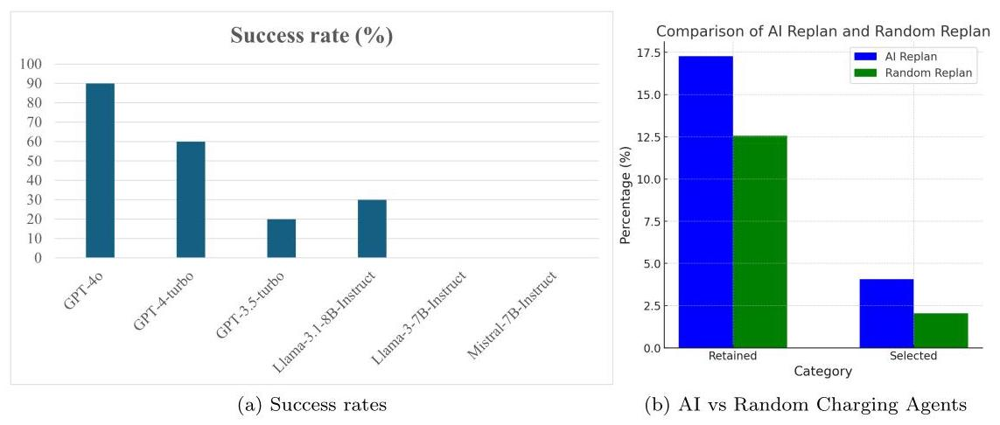

# Bridging AI and Traffic Simulation: A Robust Framework for LLM-Based AI Replanning Agents in MATSim

Ashraf Uz Zaman Patwary \( {}^{1} \) , Francesco Ciari \( {}^{1, * } \) , Luca Angioloni \( {}^{2} \) , Hamed Naseri \( {}^{1} \) , Lorenzo Brusci \( {}^{2} \) , Giulio Iannelli \( {}^{3} \) , and Arsham Bakhtiari \( {}^{1} \)

\( {}^{1} \) Polytechnique Montréal, Quebec, Canada

\( {}^{2} \) Super AI Studio, Florence, Italy

3 Università di Roma Tor Vergata

*Email: francesco.ciari@polymtl.ca

## 1 Introduction

The landscape of artificial intelligence (AI) has been dramatically changed by the advent of large language models (LLMs) and, more specifically, transformer-based architectures (Vaswani et al. 2017) relying on the self-attention mechanism. With the advanced reasoning capabilities, transformers have since been at the forefront of numerous groundbreaking models for understanding contexts in such as GPT (Radford et al. 2018), GPT3 and LLama, and their subsequent improvements for instruction following (Touvron et al. 2023, Achiam et al. 2023), etc.. Trained with large datasets (terabytes of text) and billions of parameters (the largest are said to have 1.8T parameters), these models exhibit incredible contextual understanding, logical reasoning, and show general intelligence and knowledge about the natural world and human behaviors (Bubeck et al. 2023). Hence, they naturally become good candidates to be implemented in hard-to-encode, logic-based, human behavioral simulation systems. This paper integrates LLMs as autonomous decision-making agents within microsimulation models MATSim, where agents interact dynamically and adapt during runtime. The LLM agents will perform task-specific replanning and behavioral adaptations, leveraging the rich interaction and feedback mechanisms inherent to agent-based traffic simulation models.

## 2 Agents in MATSim and AI Integration

In MATSim, agents are travelers navigating road and transit networks, engaging in activities and trips to maximize daily utility. While the simulation happens in the Mobsim, the replanning and scoring steps force the agents towards optimal plans over iterations. AI agents can enhance this process at three levels: single-shot replanning to modify existing plans, multishot replanning with feedback on scores, and multishot replanning with multi-criteria feedback for more control over the optimal plan choice. This study focuses on single-shot replanning for EV simulation in Montreal, where AI agents schedule charging activities based on activity durations, travel modes, and vehicle locations.

## 3 Training LLM Models

LLMs are typically pre-trained on extensive text datasets and fine-tuned using human-labeled data for tasks like instruction following or chat completion (Zhou & Knoll 2024). Given their large parameter sizes, task-specific, full-scale, fine-tuning is often infeasible. Instead, techniques, like LoRA and QLoRA (Hu et al. 2021, Dettmers et al. 2023), enable efficient fine-tuning by training small, low-rank parameter matrices inserted into the model's layers. Retrieval-augmented generation (RAG) is another technique that combines LLMs with external knowledge retrieval for improved context and accuracy (Lewis et al. 2020). While effective for natural language data, our tests showed RAG to be unsuitable for structured formats like XML or JSON. In this study, we rely on prompting to direct agents in their replanning tasks.

Figure 1: LLM-based AI Replanning Framework

## 4 Single shot LLM-based AI Replanning Agent Framework

The LLM-based AI replanning agent with all its components connected to each other is shown in figure 1. As shown in the figure, the framework is built with four major components: Local or Remote LLM Server, Query Builder, Query Response Parser, and finally, the Translation Engine. We have an additional component called the verification module, for verifying the accuracy of the reconstructed plan.

## 5 Experimental Setup and Results

We first experimented with a converted plan from the translation module using different LLM models outside MATSim, along with different system and user prompts. Six different LLM models, GPT-40, GPT-4-turbo, and GPT-3.5-turbo from openAI, Llama 3.1-8B-Instruct and Llama 3-70B-Instruct from meta, and Mistral-7B-Instruct from Mistral AI were tested.

Prompt Formatting: The prompt for this experiment included a system prompt with general instructions, a concise description of the task and rules, two examples, and the JSON schema of the required output defined as a callable tool. The translated JSON input plan to be modified is appended at the end. Figure 2 (a) shows the success rates for the tested models.

Figure 2: LLM AI Agents' Performance

### 5.1 Large-scale Integration

For our large-scale integration, we picked the 1% urban EV scenario with flat charger pricing for the Greater Montreal Island, reported in Bakhtiari et al. (2023). The scenario uses real charger locations for level 1, level 2, and fast chargers at 2933 locations, and 2532 home chargers accessible to specific agents in the simulation. There are 5345 EV users in the 1% scenario. The AI replanning agent is added along with the random charging scheduling logic. Due to the high cost of the openAI models, we implemented AI replanning in a limited capacity with 10-25 AI replanning attempted per simulation iteration.

With the \( {80}\% \) success rate of GPT-40, the framework was successful in completing the predefined 60 iterations of the simulation, and the score graph shows a healthy convergence to near near-equilibrium solution.

A total of 990 attempts of AI replanning have been made, out of which 909 were successful. In contrast, the total random EV charging replanning performed was 169,160. At equilibrium, 157 (17.3%) cases of AI-replanned plans were retained, with 37 (4%) of these plans being selected as the best plan compared to 3383 (2%) plans from random replanning. Figure 2(b) shows the percentage of retained and selected EV plans by both the AI replanning agent and the random replanning tools. Despite the LLM model's lack of awareness regarding network travel time, charger queue dynamics, and electricity pricing at the chargers, this statistic demonstrates the greater effectiveness of the AI-generated plans.

## 6 Conclusion

This study develops a framework for integrating large language models (LLMs) into MATSim, focusing on single-shot replanning for EV charging activities. GPT-4-turbo, achieving an 80% success rate in initial tests, was selected for large-scale implementation alongside a random charging activity scheduler. Using a 1% MATSim Montreal scenario with 5,345 EV agents, 2,933 public chargers, and 2532 home chargers, the system achieved convergence within 60 iterations, producing 909 successful AI plans out of 990 attempts. At equilibrium, 17.3% of AI-generated plans were retained compared to 12.6% for random plans, and \( 4\% \) were selected as the best plans compared to \( 2\% \) for random plans, demonstrating the higher quality of the AI-generated plans over the random scheduler. Challenges include high monetary costs (4.5 cents per query, totaling \$2,475 for 1% Montreal scenario), inefficiencies in open-source models in terms of model incompetence and high computation time (2 minutes per query), API constraints, and variability from unstructured prompting. Addressing competency limitations through fine-tuning and exploring multishot replanning could enhance LLM agents' adoption in transportation simulations.

## References

Achiam, J., Adler, S., Agarwal, S., Ahmad, L., Akkaya, I., Aleman, F. L., Almeida, D., Altenschmidt, J., Altman, S., Anadkat, S. et al. (2023), 'Gpt-4 technical report', arXiv preprint arXiv:2303.08774 .

Bakhtiari, A., Patwary, A. U. Z. & Ciari, F. (2023), 'Electric vehicle charging pricing design for agent-based traffic microsimulation', Procedia Computer Science 220, 755-762.

Bubeck, S., Chandrasekaran, V., Eldan, R., Gehrke, J., Horvitz, E., Kamar, E., Lee, P., Lee, Y. T., Li, Y., Lundberg, S. et al. (2023), 'Sparks of artificial general intelligence: Early experiments with gpt-4', arXiv preprint arXiv:2303.12712 .

Dettmers, T., Pagnoni, A., Holtzman, A. & Zettlemoyer, L. (2023), 'Qlora: efficient finetuning of quantized llms (2023)', arXiv preprint arXiv:2305.14314 52, 3982-3992.

Hu, E. J., Shen, Y., Wallis, P., Allen-Zhu, Z., Li, Y., Wang, S., Wang, L. & Chen, W. (2021), 'Lora: Low-rank adaptation of large language models', arXiv preprint arXiv:2106.09685 .

Lewis, P., Perez, E., Piktus, A., Petroni, F., Karpukhin, V., Goyal, N., Küttler, H., Lewis, M., Yih, W.-t., Rocktäschel, T. et al. (2020), 'Retrieval-augmented generation for knowledge-intensive nlp tasks', Advances in Neural Information Processing Systems 33, 9459-9474.

Radford, A., Narasimhan, K., Salimans, T., Sutskever, I. et al. (2018), 'Improving language understanding by generative pre-training'.

Touvron, H., Lavril, T., Izacard, G., Martinet, X., Lachaux, M.-A., Lacroix, T., Rozière, B., Goyal, N., Hambro, E., Azhar, F. et al. (2023), 'Llama: Open and efficient foundation language models', arXiv preprint arXiv:2302.13971 .

Vaswani, A., Shazeer, N., Parmar, N., Uszkoreit, J., Jones, L., Gomez, A. N., Kaiser, L. & Polosukhin, I. (2017), 'Attention is all you need', Advances in neural information processing systems 30.

Zhou, X. & Knoll, A. C. (2024), 'Gpt-4v as traffic assistant: An in-depth look at vision language model on complex traffic events', arXiv preprint arXiv:2402.02205 .