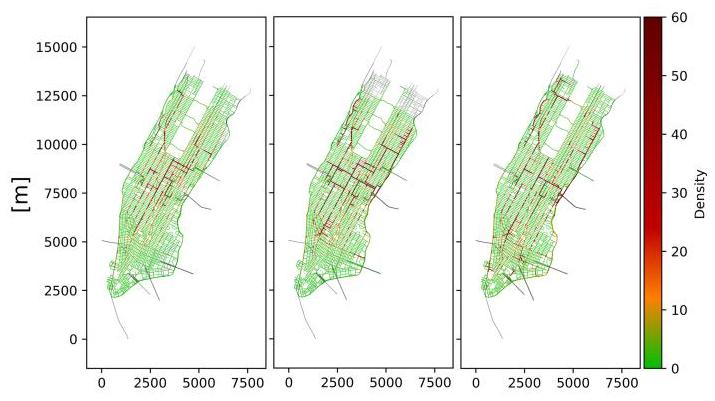

# Speak to Simulate: An LLM-Guided Agentic Framework for Traffic Simulation in SUMO

Minwoo Jeong

Korea Advanced Institute of Science

and Technology (KAIST)

Daejeon, South Korea

minwoo5003@kaist.ac.kr

Jeeyun Chang

Korea Advanced Institute of Science

and Technology (KAIST)

Daejeon, South Korea

jyc021@kaist.ac.kr

Yoonjin Yoon*

Korea Advanced Institute of Science

and Technology (KAIST)

Daejeon, South Korea

yoonjin@kaist.ac.kr

## Abstract

Traffic simulation plays a pivotal role in shaping transportation policy amid increasing urban traffic congestion and evolving mobility patterns. As a leading simulator, Simulation of Urban MObility (SUMO) is a widely adopted open-source platform for urban mobility research. However, generating traffic scenarios in SUMO is a time-consuming and intricate process, creating a steep learning curve and restricting iterative policy experiments. Although recent studies have integrated Large Language Models (LLMs) to mitigate these challenges, they often rely on fixed pipelines that lack interactive scenario generation and broad coverage of SUMO's capabilities. To address these limitations, we propose AgentSUMO, an LLM-guided agentic framework for traffic simulation. Our framework positions the LLM as an AI agent, enabling interactive scenario design and flexible policy experimentation across the full range of SUMO functionalities. On the Manhattan network, our framework demonstrates that AgentSUMO addresses high-level policy goals through task planning and policy selection, resulting in consistent improvements in key traffic flow metrics. This novel agentic approach significantly lowers the barrier to entry for traffic simulation.

## CCS Concepts

- Computing methodologies \( \rightarrow \) Modeling and simulation; Natural language processing.

## Keywords

Traffic simulation, SUMO, Large Language Models, AI Agent

## ACM Reference Format:

Minwoo Jeong, Jeeyun Chang, and Yoonjin Yoon. 2025. Speak to Simulate: An LLM-Guided Agentic Framework for Traffic Simulation in SUMO. In The 8th ACM SIGSPATIAL International Workshop on Geospatial Simulation (GeoSIM '25), November 3-6, 2025, Minneapolis, MN, USA. ACM, New York, NY, USA, 4 pages. https://doi.org/10.1145/3764921.3770151

## 1 Introduction

As cities face growing congestion and rapid shifts in mobility patterns, traffic simulation has become essential for shaping effective transportation policies [7]. It helps policymakers evaluate infrastructure strategies, assess congestion mitigation plans, and anticipate the impact of emerging transportation technologies. Researchers and engineers utilize traffic simulators to validate proposed methods and optimize strategies, such as improving signal control through microscopic simulation [12]. Traffic simulators vary in modeling granularity, from macroscopic flow-based models (e.g., DynaSMART [5]) to mesoscopic approximations (e.g., MATSim [9]) and detailed microscopic approaches. Among these, Simulation of Urban MObility (SUMO) is a prominent open-source tool that has been widely utilized for urban mobility research, traffic planning, and operational analysis [1]. Despite its capabilities, generating complex traffic scenarios in SUMO is often time-consuming and requires specialized technical expertise. The process includes extracting road networks from OpenStreetMap (OSM), preparing origin-destination (OD) demand, configuring multiple XML files for routes and control schemes, and parsing simulation outputs. These steps create a steep learning curve for non-expert users [15].

The emergence of Large Language Models (LLMs) has opened up new opportunities to reduce technical barriers in traffic simulation. Recent advances in LLMs have demonstrated strong capabilities in natural language understanding and reasoning [6]. Building on these capabilities, LLMs can also be integrated into agent-based frameworks, enabling them to perform tasks via perception, multistep planning, and interaction with external tools [2, 6]. Frameworks such as LangChain are essential for operationalizing these capabilities, providing tool integration, memory management, and workflow orchestration [8]. These developments allow LLMs to interpret complex user instructions and automate processes that previously required manual effort. Recent studies have examined approaches for integrating LLMs with traffic simulation. TrafficGPT combines LLMs with traffic foundation models to support natural language interaction for traffic data analysis and SUMO-based simulation [14]. LLMLight leverages LLMs as decision-making agents for traffic signal control within SUMO [3]. Building on this trend, ChatSUMO integrates an LLM directly with SUMO, enabling users to construct and execute traffic simulation scenarios through natural language interaction, thereby lowering the entry barrier for non-expert users [4]. SUMO-MCP similarly connects SUMO to LLMs via Model Context Protocol (MCP), allowing dynamic orchestration of simulation workflows and policy experiments from user prompts [11]. Both approaches demonstrate the potential of combining LLMs with SUMO to make traffic simulation more accessible and interactive. However, ChatSUMO confines LLM to narrow roles such as natural language parsing, parameter extraction, and result summarization within a fixed, imperative pipeline, limiting adaptability to new objectives or iterative refinements. While SUMO-MCP increases flexibility through dynamic tool composition, it currently lacks fully interactive scenario generation with users and does not fully incorporate SUMO's broader capabilities, such as diverse policy experiments and advanced network customizations.

---

*Corresponding Author.

---

To address these limitations, we propose AgentSUMO, an LLM-guided agentic framework for traffic simulation in SUMO. The framework positions the LLM as an AI agent that interactively designs scenarios, invokes specialized tools, and iteratively refines simulations to support flexible experimentation across the full range of SUMO functionalities. Our main contributions are as follows:

(1) We design an agentic simulation framework for SUMO that integrates a Planner Agent with a state-management system to centrally orchestrate the entire simulation workflow;

(2) We implement an interactive scenario generation process that uses various trip demand types (Random OD, Actual OD, Estimated OD), enabling realistic simulations without manual scripting;

(3) We demonstrate an agentic simulation workflow on a Manhattan testbed, showing how the framework autonomously plans and executes policy optimization scenarios.

AgentSUMO provides an interactive, flexible, and comprehensive environment, enabling realistic and policy-relevant traffic simulations through natural language interaction.

## 2 Methodology

### 2.1 Overview

AgentSUMO is an LLM-guided agentic framework for traffic simulation in SUMO. Through iterative and interactive dialogue, it supports end-to-end scenario generation, policy experimentation, and result analysis.

As shown in Figure 1, a conversational Planner Agent engages with the user to elicit requirements, complete missing parameters, and orchestrate simulation workflows by invoking appropriate tools. The Tool Layer encapsulates SUMO utilities and additional customization modules, while the State Management executes simulations and manages input-output data flows.

### 2.2 Core Components and Agentic Workflow

AgentSUMO consists of three main components-Planner Agent, Tool Layer, and State Management-connected through an agentic workflow that transforms natural-language into executable SUMO simulations.

Planner Agent. The Planner Agent serves as the central decision-making unit. It performs intent analysis and slot-filling to construct complete scenario specifications. Leveraging the language understanding and reasoning capabilities of LLMs, it infers implicit requirements, resolves ambiguities, and plans tool execution in the correct order. This conversational approach enables multi-turn refinement of simulation settings and supports interactive scenario generation, policy experimentation, and result analysis.

Tool Layer. The Tool Layer wraps SUMO's native utilities and custom modules into LangChain-compatible tools, enabling seamless invocation by the Planner Agent. These tools cover key stages of the pipeline-including demand generation, network customization, simulation execution, and result analysis-and are validated using Pydantic schemas to ensure consistent input-output formats.

Figure 1: AgentSUMO framework overview

State Management. A state machine pattern governs the multistep simulation process, tracking progress through stages such as intent analysis, scenario generation, map preparation, demand generation, policy experimentation, execution, and result analysis. The state manager maintains simulation context-including scenario parameters, tool outputs, and customization history-across user interactions. This enables users to apply, combine, or revert multiple interventions without reinitializing the entire pipeline.

The agentic workflow follows three main phases:

(1) Scenario Generation: After intent analysis, the Planner Agent collects all required parameters and invokes network and trip-generation tools. The pipeline branches into three modes based on the trip-demand specification:

- Random OD: For exploratory analysis, the agent uses SUMO's randomTrips. py to generate synthetic trip demand based on network size and traffic condition.

- Actual OD: When the user provides actual OD data, the agent preprocesses it accordingly. Coordinate-based input is map-matched and converted into trips, while zone-based OD matrices require a shapefile and are processed via polyconvert.py, edgesInDistricts.py, and od2trips.py.

- Estimated OD: If actual OD data is unavailable but realistic demand is desired, the agent integrates MOSS's OD Generator [13]. This module uses a generative model to produce realistic OD matrices by leveraging publicly available data as a proxy for features like sociodemographics.

In all cases, the generated network and trip demand are combined into a SUMO configuration, which is then executed within the simulation environment.

(2) Policy Experiment: AgentSUMO supports a wide range of policy interventions across three categories-Signal Control, Road Infrastructure, and Traffic Management-by leveraging SUMO's built-in functions. For signal control optimization, the agent can invoke Webster's method-calculating optimal cycle lengths and phase splits via tlsAdaptation.py-and Green Wave coordination, which synchronizes signals along a corridor using tlsCoordinator.py [10]. Road infrastructure experiments encompass road closures, lane reductions, and maximum speed limit adjustments on specified links. Traffic management strategies involve custom vehicle generation and tuning the fuel-type composition (e.g., adjusting the gasoline-to-EV ratio). AgentSUMO additionally supports batch simulations to evaluate multiple strategies and identify optimal configurations.

(3) Result Analysis: Simulation outputs (e.g., tripinfo.xml, edgedata.xml, emissions.xml) are parsed to generate reports, respond to user queries, perform comparative analysis, and visualize results as heatmaps, time-series plots, or annotated network maps.

## 3 Experimental Results

We evaluated AgentSUMO in two experiments designed to assess its capabilities in realistic traffic simulation tasks. The first experiment compared different modes of trip demand generation in reproducing real-world traffic patterns. The second demonstrated the framework's capability to autonomously plan and execute policy optimization scenarios within an agentic simulation workflow.

### 3.1 Setup

All experiments were performed on Ubuntu 20.04.1 LTS running on an Intel Core i9-10900X CPU with two NVIDIA RTX 3090 GPUs (24GB each) and 128GB RAM. We used Python 3.11.12 with LangChain 0.3.26 and Eclipse SUMO 1.22.0. The Planner Agent was powered by OpenAI's gpt-4o-mini model, accessed via the LangChain framework. Publicly available Yellow Cab trip records from the New York City Taxi and Limousine Commission \( {}^{1} \) (TLC) were used. The dataset contains 32,480 trips within Manhattan on Monday, April 4, 2016, recorded between 07:00 and 09:00. Each record includes the pickup and drop-off times and locations. To focus the analysis, only trips originating in and destined for areas surrounding and south of Central Park were retained after preprocessing. Performance was evaluated using three average-based metrics: traffic density, travel time, and time loss. These were computed via AgentSUMO's call to attributeStats.py, a SUMO built-in tool that processes simulation output files. Traffic density and travel time were obtained from edgedata.xml, and time loss from tripinfo.xml. Time loss is defined as the time lost per journey relative to free-flow conditions, quantifying the total delay caused by congestion and traffic control. All simulations were executed under identical configurations for comparability.

### 3.2 Trip Demand Generation Comparison

We evaluated three modes of trip demand generation, Random OD, Estimated OD, and Actual OD, by comparing their resulting spatial traffic patterns on the Manhattan network. As shown in Fig. 2, the Estimated OD reproduced the structured congestion corridors and CBD hotspots observed under the Actual OD, whereas the Random OD produced a more diffuse pattern with weaker continuity of the corridor. In particular, both Actual and Estimated showed low traffic density in southern Manhattan, while Random introduced spurious hotspots. These results indicate that when Actual OD is not available, Estimated OD can provide a more realistic basis for policy evaluation.

Figure 2: Comparison of average traffic density across trip types on the Manhattan network: (left) Actual OD, (middle) Estimated OD, (right) Random OD

### 3.3 Agentic Simulation for Optimal Signal Control

We assessed AgentSUMO's capability to autonomously plan and execute signal control optimization across four NYC Council Districts \( {}^{2}\left( {1 - 4}\right) \) in Manhattan, using the dataset and preprocessing described in the setup. We posed a realistic query-"find the peak-hour congestion mitigation policy for each Manhattan zone"-and let AgentSUMO (i) partition the network into the four zones, (ii) select candidate policies, (iii) orchestrate zone-wise batch simulations under identical conditions, (iv) aggregate evaluation metrics, and (v) recommend the best-performing policy per zone.

As shown in Table 1, Green Wave consistently achieved the best outcomes across all four zones, yielding the lowest travel time, traffic density, and time loss compared to the baseline. The lower performance of Webster's method can be attributed to its design for steady, single-intersection conditions. This constraint limited its effectiveness in the dynamic, multi-intersection settings of our experiments [10]. In Zone 3 (as shown in Fig. 3), Green Wave alleviated congestion at the corridor level along the north-south avenues, particularly near 6th Avenue, resulting in fewer high-density links and greater progression continuity. This experiment demonstrated an agentic simulation workflow in which the agent translated a high-level policy objective into coordinated task planning and orchestration, without the need for manually crafted imperative pipelines.

---

\( {}^{1} \) https://www.nyc.gov/site/tlc/about/tlc-trip-record-data.page

\( {}^{2} \) https://www.nyc.gov/site/districting/maps/maps.page

---

Figure 3: Comparison of average traffic density in Zone 3: (left) Baseline, (right) Green Wave Control

<table><tr><td>Zone</td><td>Policy</td><td>Travel Time (s)</td><td>Density (veh/km)</td><td>Time Loss (s)</td></tr><tr><td rowspan="3">Zone 1</td><td>Baseline</td><td>317.02</td><td>12.36</td><td>312.33</td></tr><tr><td>Green Wave</td><td>309.26</td><td>10.72</td><td>178.16</td></tr><tr><td>Webster</td><td>355.85</td><td>11.80</td><td>202.53</td></tr><tr><td rowspan="3">Zone 2</td><td>Baseline</td><td>228.19</td><td>17.15</td><td>199.43</td></tr><tr><td>Green Wave</td><td>211.70</td><td>11.59</td><td>76.58</td></tr><tr><td>Webster</td><td>262.96</td><td>14.36</td><td>128.93</td></tr><tr><td rowspan="3">Zone 3</td><td>Baseline</td><td>271.28</td><td>27.12</td><td>382.62</td></tr><tr><td>Green Wave</td><td>258.82</td><td>18.42</td><td>178.11</td></tr><tr><td>Webster</td><td>325.18</td><td>26.16</td><td>310.14</td></tr><tr><td rowspan="3">Zone 4</td><td>Baseline</td><td>282.55</td><td>32.31</td><td>367.99</td></tr><tr><td>Green Wave</td><td>260.44</td><td>25.45</td><td>190.15</td></tr><tr><td>Webster</td><td>354.74</td><td>33.78</td><td>352.81</td></tr></table>

Table 1: Results of agentic simulation

## 4 Conclusion

In this paper, we presented AgentSUMO, an agentic simulation framework for SUMO that integrates a Planner Agent with an explicit state management system, enabling centrally orchestrated workflows for scenario generation, policy experimentation, and result analysis. Our framework supports an interactive scenario generation process that adapts to available trip demand types-Random OD, Actual OD, and Estimated OD. We extended policy experimentation capabilities to leverage a broader range of SUMO functionalities, including signal control, road infrastructure modifications, and traffic management strategies. Experiment on a Manhattan testbed demonstrates how the agent translates high-level policy goals into coordinated task planning and execution, illustrating the effectiveness of the agentic simulation workflow.

Future research will focus on advancing the Planner Agent's autonomy by developing structured, multi-step dialogue procedures and enhancing its coordination for dynamic scenario adjustments. To ensure policy realism, we will systematically integrate sociodemographic factors into simulation scenarios and investigate interaction effects of multiple policies (e.g., congestion pricing) and potential negative externalities. We also plan to further broaden SUMO functionality and explore integrating complementary orchestration frameworks such as LangGraph and Model Context Protocol (MCP).

## Acknowledgments

This work was supported by the National Research Foundation of Korea(NRF) grant funded by the Korea government(MSIT) (No. 2022M3J6A1063021, No. RS-2025-00517342)

## References

[1] Michael Behrisch, Laura Bieker, Jakob Erdmann, and Daniel Krajzewicz. 2011. SUMO-simulation of urban mobility: an overview. In Proceedings of SIMUL 2011, The Third International Conference on Advances in System Simulation. ThinkMind.

[2] Xu Huang, Weiwen Liu, Xiaolong Chen, Xingmei Wang, Hao Wang, Defu Lian, Yasheng Wang, Ruiming Tang, and Enhong Chen. 2024. Understanding the planning of LLM agents: A survey. arXiv preprint arXiv:2402.02716 (2024).

[3] Siqi Lai, Zhao Xu, Weijia Zhang, Hao Liu, and Hui Xiong. 2025. Llmlight: Large language models as traffic signal control agents. In Proceedings of the 31st ACM SIGKDD Conference on Knowledge Discovery and Data Mining V. 1. 2335-2346.

[4] Shuyang Li, Talha Azfar, and Ruimin Ke. 2024. Chatsumo: Large language model for automating traffic scenario generation in simulation of urban mobility. IEEE Transactions on Intelligent Vehicles (2024).

[5] HS Mahmassani. 1992. Dynamic traffic assignment and simulation for advanced network informatics (DYNASMART). In the 2nd International Seminar on Urban Traffic Networks, 1992.

[6] Shervin Minaee, Tomas Mikolov, Narjes Nikzad, Meysam Chenaghlu, Richard Socher, Xavier Amatriain, and Jianfeng Gao. 2024. Large language models: A survey. arXiv preprint arXiv:2402.06196 (2024).

[7] Mustapha Saidallah, Abdeslam El Fergogugi, and Abdelbaki Elbelrhiti Elalaoui. 2016. A comparative study of urban road traffic simulators. In MATEC Web of Conferences, Vol. 81. EDP Sciences, 05002.

[8] Oguzhan Topsakal and Tahir Cetin Akinci. 2023. Creating large language model applications utilizing langchain: A primer on developing llm apps fast. In International conference on applied engineering and natural sciences, Vol. 1. 1050-1056.

[9] Kay W Axhausen, Andreas Horni, and Kai Nagel. 2016. The multi-agent transport simulation MATSim. Ubiquity Press.

[10] Andreas Warberg, Jesper Larsen, and \{Rene Munk\} Jørgensen. 2008. Green Wave Traffic Optimization - A Survey. Number 2008-01 in D T U Compute. Technical Report. Informatics and Mathematical Modelling.

[11] Chenglong Ye, Gang Xiong, Junyou Shang, Xingyuan Dai, Xiaoyan Gong, and Yisheng Lv. 2025. SUMO-MCP: Leveraging the Model Context Protocol for Autonomous Traffic Simulation and Optimization. arXiv preprint arXiv:2506.03548 (2025).

[12] Taeyoung Yun, Kanghoon Lee, Sujin Yun, Ilmyung Kim, Won-Woo Jung, Min-Cheol Kwon, Kyujin Choi, Yoohyeon Lee, and Jinkyoo Park. 2024. An Offline Meta Black-box Optimization Framework for Adaptive Design of Urban Traffic Light Management Systems. In Proceedings of the 30th ACM SIGKDD Conference on Knowledge Discovery and Data Mining. 6202-6213.

[13] Jun Zhang, Wenxuan Ao, Junbo Yan, Can Rong, Depeng Jin, Wei Wu, and Yong Li. 2024. Moss: A large-scale open microscopic traffic simulation system. arXiv preprint arXiv:2405.12520 (2024).

[14] Siyao Zhang, Daocheng Fu, Wenzhe Liang, Zhao Zhang, Bin Yu, Pinlong Cai, and Baozhen Yao. 2024. Trafficgpt: Viewing, processing and interacting with traffic foundation models. Transport Policy 150 (2024), 95-105.

[15] Ismet Göksad Erdağı, Mehmet Ali Silgu, and Hilmi Berk Çelikoğlu. 2019. Emission Effects of Cooperative Adaptive Cruise Control: A Simulation Case Using SUMO. In SUMO User Conference 2019 (EPiC Series in Computing, Vol. 62), Melanie Weber, Laura Bieker-Walz, Robert Hilbrich, and Michael Behrisch (Eds.). EasyChair, 92-100. doi:10.29007/fbb7