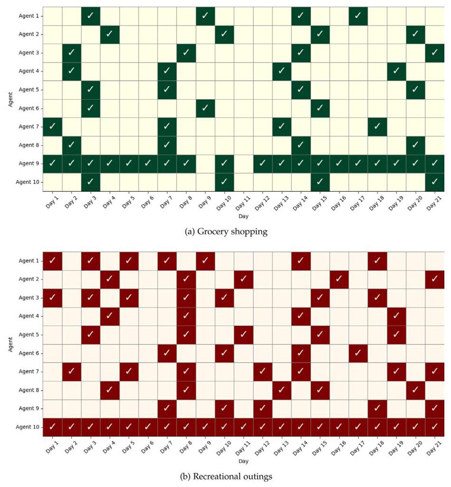
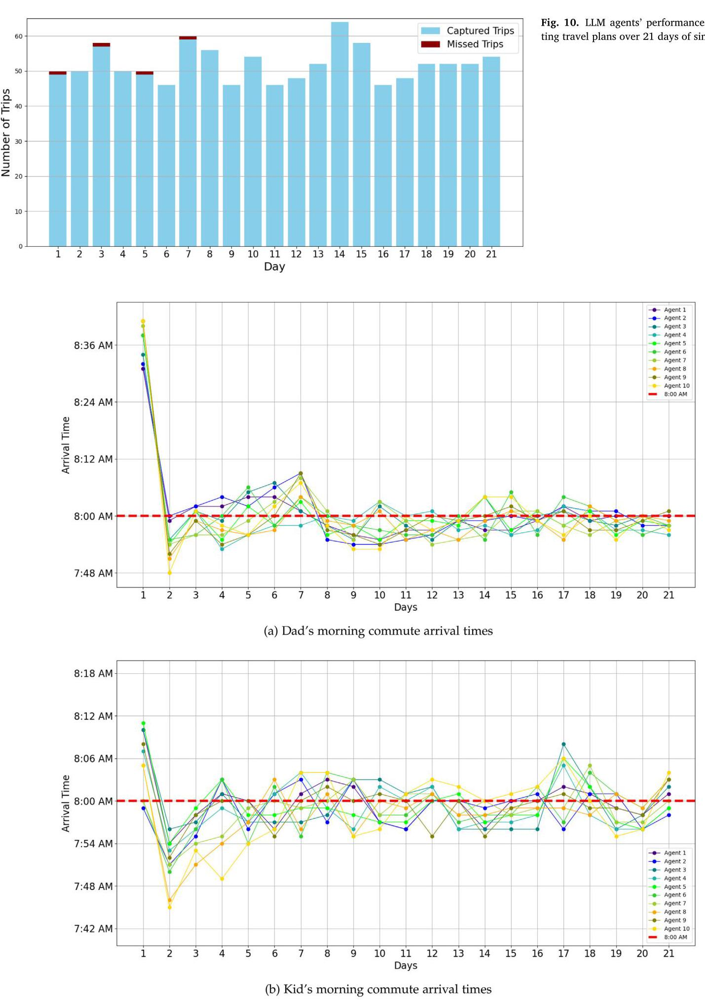

# Toward LLM-agent-based modeling of transportation systems: A conceptual framework

Tianming Liu \( {}^{\mathrm{a}} \) , Jirong Yang \( {}^{\mathrm{b}} \) , Yafeng Yin \( {}^{\mathrm{a}, * } \)

a Department of Civil and Environmental Engineering, University of Michigan, Ann Arbor, United States

\( {}^{\mathrm{b}} \) Department of Electrical Engineering and Computer Science, University of Michigan, Ann Arbor, United States

## A R T I C L E I N F O

Keywords:

Transportation system modeling

Travel behavior

Travel demand modeling

Agent-based simulation

Large language model

Transportation planning

## A B S T R A C T

In transportation system planning, agent-based models (ABMs) and microsimulations have become pivotal tools for understanding system dynamics and supporting decision-making. However, existing ABMs remain limited in their behavioral representation, flexibility, and reliance on comprehensive input data. This paper argues that recent advancements in large language models (LLMs) present a promising new avenue for enhancing agent-based transportation modeling. We propose an LLM-agent-based framework in which LLM agents act as behaviorally rich proxies for human travelers. By leveraging LLMs' capabilities in natural language understanding, contextual reasoning, and generalization, our framework aims to overcome key limitations of traditional ABMs and unlock new modeling possibilities. We design LLM agents with structured profiles, memory systems, perception, decision-making, and action modules to align with the principles of activity-based travel demand modeling. Through system design and literature synthesis, we outline the conceptual and practical advantages of this approach and support our vision with a small-scale proof of concept simulation. Lastly, we discuss the remaining challenges and propose hybrid modeling as a near-term integration strategy. By positioning LLM agents as a novel and promising paradigm, we aim to expand the role of LLMs in agent-based transportation modeling and pave the way for new approaches to travel demand modeling.

## 1. Introduction

In transportation planning, accurately modeling transportation systems and evaluating their performance is an essential task. Effective models must capture diverse traveler behaviors and dynamic interactions with infrastructure to predict travel patterns and assess outcomes of various planning scenarios. The travel demand modeling approach, originally developed in the 1950s, has evolved significantly over the past 70 years. One of the state-of-the-art approaches is agent-based models (ABMs). By simulating individual travelers as autonomous agents capable of interacting with each other and the environment, and making independent decisions, ABMs offer a detailed representation of travel behavior. Unlike traditional aggregate models, such as those that follow the trip-based four-step modeling approach, ABMs overcome the limitations associated with data aggregation, enhance behavioral realism, and provide higher-resolution analyses. Additionally, they enable a broader range of assessment criteria and generate more complete insights that support more effective transportation planning. In planning practice, ABMs are also gradually replacing classical four-step models in the planning workflows of some planning agencies (Bucci et al., 2018; Wingo et al., 2023).

However, established agent-based modeling methods face limitations in behavioral realism and practical applicability. First, decision-making mechanisms within these models typically rely on behavioral representations or heuristics that require a priori assumptions, which may not adequately capture the complex and boundedly rational decision-making processes of travelers (Ben-Elia and Avineri, 2015; Lou et al., 2010; Mahmassani and Chang, 1987; Van Cranenburgh et al., 2022). Second, agent-based models often demand extensive local data for calibration, posing a significant obstacle to their widespread adoption in real-world applications (Manzo and Matthews, 2014). Furthermore, evaluating alternative planning scenarios, especially the effects of complex, targeted policies or emerging technologies, frequently requires substantial modifications to model structure and software specifications (Bastarianto et al., 2023). This puts high demands on the resources needed to establish and maintain the framework and the expertise of the personnel conducting the evaluations, creating additional challenges to their implementation in transportation planning.

Recent advances in large language models (LLMs) offer promising new avenues to address longstanding challenges in agent-based transportation modeling. LLMs are deep generative neural networks trained on massive textual datasets to learn patterns within them. With this training, LLMs internalize patterns of thought, language, and social behavior, allowing them to potentially emulate key aspects of human behavior and decision-making. Such training also supports their ability to generalize across varied behavioral contexts with minimal task-specific calibration. Furthermore, they exhibit strong capabilities in natural language understanding and contextual reasoning. \( {}^{1} \) When deployed as autonomous agents, LLMs can model complex, context-sensitive decision processes and dynamically adjust their behavior in response to evolving environmental and system-level conditions. As a result, LLM agents are particularly well-suited to serve as digital proxies for human travelers within ABM frameworks, making them particularly valuable for transportation planning tasks that involve unstructured decisions, limited data, or complex policy contexts.

---

* Corresponding author.

E-mail address: yafeng@umich.edu (Y. Yin).

---

In this paper, we propose an LLM-agent-based modeling framework for transportation systems. To develop a structured and behaviorally realistic framework, we design the LLM agents and the system workflow that reflect characteristics of human travel behavior and align with the principles of activity-based travel demand modeling. We argue that this framework has the potential to enhance the expressiveness, generalization, and applicability of ABMs for transportation system modeling and simulation. We present the existing literature to support its potential advantages, and provide a demonstrative proof-of-concept of this system, showcasing its feasibility and desirable properties through observations. We further discuss the limitations and challenges associated with this approach, outlining key areas for improvement, and proposing future research directions to address both short-term implementation challenges and long-term research needs in LLM-agent-based transportation modeling.

The primary contribution of this paper is to articulate and demonstrate the potential of LLM agents to address critical limitations in current ABMs of transportation systems. By proposing a novel framework that integrates LLM agents with existing activity-based travel demand models and agent-based simulations, we present a forward-looking vision for more flexible, data-efficient, and realistic transportation simulations that could significantly facilitate future transportation planning. This new direction can also stimulate further research and collaboration among researchers and practitioners in transportation engineering and artificial intelligence, advancing the paradigm of travel demand modeling.

The remainder of this paper is structured as follows: Section 2 provides a review of relevant literature on existing ABMs in transportation, LLMs, LLM agents, and LLM-agent-based social simulations. Section 3 details the design of the proposed framework, including the system structure, agent architecture, simulation workflow, and underlying rationale. Section 4 presents evidence from existing research to support the feasibility and advantages of the proposed framework. Section 5 presents a proof-of-concept of the proposed framework. Section 6 discusses outstanding research challenges and proposes hybrid modeling as a near-term strategy for addressing current limitations. Finally, Section 7 summarizes the key findings, positions, and conclusions of the study.

## 2. Literature review

### 2.1. ABMs of transportation systems

ABMs of transportation systems were first developed in the 1990s to integrate microsimulation of travel behaviors (Arentze et al., 2000) and traffic flow (Barceló and Casas, 2005; Krajzewicz et al., 2002), as well as to address evolving regulations and requirements in transportation planning. Over time, ABMs have become a fundamental paradigm in the field, leading to the development of models such as TRANSSIMS (Smith et al., 1995), MATSim (Axhausen et al., 2016), SimMobility (Adnan et al., 2016), and POLARIS (Auld et al., 2016). While the existing approaches vary across multiple levels of travel behaviors and network dynamics, all ABM models share three key components: agents, which are travelers or households; agents' strategies, which guide and regulate agents' behavior; and a simulated physical environment, encompassing elements such as the transportation network, land use, and mobility services (Kagho et al., 2020). These components allow ABMs to simulate travel behaviors and transportation system dynamics in detail and better support decision-making in planning processes. In line with these capabilities, planning organizations have begun integrating ABMs into practice. For instance, in the United States, as of 2023, organizations such as the North Central Texas Council of Governments (Wingo et al., 2023) and the Southern California Association of Governments (He et al., 2022) have begun adopting or experimenting with agent-based modeling for regional transportation planning and policy evaluation.

However, despite significant advancements, existing ABMs still face challenges in behavioral representation and practical implementation. One key limitation is their ability to represent human travel behavior. While the specific methodologies vary across models and applications, behavioral modeling approaches in ABMs generally fall into two categories: econometric-based and rule-based models, both of which require a priori behavioral assumptions. Econometric models, such as discrete choice models, often rely on assumptions of rationality, stable preferences, and specific distributions of random errors. However, such assumptions often fail to fully capture the subtle and irrational behaviors that influence human travelers' behavior. Rule-based models, including decision trees and heuristic-based decision frameworks, simulate travel behavior using predefined rules. While computationally efficient, these models struggle to represent complex decision-making processes and often lack flexibility, as their fixed rule sets limit adaptability across diverse travel scenarios.

Furthermore, existing frameworks require substantial data for proper calibration. Agent-based transportation models must capture multiple layers of travel behavior, including, but not limited to, car ownership, residential location choices, activity scheduling, travel mode choice, and route choice decisions. Each of these components requires extensive data collection and calibration from scratch. For instance, calibrating SimMobility requires integrating various data sources, such as demographics surveys, household travel surveys, taxi GPS records, and transit smartcard data, specific to the region being modeled (Adnan et al., 2016). The considerable effort involved in data collection and the calibration process poses significant challenges to the practical adoption of ABMs. Many metropolitan planning agencies lack the necessary data sources, financial resources, and workforce to support these demanding requirements. According to a report in 2015 (Cambridge Systematics, 2015), only 16 % of metropolitan planning agencies in the United States have plans to transition from conventional four-step models to more advanced approaches in the near future. Similarly, Boyce and Williams (2015) note that, despite their potential, ABMs have had a relatively modest impact on transportation planning practice thus far.

### 2.2. Large language model

In recent years, advances in artificial intelligence have led to the emergence of a new class of AI models: large language models (LLMs). Built upon sequential deep learning techniques, particularly transformers (Vaswani et al., 2017), LLMs are designed to generate content in human language. They are sequence-to-sequence models that can predict the probability distribution \( \mathbb{P} \) of next word \( {w}_{i}^{\left( u\right) } \) in a sequence \( u \) given the previous words \( {w}_{i - 1}^{\left( u\right) },{w}_{i - 2}^{\left( u\right) },\ldots ,{w}_{1}^{\left( u\right) } \) , and sample from it to generate outputs:

\[
{w}_{i}^{\left( u\right) } \sim  \mathbb{P}\left( {{w}_{i}^{\left( u\right) } \mid  {w}_{i - 1}^{\left( u\right) },{w}_{i - 2}^{\left( u\right) },\ldots ,{w}_{1}^{\left( u\right) }}\right)
\]

---

\( {}^{1} \) In this paper, we use the term "contextual reasoning" to describe LLMs’ ability to complete complex tasks that typically require reasoning in humans, while acknowledging that this emergent capability of LLMs, rooted in probabilistic generation, differs from human logical reasoning.

---

The primary advancement of LLMs over conventional purpose-built machine learning models lies in their scale, both in terms of model size and training data. LLMs generally contain billions of parameters and are trained on vast and diverse text datasets, including books, articles, web-sites, online forums, social media, and research papers (Achiam et al., 2023). This extensive training enables them to generate high-quality text responses across a broad range of topics, making them more generalizable than traditional AI models, which are often limited to specialized tasks. While early LLMs, such as text-davinci (Brown et al., 2020), were primarily designed for text completion based on given input, state-of-the-art models like ChatGPT (Achiam et al., 2023), Gemini (Team et al., 2023), DeepSeek (Liu et al., 2024a), and Llama (Touvron et al., 2023) have evolved into advanced conversational agents capable of engaging in long interactions and executing complex instructions.

Beyond their ability to replicate human language patterns, LLMs exhibit several critical capabilities that significantly enhance their versatility and intelligence. First, they can solve complex problems by decomposition, which is facilitated by techniques like Chain-of-thought (CoT) prompting (Wei et al., 2022). By breaking down complex problems into sequential steps, LLMs can imitate the patterns of step-by-step analysis in human reasoning, therefore exhibiting more reliable problem-solving and improved analytical depth. Second, they can leverage retrieval-augmented generation (RAG) (Lewis et al., 2020) to access and synthesize information from designated sources, improving factual accuracy in generated responses. Next, as their training datasets expand, LLMs demonstrate remarkable generalization abilities through few-shot learning (Brown et al., 2020) and zero-shot learning (Kojima et al., 2022). This generalization ability allows them to perform unfamiliar tasks with minimal or no prior examples, adapting to new contexts with limited human guidance. Overall, the combination of these emergent properties enables LLMs to process complex scenarios, retrieve and validate external information, and efficiently tackle a wide range of problems.

#### 2.3.LLM agents

The impressive capabilities of modern LLMs give rise to a significant paradigm in AI engineering: LLM agents. Broadly defined, an LLM agent is an autonomous system that leverages an LLM to perform tasks, with autonomy being the defining characteristic. To achieve autonomy, they are typically equipped with modules for input processing, action determination, execution, and feedback, as well as integrated external tools. The specific tasks and roles of LLM agents vary widely depending on their application. For instance, information-processing agents utilize the multi-modal understanding and natural language generation capabilities of LLMs to analyze and generate reports, such as monitoring transportation system performance (Ruan et al., 2024; Wang et al., 2024a). Chatbot agents harness LLMs' natural language processing and information retrieval abilities to provide domain-specific support, including applications in public transit (Devunuri and Lehe, 2024) and transportation engineering (Wang et al., 2024d). Additionally, LLM agents can be designed for problem-solving tasks, such as automatic control (Guo et al., 2024), by leveraging their contextual reasoning abilities to optimize decision-making.

In LLM agent research, a growing body of work explores the potential of LLM agents as effective proxies for human behavior, simulating decision-making patterns across a range of domains. The key idea behind this approach is that LLMs, trained on a vast corpus of human-generated content, can potentially learn patterns of thought, expression, and decision-making, which enables them to approximate diverse human behaviors. Furthermore, their extensive parameter space and probabilistic architecture enable LLM agents to produce context-sensitive outputs that support credible role-playing in diverse backgrounds. As a result, LLM agents have been used to simulate political attitudes (Argyle et al., 2023), economic decisions (Aher et al., 2023; Horton, 2023; Korinek, 2023), psychological behaviors (Demszky et al., 2023), and social interactions (Park et al., 2024a; Ziems et al., 2024). While discrepancies between simulated and real-world behaviors remain, studies consistently show that LLM agents replicate key behavioral patterns observed in humans, making them a viable and promising proxy for human decision-makers in social simulations.

Given the key requirements for traveler agents in ABMs, LLM agents exhibit crucial capabilities that align well with this paradigm. First, their advanced natural language processing allows LLM agents to interpret both structured data and unstructured text, enabling them to incorporate diverse information sources and understand contexts. Second, they demonstrate a degree of autonomous decision-making by perceiving information and adapting their behavior to given constraints or goals. When prompted with specific instructions or queries, they can dynamically generate responses and execute decisions accordingly. For example, in travel itinerary planning, LLM agents have demonstrated the ability to create high-quality travel plans (Chen et al., 2024a; Tang et al., 2024b). Finally, they possess role-playing ability (Shanahan et al., 2023; Shao et al., 2023), which allows them to adopt diverse personas and simulate decision-making from the perspective of different traveler profiles.

### 2.4. LLM-agent-based simulation

Leveraging LLM agents' abilities, research in physical and social sciences has integrated them into ABM frameworks for simulation (Gao et al., 2024). The goal is to use LLM agents as "guinea pigs" in multi-agent simulations to study agent interactions, emergent behaviors, and the effects of interventions (Grossmann et al., 2023). By embedding LLM agents within these frameworks, researchers can explore how they respond to different stimuli, interact with other agents, and influence overall system dynamics. Here, we summarize and classify the current diverse applications of LLM-agent-based modeling and simulation in multi-agent interactive systems into three categories:

- Small-scale replica of laboratory experiments: A few existing studies use LLM agents in controlled, small-scale experimental settings to observe their behavior and emergent phenomena. These experiments typically involve a limited number of agents, ranging from two to a few dozen, operating in an environment governed by fixed rules, such as game mechanics or payoff matrices. Agents in these simulations usually only make single-shot decisions in each round of interaction. Examples of this approach include simulations of werewolf games (Xu et al., 2023), transmission chains (Acerbi and Stubbersfield, 2023), cooperation games (de Zarzà et al., 2023), collaborative task-solving (Chen et al., 2023a; Zhang et al., 2023), and economic games (Han et al., 2023; Mao et al., 2023; Trencsenyi et al., 2025).

- Neighborhood-scale or society-scale simulation of specific behaviors: Some studies employ LLM-agent-based modeling to examine the impact of individual behaviors on system dynamics and outcomes in larger-scale systems, such as neighborhoods or small societies. In these simulations, compared to small-scale experiments, a significantly larger number of LLM agents, from hundreds to millions, are involved in the simulation. However, these simulations still focus on modeling system-wide dynamics driven by a single type of agent behavior. Examples of these studies include the simulations of social media platforms (Gao et al., 2023; Mou et al., 2024; Pa-pachristou and Yuan, 2024; Tang et al., 2024a; Yang et al., 2024), where LLM agents replicate human posting behaviors; financial markets (Yang et al., 2025), where they model investor trading patterns; public health systems (Chopra et al., 2024; Williams et al., 2023), where they simulate population's response to pandemics; international relations (Hua et al., 2023), where they act as governmental decision-makers; and national politics (Jiang et al., 2024), where they mimic voters' voting behavior.

- Neighborhood-scale or society-scale simulation of general human behavior: A small body of existing research explores multifaceted human behavior simulations using LLM agents. Unlike the previous two categories, these agents operate with greater decision-making freedom and wider contexts, rather than being restricted to a single type of behavior. Within comprehensive societal simulations, these frameworks capture complex agent behaviors and more complete system-wide dynamics. Notable studies in this area include Park et al. (2023), which introduced a sandbox town where LLM agents interact socially and perform everyday tasks; AL et al. (2024), which simulated society-building among multiple LLM agents in the Minecraft environment; Cheng and Chin (2024) and Piao et al. (2025), both of which developed multi-behavior agentic frameworks to simulate and evaluate interactions across domains such as social networks, economics, and finance.

While LLM-agent-based simulations exist across multiple levels of social systems, for their implementation on transportation systems, characteristics of transportation systems and requirements for transportation planning present two unique challenges that remain unaddressed by existing studies:

- Model resolution: Existing literature on LLM-agent-based simulations either focuses on a single behavior or attempts to model general social or economic behaviors with minimal constraints. However, travel behavior in transportation systems is inherently hierarchical and diverse. To ensure behavioral realism, the design of agents and simulation pipelines in LLM-agent-based transportation models must be expanded and refined to adequately capture the decision-making processes of human travelers.

- Model accuracy: Most existing LLM-agent-based simulations rely on qualitative evaluation or quantitative assessments based on a single outcome, often aiming to identify emergent patterns rather than precisely replicate real-world human dynamics. However, in transportation planning, LLM-agent-based simulations must provide comprehensive and quantitative assessments of various planning scenarios. These evaluations require accuracy on multiple levels, including estimates of traffic flow, travel time, travel demand, transit ridership, etc. This necessitates advanced calibration techniques to improve the accuracy of LLM-driven simulations compared to existing models.

## 3. System design

In this section, we present the design of our LLM-agent-based transportation system modeling framework, detailing its core components, the structure of LLM agents, and the overall system workflow within the simulation, as well as outlining the key potential advantages of our proposal over existing ABM frameworks.

### 3.1. Overview

Our proposed framework comprises two main components: LLM agents and the physical environment. The agents represent distinct decision-making units within the transportation system. The physical environment, on the other hand, models infrastructure characteristics and service performance in response to evolving travel demand. In the simulation, multiple LLM agents with distinct identities, reflecting various demographic and behavioral attributes, operate concurrently and interact with the environment. This setup enables the representation of diverse population groups and their unique travel behaviors. Through these interactions, the agents and the physical environment collectively simulate complex transportation system dynamics, allowing the framework to evaluate system performance. The overall structure and agent-environment interactions within our LLM-agent-based modeling framework are illustrated in Fig. 1.

The core innovation of our proposed modeling framework lies in the design and implementation of LLM agents and their seamless integration into ABM systems. Before describing the specifics of LLM agents, we first provide an overview of the physical environment. The physical environment in our framework is a dynamic transportation network simulator capable of realistically representing key transportation network dynamics, including infrastructure conditions, network congestion, and multimodal transit services, while also capturing their performance responses to varying demand patterns. Furthermore, the physical environment establishes input and output requirements for key modules in LLM agent design, ensuring that the agent architecture remains compatible and functionally consistent with the broader modeling framework. The simulation environment can be either developed from scratch by the modeler or built upon existing dynamic network simulation platforms, such as SUMO (Krajzewicz et al., 2002) or Aimsun (Barceló and Casas, 2005), through integration or extension.

#### 3.2.LLM agent

In our proposed framework, as shown in Fig. 2, LLM agents are designed to emulate the behavior of human travelers. To achieve a comprehensive emulation, our LLM-based agent architecture consists of an LLM core (which is an LLM instance) and four key modules that support its functionality: the profile, perception, decision-making, and action modules.

In the profile module, we establish a human-like profile for LLM agents that serves as the intrinsic features for shaping behavior. Human travel behavior is influenced by numerous factors, including preferences, attitudes, socio-demographic characteristics, travel purposes, habits, and past experiences, and we design the profile module to capture the impact of these factors. Specifically, each agent's profile consists of three key components: identity, traits, and memory. The function and behavioral implications of each component are detailed below:

- Identity: The identity module defines the core socio-demographic characteristics that shape the agent's travel behavior. This includes information such as name, age, occupation, wage, household income, vehicle ownership, and residential location. Additionally, the identity determines obligatory travel activities. For instance, an office worker must commute to work on workdays, while a student attends school on school days. Each agent's identity is stored as natural language representations in data tables, ensuring no information loss due to aggregation while allowing coherent transfer to the LLM core for contextual understanding and role-playing in behavior simulation.

- Traits: Beyond identity, an agent's profile incorporates attitudes, habits, decision-making tendencies, economic preferences, and trade-offs, as these factors significantly influence travel behavior (Aarts, 1996; Ben-Elia and Avineri, 2015; Mokhtarian, 2024). Attitudes reflect an agent's perceptions of travel-related aspects, such as preference for travel enjoyment or environmental consciousness. Habits capture routine travel patterns, such as car dependency. Decision-making traits encapsulate aspects of bounded rationality, including cognitive inertia, degree of loss aversion, and risk preference. Finally, economic preferences and trade-offs characterize the agent's economic behavior, such as the value of travel time savings. Like identity, these trait attributes are stored in natural language format, enabling efficient retrieval and integration during simulation.

- Memory: In addition to the attributes, agents dynamically learn and adjust based on past travel experiences. For instance, frequent delays on a particular route may prompt a traveler to adjust departure times or switch modes in future trips. To replicate this learning process, we implement a memory module that tracks and stores agents' past experiences and reflections. The memory system consists of two layers: short-term memory, which records detailed recent travel experiences, and long-term memory, which retains high-level summaries and insights that persist over time. All stored memories are structured in natural language format, following a predefined data structure to facilitate retrieval and update during decision-making.

Fig. 2. Design of LLM agents.

In transportation systems, travelers collect information from the system and make travel-related decisions based on their evaluation of alternatives. The decisions depend on their intrinsic attributes and the perceived attributes of the alternatives. Furthermore, travelers must also act upon them and carry them out through interaction with the physical environment. Therefore, beyond maintaining a comprehensive profile, an agent's ability to process environmental information, make informed decisions, and execute actions is also essential for it to function. To achieve this, we introduce three vital functional modules: the perception, decision-making, and action modules. The LLM core serves as the central component, playing a critical role in all modules. The core functionalities of these modules are described below:

- Perception: Travelers frequently acquire real-time information about the physical environment, such as points of interest or candidate routes, and receive feedback on the outcomes of past actions. To reflect this, we equip agents with corresponding perceptual capabilities, allowing them to query and extract relevant information from their profile and the physical environment. This data is initially retrieved in a structured format (e.g., numerical vectors). Next, the LLM core processes this structured information, translates it into natural language, and incorporates it into subsequent decision-making processes.

- Decision-making: Human travel behavior contains a series of decisions. To simulate this using LLM agents, we combine prompt engineering with strategic querying in the decision-making module. For each travel decision, we retrieve the agent's identity attributes, behavioral traits, and past experiences from its profile and integrate them with perceived environmental data into a natural language prompt. This prompt instructs the LLM core to simulate the agent's travel behavior while adhering to predefined output formats. The LLM's capabilities in contextual understanding, planning, evaluation, and role-playing allow it to produce dynamic responses that reflect adaptive and realistic decision-making strategies.

- Action: While LLMs can simulate travel behavior, their outputs are in natural language, whereas dynamic transportation network simulators used in our physical environment require structured inputs like time-dependent origin-destination (O-D) trip matrices. To bridge this gap, the action module translates LLM-generated text into simulator-compatible formats. The action module parses LLM-generated text, extracts key travel parameters, including departure time, destination, mode choice, etc., and maps them into standardized data structures that satisfy the simulator's input. This ensures that the agents' behaviors are accurately reflected in the physical environment and the simulation.

Fig. 3. Workflow of the simulation system.

### 3.3. System workflow

In designing the system workflow of our LLM-agent-based model, we combine the principles of activity-based travel demand models (Castiglione et al., 2015) to enhance behavioral realism in both agent decision-making and agent-environment interactions. An overview of the system workflow is presented in Fig. 3.

In Fig. 3, the behavior of agents and their interaction with the transportation infrastructure follows the general workflow of activity-based models. The proposed framework primarily focuses on day-level decision-making and system dynamics; however, it can be extended to incorporate long-term decisions (e.g., residential location choices) and medium-term choices (e.g., transit memberships and vehicle ownership) by adding supplementary functions within the same pipeline. The decision-making and interaction flow of agents consists of the following key steps:

- Need-based activity generation: Travel demand is largely derived from individuals' daily activities, which are shaped by factors including socio-demographics, lifestyle, preferences, and past experiences (Arentze and Timmermans, 2009; Liu et al., 2020). To reflect this characteristic of travel behavior, in the initial stage of decision-making, LLM agents assess household and traveler characteristics and generate a comprehensive set of activities, encompassing both mandatory obligations (e.g., commuting to work or school) and discretionary choices (e.g., dining out or shopping). Agents reference related profiles and draw upon relevant experiences to formulate daily activities that align with individual and household-level needs.

- Day-level pattern construction: In activity-based models, structuring daily travel patterns is a key step between activity generation and trip itinerary formulation (Arentze et al., 2000; Castiglione et al., 2015). It defines household- and individual-level travel attributes such as the number of tours, activity sequences, and the distribution of travel responsibilities (Auld and Mohammadian, 2012; Gali et al., 2008). To capture this process, LLM agents integrate previously generated activities with past travel experiences to construct daily travel patterns. Through contextual reasoning and learned heuristics, agents organize household activities into structured tours and carefully selecting participants for each tour, activity durations, and sequencing constraints.

- Tour-level decisions: Once day-level travel patterns are established, the next step involves specifying tour attributes (Castiglione et al., 2015; Gali et al., 2008). At this stage, the LLM agents synthesize tour-level details with present-day constraints, optimizing schedules to balance efficiency and personal preferences. By continuously referencing spatial knowledge, habitual patterns, and day-level constraints, agents formulate adaptive and individualized tour schedules, which guide the subsequent final itinerary generation.

- Final itinerary construction: The final phase in activity-based modeling involves completing detailed travel itineraries. In our framework, agents finalize their tour schedules by specifying key trip attributes such as departure and arrival times, travel modes, and route choices. They incorporate relevant memories and contextual cues in constructing the final itineraries, allowing agents to make informed decisions based on prior experiences and current travel conditions. This step produces a coherent trip chain for each traveler, which can then be converted to O-D matrices in the action module.

- Self-correction and improvement: LLM agents may occasionally produce unrealistic or infeasible travel plans. To improve reliability, we implement a self-correction mechanism in which agents undergo a post-processing phase to review and correct inconsistencies and impracticalities in their schedules, leveraging LLMs' self-refinement abilities (Kamoi et al., 2024). Our previous work (Liu et al., 2025b) shows that this process significantly improves the accuracy and coherence of LLM-generated travel plans.

- Feedback: After itinerary generation, agents' travel plans are converted into structured inputs for simulation in the physical environment. The resulting travel outcomes, such as congestion levels, delays, and arrival times, are fed back to the agents. This feedback is then processed into the agents' memory systems, enabling adaptive learning and continuous refinement of future travel choices. By incorporating system feedback, LLM agents progressively enhance their decision-making strategies, ensuring that subsequent travel behaviors reflect evolving conditions and learned experiences.

#### 3.4.Key potential advantages

We argue that our approach of integrating LLMs into transportation ABMs offers more than just compatibility—LLM-based agents can enhance existing frameworks and help address key limitations of traditional models. Below, we highlight several key potential advantages of our approach.

#### 3.4.1. Relaxing behavioral assumptions

LLM agents have the potential to relax the assumptions embedded in behavior models applied in existing ABMs. As discussed in Section 2.1, traditional ABMs rely on econometrics-based models and rule-based frameworks, both of which impose assumptions about traveler behavior and have limitations in behavior representation. LLM agents offer an alternative that can relax some assumptions and incorporate a broader range of behavioral factors into travel demand modeling. Trained on vast corpora of human-generated text and record, LLMs are exposed to an extensive dataset that inherently reflects human thought patterns, preferences, and social behaviors. Therefore, in the training process, LLMs could learn from these rich patterns in the training data and approximate human language and behavior as a result, which makes them well-suited to capturing the behavior exhibited by human travelers. Empirical studies further support this potential, with research showing that LLMs exhibit economic decision-making patterns similar to those observed in humans (Coletta et al., 2024; Horton, 2023), as well as humanlike perception (Strachan et al., 2024) and social behavior (Leng and Yuan, 2023; Xie et al., 2024; Zhang et al., 2023). These findings highlight the potential of LLM agents to enhance behavioral realism in ABMs by relaxing assumptions and better capturing the complexity of human travel behavior.

#### 3.4.2. Better leveraging existing data sources

LLM agents offer the potential for more efficient and expanded utilization of existing data sources in the calibration process compared to conventional approaches. In existing ABMs, behavioral models require extensive data collection in terms of contexts, which can be a challenge, particularly for agencies or communities with limited resources. LLM agents can potentially mitigate this challenge for ABMs. First, LLM agents may leverage extensive pre-training on diverse human-generated datasets, encompassing a broad range of knowledge domains and behavioral contexts. This pre-training equips LLMs with a rich baseline of generalizable insights into human decision-making, reducing the need for calibration from scratch. Moreover, LLM agents can incorporate heterogeneous data sources, including unstructured data such as textual content, images, and other multimodal inputs, allowing model developers to better utilize existing data resources. Finally, the few-shot learning capabilities of LLMs enable them to generalize behaviors across diverse settings with minimal additional data. Consequently, LLM agents have the potential to broaden the accessibility of model training, enabling agencies and communities with resource constraints to implement agent-based simulations.

#### 3.4.3. Better supporting alternative evaluation

The LLM-agent-based framework also facilitates the evaluation of alternative transportation scenarios and policies more efficiently compared to conventional methods. Established ABMs may require extensive modifications in both agent configurations and supporting datasets to adapt to some new scenarios. In contrast, LLM agents provide significant flexibility, allowing agent behaviors to be customized through natural language prompts rather than complex logic or code specific to each scenario. This capability reduces the time and expertise required for setting up simulations. Additionally, the few-shot and zero-shot prompting mechanism of LLMs enables generalization to alternative situations with minimal data, which reduces the need for explicitly programming detailed behavioral rules for each scenario. Several studies have demonstrated the effectiveness of LLM-agent-based modeling for evaluating complex policies and scenarios. For example, Han et al. (2023) explored communication policies and market collusion; Hua et al. (2023) simulated historical international events; Li et al. (2024a) assessed COVID- 19's impact on US unemployment; and Chopra et al. (2024) modeled public health outcomes of containment policies in New York City. In each case, policies and scenarios were provided as natural language inputs, significantly simplifying simulation setup.

In addition, an LLM-agent-based framework also opens up opportunities for interactive planning interfaces, where transportation planners and policymakers can iteratively engage with the model throughout the planning process. In this interface, planners can query the model in natural language to propose policy interventions or adjust model settings, with the LLM agents responding to the planners adaptively based on their commands. This two-way interaction supports a more adaptive and collaborative approach to transportation planning, enabling planners to evaluate "what-if" scenarios on the fly, receive feedback that is customized to the planner's needs, and refine policies through conversational feedback loops.

#### 3.4.4. Supporting the learning of agents

An essential feature of ABMs in transportation systems is the ability of agents to learn and adjust their travel behavior over time. Beyond simulating the learning process of human travelers, adaptive agents play a crucial role in facilitating system convergence toward equilibrium and enabling consistent and fair assessments of alternative scenarios. However, efficiently modeling learning and behavioral adjustment remains a challenge in existing ABM frameworks. Traditional methods, such as including random permutations and co-evolutionary algorithms, could suffer from limited efficiency or generalization. LLM agents present a promising alternative for modeling learning and behavioral adaptation, as they possess intelligence that allows them to infer system patterns and make strategic adjustments to their travel decisions. Compared to traditional approaches, LLM agents offer both high adjustment efficiency and strong generalization capabilities, making them more effective in simulating adaptive human-like decision-making. These advantages are supported by existing literature. For example, Patwary et al. (2025) studied agent planning of electric vehicle charging in Greater Montreal Island, Canada, and found that LLM-based planning achieved a higher success rate and produced more reliable behavioral adjustments than conventional methods.

The potential advantages outlined in Section 3.4 position the proposed LLM-agent-based modeling as a promising advancement for enhancing transportation system modeling and simulation. However, compared to existing transportation system ABMs, the proposed framework also faces challenges. These challenges, and the associated trade-offs relative to traditional ABMs, stem directly from the inherent nature of LLMs as large, pre-trained generative AI models. While powerful, LLM agents often come with less direct control, lower interpretability, and higher computational demands than traditional agents. As a result, achieving robust behavioral alignment with human travelers and enabling scalable simulations will require additional research and careful implementation. These challenges and future research directions are provided in Section 6. Moreover, recent studies have demonstrated the significant potential of LLM agents to align with human behavior, both within transportation contexts and more broadly. A detailed review of relevant literature and supporting evidence, which reinforces the behavioral realism of our proposed approach, is provided in Section 4.

### 4.Key validations on behavioral alignment

In designing LLM agents for transportation system modeling, a crucial task is to have them closely replicate human travel behaviors. As agent-environment interactions in transportation systems are inherently iterative, agents must make travel decisions and adjust their strategies over time based on feedback. Thus, agent behavior should align with that of human travelers along three dimensions: First, controlling for individual identities, LLM agents should exhibit a similar distribution of travel-related activity types, frequencies, and timings as human travelers; Second, their travel choices should be consistent with those made by human travelers under comparable conditions; Third, LLM agents must demonstrate a human-like ability to learn from past experiences and adjust their decisions accordingly.

While LLMs are trained on vast amounts of human-generated data, there is no guarantee that their behavior will naturally align with or resemble human behavior. Even with techniques like role-play prompting (Liu et al., 2023a), which provides socio-demographic details to enhance the agent's role playing ability, studies from social science and psychology (Chen et al., 2023b; Fan et al., 2024; Goli and Singh, 2023; Hagen-dorff et al., 2023; Park et al., 2024b; Taubenfeld et al., 2024; Tjuatja et al., 2024; Wang et al., 2024b) suggest that merely prompting LLMs with task descriptions, demographic attributes, and contextual details is often insufficient to generate human-like behaviors. Consequently, additional tuning is necessary to better align LLM agents' travel choices with those of human travelers.

Encouragingly, recent research in the transportation domain shows that certain tuning methods can enable LLM agents to effectively replicate human travel behavior. These methods include advanced prompt engineering, thoughtful agent structure design (such as incorporating memory systems), and supervised fine-tuning on domain-specific datasets such as travel diaries or choice records. Results from these studies suggest that well-tuned LLMs can closely mirror human travel patterns across multiple dimensions and, in some cases, outperform established benchmark models in accuracy. In this section, we present a detailed review of existing research on this topic and assess the feasibility and progress of designing and training LLM agents to achieve strong alignment with human behavior across the three key dimensions outlined above.

### 4.1. Activity generation and scheduling

Existing research on LLM-based activity generation focuses on tuning and conditioning LLM agents to produce travel diaries that resemble those of human travelers. These diaries, which document sequences of travel activities, serve as valuable proxies for understanding activity generation and scheduling. The promising results from these studies show that with targeted prompting, conditioning, and fine-tuning, LLM agents can effectively simulate human travel activities across a wide range of contexts.

Some studies combine in-context learning with behavior theory to enhance LLM agents alignment with human activity patterns. In Wang et al. (2024b), an agentic framework combining memory and motivation was employed to condition LLM agents in generating humanlike mobility trajectories. The first step of the framework was to establish habitual travel patterns within a population by learning from real-world trajectory data and socio-demographic information. Each agent was then assigned a pattern that best aligned with its past activities. During travel diary generation, the agent identified motivations and travel needs based on socio-demographic attributes, habitual patterns, and date. These components were then loaded into a structured prompt to generate a new travel diary. Regarding the alignment between LLM-agent-generated and human trajectories, evaluations using a large-scale mobility dataset indicated that LLM agents achieved higher generation accuracy than existing theory-based or machine-learning-based benchmark models. Building on this approach, Li et al. (2024b) introduced learning-based and persona-driven LLM agents to further enhance alignment. Their framework extended the behavioral foundation by incorporating additional factors such as preferences and responsibilities in the learned personas. These learned personas were later embedded into prompts for travel diary generation. Accuracy-wise, evaluation on real-world household travel survey data showed that this method outperformed benchmark models in behavior generation.

Even in the absence of large-scale individual travel diaries, LLM agents can still generate activity patterns similar to human travelers. Liu et al. (2024d) demonstrated that with few-shot prompting and high-level guidance, LLM agents could generate travel diaries that mimics human mobility patterns. Their prompt design included the agent's socio-demographic profile, economic and mobility statistics at a granular level, guidelines based on human knowledge, and few-shot examples of travel trajectories. Using the NHTS and the SCAG travel survey data, they showed that few-shot prompting enabled LLM agents to generate activity types and locations that closely resembled human travel trends at the aggregate level, albeit with some discrepancies in scale.

Beyond few-shot prompting, fine-tuning techniques offer another promising approach for improving LLM-based travel demand generation. Zhang et al. (2024) combined few-shot prompting with fine-tuning by training an open-source LLM model on travel diary data. The study found that the fine-tuned model produced activity distributions that closely resembled the shape of the human-generated ground truth, although LLMs tended to generate fewer trips per day than human travelers.

Since travel behavior is largely a derived demand driven by human needs (Mokhtarian and Salomon, 2001), generating accurate activity patterns also hinges on an LLM agent's ability to infer and respond to human needs. Encouragingly, research suggests that LLM agents also exhibit promising capabilities in this area. For instance, Wang et al. (2024e) developed an LLM agent that integrated human desire modeling with a qualitative value system to simulate daily activity generation. Their evaluation confirmed that LLM agents could generate activities that fulfilled emerging needs, exhibiting variability and adaptability akin to human behavior. Furthermore, the activity generation accuracy of the LLM agent exceeded all benchmark models.

### 4.2. Travel choices

In choice modeling, existing research has demonstrated that by integrating behavioral theories and data mining techniques, LLM agents can exhibit travel choice behaviors similar to those of human travelers.

In our previous study on mode choice (Liu et al., 2024c), we found that role prompting based solely on socio-demographic information and few-shot learning was insufficient to fully align LLM-generated mode choices with those of human travelers. To address this limitation, we proposed a persona discovery and loading framework (illustrated in Fig. 4) to further tune LLM agents for mode choice simulation. The framework first leveraged LLMs' contextual reasoning capabilities to identify latent persona characteristics underlying mode choice behavior. Specifically, we prompted the LLM agent to summarize the revealed economic behavior based on observed mode choices of different individuals. New observations were then matched to the most appropriate latent persona. The LLM agent subsequently role-played the decision-making process using both the traveler's socio-demographic profile and the assigned persona. Empirical validation showed that incorporating persona loading significantly improved the behavioral alignment of LLM agents. Moreover, the LLM agents outperformed traditional multinomial logit models, commonly used in agent-based modeling, in accurately simulating mode choice behavior.

Apart from mode choice, LLM agents also demonstrate strong predictive capabilities in destination choice modeling. Using a few-shot learning approach, Wang et al. (2023) integrated historical travel data and domain knowledge in the destination prediction prompt, enabling the agent to extract patterns and infer likely destination choices. The LLM agent was prompted to role-play as the traveler and make destination predictions. Empirical validation on real-world mobility data confirmed that LLM agents generated destination choices comparable to those of human travelers. Similarly, Beneduce et al. (2024) employed a few-shot learning framework and reported analogous findings. Moreover, they demonstrated that zero-shot learning approaches can also produce high-quality predictions. Subsequent research refined these methods by adding memory structures, geospatial knowledge, and data mining techniques to enhance LLM agents' behavioral realism and roleplaying abilities. For example, Qin et al. (2025) integrated geospatial domain knowledge in CoT prompts to enhance zero-shot next-location prediction. Their evaluation revealed that the spatial knowledge can enhance LLM agent's effectiveness in predicting travelers' destination choices; Feng et al. (2024) combined memory-based tracking with an environment knowledge generator in an agentic framework, allowing LLM agents to produce more realistic destination choice simulations; Chen et al. (2025) introduced an entropy-based choice set generation method, allowing LLM agents to construct more accurate and diverse destination choice sets.

Beyond few-shot prompting, fine-tuning techniques have also been explored to improve the accuracy of LLM agents in destination choice simulation. Gong et al. (2025) developed a fine-tuned LLM agent for destination prediction. In their framework, geospatial data and travel purposes were vectorized using embeddings and used as inputs to fine-tune the model. The LLM agent was optimized using low-rank approximation and GPS travel data and significantly outperformed state-of-the-art machine learning models in predicting destination choices across multiple GPS tracking datasets. Similarly, Liu et al. (2024b) employed fine-tuning with LLM-generated embeddings to enhance the accuracy of destination choice prediction. Taken together, these studies demonstrate a consistent pattern: regardless of the specific tuning method, LLM agents exhibit strong performance in destination prediction. Compared to both theory-driven and deep learning models, LLM-based approaches consistently achieve higher prediction accuracy.

Fig. 4. The LLM agent mode choice prediction framework in Liu et al. (2024c).

Additional evidence of LLMs' behavioral alignment with human travelers can also be found in other travel choice contexts. For example, Chen et al. (2024b) explored how LLMs can simulate traveler decision-making during train delays using a few-shot learning framework. By utilizing delay logs, contextual features, domain knowledge, and CoT prompting, the LLM was tasked with predicting traveler decisions during delay events. These features enabled the model to identify key behavioral patterns and improve prediction accuracy. Validation with real-world data showed that delay-log-tuned LLMs more accurately simulated waiting decisions than zero-shot LLMs and benchmark rule-based models.

### 4.3. Learning and adjustment

Existing research in transportation and game theory suggests that LLM agents can be conditioned to exhibit human-like learning and adjustment behavior based on interactions with environments. In transportation research, researchers have built LLM agents and tested their learning and adjustment behavior in day-to-day route choice and departure time choice contexts. Wang et al. (2024c) designed an LLM agent that utilizes exponential smoothing memory structures and prompt-based exploration-exploitation balance strategies to model route choice behavior in a day-to-day environment of multiple agents. Their experiments in single O-D and network settings showed that agents learned from past interactions and reached near-equilibrium after initial exploration. Furthermore, in the single O-D case, agents' route-switching behavior aligned well with human patterns. In a day-to-day departure time choice setting, Liu et al. (2025b) developed an LLM agent equipped with a memory system and self-reflection feature, incorporating theory-of-mind and behavioral inertia as part of its decision-making process (as illustrated in Fig. 5). In a bottleneck scenario, they observed that after a brief exploratory phase, LLM agents quickly adjusted their departure times and the system converged to near equilibrium. The agents demonstrated the ability to learn from past experiences, refine their strategies, and stabilize their choices in a manner consistent with equilibration processes.

While research on LLM agents' learning and adaptation in transportation settings remains limited, extensive studies in game theory, particularly in repeated game settings, provide strong evidence of their capability for strategic learning and adjustment. Although vanilla LLMs may struggle with learning and adaptation in multi-agent game settings (Fan et al., 2024), empirical studies have indicated that LLM agents, equipped with human-like perception and decision-making modules, can improve their strategies over repeated interactions. Furthermore, the learning ability of agents generalizes across different game environments (Akata et al., 2023; Duan et al., 2024; Huang et al., 2024). For instance, Mao et al. (2023) demonstrated that when prompted with persona-based role descriptions and equipped with memory structures, LLM agents exhibit game-playing styles closely resembling those of human players in an auction game. Similarly, Trencsenyi et al. (2025) implemented a guided CoT mechanism for LLM agent decision-making, revealing that LLM-agent-generated strategies in a two-person beauty contest game closely mirror human behavior. Overall, evidence from both transportation and broader domains suggests that LLM agents, when equipped with appropriate prompts and architectural enhancements, can replicate human strategic behavior and converge toward equilibrium outcomes.

## 5. System demonstration

To illustrate the feasibility and key properties of the proposed LLM-agent-based modeling framework, this section presents a prototype consisting of 10 LLM agents operating within a simplified transportation network of a miniature metro area. This controlled, small-scale environment is designed to evaluate whether agents are capable of generating coherent, context-aware travel behavior through interaction with the physical environment. This demonstration serves as a proof-of-concept, highlighting the agents' ability to autonomously generate travel demand based on their individual profiles, format outputs, interact effectively with the infrastructure environment, and learn from travel outcomes and adjust their travel behavior accordingly. By isolating key aspects of agent behavior in a manageable setting, this prototype provides a qualitative evaluation of the framework's effectiveness. It represents a first step toward validating the adaptability of LLM agents in ABMs of transportation systems.

Fig. 5. The agent and game setting in Liu et al. (2025b).

Fig. 6. Illustration of the transportation network.

### 5.1. Simulation setup

#### 5.1.1. Transportation network

The transportation network consists of four zones, representing a miniature metro area and its transportation infrastructure. An illustration of the network is shown in Fig. 6.

Each of the four zones serves a distinct function:

- Zone 1 (Residential Zone) Home location for all agents;

- Zone 2 (School Zone) Location of schools within the area;

- Zone 3 (Business Zone) Workplace for agents with in-office jobs;

- Zone 4 (Recreational Zone) Destination for recreational and maintenance activities such as dining out, grocery shopping, or going to the movies.

All links in the network support car travel, and their characteristics are detailed in Table 1.

#### 5.1.2. Agent profile

We use a total of 10 LLM agents driven by OpenAI's GPT-40 API, numbered from 1 to 10, in the demonstrative example. Each agent represents a household, a decision-making unit. We assign agents similar profiles that generate the same mandatory activities, thereby inducing overlapping travel demand and creating congestion. All agents share the same identity structure and memory system. The general setup of the agent profile is illustrated in Fig. 7.

Table 1

Link characteristics for the transportation network.

<table><tr><td>Link ID</td><td>Origin zone</td><td>Destination zone</td><td>Free-flow travel time (mins)</td><td>Capacity (veh/h)</td></tr><tr><td>1</td><td>1</td><td>2</td><td>20</td><td>80</td></tr><tr><td>2</td><td>1</td><td>4</td><td>20</td><td>80</td></tr><tr><td>3</td><td>2</td><td>3</td><td>40</td><td>80</td></tr><tr><td>4</td><td>4</td><td>3</td><td>40</td><td>80</td></tr><tr><td>5</td><td>2</td><td>1</td><td>20</td><td>80</td></tr><tr><td>6</td><td>4</td><td>1</td><td>20</td><td>80</td></tr><tr><td>7</td><td>3</td><td>2</td><td>40</td><td>80</td></tr><tr><td>8</td><td>3</td><td>4</td><td>40</td><td>80</td></tr></table>

The shared identity of all agents is:

"The household has dad, who works in the company from 8 am to 5 pm, mom, a self-employed worker who works from home from 10:30 am to 3:30 pm, and kid, who attends high school from 8 am to 4 pm."

Each agent is equipped with two parallel memory systems to support different steps in travel demand generation and decision-making:

- Activity memory: This memory stores all past activities undertaken by the household, regardless of whether travel is involved. Each activity is recorded as a natural language entry that includes the activity's date and detailed contextual information.

- Travel memory: This memory stores the outcomes of all past trips. Each trip is recorded in natural language, including information such as the date, participants, purpose, origin and destination zones, route taken, departure and expected arrival times, actual arrival time, and total travel time.

Fig. 7. Illustration of LLM agent used in the demonstrative

Identity Traits example.

The household has dad, who The household is a typical

works at the company from suburban household and they

Agent 8am to 5pm, ... do all their travels by driving.

Activity memory Travel memory

At day 1, mom go grocery - At day 1, dad goes to work

shopping. and departed at 7:30am.

At day 1, dad go to work. The trip was from ...

Agents 1-8 Traits

Fig. 8. Variations in agent traits used in the demonstrative example.

The household is a typical

1.2 suburban household and they do

all their travels by driving.

Agent 9 Traits

The household is a suburban

household and members value

fresh groceries for cooking. They

do all their travels by driving.

Agent 10 Traits

The household is a suburban

household and members value

outdoor exercises in a park and

want to do it often. They do all

their travels by driving.

While all agents share the same mandatory activities like commuting to work and school, variation is introduced in the agent traits to assess the LLM agents' capability to generate non-mandatory activities based on individual preferences and needs. Fig. 8 illustrates the variation in agent traits used in the experiment. Agents 1 through 8 are assigned a base trait, while Agent 9 is configured to prioritize grocery shopping (a maintenance activity), and Agent 10 is designed to prioritize outdoor exercise (a discretionary activity).

#### 5.1.3. Simulation pipeline

We simulate the behavior of the LLM agents and the dynamics of the transportation network over 21 days, where each day corresponds to one iteration. Guided by the simulation pipeline proposed in Fig. 3, the simulation process in each iteration proceeds as follows:

1. Activity generation: All LLM agents concurrently generate their daily activities based on their profiles and past activity records. Relevant past activities are retrieved from each agent's activity memory.

2. Pattern construction and tour formulation: Conditional on the generated activities, agents assign activities to household members, identify which activities require travel, and formulate tours accordingly. This step leverages the agent's understanding of household roles and scheduling constraints in the generation process.

3. Travel plan generation: Based on the formulated tours, agents generate a complete travel plan, specifying each trip's origin, destination, departure time, and route selection. This decision-making process incorporates the agent's profile and draws on past travel experiences retrieved from its travel memory.

4. Self-correction and formatting: Agents review their generated travel plans to identify and correct potential errors or inconsistencies. They then convert the finalized plans into a structured format suitable for input to the physical environment.

5. Physical environment: The structured travel plans of all agents are merged and fed into the physical environment (a dynamic traffic assignment simulator). In this example, we use DTALite (Zhou & Taylor, 2014) to simulate traffic dynamics and travel outcomes.

6. Feedback and memory update: After the simulation, travel outcomes are returned to the respective agents. Each agent updates its travel memory based on the outcomes, enabling learning and adjustment in future iterations.

### 5.2. Simulation results and discussion

#### 5.2.1. Activity generation

In our setting, each agent is expected to generate two mandatory activities that require travel each day: the dad commuting to work and the kid going to school. To evaluate whether LLM agents can effectively handle mandatory activity generation, we examine whether agents consistently include these activities in their daily schedules. Our results show that across 21 simulated days, each agent successfully generates all mandatory travel-related activities without omission. This indicates that the agents can reliably interpret their assigned profiles and consistently generate the corresponding required activities.

For non-mandatory activities, we qualitatively evaluate the agents' ability to generate maintenance (exemplified by grocery shopping) and discretionary activities (exemplified by recreational outings) based on household needs. Real-world households periodically perform maintenance activities to fulfill operational requirements and discretionary activities to support household well-being. An LLM agent should recognize such needs by referencing recent history and generate activities accordingly. The occurrence of grocery shopping and recreational activities generated by each agent over the 21-day simulation is shown in Fig. 9.

Fig. 9. Agents' daily generated activities over 21 days of simulation. Boxes with checkmarks indicate that the activities noted in the figure are scheduled by the corresponding agent on that day.

As shown in Fig. 9, the LLM agents are capable of generating both types of non-mandatory activities in reasonable and context-sensitive patterns. For grocery shopping (shown in Fig. 9a), most agents perform the activity periodically, averaging 1.3 times per week. The shortest interval between grocery runs is 3 days, and the longest is 7 days, both plausible for a typical suburban household. Furthermore, agent 9, which is configured to value fresh groceries more highly, performs grocery shopping 19 times over 21 days. This outcome suggests that the agent successfully interprets profile-level preferences and adjusts its behavior accordingly. Similarly, Fig. 9b demonstrates that LLM agents can also generate recreational outings with realistic frequency. For agents without elevated recreational preferences, the average number of recreational activities generated is 1.8 times per week, with intervals between events ranging from 2 to 6 days. These numbers are plausible for a typical household. Additionally, agent 10, whose profile emphasizes a strong preference for outdoor exercise, schedules recreational activities every day, demonstrating its ability to incorporate profile-based preferences into activity generation. Overall, these results show that LLM agents can recognize household needs and generate activities that align with the agent profiles.

#### 5.2.2. Formatting travel plans

To bridge the gap between the LLM agents' natural language outputs and the structured input requirements of DTALite, each agent is instructed to convert its travel plans into the required structured format. This conversion process introduces potential sources of error, particularly if any trips are omitted or misrepresented during the transition from natural language to structured data. To evaluate the reliability of this process, we compare the number of trips described in the agents' natural language plans with those successfully captured in the structured outputs. The comparison is summarized in Fig. 10.

As shown in Fig. 10, the LLM agents demonstrate strong and consistent performance in converting their travel plans into the required structured format. Out of a total of 1,092 trips generated over 21 days, only 4 trips (0.4 %) are omitted during formatting. This error rate is minimal and suggests that the agents are able to understand formatting instructions and correctly represent their intended trips in a structured form. Notably, most of the missed trips occur during the first week of the simulation, while no formatting errors are observed in the last two weeks. This pattern suggests that the reliability of the process may improve over time, possibly due to agents accumulating more experience with plan generation and structure formatting.

#### 5.2.3. Learning and adjustment

To assess the agents' ability to learn from experience and adjust their travel plans through interactions with the transportation infrastructure, we examine the evolution of their morning commute patterns. Since both the dad and kid in each household must commute to work or school with fixed arrival time constraints, we can observe how agents adapt their strategies as the simulation progresses. The morning commute arrival times for dads and kids of every household are shown in Fig. 11.

As illustrated in Fig. 11, the agents are able to learn from previous travel outcomes and adjust their departure times to better meet the arrival time requirements while avoiding excessively early or late arrivals. This is evident in both panels: dads' commute times in Fig. 11(a) and kids' commute times in Fig. 11(b). For dads' commutes, agents initially arrive significantly late on day 1. However, they quickly adapt to the situation. Most agents adjust their departure times by day 2 to ensure arrival before the 8:00 AM work start time. Throughout the simulation, agents continue to make incremental adjustments in response to feedback, gradually improving the timing of their arrivals. By day 21, most agents arrive right around 8:00 AM, demonstrating a marked improvement from their initial strategies. A similar pattern is observed for the kids' morning commutes, although the magnitude of adjustment is smaller. Agents initially arrive late to school, then compensate by arriving early on subsequent days. Over time, they refine their behavior and settle into an arrival time pattern that is close to the 8:00 AM school start time. These patterns collectively indicate that the agents can adjust strategies and progressively optimize their travel behavior based on experience.

Fig. 11. Morning commute arrival times for the agents.

## 6. Challenges and near-term strategy

The preceding discussion and demonstration have illustrated the potential, advantages, and feasibility of the LLM-agent-based modeling framework. However, several key challenges must still be addressed to fully develop and implement this framework. In this section, we outline some of these challenges and propose directions for future research. We also introduce a hybrid modeling framework as a practical near-term strategy to bridge current limitations.

### 6.1. Challenges and research directions

#### 6.1.1. Enhancing behavioral alignment

One critical challenge is to further improve the behavioral realism and practical applicability of LLM agents in transportation modeling. Below, we highlight key areas that warrant further investigations:

- Modeling the randomness in human behavior: Human travel behavior exhibits inherent randomness, as individuals may make different choices even when faced with the same context. Traditional modeling frameworks address this variability through stochastic models grounded in random utility theory, which help capture the stochasticity of humans in decision-making. However, LLMs may struggle to replicate this randomness, as they are designed to predict the most probable next word or sequence based on training data, often resulting in uniform and repetitive responses. This limitation has been observed in social science (Dominguez-Olmedo et al., 2024; Park et al., 2024b) and economics research (Chen et al., 2023b; Korinek, 2023). While LLM hyperparameters, such as the "temperature" setting, can modulate randomness in text generation, studies have shown that temperature adjustment alone is insufficient to achieve the level of behavioral variability observed in human travelers (Liu et al., 2024c; Wang et al., 2024b). Further research is needed to address this misalignment and develop strategies to better capture randomness in LLM-agent-based travel behavior simulation.

- Understanding and reducing inherent bias in LLMs: Despite being trained on extensive and diverse datasets, LLMs are not immune to biases embedded in their training data. These biases may lead to systematic distortions in the representation of human travel behavior, particularly in the misrepresentation of certain population groups. This issue has been documented in existing research as well (Wang et al., 2025), highlighting the need for a comprehensive evaluation of biases in LLM-agent-generated travel behavior. Future research needs to work on identifying and quantifying biases in LLM-based travel behavior simulations and developing robust mitigation strategies to ensure fair and accurate representation across different travelers.

- Incorporating attitude variables: Existing research on LLM agents has primarily focused on profiling agents through socio-demographic attributes and memory systems. However, travel behavior studies suggest that taking account of attitude variables can improve the accuracy of behavioral predictions (Mokhtarian, 2024). Similarly, recent work in LLM-based behavioral modeling shows that attitudinal inputs can enhance the realism and depth of agent representations (Chuang et al., 2024). Future studies should explore how to effectively integrate attitudinal variables into LLM-based agent profiles, including identifying data sources and building methods and procedures for this integration.

- Realigning values for travel behavior representation: The training process of LLMs often involves value alignment to ensure that models adhere to socially desirable norms, thereby preventing the generation of harmful or inappropriate content. However, this alignment process may inadvertently introduce biases that overemphasize certain value-driven behaviors in ways that do not accurately reflect real-world human behavior. Empirical studies have identified similar distortions in value-laden decision-making and interactions of LLMs (Liu et al., 2024c; Strachan et al., 2024). Future research could investigate emerging techniques such as LLM unlearning (Liu et al., 2025a; Yao et al., 2024) on local LLM models to realign travel behavior representations while maintaining ethical and responsible AI deployment in transportation modeling contexts.

#### 6.1.2. Improve simulation scalability

Another major challenge in LLM-agent-based modeling of transportation systems is scalability. Transportation systems inherently consist of a large number of interacting agents, each responsible for making various travel decisions. Scaling an LLM-agent-based framework to accommodate these interactions presents significant challenges, primarily due to computational resource constraints and processing latency. The first major obstacle is computational power. LLMs, with billions of parameters, require substantial computing resources ranging from GPUs to TPUs to operate efficiently. As the number of agents increases, memory consumption and computational demands scale proportionally, often exceeding the capacity of standard computational devices. The second obstacle is processing latency. Unlike traditional ABMs, which employ simplified decision rules or lightweight machine learning models, LLMs perform computationally intensive inference. Each agent decision involves token-based computations and probabilistic sampling, resulting in higher delays per simulation step compared to conventional models. When simulations involve a large number of agents across multiple iterations, this latency accumulates, posing a substantial challenge to large-scale applications.

These scalability challenges pose a serious barrier for real-world deployment, especially for applications in metropolitan areas involving potentially millions of agents simulated over many days. In the demonstrative example presented in Section 5, simulating one day for 10 agents takes approximately 15 seconds. Directly extrapolating runtime from small examples like ours to city-scale is unreliable due to different hardware specifications and non-linear scaling effects. However, it is evident that the current computational cost of deploying a full LLM-agent-based simulation is considerably higher than traditional methods due to the high inference burden of LLMs. Despite these concerns, recent advances in LLM-based social simulation offer promising signs. For instance, Piao et al. (2025) reported simulating 100,000 agents for one day in as little as 0.15 seconds using the DeepSeek API paired with extensive optimization on cloud servers. This demonstrates that, with careful engineering and sufficient resources, large-scale LLM-agent-based simulations are technically achievable. However, further research is needed to benchmark performance in more complex and realistic transportation scenarios and to identify practical strategies for scaling.

The scalability potential of LLM-agent-based simulation is also supported by recent advances in LLM technology, which have introduced methods to mitigate computational challenges. At the LLM core level, techniques such as quantization (Liu et al., 2023b), PagedAttention (Kwon et al., 2023), batching, and caching can optimize computational efficiency by approximating and streamlining the inference process. At the simulation pipeline level, strategies like representative agents (Chopra et al., 2024) and meta-prompting (Yan et al., 2024) reduce the number of agents required and simplify prompt structures. However, given the importance of simulation accuracy, achieving a balance between computational efficiency and behavioral fidelity remains critical. Future research should explore innovative approaches to optimize this trade-off, enabling scalable yet behaviorally realistic LLM-agent-based models for large-scale transportation systems.

Fig. 12. Overview of the hybrid modeling framework.

#### 6.1.3. Advancing model validation

The final main challenge for the LLM-agent-based modeling framework is validation. Although initial efforts suggest that LLMs can replicate human travel behavior effectively in certain scenarios, extensive validation is essential to assess their behavioral accuracy across a broader range of tasks and contexts. For instance, it remains unclear how precisely can LLM agents imitate human cognitive processes related to travel behavior, particularly regarding how individuals process information, perceive travel conditions, and adaptively respond to changing environments in real-time. To address these uncertainties, detailed experimental validation is necessary to benchmark LLM-generated decisions against empirical observations of real-world traveler behaviors. Moreover, achieving behavioral fidelity at the individual decision-making level does not inherently guarantee that system-wide simulation outcomes will correspond closely to ground truth patterns. It is possible for inaccuracies at the individual level to propagate, potentially magnifying errors at the system level. Consequently, an extensive and systematic validation process must incorporate validation at both the micro-level of individual traveler decisions and the macro-level of system performance. This multi-level validation process would involve quantitative assessments comparing simulation outputs with empirical data, including observed traffic flows, modal splits, and congestion patterns. Addressing these validation challenges will require both methodological advances and the development of representative datasets and benchmarks, which should be a direction of future research.

### 6.2. Hybrid modeling: a near-term strategy

As discussed in Section 6.1, the LLM-agent-based modeling framework for transportation systems continues to face challenges related to behavioral alignment and scalability. Addressing both challenges will likely require long-term research and technological advances. Nevertheless, in the near term, both methodological and practical strategies can support the integration of LLM agents in transportation planning. Practically, LLM agents can be immediately deployed in early-stage policy screening. Planners can quickly configure LLM agents to represent the population of interest using household travel survey data. These agents can then be provided with descriptions of proposed policies and information on transportation infrastructure to generate behavioral responses. These simulated responses offer planners rapid, qualitative insights into how different population segments might react to proposed policies, thereby assisting in the preliminary selection and refinement of proposals for more detailed analysis.

Methodologically, as a near-term solution to facilitate the integration of LLM agents into transportation system modeling and simulation, we propose a hybrid modeling approach (illustrated in Fig. 12) that combines LLM-based agents with existing modeling techniques. This approach seeks to leverage the strengths of LLMs-including their natural language understanding, contextual adaptation, and generalization capabilities-while addressing their current limitations and uncertainties through established methodologies in agent-based modeling and behavior science.

In the hybrid modeling framework, LLM agents and traditional models play complementary roles within the simulation pipeline, capitalizing on their respective strengths:

- LLM agents are well-suited for tasks that are inherently unstructured and difficult to formalize mathematically. These tasks often lack standardized quantitative formulations that generalize well across varied contexts. They also pose calibration challenges, as the underlying behavioral parameters are typically implicit and high-dimensional, therefore difficult to specify using traditional modeling techniques. LLM agents help mitigate these limitations by utilizing their flexible contextual reasoning abilities and language-based representations. They are particularly effective in tasks such as constructing detailed daily schedules and tours under restrictions, resolving conflicts among overlapping activity priorities, and dynamically adjusting plans based on accumulated experiences.

- Traditional models, by contrast, excel at tasks that are structured and quantifiable. These decision-making problems, such as mode and route choice, are well-supported by established discrete choice theory. They involve clearly defined behavioral parameters and formulations, and are supported by standardized calibration pipelines. Traditional models also scale efficiently across large populations, making them a vital component of the hybrid framework. They complement LLM agents by ensuring accuracy and consistency in the structured elements of the simulation pipeline.

The hybrid modeling approach aims to gradually integrate LLMs into existing transportation modeling pipelines. By strategically combining these methodologies, this approach offers an adaptive, near-term solution that bridges LLM-driven innovation with the established foundations of agent-based models. Beyond the integration process of LLMs, the hybrid approach can also be utilized in the long term for resource-constrained agencies.

## 7. Conclusion

In this paper, we introduce an LLM-agent-based modeling framework for transportation systems, taking advantage of the natural language understanding, contextual reasoning, and autonomous decision-making capabilities of LLM agents to serve as traveler agents within an ABM framework. We argue that LLM agents have the potential to address key challenges in transportation ABMs, particularly in relaxing behavioral assumptions, improving data usage efficiency, enhancing model flexibility, and facilitating learning and adjustment behavior of agents. Our proposed framework integrates LLM agents with dynamic transportation network simulators. The framework is designed to align closely with human behavioral processes, incorporating a memory system that mimics human recall, as well as an information retrieval mechanism and a decision-making process that together enable agents to learn from prior experiences and adjust their travel behavior dynamically. The agent's decision-making flow is aligned closely with the activity-based travel demand models to ensure behavioral realism. Furthermore, we present evidence from established literature demonstrating that LLM agents can exhibit human-like travel behavior in activity generation and scheduling, travel choice, and learning. We then present a proof-of-concept simulation of our proposed LLM-agent-based modeling framework. The simulation results show that the proposed framework demonstrates promising capabilities in generating context-aware travel behavior. These results provide evidence that LLM agents can serve as behaviorally rich traveler proxies, supporting the feasibility and practicality of integrating LLMs into transportation ABMs.

Despite its promise, several challenges remain. Ensuring behavioral alignment between LLM agents and human travelers, particularly in capturing variability and randomness in decision-making and mitigating underlying biases in LLMs, remains an open research question. Additionally, scalability constraints present limitations that must be addressed to enable large-scale simulations. Lastly, extensive validation of both individual agent behavior and system-wide outcomes will be essential for broader adoption. As a near-term solution, we propose a hybrid modeling approach that integrates LLM agents with existing modeling techniques. Future research should focus on enhancing behavioral fidelity, improving computational efficiency, refining hybrid modeling techniques, and establishing robust evaluation methods to further advance the LLM-agent-based modeling paradigm for transportation systems.

## Declaration of generative AI and AI-assisted technologies in the writing process

During the preparation of this work, the authors used ChatGPT to improve language clarity and readability. After using this tool/service, the authors reviewed and edited the content as needed and take full responsibility for the content of the published article.

## Declaration of competing interest

The authors declare that they have no known competing financial interests or personal relationships that could have appeared to influence the work reported in this paper.

## CRediT authorship contribution statement

Tianming Liu: Writing - review & editing, Writing - original draft, Visualization, Validation, Methodology, Investigation, Conceptualization. Jirong Yang: Writing - original draft, Software, Methodology, Investigation. Yafeng Yin: Writing - review & editing, Supervision, Methodology, Funding acquisition, Conceptualization.

## Acknowledgement

The work described in this paper was partly supported by research grants from the National Science Foundation (CMMI-2233057, CMMI- 2240981). The authors would like to thank Manzi Li, Minghui Wu, Xi Lin, Yingnan Yan, and Zhichen Liu for their contribution during the early stages of this work.

## References

Aarts, H. A. G. (1996). Habit and decision making: The case of travel mode choice. Radboud University Nijmegen Ph.D. thesis..

Acerbi, A., & Stubbersfield, J. M. (2023). Large language models show human-like content biases in transmission chain experiments. Proceedings of the National Academy of Sciences, 120(44), Article e2313790120.

Achiam, J., Adler, S., Agarwal, S., Ahmad, L., Akkaya, I., Aleman, F. L., Almeida, D., Altenschmidt, J., Altman, S., Anadkat, S. et al. (2023). GPT-4 technical report. arXiv preprint arXiv:2303.08774.

Adnan, M., Pereira, F. C., Azevedo, C. M. L., Basak, K., Lovric, M., Raveau, S., Zhu, Y., Ferreira, J., Zegras, C., & Ben-Akiva, M. (2016). SimMobility: A multi-scale integrated agent-based simulation platform. 95th Annual meeting of the transportation research board forthcoming in transportation research record: vol. 2. The National Academies of Sciences, Engineering, and Medicine Washington, DC.

Aher, G. V., Arriaga, R. I., & Kalai, A. T. (2023). Using large language models to simulate multiple humans and replicate human subject studies. In International conference on machine learning (pp. 337-371). PMLR.

Akata, E., Schulz, L., Coda-Forno, J., Oh, S. J., Bethge, M., & Schulz, E. (2023). Playing repeated games with large language models. arXiv preprint arXiv:2305.16867.

AL, A., Ahn, A., Becker, N., Carroll, S., Christie, N., Cortes, M., Demirci, A., Du, M., Li, F., Luo, S. et al. (2024). Project Sid: Many-agent simulations toward AI civilization. arXiv preprint arXiv:2411.00114.

Arentze, T., Hofman, F., Van Mourik, H., & Timmermans, H. (2000). ALBATROSS: Multi-agent, rule-based model of activity pattern decisions. Transportation Research Record, 1706(1), 136-144.

Arentze, T. A., & Timmermans, H. J. (2009). A need-based model of multi-day, multi-person activity generation. Transportation Research Part B: Methodological, 43(2), 251-265.

Argyle, L. P., Busby, E. C., Fulda, N., Gubler, J. R., Rytting, C., & Wingate, D. (2023). Out of one, many: Using language models to simulate human samples. Political Analysis, 31(3), 337-351.

Auld, J., Hope, M., Ley, H., Sokolov, V., Xu, B., & Zhang, K. (2016). POLARIS: Agent-based modeling framework development and implementation for integrated travel demand and network and operations simulations. Transportation Research Part C: Emerging Technologies, 64, 101-116.

Auld, J., & Mohammadian, A. K. (2012). Activity planning processes in the agent-based dynamic activity planning and travel scheduling (ADAPTS) model. Transportation Research Part A: Policy and Practice, 46(8), 1386-1403.

Axhausen, K., Horni, A., & Nagel, K. (2016). The multi-agent transport simulation MATSim. Ubiquity Press.

Barceló, J., & Casas, J. (2005). Dynamic network simulation with AIMSUN. In Simulation approaches in transportation analysis: Recent advances and challenges (pp. 57-98). Springer.

Bastarianto, F. F., Hancock, T. O., Choudhury, C. F., & Manley, E. (2023). Agent-based models in urban transportation: review, challenges, and opportunities. European Transport Research Review, 15(1), 19.

Ben-Elia, E., & Avineri, E. (2015). Response to travel information: A behavioural review. Transport reviews, 35(3), 352-377.

Beneduce, C., Lepri, B., & Luca, M. (2024). Large language models are zero-shot next location predictors. arXiv preprint arXiv:2405.20962.

Boyce, D. E., & Williams, H. C. (2015). Forecasting urban travel: Past, present and future. Edward Elgar Publishing.

Brown, T., Mann, B., Ryder, N., Subbiah, M., Kaplan, J. D., Dhariwal, P., Neelakantan, A., Shyam, P., Sastry, G., Askell, A., et al., (2020). Language models are few-shot learners. Advances in Neural Information Processing Systems, 33, 1877-1901.

Bucci, G., Calley, C., Green, M., et al., (2018). FHWA research and technology evaluation: Agent-based modeling and simulation. Technical Report. United States. Federal Highway Administration. Office of Corporate Research.

Cambridge Systematics (2015). Status of activity-based models and dynamic traffic assignment at peer MPOs. Technical Report. Cambridge, MA

Castiglione, J., Bradley, M., & Gliebe, J. (2015). Activity-based travel demand models: A primer.

Chen, A., Ge, X., Fu, Z., Xiao, Y., & Chen, J. (2024a). TravelAgent: An AI assistant for personalized travel planning. arXiv preprint arXiv:2409.08069.

Chen, C., He, Y., Wang, H., Chen, J., & Luo, Q. (2024b). DelayPTC-LLM: Metro passenger travel choice prediction under train delays with large language models. arXiv preprint

Chen, W., Su, Y., Zuo, J., Yang, C., Yuan, C., Chan, C.-M., Yu, H., Lu, Y., Hung, Y.-H., Qian, C., et al., (2023a). AgentVerse: Facilitating multi-agent collaboration and exploring emergent behaviors. The twelfth international conference on learning representations.

Chen, Y., Chi, B., Li, C., Zhang, Y., Liao, C., Chen, X., & Xie, N. (2025). Toward interactive next location prediction driven by large language models. IEEE Transactions on Computational Social Systems. 10.1109/TCSS.2024.3522965.

Chen, Y., Liu, T. X., Shan, Y., & Zhong, S. (2023b). The emergence of economic rationality of GPT. Proceedings of the National Academy of Sciences, 120(51), Article e2316205120.

Cheng, J., & Chin, P. (2024). SocioDojo: Building lifelong analytical agents with real-world text and time series. The twelfth international conference on learning representations.

Chopra, A., Kumar, S., Giray-Kuru, N., Raskar, R., & Quera-Bofarull, A. (2024). On the limits of agency in agent-based models. arXiv preprint arXiv:2409.10568.

Chuang, Y.-S., Studdiford, Z., Nirunwiroj, K., Goyal, A., Frigo, V. V., Yang, S., Shah, D., Hu, J., & Rogers, T. T. (2024). Beyond demographics: Aligning role-playing LLM-based agents using human belief networks. arXiv preprint arXiv:2406.17232.

Coletta, A., Dwarakanath, K., Liu, P., Vyetrenko, S., & Balch, T. (2024). LLM-driven imitation of subrational behavior: Illusion or reality?arXiv preprint arXiv:2402.08755.

Demszky, D., Yang, D., Yeager, D. S., Bryan, C. J., Clapper, M., Chandhok, S., Eich-staedt, J. C., Hecht, C., Jamieson, J., Johnson, M., et al., (2023). Using large language models in psychology. Nature Reviews Psychology, 2(11), 688-701.

Devunuri, S., & Lehe, L. (2024). TransitGPT: A generative AI-based framework for interacting with GTFS data using large language models. arXiv preprint arXiv:2412.06831.

Dominguez-Olmedo, R., Hardt, M., & Mendler-Dünner, C. (2024). Questioning the survey responses of large language models. Advances in Neural Information Processing Systems, 37, 45850-45878.

Duan, J., Zhang, R., Diffenderfer, J., Kailkhura, B., Sun, L., Stengel-Eskin, E., Bansal, M., Chen, T., & Xu, K. (2024). GTbench: Uncovering the strategic reasoning limitations of LLMs via game-theoretic evaluations. arXiv preprint arXiv:2402.12348.

Fan, C., Chen, J., Jin, Y., & He, H. (2024). Can large language models serve as rational players in game theory? A systematic analysis. In Proceedings of the AAAI conference on artificial intelligence: vol. 38 (pp. 17960-17967).

Feng, J., Du, Y., Zhao, J., & Li, Y. (2024). AgentMove: Predicting human mobility anywhere using large language model based agentic framework. arXiv preprint arXiv:2408.13986.

Gali, E., Eidenbenz, S., Mniszewski, S., Cuellar, L., & Teuscher, C. (2008). ActivitySim: large-scale agent based activity generation for infrastructure simulation. Technical Report. Los Alamos National Laboratory (LANL), Los Alamos, NM (United States).

Gao, C., Lan, X., Li, N., Yuan, Y., Ding, J., Zhou, Z., Xu, F., & Li, Y. (2024). Large language models empowered agent-based modeling and simulation: A survey and perspectives. Humanities and Social Sciences Communications, 11(1), 1-24.

Gao, C., Lan, X., Lu, Z., Mao, J., Piao, J., Wang, H., Jin, D., & Li, Y. (2023). \( {s}^{3} \) : Social-network simulation system with large language model-empowered agents. arXiv preprint arXiv:2307.14984.

Goli, A., & Singh, A. (2023). Can LLMs capture human preferences?arXiv preprint arXiv:2305.02531.

Gong, L., Lin, Y., Lu, Y., Han, X., Liu, Y., Guo, S., Lin, Y., & Wan, H. (2025). Mobility-LLM: Learning visiting intentions and travel preference from human mobility data with large language models. Advances in Neural Information Processing Systems, 37, 36185-36217.

Grossmann, I., Feinberg, M., Parker, D. C., Christakis, N. A., Tetlock, P. E., & Cunningham, W. A. (2023). AI and the transformation of social science research. Science, 380(6650), 1108-1109.

Guo, X., Keivan, D., Syed, U., Qin, L., Zhang, H., Dullerud, G., Seiler, P., & Hu, B. (2024). ControlAgent: Automating control system design via novel integration of LLM agents and domain expertise. arXiv preprint arXiv:2410.19811.

Hagendorff, T., Fabi, S., & Kosinski, M. (2023). Human-like intuitive behavior and reasoning biases emerged in large language models but disappeared in ChatGPT. Nature Computational Science, 3(10), 833-838.

Han, X., Wu, Z., & Xiao, C. (2023). "Guinea pig trials" utilizing GPT: A novel smart agent-based modeling approach for studying firm competition and collusion. arXiv preprint arXiv:2308.10974.

He, B. Y., Jiang, Q., & Ma, J. (2022). Connected automated vehicle impacts in Southern California part-I: Travel behavior and demand analysis. Transportation research part D: transport and environment, 109, Article 103329.

Horton, J. J. (2023). Large language models as simulated economic agents: What can we learn from homo silicus? Technical Report. National Bureau of Economic Research. 10.3386/w31122.

Hua, W., Fan, L., Li, L., Mei, K., Ji, J., Ge, Y., Hemphill, L., & Zhang, Y. (2023). War and peace (WaraAent): Large language model-based multi-agent simulation of world wars. arXiv preprint arXiv:2311.17227.

Huang, J. T., Li, E. J., Lam, M. H., Liang, T., Wang, W., Yuan, Y., Jiao, W., Wang, X., Tu, Z., & Lyu, M. R. (2024). How far are we on the decision-making of LLMs? Evaluating LLMs' gaming ability in multi-agent environments. arXiv preprint arXiv:2403.11807.

Jiang, Z., Shi, Y., Li, M., Xiao, H., Qin, Y., Wei, Q., Wang, Y., & Zhang, Y. (2024). Casevo: A cognitive agents and social evolution simulator. arXiv preprint arXiv:2412.19498.

Kagho, G. O., Balac, M., & Axhausen, K. W. (2020). Agent-based models in transport planning: Current state, issues, and expectations. Procedia Computer Science, 170, 726-732.

Kamoi, R., Zhang, Y., Zhang, N., Han, J., & Zhang, R. (2024). When can LLMs actually correct their own mistakes? A critical survey of self-correction of LLMs. Transactions of the Association for Computational Linguistics, 12, 1417-1440.

Kojima, T., Gu, S. S., Reid, M., Matsuo, Y., & Iwasawa, Y. (2022). Large language models are zero-shot reasoners. Advances in Neural Information Processing Systems, 35, 22199-22213.

Korinek, A. (2023). Language models and cognitive automation for economic research. Technical Report. National Bureau of Economic Research.

Krajzewicz, D., Hertkorn, G., Rössel, C., & Wagner, P. (2002). SUMO (Simulation of Urban MObility)-an open-source traffic simulation. In Proceedings of the 4th middle east symposium on simulation and modelling (mesm20002) (pp. 183-187).

Kwon, W., Li, Z., Zhuang, S., Sheng, Y., Zheng, L., Yu, C. H., Gonzalez, J., Zhang, H., & Stoica, I. (2023). Efficient memory management for large language model serving with pagedattention. In Proceedings of the 29th symposium on operating systems principles (pp. 611-626).

Leng, Y., & Yuan, Y. (2023). Do LLM agents exhibit social behavior?arXiv preprint arXiv:2312.15198.

Lewis, P., Perez, E., Piktus, A., Petroni, F., Karpukhin, V., Goyal, N., Küttler, H., Lewis, M., Yih, W. T., Rocktäschel, T., et al., (2020). Retrieval-augmented generation for knowledge-intensive NLP tasks. Advances in Neural Information Processing Systems, 33, 9459-9474.

Li, N., Gao, C., Li, M., Li, Y., & Liao, Q. (2024a). EconAgent: Large language model-empowered agents for simulating macroeconomic activities. In Proceedings of the 62nd annual meeting of the association for computational linguistics (volume 1: Long papers) (pp. 15523-15536).

Li, X., Huang, F., Lv, J., Xiao, Z., Li, G., & Yue, Y. (2024b). Be more real: Travel diary generation using LLM agents and individual profiles. arXiv preprint arXiv:2407.18932.

Liu, A., Feng, B., Xue, B., Wang, B., Wu, B., Lu, C., Zhao, C., Deng, C., Zhang, C., Ruan, C. et al. (2024a). DeepSeek-v3 technical report. arXiv preprint arXiv:2412.19437.

Liu, P., Liao, F., Tian, Q., Huang, H.-J., & Timmermans, H. (2020). Day-to-day needs-based activity-travel dynamics and equilibria in multi-state supernetworks. Transportation Research Part B: Methodological, 132, 208-227.

Liu, P., Yuan, W., Fu, J., Jiang, Z., Hayashi, H., & Neubig, G. (2023a). Pre-train, prompt, and predict: A systematic survey of prompting methods in natural language processing. ACM Computing Surveys, 55(9), 1-35.

Liu, S., Cao, N., Chen, Y., Jiang, Y., & Cong, G. (2024b). Nextlocllm: next location prediction using LLMs. arXiv preprint arXiv:2410.09129.

Liu, S., Yao, Y., Jia, J., Casper, S., Baracaldo, N., Hase, P., Yao, Y., Liu, C. Y., Xu, X., Li, H., et al., (2025a). Rethinking machine unlearning for large language models. Nature Machine Intelligence, 7, 181-194.

Liu, T., Li, M., & Yin, Y. (2024c). Can large language models capture human travel behavior? Evidence and insights on mode choice. Available at SSRN 4937575.

Liu, T., Yang, J., & Yin, Y. (2025b). LLM-ABM for transportation: Assessing the potential of LLM agents in system analysis. arXiv preprint arXiv:2503.22718.

Liu, Y., Liao, X., Ma, H., He, B. Y., Stanford, C., & Ma, J. (2024d). Human mobility modeling with limited information via large language models. arXiv preprint arXiv:2409.17495.

Liu, Z., Oguz, B., Zhao, C., Chang, E., Stock, P., Mehdad, Y., Shi, Y., Krishnamoorthi, R., & Chandra, V. (2023b). LLM-QAT: Data-free quantization aware training for large language models. arXiv preprint arXiv:2305.17888.

Lou, Y., Yin, Y., & Lawphongpanich, S. (2010). Robust congestion pricing under boundedly rational user equilibrium. Transportation Research Part B: Methodological, 44(1), 15-28.

Mahmassani, H. S., & Chang, G.-L. (1987). On boundedly rational user equilibrium in transportation systems. Transportation Science, 21(2), 89-99.

Manzo, G., & Matthews, T. (2014). Potentialities and limitations of agent-based simulations. Revue Française de Sociologie, 55(4), 653-688.

Mao, S., Cai, Y., Xia, Y., Wu, W., Wang, X., Wang, F., Ge, T., & Wei, F. (2023). ALYMPICS: LLM agents meet game theory-exploring strategic decision-making with AI agents. arXiv preprint arXiv:2311.03220.

Mokhtarian, P. L. (2024). Pursuing the impossible (?) dream: Incorporating attitudes into practice-ready travel demand forecasting models. Transportation Research Part A: Policy and Practice, 190, Article 104254.

Mokhtarian, P. L., & Salomon, I. (2001). How derived is the demand for travel? Some conceptual and measurement considerations. Transportation research part A: Policy and practice, 35(8), 695-719.

Mou, X., Wei, Z., & Huang, X. (2024). Unveiling the truth and facilitating change: Towards agent-based large-scale social movement simulation. arXiv preprint arXiv:2402.16333.

Papachristou, M., & Yuan, Y. (2024). Network formation and dynamics among multi-LLMs. arXiv preprint arXiv:2402.10659.

Park, J. S., O'Brien, J., Cai, C. J., Morris, M. R., Liang, P., & Bernstein, M. S. (2023). Generative agents: Interactive simulacra of human behavior. In Proceedings of the 36th annual ACM symposium on user interface software and technology (pp. 1-22).

Park, J. S., Zou, C. Q., Shaw, A., Hill, B. M., Cai, C., Morris, M. R., Willer, R., Liang, P., & Bernstein, M. S. (2024a). Generative agent simulations of 1,000 people. arXiv preprint arXiv:2411.10109.

Park, P. S., Schoenegger, P., & Zhu, C. (2024b). Diminished diversity-of-thought in a standard large language model. Behavior Research Methods, 56, 5754-5770],.

Patwary, A.U.Z., Ciari, F., Angioloni, L., Brusci, L., Iannelli, G., & Bakhtiari, A. (2025). Bridging AI and traffic simulation: A robust framework for LLM-based AI replanning agents in MATSim, In 104th Annual Meeting of the Transportation Research Board, Washington, DC, January, Paper (No. TRBAM-25-05177).

Piao, J., Yan, Y., Zhang, J., Li, N., Yan, J., Lan, X., Lu, Z., Zheng, Z., Wang, J. Y., Zhou, D. et al. (2025). Agentsociety: Large-scale simulation of LLM-driven generative agents advances understanding of human behaviors and society. arXiv preprint arXiv:2502.08691.

Qin, Z., Zhang, P., Wang, L., & Ma, Z. (2025). LingoTrip: Spatiotemporal context prompt driven large language model for individual trip prediction. Journal of Public Transportation, 27, Article 100117.

Ruan, K., Wang, X., & Di, X. (2024). From twitter to reasoner: Understand mobility travel modes and sentiment using large language models. arXiv preprint arXiv:2411.02666.

Shanahan, M., McDonell, K., & Reynolds, L. (2023). Role play with large language models. Nature, 623(7987), 493-498.

Shao, Y., Li, L., Dai, J., & Qiu, X. (2023). Character-LLM: A trainable agent for role-playing. arXiv preprint arXiv:2310.10158.

Smith, L., Beckman, R., & Baggerly, K. (1995). TRANSIMS: Transportation analysis and simulation system. Technical Report. Los Alamos National Lab.(LANL), Los Alamos, NM (United States).

Strachan, J. W., Albergo, D., Borghini, G., Pansardi, O., Scaliti, E., Gupta, S., Saxena, K., Rufo, A., Panzeri, S., Manzi, G., et al., (2024). Testing theory of mind in large language models and humans. Nature Human Behaviour, 8(7), 1285-1295.

Tang, J., Gao, H., Pan, X., Wang, L., Tan, H., Gao, D., Chen, Y., Chen, X., Lin, Y., Li, Y. et al. (2024a). GenSim: A general social simulation platform with large language model based agents. arXiv preprint arXiv:2410.04360.

Tang, Y., Wang, Z., Qu, A., Yan, Y., Hou, K., Zhuang, D., Guo, X., Zhao, J., Zhao, Z., & Ma, W. (2024b). Synergizing spatial optimization with large language models for open-domain urban itinerary planning. arXiv preprint arXiv:2402.07204.

Taubenfeld, A., Dover, Y., Reichart, R., & Goldstein, A. (2024). Systematic biases in LLM simulations of debates. arXiv preprint arXiv:2402.04049.

Team, G., Anil, R., Borgeaud, S., Wu, Y., Alayrac, J.-B., Yu, J., Soricut, R., Schalkwyk, J., Dai, A. M., Hauth, A. et al. (2023). Gemini: a family of highly capable multimodal models. arXiv preprint arXiv:2312.11805.

Tjuatja, L., Chen, V., Wu, T., Talwalkwar, A., & Neubig, G. (2024). Do LLMs exhibit human-like response biases? a case study in survey design. Transactions of the Association for Computational Linguistics, 12, 1011-1026.

Touvron, H., Lavril, T., Izacard, G., Martinet, X., Lachaux, M.-A., Lacroix, T., Rozière, B., Goyal, N., Hambro, E., Azhar, F. et al. (2023). Llama: Open and efficient foundation language models. arXiv preprint arXiv:2302.13971.

Trencsenyi, V., Mensfelt, A., & Stathis, K. (2025). Approximating human strategic reasoning with LLM-enhanced recursive reasoners leveraging multi-agent hypergames. arXiv preprint arXiv:2502.07443.

Van Cranenburgh, S., Wang, S., Vij, A., Pereira, F., & Walker, J. (2022). Choice modelling in the age of machine learning-discussion paper. Journal of Choice Modelling, 42, Article 100340.

Vaswani, A., Shazeer, N., Parmar, N., Uszkoreit, J., Jones, L., Gomez, A. N., ... Polo-sukhin, I. (2017). Attention is all you need. Advances in Neural Information Processing Systems, 30, 6000-6010.

Wang, A., Morgenstern, J., & Dickerson, J. P. (2025). Large language models that replace human participants can harmfully misportray and flatten identity groups. Nature Machine Intelligence, 7, 400-411.

Wang, B., Cai, Z., Karim, M. M., Liu, C., & Wang, Y. (2024a). Traffic performance GPT (TP-GPT): Real-time data informed intelligent chatbot for transportation surveillance and management. arXiv preprint arXiv:2405.03076.

Wang, J., Jiang, R., Yang, C., Wu, Z., Onizuka, M., Shibasaki, R., & Xiao, C. (2024b). Large language models as urban residents: An LLM agent framework for personal mobility generation. arXiv preprint arXiv:2402.14744.

Wang, L., Duan, P., He, Z., Lyu, C., Chen, X., Zheng, N., Yao, L., & Ma, Z. (2024c). AI-driven day-to-day route choice. arXiv preprint arXiv:2412.03338.

Wang, P., Wei, X., Hu, F., & Han, W. (2024d). TransGPT: Multi-modal generative pre-trained transformer for transportation. arXiv preprint arXiv:2402.07233.

Wang, X., Fang, M., Zeng, Z., & Cheng, T. (2023). Where would I go next? Large language models as human mobility predictors. arXiv preprint arXiv:2308.15197.

Wang, Y., Chen, Y., Zhong, F., Ma, L., & Wang, Y. (2024e). Simulating human-like daily activities with desire-driven autonomy. arXiv preprint arXiv:2412.06435.

Wei, J., Wang, X., Schuurmans, D., Bosma, M., Xia, F., Chi, E., Le, Q. V., Zhou, D., et al., (2022). Chain-of-thought prompting elicits reasoning in large language models. Advances in Neural Information Processing Systems, 35, 24824-24837.

Williams, R., Hosseinichimeh, N., Majumdar, A., & Ghaffarzadegan, N. (2023). Epidemic modeling with generative agents. arXiv preprint arXiv:2307.04986.

Wingo, K., Smith, S., Boydston, M., McBrien, R. S., et al., (2023). A snapshot of travel modeling activities: 2023 update. Technical Report. United States. Department of Transportation. Federal Highway Administration.

Xie, C., Chen, C., Jia, F., Ye, Z., Lai, S., Shu, K., Gu, J., Bibi, A., Hu, Z., Jurgens, D., et al., (2024). Can large language model agents simulate human trust behavior? The thirty-eighth annual conference on neural information processing systems.

Xu, Y., Wang, S., Li, P., Luo, F., Wang, X., Liu, W., & Liu, Y. (2023). Exploring large language models for communication games: An empirical study on werewolf. arXiv preprint arXiv:2309.04658.

Yan, Y., Zeng, Q., Zheng, Z., Yuan, J., Feng, J., Zhang, J., Xu, F., & Li, Y. (2024). OpenCity: A scalable platform to simulate urban activities with massive LLM agents. arXiv preprint arXiv:2410.21286.

Yang, Y., Zhang, Y., Wu, M., Zhang, K., Zhang, Y., Yu, H., Hu, Y., & Wang, B. (2025). Twinmarket: A scalable behavioral and socialsimulation for financial markets. arXiv preprint arXiv:2502.01506.

Yang, Z., Zhang, Z., Zheng, Z., Jiang, Y., Gan, Z., Wang, Z., Ling, Z., Chen, J., Ma, M., Dong, B. et al. (2024). Oasis: Open agents social interaction simulations on one million agents. arXiv preprint arXiv:2411.11581.

Yao, Y., Xu, X., & Liu, Y. (2024). Large language model unlearning. Advances in Neural Information Processing Systems, 37, 105425-105475.

de Zarzà, I., de Curtò, J., Roig, G., Manzoni, P., & Calafate, C. T. (2023). Emergent cooperation and strategy adaptation in multi-agent systems: An extended coevolutionary theory with LLMs. Electronics, 12(12), 2722.

Zhang, J., Xu, X., & Deng, S. (2023). Exploring collaboration mechanisms for LLM agents: A social psychology view. arXiv preprint arXiv:2310.02124.

Zhang, Y., Zhang, K., Pang, Y., & Sekimoto, Y. (2024). Agentic large language models for generating large-scale urban daily activity patterns. In 2024 IEEE International conference on big data (bigdata) (pp. 6815-6822). IEEE.

Zhou, X., & Taylor, J. (2014). DTALite: A queue-based mesoscopic traffic simulator for fast model evaluation and calibration. Cogent Engineering, 1(1). 10.1080/23311916.2014.961345.

Ziems, C., Held, W., Shaikh, O., Chen, J., Zhang, Z., & Yang, D. (2024). Can large language models transform computational social science? Computational Linguistics, 50(1), 237-291.