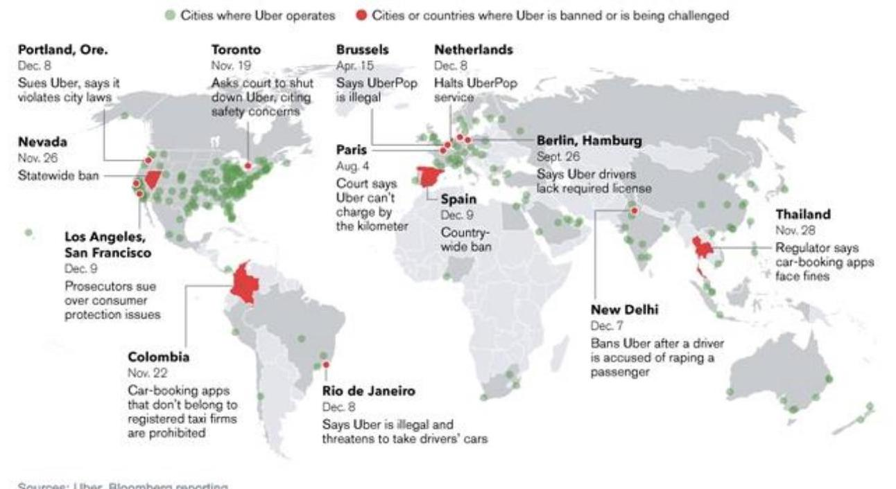
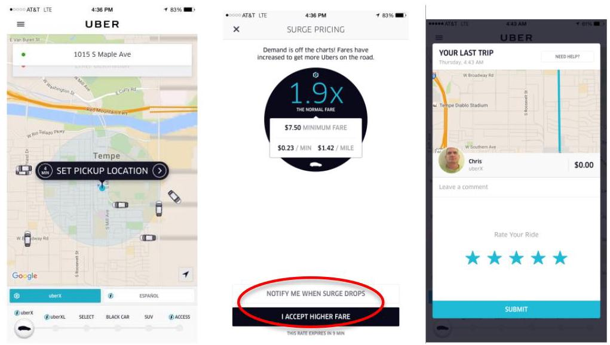
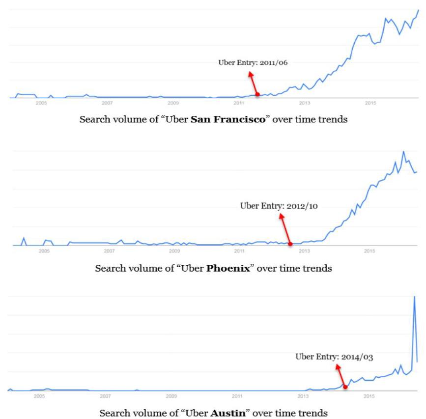

# An empirical analysis of on-demand ride sharing and traffic congestion

Completed Research Paper

Ziru Li

W. P. Carey School of Business

Arizona State University

400 E Lemon St, Tempe, AZ 85287

ziruli@asu.edu

Yili Hong

W. P. Carey School of Business

Arizona State University

400 E Lemon St, Tempe, AZ 85287

hong@asu.edu

Zhongju Zhang

W. P. Carey School of Business

Arizona State University

400 E Lemon St, Tempe, AZ 85287

Zhongju.Zhang@asu.edu

## Abstract

Sharing economy, which leverages information technology to re-distribute unused or underutilized assets to people who are willing to pay for the services, has received tremendous attention in the last few years. Its creative business model has disrupted many traditional industries (e.g., transportation, hotel) by fundamentally changing the mechanism to facilitate the matching of demand with supply in real time. In this research, we investigate how Uber, a peer-to-peer mobile ride-sharing platform, affects traffic congestion in the urban areas of the United States. Combining data from Uber and the Urban Mobility Report, we empirically examine whether and how the entry of Uber car services affect traffic congestion using a difference-in-difference framework. Findings from this research provide evidence on the potential effect of ride sharing services in the transportation industry, contributing to the understanding of the sharing economy and government policy decisions.

Keywords: Uber, sharing economy, ride sharing, platforms, traffic congestion, induced demand, difference in difference

"Sharing is to ownership what the iPod is to the eight-track, what the solar panel to the coal mine. Sharing is clean, crisp, urbane, postmodern; Owning is dull, selfish, timid, backward."

- Mark Levine, New York Times

## Introduction

Sharing economy, also referred to as collaborative consumption, gig economy or collaborative economy, has received tremendous attention in recent years. The concept was first articulated (Benkler 2002) when the Harvard law professor published a paper suggesting that we share goods in economic process. Many studies subsequently explored the potential of the collaborative consumption (Avital et al. 2014; Botsman and Rogers 2011; Felländer et al. 2015; Sundararajan 2013, 2014). In 2011, TIME magazine named collaborative consumption one of the "Ten ideas that will change the world". According to Price Waterhouse Cooper, in the year 2015-2016, sharing economy sectors generate \$15bn in global revenues.

The transformative force of the sharing economy business model, however, has also raised challenges for incumbent industries and regulators. Traditional mature industries such as hotel and automotive industries were disrupted because consumers now have convenient and cost efficient access to resources without the financial, emotional, or social burdens of ownership (Eckhardt and Bardhi 2015). As the popularity of sharing economy grows, it also raised debates on regulatory and safety concerns (Feeney 2015; Malhotra and Van Alstyne 2014). Many traditional companies have flocked to regulators and politicians, and lobbied them to stop the growth of the sharing economy (Wallsten 2015).

As one of the most successful examples of the sharing economy, Uber has raised the most heated debates. Advocates view Uber services as an important complement to the existing modes of urban transportation. Others criticize that sharing economy platforms often restructure the nature of employment and circumvent regulations in order to maximize company benefits. Uber, for instance, hires drivers as "independent contractors" not "employees", so their basic rights as labors are not guaranteed. Figure 1 shows a map of the worldwide cities where Uber operates and where it is banned or is being challenged.

Where Uber operates, and where it's been shut down

Sources: Uber, Bioomberg reporting

GRAPHIC: ALEX TRIBOU / BLOOMBERG GRAPHICS

## Figure 1. Where Uber operates, and where it's been shut down

The impact of Uber on urban traffic congestion is one of those hotly debated topics in the media. Traffic congestion has become a serious social problem as population grows, especially in metropolitan areas. According to 2015 Urban Mobility Report, \( {}^{1} \) Travel delays due to congestion caused drivers to waste more than 3 billion gallons of fuel and kept travelers stuck in their cars for nearly 7 billion extra hours - 42 hours per rush-hour commuter. Does Uber play a role in urban area traffic congestion? There are two countervailing arguments. On one hand, by providing more convenient, less expensive ride sharing services, Uber diverts non-driving trips like walking, transit, or cycling to driving mode. Hence, Uber induces additional traffic volume and increases traffic congestion. On the other hand, as a car sharing service, Uber has the potential to reduce traffic by diverting trips otherwise made in private, single occupancy cars or taxis. A few studies have looked into this issue, but the findings are inconclusive. One study from New York

---

\( {}^{1} \) http://d2dtl5nnlpfror.cloudfront.net/tti.tamu.edu/documents/mobility-scorecard-2015-wappx.pdf

---

Times \( {}^{2} \) estimated that Uber vehicles contribute to about 10 percent of traffic in Manhattan during evening rush hour, but contended that it's hard to parse the exact impact of Uber on overall traffic increase due to the concept of "induced demand" and "fundamental law of traffic congestion". In a separate study3, the Office of the Mayor in New York City released a report in January 2016, highlighting that the city mayor's contention that Uber vehicles and other ride-hailing services had worsened traffic in Manhattan is not founded. 4 The same report attributed recent slower traffic in Manhattan to population growth, more tourists and an increase in deliveries and street construction, but noted that e-dispatch ride-share service providers could drive modest growth in congestion in the future. In summary, there is limited empirical evidence to validate arguments on either side without comprehensive data and rigorous research.

In this study, we use a natural experiment approach to empirically examine the impact of Uber on traffic congestion in different urban areas of the United States. This research design offers us an important advantage: Since the time of Uber entry into various urban areas is different, we can use a difference-indifference method to investigate whether the traffic congestion before and after Uber entry is different across different urban areas. Our data come from multiple sources. First, the urban mobility report contains different elements of congestion data for each of the 101 urban areas in the United States from 1982 to 2014. Additionally, we conduct comprehensive due diligence research and collect the entry time of Uber into an urban area from Uber's official web site. In order to control the possible effects of other variables, we also collected data on fuel cost, socio-economic characteristics of the urban areas, characteristics of road transport systems from United States Census Bureau and Bureau of Economic Analysis. After integrating data from these sources, we construct an urban area-year level panel data set that includes 957 observations spanning 11 years over 87 urban areas in the United States.

We find empirical evidence that the entry of Uber actually leads to a significant decrease in traffic congestion and carbon dioxide emissions in the urban areas of the United States. Moreover, these results are consistent for different measures of the traffic congestion. To assess the robustness of the results, we perform further analysis including the use of instrumental variables (IV), alternative measures, and more granular data. We provide a few plausible underlining mechanisms to help explain our findings. This paper contributes to the existing literature by providing additional empirical evidence of the social benefits associated with the sharing economy. Additionally, it offers valuable insights about the broader impact of ride-sharing services on the transportation industry.

The rest of the paper is organized as follows. Section 2 reviews relevant literature on the digital infrastructure and platforms. Section 3 describe in detail the data and our econometric specifications. Section 4 presents our findings as well as additional robustness checks. In Section 5, we discuss our results and provide a few underlining mechanisms to explain the results. Section 6 concludes and provides directions for future research.

## Related Literature

## Sharing Economy

Sharing economy has recently become an important research topic. Leveraging the latest information technology-smartphones, GPS, payment systems, identification, and feedback mechanisms, sharing economy platforms efficiently connect providers who have unused and underexploited assets with consumers who are willing to pay for it (Wallsten 2015). It serves unmet demand of fast, flexible, convenient and cost effective services, which traditional industry could not satisfy (Rayle et al. 2014; Rempel 2014). Participants are important driving force for this new economy. Research shows that people's motivations to participate in collaborative consumption include sustainability, enjoyment of the activity as well as economic gains (Hamari et al. 2015).

---

\( {}^{2} \) http://www.nytimes.com/2015/07/28/upshot/blame-uber-for-congestion-in-manhattan-not-so-fast.html

3 http://www1.nyc.gov/assets/operations/downloads/pdf/For-Hire-Vehicle-Transportation-Study.pdf

4 http://www.nytimes.com/2016/01/16/nyregion/uber-not-to-blame-for-rise-in-manhattan-traffic-congestion-report-says.html

---

Early empirical studies investigated the impact of the emerging business models on traditional industries. For example, Zervas et al. (2014) estimate that each 10% increase in Airbnb supply results in a 0.37% decrease in monthly hotel room revenue. Wallsten (2015) explores the competitive effects of ride-sharing on the taxi industry and finds that Uber's popularity decreases the consumer complaints per trip about taxi in New York and decreases specific types of complaints about taxi in Chicago. Greenwood and Wattal (2015) find that Uber decreases the rate of alcohol related motor vehicle homicides. Burtch et al. (2016) examine how the entry of platforms influences rates of entrepreneurial activities. Rayle et al. (2014) surveyed ride-sharing users in San Francisco to investigate the difference of trips and user characteristics between taxi and on-demand ride services. The authors highlighted that the impacts of ride sharing on overall vehicle miles traveled and traffic congestion are unclear.

## Digital Infrastructure and Platforms

Digital infrastructure and platforms bring together people, information, and technology to support business practices, social and economic activities, research, and collective action in civic matters (Adner and Kapoor 2010; Au and Kauffman 2008; Constantinides and Barrett 2014; Tilson et al. 2010). On one hand, by connecting the seller and the buyer, platforms increase market efficiency and reduce transaction cost (Bailey and Bakos 1997). On the other hand, platforms increase information transparency in markets by reducing information asymmetries (Brynjolfsson et al. 2003). Williamson (1981) argued that platforms increase price transparency and thereby reduce commerce friction. By increasing information transparency and facilitating the exchange process of goods and services, platforms create buyer surplus, seller surplus and thus societal well-fare.

There has been extensive research on digital infrastructure and platforms. Here we review only a few recent studies on the effects of digital platforms. Seamans and Zhu (2013) investigate the impact of Craigslist on three different sides of newspaper markets: newspaper side, subscriber side and display-ad side. Rhue (2015) examines the racial dynamics in the crowdfunding platform Kickstarter. Parker et al. (2016) find that Reuters Market Light, a text message service in India, reduces geographic price dispersion and increases the rate at which prices converge over time. Chan and Ghose (2013) investigate whether the entry of Craigslist increases the prevalence of HIV. Bapna et al. (2013) estimate the causal effect of one specific characteristic of an online dating website. Burtch et al. (2013) examine both the antecedents and the consequences of the contribution process in a crowd-funding platform. Greenwood and Agarwal (2015) find evidence on how the entry of matching platforms influences the incidence rate of HIV infection by race, gender, and socioeconomic status.

## Traffic Congestion

Traffic congestion occurs when the demand for space is greater than the available road capacity. Slower speeds, longer trip times, and increased vehicular queues are all characteristics of traffic congestion. Traffic congestion has been a central problem in the transportation literature (Cervero and Hansen 2002; Goodwin 1996). Downs (1962) describes the "fundamental law of highway congestion" to explain why increasing road capacity will not reduce congestion but make it worse. This theory is also known as "induced traffic", or more generally referred to as "latent demand." (Leeming and Mackay 1969). Duranton and Turner (2011) confirmed the theory by providing evidence that increased provision of roads or public transit is unlikely to relieve congestion. Ample research studies have been conducted to estimate new traffic after the opening of some facilities or after a capacity expansion (Cervero and Hansen 2002; Goodwin 1996).

Some pioneering studies have examined the impact of car sharing on traffic congestion. For example, Alexander and González (2015) explored how ridesharing influences traffic congestion using mobile phone data and found that under moderate to high adoption rate scenarios, ridesharing would likely have noticeable effects in reducing congested travel times. Survey research in San Francisco reveals that although ridesharing substitutes longer transit trips, it does complement transit (Rayle et al. 2014). Fellows and Pitfield (2000) point out that encouraging ride-sharing may reduce vehicle miles travelled. Jacobson and King (2009) investigated the potential fuel savings in the US when ride-sharing policy was announced and found that if 10% cars were to have more than one passenger, it could reduce 5.4% annual fuel consumption.

Caulfield (2009) estimated the environmental benefits of ride-sharing in Dublin and found that 12,674t of CO2 emissions were saved by individual ride-sharing. Fellows and Pitfield (2000) examined the potential of ride-sharing to alleviate congestion and pollution and found evidence of its impact on reduction in vehicle kilometers, increase in average speeds and savings in fuel, accidents and emissions.

## Data and Methods

## Research Setting

Uber is the most successful ride-share platform and the representative start-up of the sharing economy. Officially launched in San Francisco in 2011, Uber has grown up from a small start-up company in Silicon Valley to an international corporation with billions of funding. By April 12, 2016, Uber was available in over 60 countries and 404 cities worldwide. The creative model of Uber has made it possible for people to simply tap their smartphone and have a cab arrive at their location in the minimum possible time. The whole process is extremely convenient. When the customer opens the app, they choose a ride (UberX, UberBlack, UberSUV and so on), set their location. The customer will see the driver's picture and vehicle details, and can track their arrival on the map. The pay process is "no cash, no tip and no hassle". If the current time period is peak demand time, the customer will face surge pricing. But they are notified before making the decision, as shown in the Figure 2. After that, the consumer can rate the driver and provide anonymous feedback about his/her trip experience.

Figure 2. Ride Share Using Uber and Surge Pricing

## Data

In order to investigate the effect of Uber entry on urban area traffic congestion, we integrate the Uber entry time into major U.S. metropolitan areas, retrieved directly from the official Uber website, with congestion data from the Urban Mobility Report, provided by the Texas A&M Transportation Institute (TTI). The Urban Mobility Report contains the urban mobility and congestion statistics for each of the 101 urban areas in the U.S. from 1982 to 2014. This report is acknowledged as the most authoritative source of information about traffic congestion and is widely used in the transportation literature. The comprehensive and longitudinal traffic-related data allow us to explore the change in urban traffic congestions due to external shocks (e.g. the entry of Uber). After merging the data sets, our final data set comprises 957 observations 957 observations spanning 11 years over 87 urban areas in the United States.

## Dependent variables

We adopted a few variables (See Table 1) from the Urban Mobility Report to measure traffic congestion. The first one is the Travel Time Index (TTI). Many studies have used the TTI as a measure of traffic congestion (Bertini 2005; Hagler and Todorovich 2009; Litman 2007; Mehran and Nakamura 2009; Sweet and Chen 2011; Zhang 2011). In the Urban Mobility Report, the Travel Time Index refers to the ratio of travel time in the peak period to travel time at free-flow conditions and is computed as:

\[
\text{ Travel Time Index } = \frac{\text{ Delay time } + \text{ Free Flow Travel Time }}{\text{ Free Flow Travel Time }} \tag{1}
\]

The Commuter Stress Index (CSI), another measure for traffic congestion, is the travel time index calculated for only the peak direction in the each peak period. The CSI is said to be more indicative of the work trip experienced by each commuter on a daily basis 5. Both the TTI and the CSI are travel indices and do not represent the actual time of delay due to congestion. Hence we adopted the daily vehicle hours of delay to measure the amount of extra time spent travelling due to congestion.

\[
\text{ Daily Vehicle Hours of Delay } = \left( \frac{\text{ Daily Vehicle }}{\text{ Speed }}\right)  - \left( \frac{\text{ Daily Vehicle }}{\text{ Speed }}\right) \tag{2}
\]

The Annual Delay per Auto Commuter is a measure of the extra travel time endured throughout the year by auto commuters who make trips during the peak period. The delay that occurs during the peak hours of the day is assigned to the pool of commuters. The delay that occurs outside of the peak period is assigned to the entire population of the urban area. Equation (3) shows how the delay per auto commuter is calculated. Note that the off-peak delay is also considered because trips not only occur during peak hours but also during other times of the weekdays and the weekends.

Delay per auto commuter \( = \left( \frac{\text{ Peak Period Delay }}{\text{ Auto commuters }}\right)  - \left( \frac{\text{ Remaining Delay }}{\text{ Population }}\right) \)(3)

In addition to the time dimension of traffic congestion, we also consider the value of the travel time delay, namely the congestion (or delay) cost. The total congestion cost takes into account of both the cost of delayed time and the cost of wasted fuel. Table 2 describes the summary statistics of the dependent variables. It should be noted these variables are not normally distributed and the log transformations are used in our later analysis.

<table><tr><td>Dependent Variable</td><td>Description</td></tr><tr><td>TTI</td><td>The ratio of travel time in the peak period to travel time at free-flow conditions</td></tr><tr><td>Delay Cost</td><td>annual congestion cost total dollars(million)</td></tr><tr><td>Delay Cost per auto</td><td>annual congestion cost per auto commuter(\$)</td></tr><tr><td>Delay Time</td><td>annual hours of delay in thousand</td></tr><tr><td>Delay Time per auto</td><td>annual hours of delay per auto commuter</td></tr><tr><td>CSI</td><td>commuter stress index</td></tr></table>

Table 1. Description of Dependent Variables

<table><tr><td>Variable</td><td>Observations</td><td>Mean</td><td>Standard Deviation</td><td>Min</td><td>Max</td></tr><tr><td>CSI</td><td>957</td><td>1.244681</td><td>0.1042578</td><td>1.07</td><td>1.64</td></tr><tr><td>Delay Cost(million)</td><td>957</td><td>1552.794</td><td>2492.025</td><td>70</td><td>16346</td></tr><tr><td>Delay Cost per auto (dollars)</td><td>957</td><td>6.688595</td><td>1.077973</td><td>4.248495</td><td>9.701738</td></tr><tr><td>Delay Time (in thousand)</td><td>957</td><td>61401.17</td><td>99993.65</td><td>2035</td><td>630722</td></tr><tr><td>Delay Time per auto</td><td>957</td><td>10.34483</td><td>1.098944</td><td>7.618251</td><td>13.35462</td></tr><tr><td>Excess Fuel (total gallons)</td><td>957</td><td>27461.53</td><td>41443.97</td><td>1106</td><td>296701</td></tr></table>

---

5 David Schrank, Bill Eisele, Tim Lomax, Jim Bak, "2015 Urban Mobility Scorecard," Texas Transportation Institute, http://d2dtl5nnlpfror.cloudfront.net/tti.tamu.edu/documents/mobility-scorecard-2015.pdf.

---

<table><tr><td>Excess Fuel per auto (gallons)</td><td>957</td><td>18.35423</td><td>5.260665</td><td>5</td><td>35</td></tr></table>

Table 2. Summary Statistics of Dependent Variables

## Control Variables

We control the effects of a number of variables including lane miles of road and the amount of travelers, which have been identified as important variables to explain traffic congestion in the transportation economic literature. Additionally, we control for the variables that may play a role in Uber's decision to enter different urban areas/cities. These variables include population size, socio-economic status (such as GDP, median income) of different cities. Table 3 describes the control variables used in our study. The summary statistics of the control variables are shown in Table 4.

<table><tr><td>Control Variable</td><td>Description</td><td>Source</td></tr><tr><td>POP</td><td>Population</td><td>T&A Urban Mobility Report</td></tr><tr><td>SOCIOECON</td><td>GDP in current dollars</td><td>Bureau of Economic Analysis</td></tr><tr><td></td><td>Median Income</td><td></td></tr><tr><td rowspan="2">ROAD</td><td>Freeway Lane-miles</td><td rowspan="3">T&A Urban Mobility Report</td></tr><tr><td>Arterial Lane-miles</td></tr><tr><td>TRAVELLER</td><td>Commuter (thousands)</td></tr></table>

Table 3. Descriptions of Control Variables

<table><tr><td>Variable</td><td>Observations</td><td>Mean</td><td>Standard Deviation</td><td>Min</td><td>Max</td></tr><tr><td>GDP</td><td>957</td><td>119241.5</td><td>181231.5</td><td>3641</td><td>1423173</td></tr><tr><td>Population</td><td>957</td><td>1820.846</td><td>2619.381</td><td>105</td><td>19040</td></tr><tr><td>Median Income</td><td>957</td><td>48443.67</td><td>8163.061</td><td>32875</td><td>76165</td></tr><tr><td>Freeway lane miles</td><td>957</td><td>16344.17</td><td>21505.79</td><td>480</td><td>139275</td></tr><tr><td>Arterial lane miles</td><td>957</td><td>16103.52</td><td>20183.7</td><td>988</td><td>126010</td></tr><tr><td>Commuter(thousand)</td><td>957</td><td>825.2027</td><td>976.1309</td><td>51</td><td>5928</td></tr><tr><td>Diesel Cost</td><td>957</td><td>3.254242</td><td>0.6863275</td><td>1.77</td><td>4.91</td></tr><tr><td>Gasoline Cost</td><td>957</td><td>2.921703</td><td>0.5604156</td><td>1.77</td><td>4.35</td></tr></table>

Table 4. Summary Statistics of Control Variables

## Empirical Estimation

As discussed earlier, the time of Uber's entry into various urban areas is different. Therefore we use a difference-in-difference method to investigate the causal effect of Uber's entry on traffic congestion. Difference-in-Difference estimation has become an increasingly popular way to estimate causal relationships (Bertrand et al. 2002). It is appropriate when one wants to compare the difference in outcomes after and before the intervention for the treated groups to the same difference for the un-treated groups. In order to control the ex-ante differences between the heterogeneous urban areas, we include group fixed effects in our model specification. Specifically, we estimate the following regression equation:

\( \ln \left( {\text{ Congestion Measures }}_{it}\right)  = \alpha  + \delta \left( {\text{ Uber\_Entry }}_{it}\right)  + \lambda \left( {\text{ Controls }}_{it}\right)  + {\theta }_{i} + {\delta }_{t} + {\varepsilon }_{it} \)

We estimate the model with various dependent variables (congestion measures) described in Table 1. Controls \( {}_{i, t} \) represent measurements of variables described in Table 3 for urban area \( i \) in year \( t \) . Uber entry is a dummy variable. It equals to 1 when the urban area \( i \) has the Uber service in year \( t \) . The parameters \( \theta \) and \( \delta \) represent the time fixed effect and the urban area fixed effect. Fixed effects capture not only non-time varying factors but also allow the error term to be arbitrarily correlated with other explanatory variables, thus making the estimation results more robust. \( \varepsilon \) is the error term. We use robust standard errors clustered at the urban areas to deal with potential issues of heteroscedasticity.

## Results

Tables 5 and 6 summarize our main results. Each column presents the effect of Uber entry as well as the effect of the control variables for a different measurement of traffic congestion. It can be seen that the effect of Uber entry is pretty consistent. The estimate of the effect (except on TTI and Excess fuel per auto) is significant and negative. We would like to highlight that the estimate of Uber entry on TTI is negative and the p value of the estimate is 0.12 , hence marginally significant given our sample size is only 957 . The estimate of Uber entry on Excess fuel per auto is insignificant and positive (p = 0.615). Overall we find reasonable evidence that the entry of Uber significantly decreases traffic congestion in the urban areas of the U.S. It is also worth to note that as the median income in an urban area increases, the traffic tends to get worse. This is consistent with the existing traffic literature that traffic conditions in a city are usually associated with the overall economic activities.

<table><tr><td>Dependent Variables</td><td>(1) TTI</td><td>(2) CSI</td><td>(3) Log(Delay Cost)</td><td>(4) Delay Cost per auto</td></tr><tr><td>Uber Entry</td><td>-0.00237   (0.00151)</td><td>-0.00377***   (0.00139)</td><td>-0.0121**   (0.00600)</td><td>-27.32***   (7.271)</td></tr><tr><td>GDP</td><td>0.000364   (0.000776)</td><td>0.000457   (0.000697)</td><td>0.00391   (0.00297)</td><td>3.337   (3.424)</td></tr><tr><td>Income</td><td>0.0515***   (0.0133)</td><td>0.0580***   (0.0139)</td><td>0.255***   (0.0696)</td><td>218.7***   (59.51)</td></tr><tr><td>Population</td><td>-0.0230   (0.0390)</td><td>-0.0274   (0.0391)</td><td>0.117   (0.141)</td><td>9.995   (188.5)</td></tr><tr><td>Commuters</td><td>-0.0316   (0.0400)</td><td>-0.0325   (0.0408)</td><td>0.603***   (0.153)</td><td>739.8***   (194.6)</td></tr><tr><td>Gasoline Cost</td><td>-0.00336   (0.0132)</td><td>-0.00919   (0.0132)</td><td>-0.0505   (0.0573)</td><td>-48.53   (54.28)</td></tr><tr><td>Diesel Cost</td><td>0.0169   (0.0154)</td><td>0.0138   (0.0157)</td><td>0.112   (0.0889)</td><td>163.9**   (78.98)</td></tr><tr><td>Freeway Lane-miles</td><td>0.00828   (0.0138)</td><td>0.00780   (0.0148)</td><td>0.0748   (0.0659)</td><td>55.72   (69.97)</td></tr><tr><td>Arterial Lane-miles</td><td>0.0185**   (0.00877)</td><td>0.0130   (0.00841)</td><td>0.0733*   (0.0436)</td><td>86.16*   (45.61)</td></tr><tr><td>Constant</td><td>0.745***   (0.276)</td><td>0.815***   (0.286)</td><td>-1.985   (1.312)</td><td>-7,355***   (1,265)</td></tr><tr><td>Time fixed effect</td><td>Yes</td><td>Yes</td><td>Yes</td><td>Yes</td></tr><tr><td>Observations</td><td>957</td><td>957</td><td>957</td><td>957</td></tr><tr><td>R-squared</td><td>0.241</td><td>0.262</td><td>0.478</td><td>0.538</td></tr><tr><td>Number of urban areas</td><td>87</td><td>87</td><td>87</td><td>87</td></tr><tr><td colspan="3">Note: Robust standard errors in parentheses</td><td colspan="2">*** \( p < {0.01} \) ,** \( p < {0.05} \) ,* \( p < {0.1} \)</td></tr></table>

Table 5. Estimation Results of Uber Entry on Traffic Congestion

<table><tr><td>Dependent Variables</td><td>(5) Log(Delay Time)</td><td>(6) Delay Time per auto</td><td>(7) Log(Excess Fuel)</td><td>(8) Excess Fuel Per auto</td></tr><tr><td>Uber Entry</td><td>-0.0121**   (0.00599)</td><td>-0.491*   (0.252)</td><td>-0.0121**   (0.00599)</td><td>0.210   (0.133)</td></tr><tr><td>GDP</td><td>0.00388   (0.00297)</td><td>0.127   (0.145)</td><td>0.00389   (0.00297)</td><td>0.0652   (0.0820)</td></tr><tr><td>Income</td><td>0.256***   (0.0692)</td><td>9.673***   (2.416)</td><td>0.256***   (0.0692)</td><td>4.746***   (1.166)</td></tr><tr><td>Population</td><td>0.118   (0.141)</td><td>-5.202   (7.546)</td><td>0.118   (0.141)</td><td>3.555   (4.039)</td></tr><tr><td>Commuters</td><td>0.599***   (0.153)</td><td>-6.314   (7.733)</td><td>0.599***   (0.153)</td><td>8.972**   (4.112)</td></tr><tr><td>Gasoline Cost</td><td>-0.0499   (0.0573)</td><td>-1.067   (2.272)</td><td>-0.0498   (0.0573)</td><td>0.316   (1.148)</td></tr><tr><td>Diesel Cost</td><td>0.113   (0.0891)</td><td>5.160*   (2.621)</td><td>0.113   (0.0891)</td><td>1.991   (1.285)</td></tr><tr><td>Freeway Lane-miles</td><td>0.0759   (0.0660)</td><td>2.361   (2.561)</td><td>0.0760   (0.0660)</td><td>-0.329   (1.136)</td></tr><tr><td>Arterial Lane-miles</td><td>0.0742*   (0.0436)</td><td>3.202*   (1.710)</td><td>0.0742*   (0.0436)</td><td>1.181   (0.821)</td></tr><tr><td>Time Fixed Effect</td><td>Yes</td><td>Yes</td><td>Yes</td><td>Yes</td></tr><tr><td>Constant</td><td>1.534   (1.307)</td><td>-42.70   (45.01)</td><td>0.784   (1.307)</td><td>-124.0***   (21.82)</td></tr><tr><td>Observations</td><td>957</td><td>957</td><td>957</td><td>957</td></tr><tr><td>R-squared</td><td>0.687</td><td>0.292</td><td>0.687</td><td>0.648</td></tr><tr><td>Number of urban areas</td><td>87</td><td>87</td><td>87</td><td>87</td></tr></table>

Note: Robust standard errors in parentheses *** \( p < {0.01} \) ,** \( p < {0.05} \) ,* \( p < {0.1} \)

Table 6. Estimation Results of Uber Entry on Traffic Congestion (cont'd)

## Instrumental Variables

In order to address the issue of endogeneity, we identified an instrumental variables (IV) to further assess the causal relationship between Uber and the traffic congestion. The IV we used is the unemployment rate. From the United States Bureau of Labor Statistics, we collected data on the unemployment rate of 87 urban areas from 2004 to 2014. This variable serves as a valid instrument because it is not likely to be correlated with the traffic congestion, but is an important factor for Uber executives to consider when deciding a goto market strategy. A unique feature of Uber's business model is that it provides flexible job opportunities that attract independent contractors to participate in the labor market. Hence, Uber may be well received in areas with higher unemployment rates.

Following Angrist and Pischke (2008), we estimate the IV model with the 2SLS approach. Specially, we estimate the probability that Uber enters an urban area using the standard linear probability approach and then included it in the second stage estimation. Table 7 reports the results of this analysis, providing further empirical evidence of our main results. We report the first stage results and the fit statistics in Table 8. It can be seen that there is a significant correlation between the IV (unemployment rate) and the Uber entry time (p = 0.018). Additionally, the first stage F statistics are all significant. Both the Cragg-Donald Wald F statistics and the Kleibergen-Paap Wald rk F statistic pass the critical value suggested by Stock and Yogo (2005), alleviating the weak instrument concern.

<table><tr><td>DV</td><td>(1) TTI</td><td>(2) CSI</td><td>(3)   ln(Delay Cost)</td><td>(4)   Delay Cost pa</td><td>(5)   ln(Delay Time)</td><td>(6)   Delay Time pa</td><td>(7)   ln(Excess Fuel)</td><td>(8)   Excess Fuel pa</td></tr><tr><td>Uber Dummy</td><td>-0.153**   (0.067)</td><td>-0.168**   (0.073)</td><td>-0.745**   (0.327)</td><td>-821**   (346.1)</td><td>-0.74**   (0.327)</td><td>-30.8**   (13.37)</td><td>-0.74**   (0.327)</td><td>-12.7**   (5.797)</td></tr><tr><td>Controls</td><td>Included</td><td>Included</td><td>Included</td><td>Included</td><td>Included</td><td>Included</td><td>Included</td><td>Included</td></tr><tr><td>Time and area fixed effect</td><td>Yes</td><td>Yes</td><td>Yes</td><td>Yes</td><td>Yes</td><td>Yes</td><td>Yes</td><td>Yes</td></tr><tr><td>Observations</td><td>957</td><td>957</td><td>957</td><td>957</td><td>957</td><td>957</td><td>957</td><td>957</td></tr><tr><td>R-squared</td><td>-9.152</td><td>-10.210</td><td>-6.134</td><td>-7.092</td><td>-3.281</td><td>-11.107</td><td>-3.283</td><td>-3.545</td></tr><tr><td>Number of UR</td><td>87</td><td>87</td><td>87</td><td>87</td><td>87</td><td>87</td><td>87</td><td>87</td></tr></table>

Table 7. 2SLS Estimation Results Using Unemployment Rate as the IV

<table><tr><td>DV</td><td>Uber entry</td></tr><tr><td>Unemployment Rate</td><td>0.0183763 ** (0.327)</td></tr><tr><td>Control variables</td><td>Included</td></tr><tr><td>Time and urban area Fixed Effect</td><td>Yes</td></tr><tr><td>F statistic</td><td>5.61*</td></tr><tr><td>Observations</td><td>957</td></tr><tr><td>Cragg-Donald Wald F statistic</td><td>3.44</td></tr><tr><td>Kleibergen-Paap Wald rk F statistic</td><td>5.61</td></tr></table>

Table 8. IV First Stage Analysis (Unemployment Rate)

## Alternative Measure for Uber Entry

So far, we have used Uber entry time to proxy for the implementation of Uber service. This approach has limitations. Specifically, after Uber service enters an urban area, it takes time for people to accept and get accustomed to this new service. Therefore, Uber entry may not represent the actual usage rate, and there may be a time lag between Uber entry and its impact on the traffic congestion. In order to alleviate this concern, we use an alternative measure of "Uber Entry" in urban areas: the number of Uber searches in an urban area on "Google Trends". "Google Trends" is a publicly available web application based on Google Search. It provides us an index of the popularity of ride-sharing in a certain geographic region. Google Trends have been previously demonstrated to track economic activities (retail sales, automotive sales, home sales, and travel) in real time (Choi and Varian 2012). Wu and Brynjolfsson (2013) find that Google Trends are better in predicting housing sales and prices than traditional indicators.

We used the "Google Trends" search history of the keyword combination "Uber" + "name of the urban area" to measure the popularity and the usage level of Uber in an urban area. It's reasonable to assume that when a person search "Uber New York", she is likely to be interested in the Uber service in the New York City. Figure 3 plots the search history of Uber service in three cities: San Francisco, Phoenix, and Austin along with the corresponding actual Uber entry time in each city. We observe that even though Uber entered San Francisco in June 2011, it only began to become popular after some time. Similarly, Uber entered Phoenix in October 2012, but began to attract public attention around 2014. The correlation between Uber entry time and the search volume on Google is positive and significant.

Figure 3. Time trends of "Uber + sample urban areas" on Google Trends

<table><tr><td></td><td>(1) TTI</td><td>(2) CSI</td><td>(3) ln(Delay)</td><td>(4) paDelay</td></tr><tr><td>Uber Use</td><td>-0.000421+   (0.000258)</td><td>-0.000626**   (0.000243)</td><td>-0.0023**   (0.00106)</td><td>-0.0862*   (0.0434)</td></tr><tr><td>GDP</td><td>0.000373   (0.000771)</td><td>0.000472   (0.000691)</td><td>0.00393   (0.00295)</td><td>0.129   (0.144)</td></tr><tr><td>Income</td><td>0.0516***   (0.0133)</td><td>0.0581***   (0.0139)</td><td>0.256***   (0.0691)</td><td>9.69***   (2.415)</td></tr><tr><td>Population</td><td>-0.0221   (0.0391)</td><td>-0.0267   (0.0394)</td><td>0.126   (0.141)</td><td>-5.035   (7.581)</td></tr><tr><td>Commuters</td><td>-0.0323   (0.0401)</td><td>-0.0331   (0.0411)</td><td>0.593***   (0.153)</td><td>-6.453   (7.763)</td></tr><tr><td>Gasoline Cost</td><td>-0.00342   (0.0132)</td><td>-0.00934   (0.0132)</td><td>-0.0501   (0.0573)</td><td>-1.081   (2.275)</td></tr><tr><td>Diesel Cost</td><td>0.0167   (0.0153)</td><td>0.0136   (0.0157)</td><td>0.112   (0.0888)</td><td>5.125*   (2.612)</td></tr><tr><td>FDVMT</td><td>0.00798   (0.0138)</td><td>0.00742   (0.0148)</td><td>0.0740   (0.0660)</td><td>2.300   (2.566)</td></tr><tr><td>ASDVMT</td><td>0.0186**   (0.00883)</td><td>0.0131   (0.00845)</td><td>0.0751*   (0.0438)</td><td>3.229*   (1.717)</td></tr><tr><td>Constant</td><td>0.744***   (0.276)</td><td>0.814***   (0.286)</td><td>1.528   (1.304)</td><td>-42.85   (44.96)</td></tr><tr><td>Observations</td><td>957</td><td>957</td><td>957</td><td>957</td></tr><tr><td>R-squared</td><td>0.242</td><td>0.262</td><td>0.687</td><td>0.293</td></tr><tr><td>Number of UR</td><td>87</td><td>87</td><td>87</td><td>87</td></tr></table>

Table 9. Estimation Results Using Alternative Measure

There is, however, a potential issue with the search volume on Google trends. Before Uber actually entered an urban area, the search volume is generally not zero in most urban areas. The non-zero search volume could represent some expectations and curiosity but not the actual Uber usage. We address this problem by multiplying it with the Uber entry dummy variable as a new variable: Uber usage.

Table 9 and table 10 present the results of our analysis using Uber usage. Once again, we find that our estimation results are robust to this alternative measure.

<table><tr><td>VARIABLES</td><td>(5) lnCost</td><td>(6) paCost</td><td>(7) lnFuel</td><td>(8) paFuel</td></tr><tr><td>Uber Use</td><td>-0.00231**   (0.00106)</td><td>-4.817***   (1.286)</td><td>-0.00231**   (0.00106)</td><td>0.0283   (0.0225)</td></tr><tr><td>GDP</td><td>0.00395   (0.00296)</td><td>3.440   (3.373)</td><td>0.00393   (0.00295)</td><td>0.0642   (0.0822)</td></tr><tr><td>Income</td><td>0.256***   (0.0695)</td><td>219.7***   (59.33)</td><td>0.256***   (0.0691)</td><td>4.737***   (1.167)</td></tr><tr><td>Population</td><td>0.125   (0.141)</td><td>19.63   (189.0)</td><td>0.126   (0.141)</td><td>3.624   (4.049)</td></tr><tr><td>Commuters</td><td>0.597***   (0.153)</td><td>731.8***   (194.7)</td><td>0.593***   (0.153)</td><td>8.908**   (4.113)</td></tr><tr><td>Gasoline Cost</td><td>-0.0507   (0.0573)</td><td>-49.30   (54.43)</td><td>-0.0500   (0.0573)</td><td>0.331   (1.147)</td></tr><tr><td>Diesel Cost</td><td>0.111   (0.0886)</td><td>161.9**   (78.39)</td><td>0.112   (0.0888)</td><td>1.990   (1.282)</td></tr><tr><td>FDVMT</td><td>0.0729   (0.0658)</td><td>52.32   (69.84)</td><td>0.0741   (0.0660)</td><td>-0.322   (1.140)</td></tr><tr><td>ASDVMT</td><td>0.0742*   (0.0438)</td><td>87.67*   (45.90)</td><td>0.0751*   (0.0438)</td><td>1.182   (0.823)</td></tr><tr><td>Constant</td><td>-1.991   (1.309)</td><td>-7,363***   (1,261)</td><td>0.778   (1.305)</td><td>-124.1***   (21.82)</td></tr><tr><td>Observations</td><td>957</td><td>957</td><td>957</td><td>957</td></tr><tr><td>R-squared</td><td>0.479</td><td>0.539</td><td>0.687</td><td>0.647</td></tr><tr><td>Number of UR</td><td>87</td><td>87</td><td>87</td><td>87</td></tr></table>

Table 10. Estimation Results Using Alternative Measure (cont'd)

## Discussion

Our extensive analysis provides empirical evidence of a causal relationship between ride-sharing services and traffic congestion. An important question is what mechanism could possibly drive this main result. In the following, we offer a few explanations and our insights.

The first possible explanation is that Uber increases vehicle occupancy, thereby decreasing traffic congestion. Given that the number of commuters in an urban area does not grow at a high rate over a short period of time, ride sharing can reduce the total number of cars on the road by having more than one person in the car. A recent survey (Rayle et al. 2014) found that occupancy levels for ride-sharing vehicles averaged 1.8 passengers in contrast to 1.1 passengers for taxis in a matched pair analysis. According to the International Energy Agency (2005) \( {}^{6} \) , adding one additional person to every commute trip could achieve a saving of 7.7% on fuel consumption and a reduction of 12.5% on vehicle miles.

---

6 http://www.worldenergyoutlook.org/media/weowebsite/2008-1994/weo2005.pdf

---

Second, the low cost travel mode of ride sharing reduces car ownership. In a growing number of cities, ride-sharing services like Uber provide low cost alternatives to car ownership. 7 Take San Francisco as an example, ride-sharing services are found to reduce car ownership, encourage more judicious and selective use of cars for particular trip purposes (Cervero and Tsai 2004). The availability of ride-sharing services also reduces consumers' incentives to purchase automobiles (Rogers 2015). Martin and Shaheen (2011) surveyed a sample of 6,281 households and found that each ride-sharing vehicle replaces 9 to 13 vehicles (postponed and sold) from the road. Another recent study of North American ride-sharing organizations shows that 15% to 32% of ride-sharing members sold their personal vehicles, and between 25% and 71% of members avoided an auto purchase because of ride-sharing. \( {}^{8} \) A recent survey (Murphy 2016) of more than 4,500 shared mobility users in the seven study cities (Austin, Boston, Chicago, Los Angeles, San Francisco, Seattle and Washington, DC) also found that people who use more shared modes report lower household vehicle ownership and decreased spending on transportation.

Third, ride-sharing services can shift demand among different traffic modes. Researchers(Meijkamp 1998; Munheim 1998; Steininger et al. 1996) found evidence that those who used car sharing services drove significantly less than they did before they had used this service. Katzev (2003) conducted three studies on the early adopters of Car Sharing Portland and found that this service promoted trip "bundling" and greater use of alternative transportation such as bus riding, bicycling, and walking. Martin and Shaheen (2011) found that more car sharing users increased their overall public transit and non-motorized modal use.

Fourth, Uber's surge pricing strategy has the potential to delay or divert peak hour demands. The idea behind surge pricing is to adjust prices of rides so as to match driver supply to rider demand at any given time. Since the price of ride sharing in peak hours can surge quite high, riders who are price sensitive and flexible in their schedule may delay the travel time or choose to use public transit instead.

Finally, Uber increases vehicle capacity utilization. According to Cramer and Krueger (2016), in most cities, the efficiency of Uber is much higher than traditional taxis by having a higher faction of time and a higher share of miles having fare-paying passengers in their backseats. Higher capacity utilization means that Uber drivers will spend less time wandering streets searching passengers, which reduces excess fuel usage and traffic congestion.

## Conclusion

As sharing economy grows, it is important to look into its potential impacts and implications. This paper studies one of the many social issues associated with ride-share services. Specifically, we empirically examine how the entry of Uber into major U.S. metropolitan areas influences traffic congestions. By taking advantage of the different entry times of Uber into different urban areas, we are able to compare the difference in traffic congestion after and before Uber entry for the urban areas where Uber operates to the same difference for those urban areas without Uber service. We argue that ride-share service like Uber has the potential to reduce car ownership, shift traffic mode from single occupancy to ride sharing, delay travel plans in peak hours, thus reducing the overall traffic congestion in an urban area. Using annual congestion data from the urban mobility report, we find empirical evidence to support this line of argument.

This study has several limitations. First, we identify a few mechanisms through which Uber decreases the traffic congestion. Data limitations prevent us from directly testing those hypotheses. We do want to highlight that the logics behind our argument have been tested in the transportation literature using survey data, mobile phone real time data, and simulations. . Second, our traffic data is aggregated at the annual level. More granular level such as quarterly or monthly traffic data might allow us to pinpoint a more robust causal relationship. We are in the process to collect detailed traffic data to carry out further analysis. Finally, because the sharing economy is a relatively new phenomenon, we are unable to examine the longer term consequences of Uber's entry on traffic congestion. Future work using longer panel data is worth to pursue.

---

7 http://www.usatoday.com/story/money/personalfinance/2014/11/08/ridesharing-lyft-uber/18482083/

\( {}^{8} \) http://www.rmi.org/Content/Files/North\\%20American\\%20Carsharing\\%20- \\%2010\\%20Year\\%20Retrospective.pdf

---

## References

Adner, R., and Kapoor, R. 2010. "Value creation in innovation ecosystems: How the structure of technological interdependence affects firm performance in new technology generations," Strategic management journal (31:3), pp. 306-333.

Alexander, L. P., and González, M. C. 2015. Assessing the Impact of Real-time Ridesharing on Urban Traffic using Mobile Phone Data, Sydney, Australia.

Angrist, J. D., and Pischke, J.-S. 2008. Mostly harmless econometrics: An empiricist's companion, Princeton university press (available at https://books.google.com/books?hl=zh-CN&lr=&id=ztXL21Xd8v8C&oi=fnd&pg=PR8&dq=angrist,+pischke+mostly+harmles++econom etrics:+an+empiricist%27s+comopanion&ots=Ui76WCZQBQ&sig=Ls-msi61r9qVpyaTvlVolqL2GyQ).

Au, Y. A., and Kauffman, R. J. 2008. "The economics of mobile payments: Understanding stakeholder issues for an emerging financial technology application," Electronic Commerce Research and Applications (7:2), pp. 141-164.

Avital, M., Andersson, M., Nickerson, J., Sundararajan, A., Van Alstyne, M., and Verhoeven, D. 2014. "The Collaborative Economy: A Disruptive Innovation or Much Ado about Nothing?," in ICIS (available at http://dro.deakin.edu.au/eserv/DU:30070161/verhoeven-collaborativeeconomy-2014.pdf).

Bailey, J. P., and Bakos, Y. 1997. "An exploratory study of the emerging role of electronic intermediaries," International Journal of Electronic Commerce (1:3), pp. 7-20.

Bapna, R., Ramaprasad, J., Shmueli, G., and Umyarov, A. 2013. "One-way mirrors and weak-signaling in online dating: A randomized field experiment," in International Conference on Information Systems (ICIS 2013): Reshaping Society Through Information Systems Design (Vol. 3), pp. 2748- 2762 (available https://www.krannert.purdue.edu/academics/MIS/workshop/papers/One_Way_Mirrors_in_O nline_Dating-BRSU.pdf).

Benkler, Y. 2002. "Coase's Penguin, or, Linux and' The Nature of the Firm," Yale Law Journal, pp. 369- 446.

Bertini, R. 2005. "You are the traffic jam: an examination of congestion measures', Department of Civil and Environmental Engineering, Portland State University," Unpublished Research Monograph.

Bertrand, M., Duflo, E., and Mullainathan, S. 2002. "How much should we trust differences-in-differences estimates?," National Bureau of Economic Research (available at http://www.nber.org/papers/w8841).

Botsman, R., and Rogers, R. 2011. What's mine is yours: how collaborative consumption is changing the way we live, Collins London (available at http://appli6.hec.fr/amo/Public/Files/Docs/241_fr.pdf).

Brynjolfsson, E., Hu, Y., and Smith, M. D. 2003. "Consumer surplus in the digital economy: Estimating the value of increased product variety at online booksellers," Management Science (49:11), pp. 1580- 1596.

Burtch, G., Carnahan, S., and Greenwood, B. N. 2016. "Can You Gig it? An Empirical Examination of the Gig-Economy and Entrepreneurial Activity," An Empirical Examination of the Gig-Economy and Entrepreneurial Activity (March 7, 2016) (available at http://papers.ssrn.com/sol3/papers.cfm?abstract_id=2744352).

Burtch, G., Ghose, A., and Wattal, S. 2013. "An empirical examination of the antecedents and consequences of contribution patterns in crowd-funded markets," Information Systems Research (24:3), pp. 499-519.

Caulfield, B. 2009. "Estimating the environmental benefits of ride-sharing: A case study of Dublin," Transportation Research Part D: Transport and Environment (14:7), pp. 527-531.

Cervero, R., and Hansen, M. 2002. "Induced travel demand and induced road investment: a simultaneous equation analysis," Journal of Transport Economics and Policy, pp. 469-490.

Cervero, R., and Tsai, Y. 2004. "City CarShare in San Francisco, California: Second-Year Travel Demand and Car Ownership Impacts," Transportation Research Record: Journal of the Transportation Research Board (1887), pp. 117-127 (doi: 10.3141/1887-14).

Chan, J., and Ghose, A. 2013. "Internet's dirty secret: assessing the impact of online intermediaries on HIV transmission," Chan J., and Ghose A.," Internet's Dirty Secret: Assessing the Impact of Online Intermediaries on HIV Transmission", MIS Quarterly (38:4), pp. 955-976.

Choi, H., and Varian, H. 2012. "Predicting the present with Google Trends," Economic Record (88:s1), pp. 2-9.

Constantinides, P., and Barrett, M. 2014. "Information Infrastructure Development and Governance as Collective Action," Information Systems Research (26:1), pp. 40-56.

Cramer, J., and Krueger, A. B. 2016. "Disruptive Change in the Taxi Business: The Case of Uber," Working Paper No. 22083, National Bureau of Economic Research (available at http://www.nber.org/papers/w22083).

Downs, A. 1962. "THE LAW OF PEAK-HOUR EXPRESSWAY CONGESTION," Traffic Quarterly (16:3) (available at http://trid.trb.org/view.aspx?id=694596).

Duranton, G., and Turner, M. A. 2011. "The fundamental law of road congestion: Evidence from US cities," The American Economic Review, pp. 2616-2652.

Eckhardt, G. M., and Bardhi, F. (n.d.). "The Sharing Economy Isn't About Sharing at All," Harvard Business Review (available at https://hbr.org/2015/01/the-sharing-economy-isnt-about-sharing-at-all; retrieved December 31, 2015).

Feeney, M., and companies Uber, R. 2015. "Is Ridesharing Safe?," Cato Policy Analysis (767), p. 2.

Felländer, A., Ingram, C., and Teigland, R. 2015. "Sharing Economy-Embracing Change with Caution," in Näringspolitiskt Forum rapport.

Fellows, N. T., and Pitfield, D. E. 2000. "An economic and operational evaluation of urban car-sharing," Transportation Research Part D: Transport and Environment (5:1), pp. 1-10.

Goodwin, P. B. 1996. "Empirical evidence on induced traffic," Transportation (23:1), pp. 35-54.

Greenwood, B. N., and Agarwal, R. 2015. "Matching Platforms and HIV Incidence: An Empirical Investigation of Race, Gender, and Socioeconomic Status," Management Science (available at http://pubsonline.informs.org/doi/abs/10.1287/mnsc.2015.2232).

Greenwood, B. N., and Wattal, S. 2015. "Show Me the Way to Go Home: An Empirical Investigation of Ride Sharing and Alcohol Related Motor Vehicle Homicide," Available at SSRN 2557612 (available at http://papers.ssrn.com/sol3/papers.cfm?abstract_id=2557612).

Hagler, Y., and Todorovich, P. 2009. Where high-speed rail works best, America 2050 (available at http://america2050.org/pdf/2050_Report_Where_HSR_Works_Best.pdf).

Hamari, J., Sjöklint, M., and Ukkonen, A. 2015. "The sharing economy: Why people participate in collaborative consumption," Available at SSRN 2271971 (available at http://papers.ssrn.com/sol3/papers.cfm?abstract_id=2564006).

Jacobson, S. H., and King, D. M. 2009. "Fuel saving and ridesharing in the US: Motivations, limitations, and opportunities," Transportation Research: Transport and Environment (14:1), pp. 14-21.

Katzev, R. 2003. "Car sharing: A new approach to urban transportation problems," Analyses of Social Issues and Public Policy (3:1), pp. 65-86.

Leeming, J. J., and Mackay, G. M. 1969. Road Accidents: Prevent Or Punish?: Prevent Or Punish?, Cassell.

Litman, T. 2007. "Evaluating rail transit benefits: A comment," Transport Policy (14:1), pp. 94-97 (doi: 10.1016/j.tranpol.2006.09.003).

Malhotra, A., and Van Alstyne, M. 2014. "The dark side of the sharing economy... and how to lighten it," Communications of the ACM (57:11), pp. 24-27.

Martin, E. W., and Shaheen, S. A. 2011. "Greenhouse gas emission impacts of carsharing in North America," Intelligent Transportation Systems, IEEE Transactions on (12:4), pp. 1074-1086.

Mehran, B., and Nakamura, H. 2009. "Considering travel time reliability and safety for evaluation of congestion relief schemes on expressway segments," IATSS research (33:1), pp. 55-70.

Meijkamp, R. 1998. "Changing consumer behaviour through eco-efficient services: an empirical study of car sharing in the Netherlands," Business Strategy and the Environment (7:4), pp. 234-244.

Munheim, P. 1998. "Car Sharing Studies: An Investigation," Lucerne, Switzerland.

Murphy, C. 2016. "Shared Mobility and the Transformation of Public Transit," (available at https://trid.trb.org/view.aspx?id=1401765).

Parker, C., Ramdas, K., and Savva, N. 2016. "Is IT Enough? Evidence from a Natural Experiment in India's Agriculture Markets," Management Science (available at http://pubsonline.informs.org/doi/abs/10.1287/mnsc.2015.2270).

Rayle, L., Shaheen, S., Chan, N., Dai, D., and Cervero, R. 2014. "App-Based, On-Demand Ride Services: Comparing Taxi and Ridesourcing Trips and User Characteristics in San Francisco University of California Transportation Center (UCTC)," UCTC-FR-2014-08 (available at http://76.12.4.249/artman2/uploads/1/RidesourcingWhitePaper_Nov2014Update.pdf).

Rempel, J. 2014. "A Review of Uber, the Growing Alternative to Traditional Taxi Service," (available at http://www.afb.org/afbpress/Pub.asp?DocID=aw150602).

Rhue, L. 2015. "Who Gets Started on Kickstarter? Demographic Variations in Fundraising Success," (available at http://aisel.aisnet.org/icis2015/proceedings/EconofIS/12/).

Rogers, B. 2015. "The social costs of Uber," University of Chicago Law Review, Forthcoming (available at http://papers.ssrn.com/sol3/papers.cfm?abstract_id=2608017).

Seamans, R., and Zhu, F. 2013. "Responses to entry in multi-sided markets: The impact of Craigslist on local newspapers," Management Science (60:2), pp. 476-493.

Steininger, K., Vogl, C., and Zettl, R. 1996. "Car-sharing organizations: The size of the market segment and revealed change in mobility behavior," Transport Policy (3:4), pp. 177-185.

Stock, J. H., and Yogo, M. 2005. "Testing for weak instruments in linear IV regression," Identification and inference for econometric models: Essays in honor of Thomas Rothenberg (available at http://papers.ssrn.com/sol3/papers.cfm?abstract_id=1734933).

Sundararajan, A. 2013. "From Zipcar to the sharing economy," Harvard Business Review (1) (available at http://oz.stern.nyu.edu/SharingEconomy2013HBR.pdf).

Sundararajan, A. 2014. "Peer-to-peer businesses and the sharing (collaborative) economy: Overview, economic effects and regulatory issues," Written testimony for the hearing titled The Power of Connection: Peer to Peer Businesses, January (available at http://smbiz.house.gov/uploadedfiles/1-15-2014_revised_sundararajan_testimony.pdf).

Sweet, M. N., and Chen, M. 2011. "Does regional travel time unreliability influence mode choice?," Transportation (38:4), pp. 625-642 (doi: 10.1007/s11116-011-9335-z).

Tilson, D., Lyytinen, K., and Sørensen, C. 2010. "Research commentary-digital infrastructures: the missing IS research agenda," Information systems research (21:4), pp. 748-759.

"Traffic congestion.," 2016. Wikipedia, the free encyclopedia, February 4 (available at https://en.wikipedia.org/w/index.php?title=Traffic_congestion&oldid=703227562; retrieved February 18, 2016).

Wallsten, S. 2015. "The Competitive Effects of the Sharing Economy: How is Uber Changing Taxis?," Technology Policy Institute, p. 22 (available at http://techpolicyinstitute.org/files/wallsten_the%20competitive%20effects%20of%20uber.pdf).

Williamson, O. E. 1981. "The economics of organization: The transaction cost approach," American journal of sociology, pp. 548-577.

Wu, L., and Brynjolfsson, E. 2013. "The future of prediction: How Google searches foreshadow housing prices and sales," Available at SSRN 2022293 (available at http://papers.ssrn.com/sol3/papers.cfm?abstract_id=2022293).

Zervas, G., Proserpio, D., and Byers, J. 2014. "The rise of the sharing economy: Estimating the impact of Airbnb on the hotel industry," Boston U. School of Management Research Paper (2013-16) (available at http://papers.ssrn.com/sol3/Papers.cfm?abstract_id=2366898).

Zhang, Y. 2011. "Hourly traffic forecasts using interacting multiple model (IMM) predictor," Signal Processing Letters, IEEE (18:10), pp. 607-610.

## Responses to Comments on ICIS-0829-2016 "Do Ride Sharing Services Affect Traffic Congestion? An Empirical Study of Uber Entry"

We thank the track chair and the two reviewers for their thoughtful and constructive comments, which we have attempted to incorporate into the revised paper. In the following, we provide detailed point-to-point response to the issues raised by the entire review team; the original comments are italicized and underlined.

## Responses to Track Chair's Comments

This is a nicely done paper. It asks an important question: whether ridesharing services increase traffic congestion. There's an interesting combining of data sources, and I like the design. Even though metropolitan-level data may be insufficiently granular to close the question, its good enough to get a stream of work started. Overall, nicely done.

Thank you for your nice words about our work. We appreciate the opportunity to present the research at ICIS 2016.

## I didn't see a reference to the 2016 NYC study that asked this question

## http://www1.nyc.gov/assets/operations/downloads/pdf/For-Hire-Vehicle-Transportation-Study.pdf

We have now included the reference in the revised paper.

## Try and explain how your findings stack up against theirs.

We revised the Results section of the paper, and also added a new Discussions section, which aims to provide explanations of our findings as well as the mechanisms that drive the main results.

## Responses to Reviewer 1's Comments

Thank you for your helpful comments. We believe that the revised paper is an improvement over the original version thanks to the changes being made. We hope that this revision will be regarded as satisfactory.

1) "The authors position the research as part of the "sharing economy" literature. While it's true that Uber is part of the sharing economy, the sharing economy concept is too broad, and does not help inform us about the likely impacts of Uber on congestion. The paper could begin at paragraph 4 with no loss of information. Likewise, the literature review reads more like a laundry list of existing papers than a discussion of how previous research informs the current study."

We have revised the introduction part according to your comments. We deleted redundant contents related to the background, sharing economy. Our logic here is "sharing economy" is an explosive and overwhelming trend but with heated debates. It's incumbent and significant to address these issues. As one of the most popular and successful representatives of sharing economy platform, Uber faces the harshest debates. It is the motivation of our study. We target on addressing one of those issues.

2) "The authors rightly suggest that induced demand, substitution for private car vs. public transit, car ownership, and surge pricing are key considerations.

## -I would add the following:

-Car ownership is important because, when people own a car, most travel costs are fixed and the marginal cost of driving an extra mile is low, so people are more likely to travel more. In contrast, when using ridesharing or carsharing, most travel costs are marginal, so people are incentivized to reduce their travel.

## -Surge pricing could also increase congestion by increasing supply.

## -How does drivers cruising around looking for passengers affect congestion?

-Drivers from outlying areas may also congregate in high-demand areas, increasing congestion locally.

Thank you for this comment. We adjust the framework of our paper. These mechanisms are the possible explanations for our results. Due to the accessibility of data, we cannot test these mechanisms directly. But all of them have been demonstrated and test in literature.

As to "How does drivers cruising around looking for passengers affect congestion?", we would like to use the empirical evidence from the paper of Cramer and Krueger (from the national bureau of economic research) to address this concern. This paper has also been cited by Bloomberg and WSJ. According to this research, Uber entry decreases traffic congestion and carbon emissions because it increases capacity utilization. In economies, capacity utilization means the extent to which available resources are being used at any given time. In taxi industries, it means how often you have a passenger in your backseat. Actually this is a very good point. We have added this viewpoint as the fifth mechanisms that may explain our results.

3)The hypotheses are about congestion cost and commuter stress, but you have not yet discussed these concepts. How are they related to congestion? Why do these indicators add anything to the analysis?

These two variables are derived from Urban Mobility Report. They measure the traffic congestion from different perspectives. We try to adopt a complete performance metrics of traffic congestion.

We add more detailed explanations of dependent variables in the "Data" part of the paper: according to the Urban Mobility Report, commuter stress is the travel time index calculated for only the peak direction in each peak period. The CSI is believed to be more indicative of the work trip experienced by each commuter on a daily basis. And in addition to the time dimension of traffic congestion, we also consider the value of the travel time delay, namely the congestion (or delay) cost. The total congestion cost takes into account of both the cost of delayed time and the cost of wasted fuel.

4) "I have serious concerns about whether Uber's effect would be measurable in metropolitan level data. The effect of Uber on congestion is likely to be very localized within the urban area. I understand you won't be able to consider smaller spatial areas using the UMR data, but I'm not convinced the effect of Uber would be reflected in your data."

Thank you for this comment. Yes, Uber expand its market by city. Our analysis units are "urban areas", which is defined as an area which is the region surrounding a city. An urban area is always centered around a city. Due to the accessibility of congestion data, we cannot get city level, panel data with consistent congestion measures. The econometric specification of this research requires us to get compared data before and after Uber entry of enough geographical areas. The most largest scale, authoritative data we can get is from UMR. We collect control variables at urban area level with the adjustment of population and acreage. We approximate the Uber entry time of one urban area with the Uber entry of the center city of this urban area. This approximation will only make the coefficient of Uber entry downward, which means it makes our results less likely to be significant but not change the sign of the coefficients. So the results we get is conservative. But this is not a big issue.

5) "I'm not convinced the models sufficiently control for confounding factors. The greatest contribution to congestion is employment (although it is correlated with commuters). You might also control for transit ridership. And probably non-motorized travel. Cities have adopted other policies during this time intended to reduce congestion (e.g, transit investments). Maybe more people are living in the city center. You might control for % population within X miles (easily obtainable from the census). Perhaps control for population density."

In the revised version of this paper, we add robustness checks. We use the unemployment rate as the instrumental variable to conduct IV analysis, which will address the endogeneity issue. We find that the results of the IV analysis is consistent with our main analysis.

As to the population variable, we do use the population density. We apologize for this error in the last version. We have added the detail explanation in the revision.

6) "It seems reasonable to use Uber's entry in the market as the treatment, for simplicity. But use of Uber will grow over time in each market, probably exponentially. I question whether Uber would be large enough initially to actually affect congestion. What about years in the market as an explanatory variable?"

Thanks for your comment. We address this concern by using alternative measures of Uber entry dummy variable and conduct the same analysis. .

7) "I don't understand why so many measures of congestion are needed. Why would all these measures of congestion be different? You might consider dropping some of these congestion measures and focus more on control variables."

Those are measures of traffic congestion from different perspectives. We try to adopt a complete performance metrics of traffic congestion.

## 8) "Aren't there only a few years in this dataset in which Uber has entered the market?

Yes. Because there is a long lag time for transportation department to disclosure the traffic congestion data. Currently the latest congestion data we can get is 2014. But we are now taking actions to try to connect with transportation department to get latest data. We hope we can get the new data soon and conduct the analysis again. But even though the after-treatment periods in our dataset is limited, we can still get some important insights from our study.

9) "At least it appears Uber isn't increasing congestion at the metro level. But it could still be that in localized areas (and times) congestion is increased, which might help explain popular complaints...

This is an excellent point. We wish we could conduct more granular level analysis if data is available. The point is with the current dataset (time dimension is yearly level), we cannot focus on few specific areas because of the power of econometric analysis. We wish we can dig it deeper as long as we get more granular level data.

10) “I’d suggest moving the discussion of limitations up to follow the results. You need to address the limitations regarding spatial scale. Also there's a bunch of literature on the limitations of diff-in-diff methods.

We have added some limitations of diff-in-diff following the results. Besides, in the revised version, we added two additional analysis to address the issues of diff-in-diff. To address the endogeneity issue, we conduct IV analysis using unemployment rate as our instrumental variable. And we use alternative measures of our variables of interest to conduct additional analysis. Our results are consistent and robust through all the analysis.

## 11) Check your list of references. Some are missing.

Thanks for your comment. We have revised our reference.

## Responses to Reviewer 2's Comments

1) “I have similar angst about assuming that surge pricing has an impact on the temporal distribution of travel with respect to the peak period. It would be helpful to have some data on when surge pricing is applied. My understanding was this was primarily a late-night and special event targeted pricing strategy."

Yes, we agree. Thanks for your excellent advice. I think in the future, it may be helpful to conduct specific analysis when data is available. But currently we cannot address this problem due to the limitedness of data. We are trying to connect with Uber and get some granular data of detail trips to conduct further research.

2) "At one point in the hypothesis section the author stated they expect that the entry of Uber into urban areas will increase vehicle occupancies, decrease private car ownership, encourage people to use public transit and other non-driving travel modes, and delay or divert peak hour demands. It should be clear to the reader that this analysis does not enable one to differentiate as to if or which one(s) of these phenomenon might be at work in producing the results."

Thanks for your comment. We adjust the framework of the paper. Since we cannot demonstrate and test those mechanisms with data in this study, it's not rigorous to develop hypothesis based on those mechanisms. Actually we derived those mechanism through which the entry of Uber may exert influence on traffic congestion and use them to explain our results. Those mechanism are based on previous study and have been tested by different studies.

3) "It would be particularly helpful to have some gauge of the magnitude of travel accommodated on Uber and then some evidence of the elasticity of congestion to VMT. Having this information could give some ground truth to the feasibility of Uber use or Uber influence on overall travel behavior impacting total travel demand in a magnitude suggested by the models. It would be helpful to interpret the coefficients of the model into units of demand or volume or minutes of savings in a way that gave some sense of significance to the impact. The authors’ use of the term that the impact was "significant" presumably referred to the statistical properties of significance but gave no hint of the actual magnitude of consequence in terms of delay time.

Thanks for your comment. This is really helpful. We have addressed this issue in our revised version.

4) I might note that the TTI urban mobility study has been extensively critiqued in the authors might be advised to read through those critiques, for example by Todd Litman, and see if that jeopardizes the veracity of using TTI congestion metrics for this application."

Thanks, this is a very important point. We have conducted a complete research on the subjectivity and precision of TTI. Actually, there are two opposite viewpoints. We went through both sides. Due to the limitedness of page, we did not compare comprehensively those views about TTI in our paper. But we do know its strengths and weaknesses. According to our research, TTI has been widely used in some congestion related studies. The most important is, it do provide us a rich dataset. So currently this is the most comprehensive congestion data we can find.