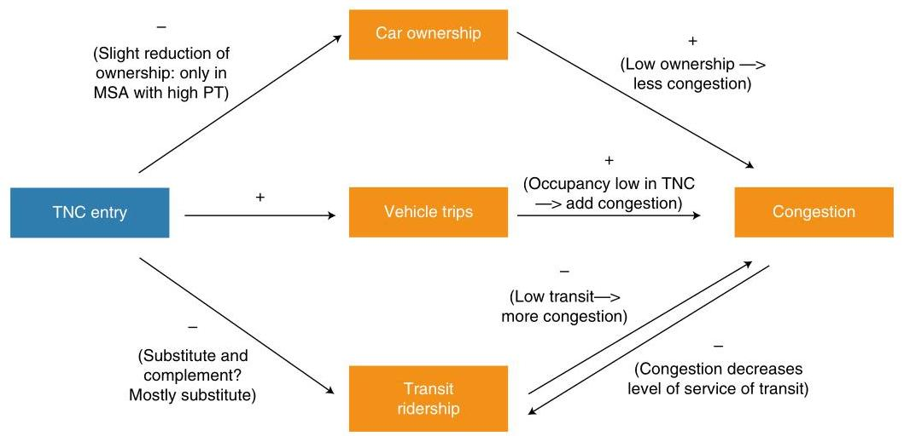

# Impacts of transportation network companies on urban mobility

Mi Diao \( {}^{1} \) , Hui Kong \( {}^{2,3} \) and Jinhua Zhao \( {}^{2}{}^{2,3} \)

The role of transportation network companies (TNCs) in the urban transport system is under intense debate. In this study, we systematically assess three aspects of the net impacts of TNCs on urban mobility in the United States—road congestion, transit ridership and private vehicle ownership-and examine how these impacts have evolved over time. Based on a set of fixed-effect panel models estimated using metropolitan statistical area level data, we find that the entrance of TNCs led to increased road congestion in terms of both intensity (by 0.9%) and duration (by 4.5%), an 8.9% decline in transit ridership and an insignificant change in vehicle ownership. Despite the ideal of providing a sustainable mobility solution by promoting large-scale car sharing, our analysis suggests that TNCs have intensified urban transport challenges since their debut in the United States.

Rapid population growth and increasing urbanization in the past decades have resulted in continually growing demand for travel in big cities worldwide, imposing significant challenges on urban transport systems \( {}^{1 - 3} \) . Public transportation (PT) provides high-efficiency shared services, but it accommodates only a small fraction of urban mobility demand in the United States, due to the limited coverage and often low quality of services \( {}^{4} \) . While private vehicles offer more flexible services, these are parked for about 95% of the time and when moving carry well below two persons per vehicle on average \( {}^{5,6} \) . In addition to the low occupancy, private vehicles are widely criticized for their significant negative externalities such as congestion, pollution and road accidents7. Finding new urban transport solutions that can address the challenges faced by both PT and private vehicles is crucial to meeting future demand for travel and achieving sustainability of cities.

The recent 'sharing economy' boom is viewed as a way to revolutionize urban transport systems and enable easy access to goods and opportunities \( {}^{8,9} \) . The sharing economy aims to boost efficiency and flexibility by providing access to-instead of ownership of-underused goods and services, coordinated through web-based applications \( {}^{10} \) . Built on the concept of the sharing economy, transportation network companies (TNCs) have emerged as a new mode of transport that has significantly affected urban mobility in the past decade \( {}^{8} \) , even though TNC trips remain a small fraction of the overall miles travelled \( {}^{11} \) . TNCs use online platforms to provide rides on demand by connecting passengers with drivers using their private vehicles based on real-time information \( {}^{12} \) . TNCs enable both the sharing of vehicles where one passenger or one group of passengers enjoys and pays for the ride exclusively (for example, UberX and Lyft) and the sharing of trips by unacquainted passengers with similar origins and destinations who split the fare (for example, UberPool and Lyft Shared). Many researchers have estimated the benefit of on-demand mobility sharing using mathematical models, finding great potential. For example, recent studies of taxi trips in New York City (NYC) document a high level of shareability among urban trips \( {}^{{13} - {15}} \) . Assuming that all the taxi trips in NYC remain unchanged, sharing of trips through taxis could reduce taxi traffic by \( {40}\% \) or more \( {}^{13} \) ; sharing of trips through vans (with capacity for ten) could reduce the fleet size by almost \( {85}{\% }^{14} \) ; and sharing of taxis (without assuming sharing of trips) could reduce fleet size by \( {30}{\% }^{15} \) , compared with current taxi operation. By promoting on-demand shared mobility services, TNCs seem to be a promising way to transform urban transport systems to achieve higher efficiency, flexibility and sustainability \( {}^{{16} - {18}} \) .

Despite the substantial theoretical benefits of on-demand shared mobility \( {}^{{13} - {15}} \) , the actual role of TNCs in urban transport systems is under intense debate and their impact on the sustainability of cities remains unclear. Existing studies indicate that there could be multiple channels through which TNCs affect individual mobility choices and transportation network performance, leading to different consequences for urban sustainability. On the one hand, TNCs can serve as a flexible supplemental mobility option for transit riders in case of emergency \( {}^{19} \) and in areas with no or low transit services \( {}^{16} \) , while also offering a similar but cheaper alternative to driving for certain vehicle owners \( {}^{{20},{21}} \) , thus reducing the reliance on private vehicles. On the other hand, TNCs may squeeze out public transit by offering on-demand mobility services \( {}^{{22},{23}} \) , providing easier access to vehicles to transit riders \( {}^{24} \) , leading to more congestion by inducing travel and staying at a low passenger occupancy rate while on the road \( {}^{{25} - {28}} \) . Most existing empirical studies tend to rely on interviews and surveys of TNC drivers and users and have a narrow focus on specific cities or limited aspects of urban mobility. The findings are highly dependent on when, where and how the data are collected. A comprehensive assessment on the overall net effects of TNCs on urban mobility is lacking.

In this study, we aim to systematically examine how TNCs have changed urban mobility in the United States as measured by road congestion, PT ridership and private vehicle ownership, using a panel dataset covering mobility trends, sociodemographic changes and TNC entry in all the metropolitan statistical areas (MSAs) that had Uber and/or Lyft as of 2016 and report their PT ridership regularly. Uber and Lyft are the top two players in the TNC market in the United States, with a combined market share of 98% in 2018.

Uber launched its services in San Francisco, California in 2010 and its main US competitor, Lyft, was founded in the same city in 2012. In 2016, TNCs accounted for 15% of all intracity vehicle trips in San Francisco,12 times the number of taxi trips \( {}^{29} \) . Uber has a market share of approximately \( {69}{\% }^{30} \) . It is headquartered in

---

\( {}^{1} \) College of Architecture and Urban Planning, Tongji University, Shanghai, PR China. \( {}^{2} \) Department of Urban Studies and Planning, Massachusetts Institute of

Technology, Cambridge, MA, USA. \( {}^{3} \) Singapore-MIT Alliance for Research and Technology Centre (SMART), Singapore, Singapore. \( {}^{\text{ ✉ }} \) e-mail: jnihua@mit.edu

---

## NATURESUSTAINABILITY

Table 1 | Impacts of TNCs on congestion

<table><tr><td rowspan="3">Dependent variable</td><td colspan="4">log(TTI)</td><td colspan="4">log(CH)</td></tr><tr><td colspan="2">(1) Model 1</td><td colspan="2">(2) Model 2</td><td colspan="2">(3) Model 1</td><td colspan="2">(4) Model 2</td></tr><tr><td>Estimate</td><td>\( t \) statistic</td><td>Estimate</td><td>\( t \) statistic</td><td>Estimate</td><td>\( t \) statistic</td><td>Estimate</td><td>\( t \) statistic</td></tr><tr><td>Constant</td><td>-0.7110</td><td>-7.349***</td><td>-0.7352</td><td>-8.005***</td><td>-2.6150</td><td>-4.969***</td><td>-2.3480</td><td>-4.385***</td></tr><tr><td>TNC</td><td>0.0089</td><td>3.400***</td><td></td><td></td><td>0.0449</td><td>2.966***</td><td></td><td></td></tr><tr><td>Within 1 year of TNC entry</td><td></td><td></td><td>0.0043</td><td>1.426</td><td></td><td></td><td>0.0498</td><td>2.822***</td></tr><tr><td>Within 1-2 years of TNC entry</td><td></td><td></td><td>0.0075</td><td>1.678*</td><td></td><td></td><td>0.0487</td><td>1.881*</td></tr><tr><td>Within 2-3 years of TNC entry</td><td></td><td></td><td>-0.0006</td><td>-0.104</td><td></td><td></td><td>0.0764</td><td>2.256**</td></tr><tr><td>Within 3-4 years of TNC entry</td><td></td><td></td><td>-0.0021</td><td>-0.274</td><td></td><td></td><td>0.0904</td><td>2.019**</td></tr><tr><td>Beyond 4 years of TNC entry</td><td></td><td></td><td>0.0083</td><td>0.812</td><td></td><td></td><td>0.1931</td><td>3.224***</td></tr><tr><td>Two TNC operators</td><td></td><td></td><td>0.0032</td><td>1.205</td><td></td><td></td><td>0.0463</td><td>2.976***</td></tr><tr><td>Control variables</td><td>Yes</td><td></td><td>Yes</td><td></td><td>Yes</td><td></td><td>Yes</td><td></td></tr><tr><td>MSA fixed effect</td><td>Yes</td><td></td><td>Yes</td><td></td><td>Yes</td><td></td><td>Yes</td><td></td></tr><tr><td>Month fixed effect</td><td>Yes</td><td></td><td>Yes</td><td></td><td>Yes</td><td></td><td>Yes</td><td></td></tr><tr><td>No. of observations</td><td>2,640</td><td></td><td>2,640</td><td></td><td>2,640</td><td></td><td>2,640</td><td></td></tr><tr><td>Adjusted \( {R}^{2} \)</td><td>0.8600</td><td></td><td>0.8791</td><td></td><td>0.8399</td><td></td><td>0.8410</td><td></td></tr></table>

Significance codes: ***P < 0.01; **P < 0.05; *P < 0.1.

San Francisco with regional offices in Chicago, Los Angeles, NYC, Seattle and Washington DC.

## Results

In this study, we use the heterogeneity in TNC entry time as an identification strategy to assess the impact of TNCs on urban mobility as well as the temporal evolution of the TNC effect at the MSA level in the United States. Based on the MSA-level data, we estimate a set of fixed-effect panel models. The dependent variables are congestion levels as measured by travel time index (TTI) and congested hours (CH), monthly PT ridership and average number of vehicles owned by a household, all in log form. We have two base model specifications for each mobility measure. Model 1 tests the impact of the TNC entry on urban mobility as measured by the coefficient of a dummy variable TNC, which indicates the presence of TNCs in the MSA. Model 2 examines the temporal evolution of the TNC effect and the joint and interactive roles of the top two TNC operators. An ideal dataset for this test is the number of TNC drivers from each operator over time in individual MSAs, which is not available to us. To address this data limitation, we use the number of years after TNC entry as a proxy for TNC market penetration. We decompose the overall effect of the two TNC operators into two components in the model: (1) the increasing market penetration of the first TNC operator over time, captured by a set of dummy variables indicating the number of years after the entry of the first operator into an MSA; and (2) the abrupt effect of the second TNC operator, captured by a dummy variable indicating the entry of the second operator in the MSA. The combination of these two components could help us to understand the implications of the different relative entry time of the two TNC operators. All the models control for MSA fixed effects, time fixed effects and a set of MSA-level control variables, including population, gross domestic product (GDP), median household income and unemployment rate. Unlike previous studies that focus only on Uber (for example, refs. \( {}^{{31},{32}} \) ), our dataset allows us to take both Uber and Lyft into account. Lyft has a market share of approximately 29% and entered some MSAs ahead of Uber. The competition between the top two players could change the price and quality of service offered by TNCs, thus affecting individual mobility choices. Therefore, neglecting Lyft in the analyses may lead to biased estimates of the TNC effect. We recognize that TNCs may choose the time of entry into an MSA based on its mobility trends. To address the potential endogeneity in TNC entry time, we adopt an instrument variable (IV) regression approach as a robustness check. The results of the IV regressions are reported in the Robustness check sections.

Based on the models described above, we find that TNCs increased road congestion in terms of both intensity (by 0.9% as measured by TTI) and duration (by 4.5% as measured by CH). As a net substitute for transit, TNCs led to an 8.9% decline in PT ridership at the MSA level. TNCs had insignificant effect on vehicle ownership on average, but they reduced vehicle ownership by 1% in the top ten transit MSAs. Despite the ideal of providing a sustainable mobility solution by promoting large-scale car sharing, TNCs have intensified urban transport challenges since their debut in the United States.

Road congestion level. The road congestion models are calibrated for the 44 MSAs in the United States with their monthly congestion data reported in the Federal Highway Administration's National Performance Management Research Data Set (FHWA's NPMRDS) and a TNC entry time between 2012 and 2016. TNCs led to an increase in road congestion as reported in Table 1 (TTI by 0.9% and CH by 4.5%) and affected road congestion mainly through extended congestion duration and slightly through increased severity. The TNC effect on CH increased over time, but no statistically significant trend existed for TTI. The entry of the second TNC operator increased CH by 4.6 percentage points.

Our results, based on monthly congestion data from 44 MSAs in the United States, are consistent with the most recent studies focusing on individual cities, which find that TNCs increased vehicle miles travelled by 3.5% in NYC \( {}^{33} \) , increased weekday vehicle delay by 69% in San Francisco \( {}^{25} \) and reduced the average travel speed by 8% in Shenzhen, China during the peak of its expansion \( {}^{34} \) . However, our results are contrary to the findings of a study \( {}^{32} \) that reveals a reduction in congestion after Uber entry. Possible reasons for this discrepancy include differences in data source and aggregation level. The data used by ref. \( {}^{32} \) come from the Urban Mobility Report provided by the Texas A&M Transportation Institute, which reports yearly congestion data of 101 cities; in this paper, we use the monthly congestion data from the FHWA's NPMRDS, which uses a different definition of the spatial unit (MSAs) and measures the congestion using more complete roadway coverage.

Public transit ridership. Table 2 reports that, on average, the entry of TNCs reduced PT ridership by 8.9% (column (1)) in the 174 MSAs with regular monthly PT ridership data records. The magnitude of this effect increased overtime in the first three years following TNC entry and stabilized at approximately 16% thereafter. The entry of the second TNC operator reduced PT ridership further by 2.1 percentage points.

Our finding of TNC's negative effect on PT ridership is consistent with some studies \( {}^{{22},{23},{35} - {37}} \) and in contrast with others \( {}^{{16},{31},{38}} \) . In particular, Hall et al. \( {}^{31} \) , using a similar dataset and method as ours, document a positive relationship between TNCs and PT ridership at the transport agency level. One potential source of the discrepancy is the different aggregation levels at which the analyses are performed. An MSA may have multiple transport agencies, many of which are small in size. Despite their low ridership, small agencies may have a disproportionately high impact on regression models that report the mean effect. The MSA is the more appropriate unit of analysis to reflect the overall urban mobility conditions.

Vehicle ownership. Table 3 reports the results of the vehicle ownership models for the 174 MSAs in our data sample. On average, the TNC entry had an insignificant impact on vehicle ownership (column (1)). To explore the heterogeneity in the treatment effect of TNCs, we add an interaction term of the TNC dummy and a new dummy variable denoting the top ten transit MSAs in the United States as measured by number of monthly PT trips per capita. Column (2) shows that, although the average effect of TNCs on vehicle ownership was insignificant, the entry of the first TNC operator into a top ten transit-MSA did decrease vehicle ownership by 1% relative to other MSAs. It may suggest that TNCs and PT could be complementary as substitutes for private vehicle ownership in transit-friendly MSAs. Column (3) reports that the TNC effect on vehicle ownership stayed negative in the years following the entry of the first TNC with an increasing magnitude over time, reaching 1.09% beyond four years of initial TNC entry with a significance level of 0.01 , and that the second TNC operator had no significant impact on vehicle ownership.

Contrary to the vision that TNCs can reduce the reliance on private vehicles by facilitating car sharing \( {}^{{21},{39}} \) , our results indicate an insignificant role of TNCs in reducing vehicle ownership in general. In MSAs where residents are most likely to use transit in the United States, the vehicle reduction effect of TNCs is approximately 1%. This result is directionally consistent with the findings in another study based on aggregate vehicle registration data at the state level \( {}^{40} \) , which shows that the entry of TNCs decreases per-capita vehicle registrations by 3% on average.

Robustness check: what if TNCs enter MSAs randomly? One concern of the ordinary least squares (OLS) models is that the TNCs may not randomly choose the MSAs to enter. They may decide whether and when to enter an MSA based on its mobility trends. To address the endogeneity concern, we adopt an IV regression approach and compare these results with those based on OLS regressions as a robustness check. We seek MSA-level IVs that are correlated with the likelihood that TNCs enter an MSA but are unlikely to be correlated with the unobserved determinants of an MSA's mobility patterns. We use distance to the nearest TNC hub city (with headquarter or regional office of Uber) as the IV. In calculating the distance, an MSA is considered a hub city only after Uber sets up a headquarter or regional office in the MSA. Proximity to headquarters or regional offices could bring management convenience to the TNCs, thus increasing the probability of TNCs entering an MSA. Meanwhile, TNCs seem to be the only channel by which the IV can affect mobility. Therefore, distance to the nearest TNC hub city could serve as a valid IV in our study. Furthermore, we exclude the six hub cities from the sample in the IV regressions to ensure the exogeneity of the IV. However, it is still possible that TNCs place the regional offices in cities convenient to fertile markets, suggesting that the endogeneity may not be completely removed with this IV. Tables 4 and 5 compare the estimation results of the IV regressions and OLS regressions. To make the two sets of results comparable, we report the OLS regression results using the same data sample as the IV regressions with observations from the six hub MSAs excluded.

Table 2 | Impact of TNCs on PT ridership

<table><tr><td rowspan="3">Dependent variable</td><td colspan="4">log(PT ridership)</td></tr><tr><td colspan="2">(1) Model 1</td><td colspan="2">(2) Model 2</td></tr><tr><td>Estimate</td><td>\( t \) statistic</td><td>Estimate</td><td>\( t \) statistic</td></tr><tr><td>Constant</td><td>12.7518</td><td>172.387***</td><td>12.7300</td><td>171.004***</td></tr><tr><td>TNC</td><td>-0.0890</td><td>-11.597***</td><td></td><td></td></tr><tr><td>Within 1 year of TNC entry</td><td></td><td></td><td>-0.0768</td><td>\( - {9.084}^{* *  * } \)</td></tr><tr><td>Within 1-2 years of TNC entry</td><td></td><td></td><td>-0.1216</td><td>\( - {10.812}^{* *  * } \)</td></tr><tr><td>Within 2-3 years of TNC entry</td><td></td><td></td><td>-0.1598</td><td>\( - {10.256}^{* *  * } \)</td></tr><tr><td>Within 3-4 years of TNC entry</td><td></td><td></td><td>-0.1583</td><td>\( - {6.852}^{* *  * } \)</td></tr><tr><td>Beyond 4 years of TNC entry</td><td></td><td></td><td>-0.1628</td><td>\( - {5.384}^{* *  * } \)</td></tr><tr><td>Two TNC operators</td><td></td><td></td><td>-0.0212</td><td>\( - {2.243}^{* * } \)</td></tr><tr><td>Control variables</td><td>Yes</td><td></td><td>Yes</td><td></td></tr><tr><td>MSA fixed effect</td><td>Yes</td><td></td><td>Yes</td><td></td></tr><tr><td>Month fixed effect</td><td>Yes</td><td></td><td>Yes</td><td></td></tr><tr><td>No. of observations</td><td>24,654</td><td></td><td>24,654</td><td></td></tr><tr><td>Adjusted \( {R}^{2} \)</td><td>0.9816</td><td></td><td>0.9817</td><td></td></tr></table>

Significance codes: ***P < 0.01; **P < 0.05; *P < 0.1.

It should be noted that the models for road congestion, PT ridership and vehicle ownership use different data samples, which leads to three separate models in the first stage of the two-stage least squares regression (2SLS) as shown in Table 4. The vehicle ownership model is based on annual data. Both the road congestion and PT ridership models are based on monthly data, but the road congestion model includes a smaller set of MSAs and covers a shorter period than the PT ridership model. In the first stage of 2SLS, 'distance to the nearest hub city' has a negative and significant coefficient, suggesting that proximity to hub cities does play a role in TNC operators' entry decision-the further away from hub cities, the less likely an MSA is to be chosen by TNC operators. Table 5 reports the results in the second stage of the 2SLS. We find that the main results in the IV regressions are consistent with those in the OLS models after controlling for the potential non-randomness of TNC entry time: TNCs resulted in a slight reduction in vehicle ownership, a significant decrease in PT ridership and a significant increase in road congestion level. The coefficients of TNCs in the IV regressions for PT ridership and road congestion level are notably larger in magnitude than the corresponding OLS estimates, which suggests that the TNC effects in reducing PT ridership and increasing congestion level would be more profound if the operators chose to enter MSAs in random order. This finding implies that TNC operators prefer to enter MSAs with more PT ridership and less congestion, because it would be easier for TNC drivers to do business in these MSAs with better road conditions and a larger base of PT riders to serve.

## NATURESUSTAINABILITY

Table 3 | Impact of TNCs on vehicle ownership

<table><tr><td rowspan="3">Dependent variable</td><td colspan="7">log(vehicle ownership)</td></tr><tr><td colspan="2">(1) Model 1</td><td colspan="2">(2) Model 1 + top 10 transit</td><td colspan="3">(3) Model 2</td></tr><tr><td>Estimate</td><td>\( t \) statistic</td><td>Estimate</td><td>\( t \) statistic</td><td>Estimate</td><td>\( t \) statistic</td><td></td></tr><tr><td>Constant</td><td>0.4244</td><td>42.622***</td><td>0.4172</td><td>41.615***</td><td>0.4205</td><td>41.915***</td><td></td></tr><tr><td>TNC</td><td>-0.0003</td><td>-0.239</td><td>0.0011</td><td>0.963</td><td></td><td></td><td></td></tr><tr><td>TNC \( \times \) top 10 transit</td><td></td><td></td><td>-0.0103</td><td>-4.620***</td><td></td><td></td><td></td></tr><tr><td>Within 1 years of TNC entry</td><td></td><td></td><td></td><td></td><td>-0.0007</td><td>-0.607</td><td></td></tr><tr><td>Within 1-2 years of TNC entry</td><td></td><td></td><td></td><td></td><td>-0.0026</td><td>-1.690*</td><td></td></tr><tr><td>Within 2-3 years of TNC entry</td><td></td><td></td><td></td><td></td><td>-0.0023</td><td>-1.127</td><td></td></tr><tr><td>Within 3-4 years of TNC entry</td><td></td><td></td><td></td><td></td><td>-0.0044</td><td>-1.511</td><td></td></tr><tr><td>Beyond 4 years of TNC entry</td><td></td><td></td><td></td><td></td><td>-0.0109</td><td>-2.906</td><td></td></tr><tr><td>Two TNC operators</td><td></td><td></td><td></td><td></td><td>0.0017</td><td>1.389</td><td></td></tr><tr><td>Control variables</td><td>Yes</td><td></td><td>Yes</td><td></td><td>Yes</td><td></td><td></td></tr><tr><td>MSA fixed effect</td><td>Yes</td><td></td><td>Yes</td><td></td><td>Yes</td><td></td><td></td></tr><tr><td>Year fixed effect</td><td>Yes</td><td></td><td>Yes</td><td></td><td>Yes</td><td></td><td></td></tr><tr><td>No. of observations</td><td>2,088</td><td></td><td>2,088</td><td></td><td>2,088</td><td></td><td></td></tr><tr><td>Adjusted \( {R}^{2} \)</td><td>0.9760</td><td></td><td>0.9763</td><td></td><td>0.9761</td><td></td><td></td></tr><tr><td colspan="8">Significance codes: ***P<0.01:**P<0.05: *P<0.1</td></tr></table>

## Table 4 | Estimation results of IV regressions: stage 1 of 2SLS

<table><tr><td rowspan="2">Model</td><td colspan="2">Road congestion model</td><td colspan="2">PT ridership model</td><td colspan="2">Vehicle ownership model</td></tr><tr><td>Estimate</td><td>t statistic</td><td>Estimate</td><td>\( t \) statistic</td><td>Estimate</td><td>\( t \) statistic</td></tr><tr><td>Constant</td><td>3.1640</td><td>5.924```</td><td>0.6008</td><td>3.288</td><td>0.1927</td><td>0.326</td></tr><tr><td>GDP (k)</td><td>-0.1498</td><td>-6.613```</td><td>0.0364</td><td>3.112</td><td>0.0440</td><td>1.107</td></tr><tr><td>Population (m)</td><td>1.2620</td><td>10.918***</td><td>0.2361</td><td>4.202***</td><td>0.1475</td><td>0.773</td></tr><tr><td>Income (k)</td><td>0.0297</td><td>4.011***</td><td>0.0002</td><td>0.073</td><td>0.0040</td><td>0.460</td></tr><tr><td>Unemployment</td><td>-0.6054</td><td>\( - {18.389}^{* * } \)</td><td>-0.1228</td><td>-12.743```</td><td>-0.0730</td><td>\( - {2.371}^{* * } \)</td></tr><tr><td>Distance to Uber hub cities</td><td>-0.0008</td><td>\( - {6.575}^{* *  * } \)</td><td>-0.0014</td><td>-44.501```</td><td>-0.0013</td><td>-13.490```</td></tr><tr><td>No. of observations</td><td>2,580</td><td></td><td>24,192</td><td></td><td>2,016</td><td></td></tr><tr><td>Pseudo \( {R}^{2} \)</td><td>0.1726</td><td></td><td>0.2557</td><td></td><td>0.2421</td><td></td></tr></table>

Significance codes: ***P< 0.01; **P< 0.05; *P< 0.1. All the models include MSA-level control variables, MSA fixed effects and time (month/year) fixed effects.

Table 5 | Estimation results of IV regressions: stage 2 of 2SLS

<table><tr><td rowspan="3">Dependent variable</td><td colspan="4">log(TTI)</td><td colspan="4">log(CH)</td></tr><tr><td colspan="2">OLS</td><td colspan="2">IV regression</td><td colspan="2">OLS</td><td colspan="2">IV regression</td></tr><tr><td>Estimate</td><td>\( t \) statistic</td><td>Estimate</td><td>\( t \) statistic</td><td>Estimate</td><td>\( t \) statistic</td><td>Estimate</td><td>t statistic</td></tr><tr><td>Constant</td><td>-0.6166</td><td>-6.653```</td><td>-1.0080</td><td>\( - {10.288}^{* *  * } \)</td><td>-2.8410</td><td>-5.230```</td><td>-3.8020</td><td>-6.022***</td></tr><tr><td>TNC</td><td>0.0057</td><td>2.336**</td><td>0.1856</td><td>7.885</td><td>0.0413</td><td>2.679```</td><td>0.4790</td><td>3.158***</td></tr><tr><td rowspan="3">Dependent variable</td><td colspan="4">log(vehicle ownership)</td><td colspan="4">log(PT ridership)</td></tr><tr><td colspan="2">OLS</td><td colspan="2">IV regression</td><td colspan="2">OLS</td><td colspan="2">IV regression</td></tr><tr><td>Estimate</td><td>\( t \) statistic</td><td>Estimate</td><td>\( t \) statistic</td><td>Estimate</td><td>\( t \) statistic</td><td>Estimate</td><td>\( t \) statistic</td></tr><tr><td>Constant</td><td>0.3971</td><td>37.624***</td><td>0.4050</td><td>39.326***</td><td>12.6200</td><td>158.482***</td><td>12.6700</td><td>158.476***</td></tr><tr><td>TNC</td><td>-0.0001</td><td>-0.060</td><td>-0.0253</td><td>-10.133***</td><td>-0.0881</td><td>-10.613```</td><td>-0.1654</td><td>\( - {8.649}\cdots \)</td></tr></table>

Significance codes: ***P< 0.01; **P< 0.05; *P< 0.1. All the models include MSA-level control variables, MSA fixed effects and time (month/year) fixed effects.

Robustness check: what if we include all the MSAs? The previous analyses on PT ridership and vehicle ownership are limited to the 174 MSAs with TNC operation as of 2016 and monthly PT ridership reports (TNC MSAs), assessing the impact of TNCs by comparing the mobility patterns of TNC MSAs before and after entry of TNCs. In another robustness test, we expand the analysis to include

ARTICLES

Table 6 | Estimation results of models including non-TNC MSAs

<table><tr><td rowspan="2">Dependent variable</td><td colspan="2">(1) log(PT ridership)</td><td colspan="2">(2) log(vehicle ownership)</td></tr><tr><td>Estimate</td><td>t statistic</td><td>Estimate</td><td>\( t \) statistic</td></tr><tr><td>Constant</td><td>5.4700</td><td>25.445```</td><td>0.5662</td><td>17.553```</td></tr><tr><td>TNC</td><td>-0.1207</td><td>\( - {4.783}^{* * } \)</td><td>-0.0033</td><td>-0.880</td></tr><tr><td>TNC MSA</td><td>6.0530</td><td>52.830***</td><td>-0.1089</td><td>-5.864***</td></tr><tr><td>Control variables</td><td>Yes</td><td></td><td colspan="2">Yes</td></tr><tr><td>MSA fixed effect</td><td>Yes</td><td></td><td>Yes</td><td></td></tr><tr><td>Time fixed effect</td><td>Yes</td><td></td><td>Yes</td><td></td></tr><tr><td>No. of observations</td><td>4,776</td><td></td><td>450</td><td></td></tr><tr><td>Adjusted \( {R}^{2} \)</td><td>0.9624</td><td></td><td>0.9287</td><td></td></tr></table>

Significance codes: ***P < 0.01; **P < 0.05; *P < 0.1.

non-TNC MSAs to assess the impact of TNCs by comparing the mobility changes in TNC MSAs before and after entry of TNCs relative to non-TNC MSAs. In this simple difference-in-differences analysis, we keep observations only in two years: 2005 and 2016. We further exclude MSAs that TNCs entered in 2016 because the duration of TNC operation may be too short to show any significant impact. We regress the mobility measures against a dummy 'TNC MSA' differentiating TNC and non-TNC MSAs, a 'TNC' dummy indicating the presence of TNCs in the MSA (which takes a value of 1 for TNC MSAs in 2016 and 0 for non-TNC MSAs as well as TNC MSAs in 2005) and MSA-level control variables. We also include MSA and time fixed effects in the models. The estimated coefficient of TNC captures the impact of TNCs on urban mobility. Table 6 presents the estimation results for the PT ridership and vehicle ownership models. Road congestion models are not included because all the MSAs in the congestion database are TNC MSAs. We find that TNCs can decrease PT ridership by 12% in TNC MSAs relative to non-TNC MSAs, while their impact on vehicle ownership is insignificant. The findings are consistent with our base models.

## Discussion

While we are still in the infancy of the changes that TNCs have unleashed, the data we analyse suggest that TNCs have intensified urban transport challenges in the United States, rather than relieving them. We find that, on average, TNCs had an insignificant effect on vehicle ownership, but they slightly reduced vehicle ownership in MSAs with high PT ridership per capita relative to other MSAs. Meanwhile, TNCs were a net substitute for PT, leading to a significant decline in PT ridership. Contrary to the vision that TNCs can reduce road traffic by promoting large-scale car sharing, they increased congestion mainly through the extended duration (as measured by \( \mathrm{{CH}} \) ) and slightly through the increased intensity (as measured by TTI). The modal shifts between TNCs, private vehicles, PT and other modes of transport could explain the growth in road traffic after the entry of \( {\mathrm{{TNCs}}}^{{41} - {43}} \) . Using survey data from a number of US cities, researchers found that approximately half of TNC trips are ones that would otherwise have been made by walking, cycling, PT or would not have been made at \( {\mathrm{{all}}}^{{42},{43}} \) . Even for those TNC trips that substitute for private vehicle trips, the miles in private vehicles taken off the road are more than compensated by TNC vehicle miles \( {}^{{41},{42}} \) , due to the substantial deadheading miles (miles travelled without a passenger), which account for at least 40.8% of TNC miles \( {}^{27} \) . One possible factor contributing to the different TNC effects on the two congestion measures is the dynamic pricing scheme of TNCs, which charge higher prices when congestion becomes more severe. TNCs increase road traffic by substituting for PT, but the heightened price could reduce the demand for TNCs under extremely congested conditions, thus mitigating the intensity of congestion, but in the meantime extending the congested hours.

We find that generally the TNC effects on the duration of congestion, PT ridership and vehicle ownership increase over time, while PT ridership seems to stabilize after three years of entry. The entry of the second TNC operator can further reduce PT ridership and extend the duration of congestion, possibly due to the lower prices and better services resulting from the competition between TNC operators. This result is also consistent with our finding that TNCs affect congestion duration more than intensity. Our findings remain robust after we control for the non-randomness in the entry decision of TNCs or expand the analysis to include MSAs without TNC operation as the control group.

Figure 1 shows the multiple pathways of TNCs' impact on urban mobility as suggested by our analyses. TNCs slightly reduced vehicle ownership only in MSAs with higher PT ridership per capita. Therefore, their contribution in addressing road congestion through reducing vehicle ownership tended to be small if any. Despite providing a complement for PT riders in some scenarios \( {}^{{16},{19}} \) , TNCs served mostly as a substitute for PT. TNCs increased road congestion, and worsening congestion could in turn decrease the level of service of PT and reduce PT ridership further (not tested in this analysis), forming a vicious circle. In the meantime, empirical studies show that the average occupancy of TNCs (excluding the driver) is between 0.44 and 0.65 (refs. \( {}^{{26},{27}} \) ) in cities such as Boston, Los Angeles, New York, San Francisco, Seattle and Denver, which is well below the 1.67 occupancy level of private light vehicles (including the driver) in the United States in \( {2017}^{44} \) . These factors collectively contribute to worsening road congestion after TNCs' entry into the market.

Although abstract mathematical models in prior studies show that the potential benefit of on-demand shared mobility could be great \( {}^{{13} - {15}} \) , this study suggests that translating this potential into actual gains is much more complicated in the real world. The complex nature of individuals' mobility decisions, rooted in its interactions with various psychological, cultural, socioeconomic and built-environment factors, could contribute to this discrepancy, demanding further exploration. Our findings provide useful insights into the role that TNCs have played in urban transport systems, which can support transportation planners and policy makers in their decisions to regulate TNCs.

The global COVID-19 pandemic and the implementation of social distancing policies in many cities have raised broad questions about shared mobility. Pooled ride-sharing services were the first to shut down, making TNC vehicle occupancy even lower. While the idea of sharing remains a promising solution to urban transport challenges, the task of finding ideal forms of shared mobility to achieve the goal of sustainable urban transport will be even more challenging in the post-pandemic era.

Some limitations of this study and potential future extensions are worth noting. This study explores the aggregate mobility trends at the MSA level and assesses the overall net effect of TNCs. Future studies with microdata would be good supplements for investigating the behaviour mechanisms of the TNC effect. TNCs have been gaining in popularity in very recent years, but our dataset only covers the dynamics until 2016. Thus, the long-term effect of TNCs is not fully captured. Future studies using datasets with longer time spans can address this issue. In this study, we use the number of years after TNC entry to capture the temporal change in TNC effect. More direct measures on the penetration rate of TNCs in individual MSAs, if available, could improve the estimation.

## Methods

Panel data. The panel dataset for our analysis combines multiple sources of data. Data on the entry time of TNCs into individual cities in the United States are obtained directly from Uber and Lyft. We then associate cities to corresponding MSAs to get MSA-level TNC entry time. Supplementary Fig. 1 shows the MSAs in the United States by the year of TNC entry.

 less congestion)<br>+<br>+<br>(Occupancy low in TNC --> add congestion)<br>Congestion<br>TNC entry<br>Vehicle trips<br>-<br>(Low transit—> more congestion)<br>(Substitute and complement? Mostly substitute)<br>Transit ridership<br>(Congestion decreases level of service of transit) -->



Fig. 1 | Multiple pathways of TNCs' impact on urban mobility. Note that the arrow showing congestion reduces transit ridership is not tested in this paper.

The congestion data are provided by the FHWA's NPMRDS, which include two measures for traffic congestion. The first measure is the TTI, calculated as the ratio of the peak-period travel time (06:00-09:00 and 16:00-19:00) to the free-flow travel time. Another measure is CH, computed as the average number of hours during specified time periods in which road sections are congested (speeds less than 90% of free-flow speed). The congestion data cover 51 MSAs monthly for five years (2012-2016). We include 44 MSAs which have TNCs entering the market during this period in our road congestion models, so the total observation is 12 (months) \( \times  5 \) (years) \( \times  {44} \) (MSAs) \( = 2,{640} \) .

Public transit ridership data come from the National Transit Database. This database contains monthly ridership for all agencies receiving funds from a Federal Transit Administration formula programme. In cleaning the data, we keep only 'Full Reporters' that regularly report their ridership on a monthly basis, and exclude 'Reduced Reporters' (small transit agencies that operate 30 or fewer vehicles in peak service) and 'Rural Reporters,' because they are exempt from monthly reporting. We use linear interpolation to generate ridership estimates for a small set of missing values between two normal reporting periods for a few agencies. After data cleaning, we aggregate the monthly agency level ridership counts to the MSA level by summing up the ridership of all the agencies in the same MSA. The PT ridership data cover 310 MSAs from 2005 to 2016. The number of MSAs in the dataset drops to 251 after MSAs without 'Full Reporters' are removed, among which 174 MSAs have TNCs in operation as of 2016. These 174 MSAs are the major focus of our analysis. The total observation is 12 (months) \( \times  {12} \) (years) \( \times  {174} \) (MSAs) = 25,056. Further excluding 402 observations with null values, our final data sample for PT ridership consists of 24,654 observations. We identify the top ten transit MSAs in the United States for our vehicle ownership models according to the number of monthly PT trips per capita, including: (1) New York-Newark-Jersey City, NY-NJ-PA Metro Area, (2) San Francisco-Oakland-Hayward, CA Metro Area, (3) Washington-Arlington-Alexandria, DC-VA-MD-WV Metro Area, (4) Boston-Cambridge-Newton, MA-NH Metro Area, (5) Chicago-Naperville-Elgin, IL-IN-WI Metro Area, (6) Philadelphia-Camden-Wilmington, PA-NJ-DE-MD Metro Area, (7) Ames, IA Metro Area, (8) Seattle-Tacoma-Bellevue, WA Metro Area, (9) Los Angeles-Long Beach-Anaheim, CA Metro Area and (10) Portland-Vancouver-Hillsboro, OR-WA Metro Area.

Average household vehicle ownership at the MSA level is calculated based on the American Community Survey (ACS). ACS is an annual, nationally representative survey conducted by the United States Census Bureau that collects and produces information on demographic, social, economic and housing characteristics. Therefore, we have in total 12 (years) \( \times  {174} \) (MSAs) \( = 2,{088} \) observations for the analysis on vehicle ownership. Data on household median income and unemployment rate are also from ACS. The GDP data are from the Bureau of Economic Analysis. Supplementary Table 1 summarizes the descriptive statistics of the variables.

Model specifications. In this study, we calibrate a set of fixed-effect panel data models to assess the impact of TNCs on urban mobility, using the heterogeneity in TNC entry time as an identification strategy. The base model is specified as:

\[
{y}_{it} = \alpha  + \beta  \times  {\mathrm{{TNC}}}_{it} + r \times  {\text{ Controls }}_{it} + {\theta }_{i} + {\tau }_{t} + {\epsilon }_{it} \tag{1}
\]

where \( {y}_{it} \) is the log of each mobility measure (road congestion level, PT ridership and vehicle ownership) of MSA \( i \) in time \( t \) ; TNC \( {}_{it} \) is a dummy variable indicating the presence of TNCs in MSA \( i \) in time \( t \) , which takes a value of 1 if there is TNC service in MSA \( i \) in time \( t \) , and 0 otherwise; Controls \( {}_{it} \) is a set of control variables at the MSA level, including GDP, population, median household income and unemployment; \( {\theta }_{i} \) is MSA fixed effects to control for time-invariant unobservable MSA characteristics that may affect mobility; \( {\tau }_{t} \) is time fixed effects to control for the temporal trends in urban mobility; and \( {\epsilon }_{it} \) is a random error term. \( \beta \) captures the average treatment effect of TNCs on urban mobility.

We also test the temporal change of the TNC effect and the impact of the entry of the second TNC operator into the market using the following specification.

(2)

\[
{y}_{it} = \alpha  + {\beta }_{1} \times  {\mathrm{{TNC}}}_{ - }{\mathrm{{Year1}}}_{it} + {\beta }_{2} \times  {\mathrm{{TNC}}}_{ - }{\mathrm{{Year2}}}_{it} + \ldots  +
\]

\[
{\beta }_{n} \times  {\mathrm{{TNC}}}_{ - }{\operatorname{YearN}}_{it} + {\delta }_{it} \times  {\mathrm{{TNC2}}}_{it} + r \times  {\text{ Controls }}_{it} + {\theta }_{i} + {\tau }_{t} + {\epsilon }_{it}
\]

where TNC_Year \( {N}_{it} \) is a dummy variable that takes the value of 1 if time \( t \) is between \( N - 1 \) to \( N \) years after the entry of TNC in MSA \( i \) ; and \( {\mathrm{{TNC2}}}_{it} \) is a dummy variable indicating the presence of two TNCs in MSA \( i \) in time \( t \) . The \( \beta \) variables capture the temporal change of the TNC effect and the \( \delta \) reflects the impact of the second TNC operator.

We realize the potential endogeneity in the entry time of TNCs-Uber or Lyft may purposely choose to enter MSAs with certain mobility trends. We apply an IV regression approach to address this endogeneity. In implementing the IV regressions, we estimate a 2SLS. In the first stage, we estimate a logit model of presence of TNCs in MSA \( i \) at time \( t \) .

\[
{\mathrm{{TNC}}}_{it} = \alpha  + \beta  \times  {\text{ Dis\_Hub }}_{it} + r \times  {\text{ Controls }}_{it} + {\epsilon }_{it} \tag{3}
\]

where Dis_Hub \( {}_{it} \) is the distance from MSA \( i \) to the nearest TNC hub city, serving as the IV in our models. In the second stage, we regress mobility measures (in log term) on the predicted \( {\mathrm{{TNC}}}_{it} \) from the first stage, control variables, as well as MSA and time fixed effects (equations (1) and (2)).

## Data availability

The TNC entry time datasets are available from the corresponding author on request. The publicly accessible databases on public transit ridership, congestion, GDP, population, household median income and unemployment rate can be downloaded at: (1) National Transit Database (NTD): https://www.transit.dot.gov/ ntd/ntd-data; (2) Federal Highway Administration (FHWA): https://ops.fhwa.dot.gov/perf_measurement/ucr/; (3) Bureau of Economic Analysis (BEA): https://www.bea.gov/data/gdp; (4) American Community Survey (ACS): https://www.census.gov/programs-surveys/acs/data.html.

Received: 24 November 2019; Accepted: 15 December 2020; Published online: 1 February 2021

## References

1. Batty, M. The size, scale, and shape of cities. Science 319, 769-771 (2008).

2. Bettencourt, L., Lobo, J., Helbing, D., Kuhnert, C. & West, G. Growth, innovation, scaling, and the pace of life in cities. Proc. Natl Acad. Sci. USA 104, 7301-7306 (2007).

3. Bettencourt, L. The origins of scaling in cities. Science 340, 1438-1441 (2013).

4. Vuchic, V. Urban Transit: Operations, Planning, and Economics (John Wiley & Sons, 2017).

5. Habitat III: Third United Nations conference on housing and sustainable urban development. J. Educ. Sustain. Dev. 9, 125 (2015).

6. Mitchell, W., Borroni-Bird, C. & Burns, L. Reinventing the Automobile: Personal Urban Mobility for the 21st Century (MIT Press, 2010).

ARTICLES

7. Parry, I., Walls, M. & Harrington, W. Automobile externalities and policies. J. Econ. Lit. 45, 373-399 (2007).

8. Cohen, B. & Kietzmann, J. Ride on! Mobility business models for the sharing economy. Organ. Environ. 27, 279-296 (2014).

9. Drut, M. Spatial issues revisited: the role of shared transportation modes. Transp. Policy (Oxf) 66, 85-95 (2018).

10. Hamari, J., Sjöklint, M. & Ukkonen, A. The sharing economy: why people participate in collaborative consumption. J. Assoc. Inf. Sci. Technol. 67, 2047-2059 (2016).

11. App-Based Ride and Taxi Services: Principles for Regulation (OECD/ITF, 2016).

12. Taylor, B. et al. Between Public and Private Mobility: Examining the Rise of Technology-Enabled Transportation Services; Special Report 319 (Committee for Review of Innovative Urban Mobility Services, Transportation Research Board, The National Academy of Sciences, 2016).

13. Santi, P. et al. Quantifying the benefits of vehicle pooling with shareability networks. Proc. Natl Acad. Sci. USA 111, 13290-13294 (2014).

14. Alonso-Mora, J., Samaranayake, S., Wallar, A., Frazzoli, E. & Rus, D. On-demand high-capacity ride-sharing via dynamic trip-vehicle assignment. Proc. Natl Acad. Sci. USA 114, 462-467 (2017).

15. Vazifeh, M., Santi, P., Resta, G., Strogatz, S. & Ratti, C. Addressing the minimum fleet problem in on-demand urban mobility. Nature 557, 534-538 (2018).

16. Shared Mobility and the Transformation of Public Transit (American Public Transportation Association, 2016); https://www.apta.com/wp-content/ uploads/Resources/resources/reportsandpublications/Documents/ APTA-Shared-Mobility.pdf

17. Shaheen, S. & Chan, N. Mobility and the sharing economy: potential to facilitate the first- and last-mile public transit connections. Built Environ. 42, 573-588 (2016).

18. Jin, S., Kong, H., Wu, R. & Sui, D. Ridesourcing, the sharing economy, and the future of cities. Cities 76, 96-104 (2018).

19. Hoffmann, K., Ipeirotis, P. & Sundararajan, A. Ridesharing and the Use of Public Transportation (International Conference on Information Systems, 2016).

20. Caranza, V., Chow, K., Pham, H., Roswell, E. & Sun, P. Life cycle analysis: Uber vs. car ownership. Environment 159, 1-19 (2016).

21. Fulton, L., Mason, J. & Meroux, D. Three Revolutions in Urban Transportation: How to Achieve the Full Potential of Vehicle Electrification, Automation, and Shared Mobility in Urban Transportation Systems Around the World by 2050 (Institute for Transportation & Development Policy, 2017); https://www.itdp.org/wp-content/uploads/2017/04/UCD-ITDP-3R-Report-FINAL.pdf

22. Rayle, L., Dai, D., Chan, N., Cervero, R. & Shaheen, S. Just a better taxi? A survey-based comparison of taxis, transit, and ridesourcing services in San Francisco. Transp. Policy 45, 168-178 (2016).

23. Kong, H., Zhang, X. & Zhao, J. How does ridesourcing substitute for public transit? A geospatial perspective in Chengdu, China. J. Transp. Geogr. 86, 102769 (2020).

24. Anderson, D. 'Not just a taxi'? For-profit ridesharing, driver strategies, and VMT. Transportation 41, 1099-1117 (2014).

25. Erhardt, G. et al. Do transportation network companies decrease or increase congestion? Sci. Adv. 5, eaau2670 (2019).

26. Cramer, J. & Krueger, A. B. Disruptive change in the taxi business: the case of Uber. Am. Econ. Rev. 106, 177-182. (2016).

27. Henao, A. & Marshall, W. E. The impact of ride-hailing on vehicle miles traveled. Transportation 46, 2173-2194 (2019).

28. Kong, H., Zhang, X. & Zhao, J. Is ridesourcing more efficient than taxis? Appl. Geog. 125, 102301 (2020).

29. TNCs Today: A Profile of San Francisco Transportation Network Company Activity (San Francisco County Transportation Authority, 2017); https://www.sfcta.org/sites/default/files/2019-02/TNCs_Today_112917_0.pdf

30. Iqbal, M. Uber revenue and usage statistics. Business of Apps https://www.businessofapps.com/data/uber-statistics (2019).

31. Hall, J., Palsson, C. & Price, J. Is Uber a substitute or complement for public transit? J. Urban Econ. 108, 36-50 (2018).

32. Li, Z., Hong, Y. & Zhang, Z. Do ride-sharing services affect traffic congestion? An empirical study of Uber entry. Soc. Sci. Res. Netw. 2002, 1-29 (2016).

33. Schaller, B. Unsustainable? The Growth of App-Based Ride Services and Traffic, Travel and the Future of New York City (Schaller Consulting, 2017); http:// www.schallerconsult.com/rideservice/unsustainable.pdf

34. Nie, Y. M. How can the taxi industry survive the tide of ridesourcing? Evidence from Shenzhen, China. Transp. Res. Part C Emerg. Technol. 79, 242-256 (2017).

35. Graehler, M., Mucci, A. & Erhardt, G. Understanding the recent transit ridership decline in major US cities: service cuts or emerging modes? In Transportation Research Board 98th Annual Meeting (2019); https://www.eenews.net/assets/2019/03/05/document_daily_01.pdf

36. Jin, S., Kong, H. & Sui, D. Uber, public transit, and urban transportation equity: a case study in New York City. Prof. Geogr. 71, 315-330 (2019).

37. Ward, J. W., Michalek, J. J., Azevedo, I. L., Samaras, C. & Ferreira, P. Effects of on-demand ridesourcing on vehicle ownership, fuel consumption, vehicle miles travelled, and emission per capita in US states. Transp. Res. Part C Emerg. Technol. 108, 289-301 (2019).

38. Smith, A. Shared, Collaborative and On Demand: The New Digital Economy (Pew Research Center, 2016); http://www.pewinternet.org/2016/05/19/ the-new-digital-economy/

39. Katzev, R. Car sharing: a new approach to urban transportation problems. Anal. Soc. Issues Public Policy 3, 65-86 (2003).

40. Henao, A. Impacts of Ridesourcing-Lyft and Uber-on Transportation Including VMT, Mode-Replacement, Parking, and Travel Behavior (Univ. of Colorado Denver, 2017).

41. Schaller, B. The New Automobility: Lyft, Uber and the Future of American Cities (Schaller Consulting, 2018).

42. Clewlow, R. R. & Mishra, G. S. Disruptive Transportation: The Adoption, Utilization, and Impacts of Ride-Hailing in the United States (Institute of Transportation Studies, Univ. of California, Davis, 2017).

43. Circella, G., Alemi, F., Tiedeman, K., Handy, S. & Mokhtarian, P. The Adoption of Shared Mobility in California and its Relationship with Other Components of Travel Behavior (Univ. of California, Davis and National Center for Sustainable Transportation, 2018).

44. FOTW #1040, July 30, 2018: Average Vehicle Occupancy Remains Unchanged from 2009 to 2017 (US Department of Energy, 2018); https://www.energy.gov/ eere/vehicles/articles/fotw-1040-july-30-2018-average-vehicle-occupancy-r emains-unchanged-2009-2017

## Acknowledgements

The research is supported by the National Research Foundation, Prime Minister's Office, Singapore, under the CREATE programme, the Singapore-MIT Alliance for Research and Technology (SMART) Centre and the Future Urban Mobility Interdisciplinary Research Group.

## Author contributions

M.D. and J.Z. designed the research. H.K. prepared the data. M.D. performed the analysis. M.D., H.K. and J.Z. discussed the results and drafted the manuscript.

## Competing interests

The authors declare no competing interests.

## Additional information

Supplementary information The online version contains supplementary material available at https://doi.org/10.1038/s41893-020-00678-z.

Correspondence and requests for materials should be addressed to J.Z.

Reprints and permissions information is available at www.nature.com/reprints.

Publisher's note Springer Nature remains neutral with regard to jurisdictional claims in published maps and institutional affiliations.

© The Author(s), under exclusive licence to Springer Nature Limited 2021