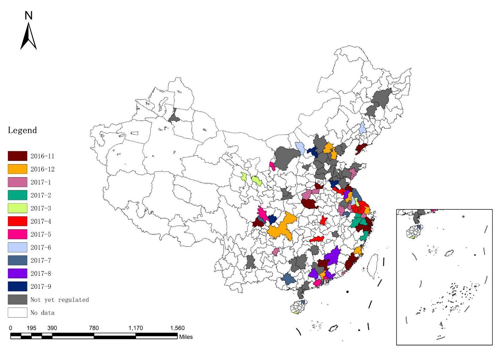
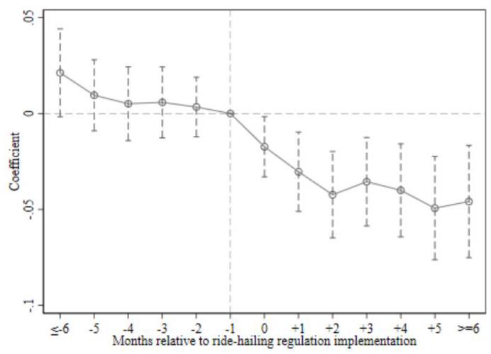
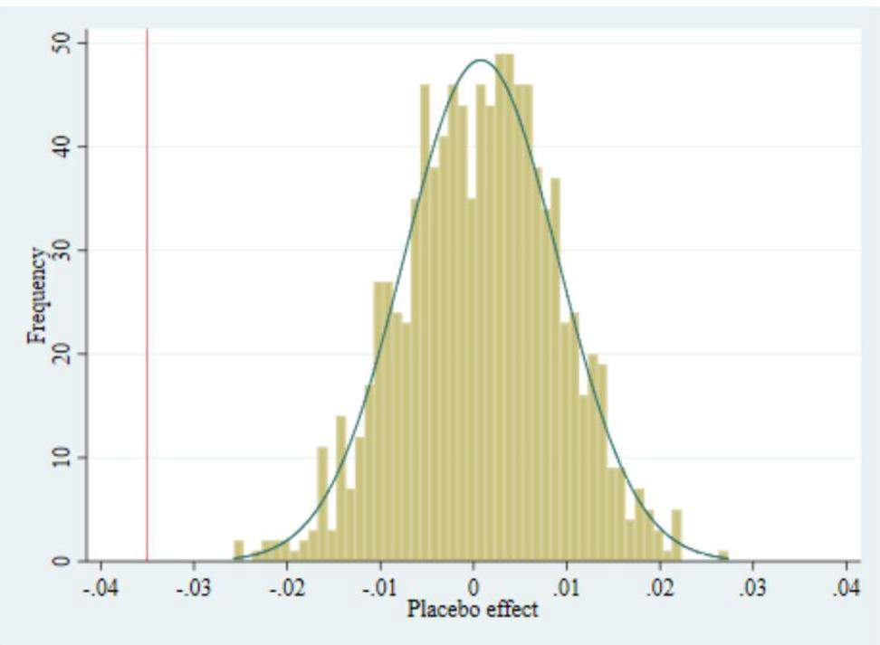
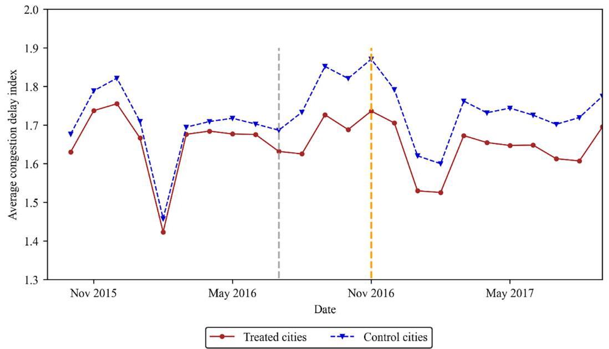
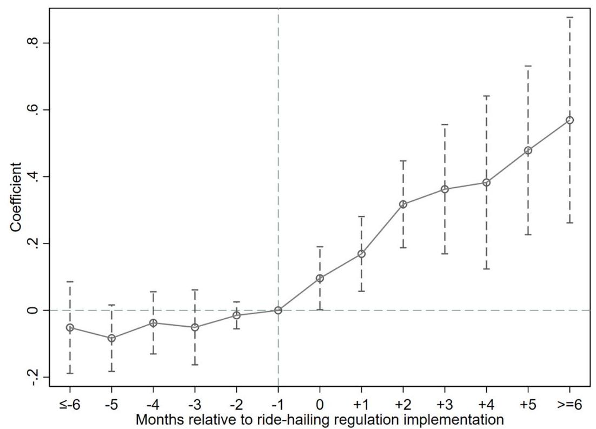

# The impact of ride-hailing regulations on traffic congestion: Evidence from China

Ganxiang Huang \( {}^{\mathrm{a},\mathrm{b}} \) , Hongyan Wang \( {}^{\mathrm{c}} \) , Liuqin Zhang \( {}^{\mathrm{a},\mathrm{b}} \) , Di Xu \( {}^{\mathrm{d}, * } \) ®

a School of Economics and Management, Guangxi Normal University, Guilin 541006, China

\( {}^{\mathrm{b}} \) Key Laboratory of Digital Empowerment Economic Development (Guangxi Normal University), Education Department of Guangxi Zhuang Autonomous Region, Guilin 541006, China

\( {}^{\mathrm{c}} \) School of Aviation Services and Tourism Management, Guilin University of Aerospace Technology, Guilin 541004, China

d School of Management, Xiamen University, Xiamen 361005, China

## A R T I C L E I N F O

Keywords:

Ride-hailing

Regulation

Traffic congestion

Difference-in-differences

Natural experiment

## A B S T R A C T

Despite theoretical controversies, many city governments have begun to regulate ride-hailing services in response to concerns that their rapid growth could worsen traffic congestion. However, the precise impact of these regulatory measures on traffic congestion remains unclear. To address this research gap, we utilized a quasi-natural experiment involving the phased implementation of regulatory policies restricting the supply of ride-hailing services in various cities across China to identify the causal effect of ride-hailing regulations on traffic congestion. Using monthly panel data from 98 Chinese cities, our difference-in-differences estimation shows that the congestion delay index decreased by an average of 2.4% after the implementation of ride-hailing regulations. This finding remains consistent and robust across a series of robustness checks. Furthermore, our heterogeneity analysis indicates that the congestion mitigation effect of ride-hailing regulations varies depending on the types and intensities of regulations implemented, and that this effect is stronger in central cities with larger populations, more developed public transportation systems, and higher levels of congestion.

## 1. Introduction

The emergence of a new generation of information technology-enabled ride-hailing platforms, such as Uber and Lyft, is disrupting the traditional transportation industry (Clewlow and Mishra, 2017). Although ride-hailing platforms provide passengers with convenient and flexible on-demand travel services, reduce driver search frictions, and bring a series of significant social benefits, such as increased entrepreneurial activity (Barrios et al., 2022), fewer traffic accidents (Barreto et al., 2021), and deterring sexual assaults (Park et al., 2021). However, with the exponential growth of the number of users, the potential negative externalities of ride-hailing services have also garnered significant attention, particularly the impact on urban traffic congestion, which has aroused ongoing cross-disciplinary debate. Some proponents argue that ride-hailing services help alleviate traffic congestion by improving the utilization of available seat capacity through demand pooling and by complementing public transit by solving the last-mile problem (Fageda, 2021; Ke et al., 2020; Krishnamurthy and Ngo, 2024). On the other hand, many detractors argue that ride-hailing services increase traffic congestion by replacing more efficient public transit, stimulating unnecessary additional travel demand, creating large amounts of vacant vehicle miles, and increasing private new vehicle ownership (Agarwal et al., 2023; Barrios et al., 2023; Diao et al., 2021).

---

* Corresponding author at: 422 South Siming Road, Siming District, Xiamen 361005, China.

E-mail address: dxu@xmu.edu.cn (D. Xu).

---

Despite ongoing controversies, some city governments have experimented with regulating ride-hailing services in recent years to address potential negative externalities such as traffic congestion resulting from their rapid growth. For example, the New York City Council passed a regulation in 2018 that froze the number of ride-hailing vehicles for one year in response to increasing traffic congestion. Chicago has implemented a new congestion tax on ride-hailing services since January 2020, imposing an additional surcharge on trips that started or ended in the downtown area (Liang et al., 2023). China, the world's largest ride-hailing market with an average of 21 million rides per day on ride-hailing platforms (Anonymous, 2021), promulgated its national regulatory framework for the ride-hailing industry in July 2016. Subsequently, local governments developed their own rules that met or were much stricter than the national standards and determined the timing for their implementation (Stemler et al., 2019). However, to our knowledge, few studies have empirically investigated the impact of these regulatory policies on congestion, and it remains unclear whether and how they affect traffic congestion. As such, this study aims to address these research gaps by identifying the causal effects of ride-hailing regulation implementation on traffic congestion and further examining its heterogeneity.

To establish a reliable causal relationship, we utilized a quasi-natural experimental setting of the phased implementation of regulatory policies in Chinese cities that restrict the supply of ride-hailing services. Using monthly panel data on the average daily congestion delay index for 98 Chinese cities, our difference-in-differences (DID) estimation indicates that the implementation of ride-hailing regulations significantly alleviated urban traffic congestion. This conclusion remains valid after a series of identification condition tests and robustness checks, including the parallel trends assumption, exogeneity test, stacked regression, sample selection, and placebo test. Furthermore, we observed that the congestion mitigation effect of ride-hailing regulations exhibits heterogeneity across different types and intensities of regulation, as well as city characteristics, including urban population, public transit supply, congestion levels, and administrative levels. Additionally, we found evidence that ride-hailing regulations significantly increase ridership on rail transit lines, which provides an indicative mechanism through which the implementation of regulatory policies alleviates traffic congestion by diverting some passengers who previously used ride-hailing services to public transit.

This study makes several notable contributions to the existing literature. First, to the best of our knowledge, this study is the first to empirically investigate the impact of ride-hailing regulation on urban traffic congestion in China. Given that China is the largest ride-hailing market in the world and faces severe traffic congestion, this contribution is nontrivial. Second, our study enriches the emerging literature on the social externalities of ride-hailing regulations, particularly concerning traffic congestion. Unlike recent studies that focused on a single city to examine the impact of ride-hailing regulations on traffic congestion (Liang et al., 2023; Wang et al., 2024; Zheng et al., 2023), this study employs observational data from 98 cities across China, enabling a more nuanced heterogeneity analysis at the city level. Furthermore, in contrast to existing research that found imposing congestion taxes on ride-hailing services did not significantly alleviate traffic congestion in U.S. cities (Li and Vignon, 2024; Liang et al., 2023; Tarduno, 2023), our findings based on Chinese data indicate that regulatory policies restricting the supply of ride-hailing services have significantly reduced traffic congestion. Third, by providing unique large-sample empirical evidence from a Chinese context, our study also enriches the ongoing interdisciplinary debate on the relationship between ride-hailing services and traffic congestion in recent years (Diao et al., 2021; Krishnamurthy and Ngo, 2024; Li et al., 2016; Tarduno, 2021). Leveraging a quasi-natural experiment of phased implementation of regulatory policies limiting the supply of ride-hailing services in Chinese cities, our results suggest that ride-hailing services likely contributed to increased traffic congestion, providing empirical evidence beyond the United States.

The structure of the paper is organized as follows. Section 2 presents a literature review. Section 3 provides institutional background information. Sections 4 and 5 detail the data and methods used, respectively. Section 6 reports the results. Section 7 discusses the limitations and suggests directions for future research. Finally, Section 8 summarizes the main conclusions and their policy implications.

## 2. Literature review

### 2.1. Ride-hailing and traffic congestion

With the rapid growth of the number and scale of ride-hailing platforms, the impact of ride-hailing services on urban traffic congestion has attracted extensive attention from policymakers and scholars. Nonetheless, there is limited causal evidence on the relationship between ride-hailing and traffic congestion due to the availability of congestion data and the challenges of causal identification. Existing studies are not consistent in their conclusions and even report contrary findings, mostly focusing on the U.S. context. For instance, Li et al. (2016) and Krishnamurthy and Ngo (2024) employed a difference-in-differences design to empirically examine the causal effect of ride-hailing services on traffic congestion and found that the entry of Uber significantly reduced vehicle delay time. In contrast, using a similar research design, the results of Diao et al. (2021) and Barrios et al. (2023) show that the entry of ride-hailing services significantly increases traffic congestion. Erhardt et al. (2019) and Tarduno (2021) also found that ride-hailing services worsened traffic congestion in Los Angeles and Austin, respectively, based on high-frequency speed data within cities. In addition, some scholars have found that the average effect of Uber's entry on urban traffic congestion is not significant, pointing out that Uber's effect (either increase or decrease congestion) on traffic depends on a series of contextual factors, such as urban compactness, population density, and road type (Dhanorkar and Burtch, 2022; Lee et al., 2022; Li et al., 2022).

Obviously, the aforementioned studies all focus on U.S. cities, which limits the generalization of the findings. To the best of our knowledge, there are only two pieces of literature that focus on contexts outside the United States. The first is the study by Fageda (2021), which analyzed annual congestion data from 130 cities across 19 European countries between 2008 and 2016. The study found that the introduction of Uber significantly reduced urban traffic congestion, particularly in cities without strict regulatory restrictions on ride-hailing services. The second study is a recent one by Agarwal et al. (2023), who utilized real-time traffic and route trajectory data from Google Maps to investigate the impact of the absence of ride-hailing services on traffic congestion in three major Indian cities. Their findings indicate a significant decrease in travel time during disruptions to ride-hailing services, with a more pronounced effect in congested areas during peak hours. Considering that the influence of ride-hailing services on traffic congestion may vary significantly depending on the institutional environment and the organization of these services (Benjaafar et al., 2022; Erhardt et al., 2019), our study contributes to this body of literature by examining the unique context of China, the world's largest ride-hailing market with a high proportion of full-time drivers.

### 2.2. Ride-hailing regulations

In response to potential negative externalities from ride-hailing services, an increasing number of city governments have initiated or are contemplating the implementation of ride-hailing regulations. The topic of whether and how to regulate ride-hailing services and the resulting consequences have also garnered increasing attention from researchers. Beer et al. (2017) reviewed ride-hailing regulations in 15 major U.S. cities and categorized them into driver-related and company-related regulations. Driver-related regulations encompass background checks, driver's licenses, vehicle registrations, special licenses (e.g., business licenses), and external vehicle displays. Company-related regulations involve restrictions on the number of ride-hailing vehicles in operation and the mandate to share driver lists and trip data with city authorities. Through expert interviews, Peace et al. (2023) explored the underlying processes involved in policymaking and planning for ride-hailing services in Toronto and Vancouver. They highlighted safety as a primary concern, with policy objectives aimed at consumer protection, reducing community nuisance, and ensuring public health and safety.

Several researchers have evaluated potential regulatory policies using analytical models. For example, Li et al. (2021) proposed a market equilibrium model to evaluate the impact of congestion charges and minimum wage policies. They found that congestion charges do not significantly affect ride-hailing ridership or alleviate congestion directly by reducing the number of ride-hailing vehicles on the road. Zhang and Nie (2022) utilized a two-node spatial market equilibrium model to analyze the impact of three potential regulatory policies on an idealized urban transportation system. They noted that while the trip-based and cordon-based policies modestly decreased congestion, the cruising cap policy could diminish overall social welfare and potentially exacerbate city center traffic by incentivizing more trips in those areas. Vignon et al. (2023) presented a model of competition in the ride-hailing market, indicating that congestion could intensify under a duopoly. However, a commission cap regulation might mitigate congestion and enhance consumer welfare. Agrawal and Zhao (2023) extended a pseudo-monocentric city model to incorporate multiple endogenously chosen modes of transportation. They demonstrated that most policies currently adopted by cities to tax ride-hailing services have slightly increased public transit usage. In our study, we aim to empirically examine the effects of real-world ride-hailing regulatory policies, thereby offering empirical evidence to support existing theoretical analysis literature.

Our study is most relevant to several recent empirical studies investigating the impact of ride-hailing regulation. Using a difference-in-differences identification strategy, Zheng et al. (2023) quantified the impact of congestion tax policies on ride-hailing ridership in Chicago. They found that the implementation of the congestion tax policy led to a 7.1 % decrease in the number of total ride-hailing pickup trips, a 16.4 % increase in the number of shared ride-hailing pickup trips, and an 11 % decrease in the number of single ride-hailing pickup trips. Using the previous year's samples as the control group, Liang et al. (2023) obtained similar results based on the difference-in-differences approach and showed that the congestion tax policy did not significantly alleviate traffic congestion in Chicago. A recent study by Wang et al. (2024) evaluated the impact of ride-hailing regulations in New York City using street-level speed records, and the results based on a regression discontinuity design showed that the implementation of driver application freeze significantly increased traffic speed. In contrast to the aforementioned studies, which focus on the U.S. context and are limited to individual cities, our study enriches this emerging stream of literature by providing unique large-sample (i.e., 98 cities) empirical evidence from China.

## 3. Institutional background

With the rapid growth in the number and size of ride-hailing platforms since 2012, a growing number of legal issues have emerged, such as the unclear legal status and responsibility of participants, and ineffective protection of customers' safety and legitimate rights (Jiang and Wang, 2020). In response, in July 2016, China's Ministry of Transport and six other ministries jointly issued a national regulatory policy for China's ride-hailing industry—the Interim Measures for the Administration of Online Taxi Booking Business Operations and Services (hereinafter referred to as the Interim Measures), which took effect in November of that year. The Interim Measures not only grants legal status to ride-hailing services but also provides framework provisions regarding ride-hailing platforms, vehicles, drivers, operations, supervision and inspection, and legal liability. The Interim Measures require that the ride-hailing (or online taxi-booking) service obtain licenses or permits before entering the market, similar to the regulations governing traditional taxi services (Jiang and Wang, 2020). The ride-hailing platform company must meet specific technical, security, and payment standards prior to acquiring a "Ride-hailing Business Permit"; the vehicle must obtain the "Ride-hailing Transport Certificate"; and the driver is required to obtain the "Ride-hailing Driver's License."2 Therefore, the Interim Measures are essentially a means of quantity control, limiting the supply of ride-hailing services. More importantly, it explicitly empowers local governments to establish specific implementation rules, including requirements for ride-hailing drivers and vehicles and the timeline for implementation. Consequently, due to the general considerations and administrative efficiency of local governments, this top-down process results in variations in the timing of implementing ride-hailing regulatory policies across different cities nationwide. According to the official statistics of China's Ministry of Transport, as of July 2017, 133 cities, including Beijing, Shanghai, and Tianjin, had announced and implemented regulatory policies, while an additional 86 cities were either in the process of or had completed public consultation (Beijing News, 2017). These local regulations are largely consistent with the Interim Measures, but some cities have proposed more detailed and stringent criteria for setting entry thresholds (Jiang and Wang, 2020).

---

\( {}^{1} \) The vehicle must meet the requirements of passenger cars with seven seats or fewer and be equipped with vehicle satellite positioning devices and emergency alarm devices with a driving record function.

---

Based on the published regulatory policy documents on ride-hailing in 98 cities collected by the author, most of them restrict drivers and vehicles engaged in ride-hailing services from various aspects such as drivers' household registration, vehicle displacement, vehicle wheelbase, vehicle license plate, and vehicle price (Table A.1 in the Appendix, for example). Among these cities, Beijing, Shanghai, and Tianjin have the strictest residency restrictions, all requiring ride-hailing drivers to have local hukou (i.e., a system of household registration used in Chinese Mainland), while most cities only mandate drivers to obtain a local residence permit. Regarding the requirements for vehicles engaged in ride-hailing services, most cities stipulate that vehicles must have local license plates or be registered in the city. Shenyang, Shijiazhuang, Fuzhou, Xiamen, and Zhuhai also mandate that vehicles have a wheelbase greater than \( 2,{650}\mathrm{\;{mm}} \) and a displacement of no less than 1.75 L. Furthermore, some cities have imposed additional restrictions on vehicle registration years and third-party liability insurance.

Clearly, the strict requirements imposed on drivers and vehicles indicate that the implementation of regulatory policies in various cities will inevitably result in a sharp decline in the supply of ride-hailing services. Effectively, this amounts to a form of disguised quantitative regulation. For instance, in Beijing, only 10.7 % of the over 200,000 active drivers on Didi Chuxing, China's largers tried-hailing platform, comply with the local residency requirement imposed by the city (Caixin, 2016). This percentage is even lower in Shanghai, where only approximately 3% of the 410,000 drivers meet the same requirement (Anonymous, 2021). The reduction in the supply of ride-hailing services due to regulatory policies has made it more challenging to hail rides in cities and has decreased the demand for such services. According to big data from Didi Chuxing, in June 2017, the difficulty of hailing a ride during peak hours in Shenzhen, Guangzhou, Shanghai, and Beijing increased by 22.5 %, 13.2 %, 17.7 %, and 12.4 % respectively, compared to the period before the implementation of ride-hailing regulations. Notably, in Beijing, the number of ride-hailing orders dropped by around 10 % following the enforcement of the regulatory policy (Xinhua News Agency, 2017).

It should be noted that the reduction of the supply of ride-hailing services in cities caused by the implementation of regulatory policies is likely to be a relatively short-term shock. \( {}^{3} \) In addition, some cities adjusted their regulatory policies after they had been in place for some time. For example, in September 2017, Lanzhou became the first city in China to revise its regulations, removing wheelbase restrictions and lowering price requirements, more than five months after it officially implemented ride-hailing regulations. To reduce the interference of the above factors on the estimation results and more cleanly identify the causal effect of the implementation of regulatory policies restricting the supply of ride-hailing services on traffic congestion, the sample observation time of this study ends in September 2017. Therefore, this study focuses on the short-term impact of the implementation of regulatory policies that restrict the supply of ride-hailing services on traffic congestion.

## 4. Data

This study integrates multiple data sources and constructs a monthly panel dataset of 98 cities in China for a total of 24 months from October 2015 to September 2017. The selection of the 98 sample cities is primarily based on the availability of urban traffic congestion delay index data. We obtained the congestion delay index data of 100 major cities in China released by Amap and excluded Ili and Hong Kong due to the absence of control variable data, resulting in a final sample of 98 cities for this study. The 98 sample cities cover 30 provinces in China (see Fig. 1), and the total GDP and urban population in 2018 account for 69.5 % and 45.1 % of China, respectively, making the samples highly representative.

### 4.1. Traffic congestion data

This study uses the congestion delay index to measure urban traffic congestion levels. The data is sourced from Wind Economic Database (Wind, 2021), \( {}^{4} \) a leading provider of financial data, information, and software in China. It documents the congestion delay index of major Chinese cities, which is published daily by Amap, a leading digital map, navigation, and location service provider in China with over 700 million monthly active users. The congestion delay index is calculated as the actual travel time divided by the free-flow travel time. A higher congestion delay index indicates more severe traffic congestion. It is worth noting that the congestion delay index takes into account both the actual travel speed and the free flow speed, thereby standardizing for disparities in road network structures among cities. Consequently, this index offers a more uniform metric than simply using average traffic speed, making it more suitable for comparing congestion levels across cities (Li et al., 2019). We obtained the daily congestion delay index data from 98 sample cities, aggregated them to the city-month level, and calculated their average value to measure traffic congestion for subsequent empirical analysis.

---

2 The driver needs to obtain the corresponding licensed motor vehicle driving license and have more than three years of driving experience, as well as no traffic crime or dangerous driving crime record, and must not have recorded 12 points in the last three consecutive scoring cycles.

\( {}^{3} \) For example, some ride-hailing drivers who initially left due to non-compliance with regulatory requirements might return to the platform through the purchase of new cars or other means. This could potentially mitigate or even counterbalance the reduction in ride-hailing service supply caused by the implementation of regulatory policies.

\( {}^{4} \) It should be noted that we obtained this data in December 2021 from Wind Economic Database (EDB). However, Wind no longer provides this data at present.

---

Fig. 1. Geographical distribution of sample cities. Notes: No data indicates that we did not acquire traffic congestion information for these cities; therefore, they are excluded from our sample.

### 4.2. Ride-hailing regulation data

We collected the policy documents on ride-hailing regulation from the government website and the Magic Weapon of Peking University (Magic Weapon of Peking University, 2022) for each city, and obtained the implementation date of the ride-hailing regulation from these sources. It is important to note that the implementation date refers to the time of formal implementation and does not account for any transition period. \( {}^{5} \) The geographical distribution of the sampled cities and the implementation dates of ride-hailing regulations are illustrated in Fig. 1. Out of the 98 sample cities, 65 had implemented ride-hailing regulations during the study period, while the remaining 33 cities had not implemented them yet.

### 4.3. Control variable data

To alleviate the omitted variable bias problem, we also control a series of factors that may affect traffic congestion, including temperature, precipitation, air quality, urban population, per capita disposable income of urban residents, the number of buses, the length of rail transit, and the length of roads. We collected temperature and precipitation meteorological data from the National Oceanic and Atmospheric Administration (NOAA, 2022), and air quality data from the China Stock Market & Accounting Research Database (CSMAR, 2022). The data on urban population, rail transit length, and road length were collected from the China Urban Construction Statistical Yearbook (MOHURD, 2022). Data on the number of buses and per capita disposable income of urban residents were collected from the China Urban Statistical Yearbook (CNKI, 2022) and the China Entrepreneur Investment Club Database (CEIC, 2022). In addition to temperature, we also performed logarithmic transformations on all of the above control variables to make their distribution closer to normal. \( {}^{6} \) Descriptive statistics are shown in Table 1. We also plotted the evolution trend of the average congestion delay index for both treated and untreated cities and found that there was no significant difference between the two groups before the issuance of the Interim Measures (see in Fig. A. 1 in the Appendix), \( {}^{7} \) providing descriptive evidence to support the parallel trend assumption.

---

\( {}^{5} \) To address the potential anticipation effect, we will incorporate the transition period in our subsequent robustness tests to validate the reliability of our findings.

---

## 5. Methods

### 5.1. Identification strategy

The most intuitive way to examine the short-term impact of ride-hailing regulation on traffic congestion is to conduct a before-and-after analysis. However, this simple before-and-after comparison is likely to confound the impact of ride-hailing regulation and seasonal factors on traffic congestion. To establish a reliable causal relationship, we use the difference-in-differences approach to identify the causal effect, with the help of the quasi-natural experimental setting of staggered implementation of ride-hailing regulations in various cities in China since November 2016, which provides a good scenario for this study. First, the main purpose of the city government's implementation of ride-hailing regulations is to standardize the ride-hailing market, ensuring operational safety and protecting the legitimate rights and interests of passengers. Therefore, ride-hailing regulation is an exogenous event unrelated to urban traffic congestion conditions, which avoids reverse causality. Second, the timing of the implementation of ride-hailing regulatory policies varies among Chinese cities. This allows us to utilize the staggered DID design to identify the causal effect, effectively mitigating concerns that other factors may confound the treatment effect during the same period.

#### 5.2.DID model

Although randomized trials are the best way to determine causality, conducting large-scale randomized field experiments is often challenging due to the high cost of experiments and implementation difficulties. Natural experiments, which occur naturally but are similar in persuasion to randomized experiments and have almost no cost, have become increasingly popular among researchers in recent years. However, groupings of individuals in natural experiments are often not randomly generated, which can lead to selection bias (Ho et al., 2017). The DID model is a common approach to such problems. It enables the calculation of the treatment effect by comparing the average difference in outcome changes between the treatment group and control group before and after receiving the treatment (e.g., the implementation of ride-hailing regulations). The average treatment effect ATT can be expressed as:

\[
{ATT} = \left( {E\left\lbrack  {{Y}_{T} \mid  \text{ Post }}\right\rbrack   - E\left\lbrack  {{Y}_{T} \mid  \text{ Pre }}\right\rbrack  }\right)  - \left( {E\left\lbrack  {{Y}_{C} \mid  \text{ Post }}\right\rbrack   - E\left\lbrack  {{Y}_{C} \mid  \text{ Pre }}\right\rbrack  }\right) \tag{1}
\]

Where \( {Y}_{T} \) and \( {Y}_{C} \) represent the sets of outcome variables for the treatment group and the control group, respectively. Post denotes the period after treatment, while Pre refers to the period before treatment.

More formally, in our context, we estimate ATT using the following two-way fixed effects DID model, also known as the staggered DID model:

\[
{Y}_{it} = a + {\beta regulat}{e}_{it} + \varphi {X}_{it} + {\delta }_{i} + {\lambda }_{t} + {\varepsilon }_{it} \tag{2}
\]

Where \( {Y}_{it} \) represents the traffic congestion delay index of city \( i \) on date \( t \) . regulate \( {a}_{it} \) is a dummy variable, with a value of 1 indicating that city \( i \) implemented ride-hailing regulations on date \( t \) , otherwise the value is \( 0.{X}_{it} \) is a vector of control variables, which include temperature, precipitation, air quality, population, income, number of buses, length of rail transit lines, and length of roads. \( {\delta }_{i} \) is a vector of the city fixed effects that control for time-invariant features of the sample cities. \( {\lambda }_{t} \) denotes a vector of time (year-month) fixed effects to control for common factors that affect all sample cities but change over time. \( {\varepsilon }_{it} \) indicates the error term. We cluster the standard error at the city level to account for possible within-group error correlations. \( \beta \) is the estimated coefficient of interest in thi: study, reflecting the average treatment effect of the implementation of ride-hailing regulation on urban traffic congestion.

A key assumption for the validity of the DID model is the parallel trend between the treatment group and the control group. That is, the trend of change in the outcomes (i.e., congestion delay index) of the treatment group cities and the control group cities should be the same in the absence of treatment (i.e., ride-hailing regulation implementation). The common way to test parallel trends is to draw on the idea of an event study and use a relative time model to investigate whether there is a significant difference between the outcomes of the treatment group and the control group before receiving the treatment (Mithas et al., 2022). Formally, we construct the following relative time model:

\[
{Y}_{it} = a + \mathop{\sum }\limits_{{k \neq   - 1}}{\beta }_{k}{D}_{it}\left( k\right)  + \varphi {X}_{it} + {\delta }_{i} + {\lambda }_{t} + {\varepsilon }_{it} \tag{3}
\]

---

\( {}^{6} \) We also conducted our DID estimates without applying logarithmic transformations to the control variables, and the results remained consistent.

\( {}^{7} \) It should be noted that following the announcement of the national Interim Measures, but before the implementation of the local regulatory policy, a significant divergence in traffic congestion between the treatment and control groups emerged (i.e., between the gray and orange lines in Fig. A.1), which we attribute to the potential expected effect. Similar to the increase in housing prices driven by anticipated improvements in transportation accessibility (Mikula and Molnár, 2023), sample cities that solicit public opinion on regulatory rules following the enactment of national policy, but before the actual implementation of local ride-hailing regulations, may also elicit an early response from stakeholders (CAC, 2016). For instance, ride-hailing platforms might take the initiative to remove non-compliant vehicles and drivers, while those drivers who fail to meet regulatory standards may opt to exit the ride-hailing market prematurely. This potential expected effect could lead to an underestimation of the congestion mitigation effects of ride-hailing regulations.

---

Table 1

Descriptive statistics.

<table><tr><td>Variables</td><td>Description</td><td>Mean</td><td>S.D.</td><td>Min</td><td>Max</td></tr><tr><td>TTI</td><td>Congestion delay index</td><td>1.648</td><td>0.140</td><td>1.263</td><td>2.308</td></tr><tr><td>regulate</td><td>Binary indicator of ride-hailing regulation</td><td>0.232</td><td>0.422</td><td>0</td><td>1</td></tr><tr><td>temperature</td><td>Mean temperature (°C)</td><td>17.421</td><td>9.704</td><td>-19.416</td><td>32.247</td></tr><tr><td>Inprecipitation</td><td>Total precipitation (mm)</td><td>4.179</td><td>1.358</td><td>0</td><td>6.992</td></tr><tr><td>lnaqi</td><td>Air quality index</td><td>4.396</td><td>0.347</td><td>3.178</td><td>5.707</td></tr><tr><td>Inpopulation</td><td>Number of permanent urban residents (10,000)</td><td>5.540</td><td>0.809</td><td>3.140</td><td>7.820</td></tr><tr><td>Inincome</td><td>Per capita disposable income of urban residents (RMB)</td><td>10.508</td><td>0.229</td><td>10.033</td><td>11.044</td></tr><tr><td>Inbusvehicle</td><td>Number of buses</td><td>7.888</td><td>0.968</td><td>5.805</td><td>10.486</td></tr><tr><td>Inraillength</td><td>Rail transit line length (km)</td><td>1.456</td><td>2.142</td><td>0</td><td>6.461</td></tr><tr><td>Inroadlength</td><td>Road length (km)</td><td>7.470</td><td>0.796</td><td>5.756</td><td>9.145</td></tr></table>

Notes: \( N = 1,{962} \) .

Where \( {D}_{it}\left( k\right) \) is a vector of the relative time dummy variable, and its value is 1 when the relative chronological distance between the date of the implementation of ride-hailing regulation in city \( i \) and the date \( t \) is \( k \) , otherwise the value is 0 . The remaining variables are defined as in Eq. (1). Consistent with previous studies, we define \( k =  - 1 \) as the base period. Obviously, coefficient \( {\beta }_{k} \) reflects the relative difference in the outcome variables between the cities in the treatment and control groups for the \( k \) month (relative to the base period). If the estimated coefficient of \( {\beta }_{k}\left( {k \leq   - 1}\right) \) is not significant, it indicates that the traffic congestion delay index of the cities in the treatment group and the cities in the control group have the same change trend before the implementation of the ride-hailing regulation policy, that is, the parallel trend assumption is satisfied.

## 6. Results

### 6.1. Baseline results

Table 2 reports our baseline regression results for Eq. (2). Column (1) includes only the city fixed effects and time fixed effects, column (2) adds the temperature, precipitation, and air quality at the city-monthly level, and column (3) further incorporates the characteristic factors at the city-annual level. The estimated coefficient of regulate is significantly negative at the 1% level, indicating a significant decrease in the congestion delay index after the implementation of ride-hailing regulation. This suggests that regulatory policies restricting the supply of ride-hailing services have notably alleviated local traffic congestion. Given the additional control variables in column (3), subsequent analyses in this study are based on this column. Specifically, the congestion delay index in the sample cities decreased by an average of about 0.039 after the implementation of ride-hailing regulations. As the average congestion delay index before the implementation of ride-hailing regulations in the sample cities is 1.651, this figure indicates that the implementation of ride-hailing regulations has reduced traffic congestion by about 2.4 % on average (0.039/1.651).

### 6.2. Parallel trend assumption

As mentioned earlier, we utilize the relative time model shown in Eq. (3) to test the parallel trend assumption. Fig. 2 plots the estimated results for the coefficient \( {\beta }_{k} \) of equation (3) with a 95% confidence interval, the standard error clustered at the city level. It is clear that there was no significant difference in congestion delay index between the treatment group and the control group cities before the implementation of ride-hailing regulations \( \left( {\beta }_{k}\right. \) was not significantly different from zero, \( k < \) -1), thus supporting the parallel trend assumption. In addition, Fig. 2 also indicates that the coefficient \( {\beta }_{k}\left( {k \geq  0}\right) \) was significantly negative from the month when the city implemented the ride-hailing regulation, and this congestion mitigation effect remained significant six months after the policy implementation, further validating the reliability of our baseline results.

### 6.3. Exogeneity test of ride-hailing regulation

Although the main purpose of implementing regulatory policies is to standardize the operation of ride-hailing services, ensuring the safety and legitimate rights and interests of passengers, some local governments may also take into account the traffic congestion conditions in the city when formulating such regulations. Hence, a reasonable concern is that the timing of cities implementing ride-hailing regulations may be endogenous and affected by traffic congestion levels. This implies that reverse causation is also possible. To this end, we draw on the practice of Dube and Zhu (2021) to conduct an exogenous test on the implementation of ride-hailing regulation. Specifically, a survival analysis was conducted with the expected time for local governments to implement ride-hailing regulations (the time distance from July 2016) as the outcome variable, and the results are presented in Table 3. Column 1 reports the coefficient estimates for the COX proportional hazard model, while columns 2 and 3 present estimates of the hazard functions following Weibull and exponential distributions, respectively. All regression results consistently indicate that the timing of city governments' implementation of ride-hailing regulations is not significantly associated with local traffic congestion conditions. Instead, it is primarily associated with per capita disposable income and the length of rail transit lines, both of which have been incorporated into all regression models. Therefore, the results of the survival analysis support the causal effect of ride-hailing regulation on traffic congestion in our baseline results.

Table 2

Baseline regression results.

<table><tr><td>Variables</td><td>(1)</td><td>(2)</td><td>(3)</td></tr><tr><td>regulate</td><td>\( - {0.037}^{* *  * } \)   (0.009)</td><td>-0.038***   (0.009)</td><td>-0.039***   (0.009)</td></tr><tr><td>temperature</td><td></td><td>-0.002*   (0.001)</td><td>-0.002   (0.001)</td></tr><tr><td>Inprecipitation</td><td></td><td>0.008***   (0.002)</td><td>0.008***   (0.002)</td></tr><tr><td>lnaqi</td><td></td><td>0.006   (0.015)</td><td>0.005   (0.015)</td></tr><tr><td>Inpopulation</td><td></td><td></td><td>-0.066*   (0.035)</td></tr><tr><td>Inincome</td><td></td><td></td><td>0.354*   (0.204)</td></tr><tr><td>Inbusvehicle</td><td></td><td></td><td>-0.008   (0.014)</td></tr><tr><td>Inraillength</td><td></td><td></td><td>-0.009*   (0.005)</td></tr><tr><td>Inroadlength</td><td></td><td></td><td>0.022   (0.020)</td></tr><tr><td rowspan="2">Constant</td><td>1.657***</td><td>1.627***</td><td>-1.811</td></tr><tr><td>(0.002)</td><td>(0.063)</td><td>(2.177)</td></tr><tr><td>Time fixed effects</td><td>YES</td><td>YES</td><td>YES</td></tr><tr><td>City fixed effects</td><td>YES</td><td>YES</td><td>YES</td></tr><tr><td>Observations</td><td>1,962</td><td>1,962</td><td>1,962</td></tr><tr><td>R-squared</td><td>0.794</td><td>0.797</td><td>0.799</td></tr></table>

Notes: Robust standard errors clustered at the city level are reported in parentheses. *** p < 0.01, ** p < 0.05, * p < 0.1.

Fig. 2. Dynamic treatment effects of ride-hailing regulation implementation. Notes: This figure plots the estimates of \( {\beta }_{k} \) from Eq. (3), with month -1 as the baseline. The 95% confidence intervals are shown, with standard errors clustered at the city level.

### 6.4. Robustness checks

To validate the robustness and reliability of the baseline results reported in Table 2, we next conduct a series of robustness checks.

#### 6.4.1. Sample selection

One possible concern was that the baseline regression results might be sensitive to sample selection, for which we performed a series of subsample analyses.

Table 3

Results of the exogeneity test.

<table><tr><td>Variables</td><td>(1)</td><td>(2)</td><td>(3)</td></tr><tr><td></td><td>COX</td><td>Weibull</td><td>Exponential</td></tr><tr><td>TTI</td><td>-0.986   (0.756)</td><td>-1.270   (0.862)</td><td>-0.808   (0.654)</td></tr><tr><td>lnaqi</td><td>0.260   (0.388)</td><td>0.345   (0.458)</td><td>0.112   (0.309)</td></tr><tr><td>Inpopulation</td><td>0.382   (0.333)</td><td>0.468   (0.379)</td><td>0.236   (0.265)</td></tr><tr><td>Inincome</td><td>2.026**   (0.794)</td><td>2.442***   (0.919)</td><td>1.441**   (0.566)</td></tr><tr><td>Inbusvehicle</td><td>-0.356   (0.340)</td><td>-0.397   (0.388)</td><td>-0.285   (0.272)</td></tr><tr><td>Inraillength</td><td>0.181*   (0.095)</td><td>0.213**   (0.105)</td><td>0.140*   (0.083)</td></tr><tr><td>Inroadlength</td><td>-0.133   (0.286)</td><td>-0.175   (0.315)</td><td>-0.047   (0.235)</td></tr><tr><td>Constant</td><td></td><td>-29.726***   (9.223)</td><td>-15.950***   (5.839)</td></tr><tr><td>Observations</td><td>98</td><td>98</td><td>98</td></tr></table>

Notes: The dependent variable is the number of months until the implementation of local ride-hailing regulations, starting from the launch date of the national regulatory framework in July 2016. This variable is right-truncated for cities that had not implemented regulations by the end of our sample observation period. *** p < 0.01, ** p < 0.05, * p < 0.1.

First, we further shortened the time window of sample observations, considering that the impact of the implementation of the regulatory policy on the reduction of the supply of ride-hailing services is short-term in nature. \( {}^{8} \) Specifically, we narrowed the time window of sample observations to 3 months and 5 months before and after the first implementation of ride-hailing regulation in the sample cities, and then repeated the baseline regression estimate. \( {}^{9} \) As shown in columns (1) and (2) of Table 4, the estimated coefficients of regulate are significantly negative at the \( 1\% \) level, which is consistent with the baseline results.

Second, the decision by local governments to implement ride-hailing regulatory policies may be influenced by certain city-specific characteristics, particularly those hidden factors that are not directly observable. To ensure that the sample cities are as similar as possible in terms of the probability and timing of implementing ride-hailing regulations, we adopted the approach of (Babar and Burtch, 2020), excluding cities that did not implement ride-hailing regulations during the study period, and subsequently repeated the estimate of Eq. (1). As shown in column (3) of Table 4, the estimated coefficients of regulate do not differ substantially from the baseline regression results.

Finally, to further ensure comparability between the cities in the treatment group and the control group, we also conducted matching based DID estimates. Using air quality, urban population, per capita disposable income, number of buses, rail transit line length, and road length in 2016 as matching covariates, we conducted one-to-one propensity score matching without replacement within a caliper of 0.05 . The idea of the propensity score matching approach is to calculate the probability of each individual receiving a certain treatment (i.e., the propensity score) and then match individuals in the treatment and control groups to ensure that the distribution of key covariates across the two groups is as similar as possible. The results of the balance check are presented in Appendix Table A.2, showing no significant differences in the characteristics of cities in the treatment and control groups after propensity score matching. Then, we separately use the matched samples to perform the DID estimation as shown in Eq. (1). The estimated coefficients of regulate remain significantly negative, as shown in column (4) of Table 4.

#### 6.4.2. Treatment effect heterogeneity

In response to the recent concerns regarding bias in two-way fixed effects DID estimators due to treatment effect heterogeneity (Callaway and Sant'Anna, 2021; De Chaisemartin and D'Haultfoeuille, 2020; Goodman-Bacon, 2021)," this study also performed Goodman-Bacon decomposition and conducted stacked regressions with and without control variables, as suggested by Baker et al. (2022). Goodman-Bacon (2021) shows that the two-way fixed effects estimator in a staggered DID design is equivalent to a weighted average of all possible \( 2 \times  2 \) DID estimators. In the case of the heterogeneity of treatment effects, this staggered DID design-utilizing earlier-treated units as the control group for later-treated units-can lead to a problem of negative weights, which may result in inconsistent parameter estimates. The idea of the Goodman-Bacon decomposition approach is to decompose the traditional two-way fixed effects estimators into multiple \( 2 \times  2 \) DID estimator combinations, which allows researchers to assess the severity of treatment effect heterogeneity by calculating each \( 2 \times  2 \) DID estimate along with its corresponding weight. As shown in Table 5, the proportion of earlier-treated cities as the control group is lower (0.128). Moreover, all possible \( 2 \times  2 \) DID combination estimates are negative, and the effect size does not significantly differ from that of the two-way fixed effects estimators (i.e., the overall DID estimate), suggesting that the threat of bias from treatment effect heterogeneity in our setting is unlikely to be a big concern (Barrios, 2021).

---

\( {}^{8} \) As the implementation of regulatory policies progresses over time, it is likely that the supply of ride-hailing services will gradually rebound. This is because some drivers who initially did not meet the vehicle requirements may return to the ride-hailing platforms by purchasing new cars, and new drivers may also be incentivized to join these platforms.

\( {}^{9} \) This estimation, based on a shorter observation time window, also helps to reduce the potential interference of other unobserved factors on the estimated results.

\( {}^{10} \) It should be noted that the sample observation time window used in this study is relatively short. This implies that the threat of bias from treatment effect heterogeneity in our setting may not be as big of a concern, as the proportion of cities treated earlier in the control sample is lower. Moreover, the estimated results of dynamic treatment effects based on event analysis (Fig. 2 and shortening the sample observation time window (columns (1) - (2) of Table 3) consistently show that the implementation of ride-hailing regulation significantly reduces traffic congestion. These results should alleviate concerns about the threat of bias from treatment effect heterogeneity (Barrios, 2021).

---

Table 4

Results of sample selection.

<table><tr><td>Variables</td><td>[2016/8-2017/2]</td><td>[2016/6-2017/4]</td><td>Exclude unimplemented cities</td><td>Propensity score matching</td></tr><tr><td></td><td>(1)</td><td>(2)</td><td>(3)</td><td>(4)</td></tr><tr><td rowspan="2">regulate</td><td>-0.049***</td><td>-0.047***</td><td>-0.047***</td><td>-0.042**</td></tr><tr><td>(0.014)</td><td>(0.011)</td><td>(0.010)</td><td>(0.017)</td></tr><tr><td rowspan="2">Constant</td><td>-7.019</td><td>-4.431</td><td>1.348</td><td>-2.258</td></tr><tr><td>(4.817)</td><td>(3.377)</td><td>(7.439)</td><td>(2.122)</td></tr><tr><td>Controls</td><td>YES</td><td>YES</td><td>YES</td><td>YES</td></tr><tr><td>Time fixed effects</td><td>YES</td><td>YES</td><td>YES</td><td>YES</td></tr><tr><td>City fixed effects</td><td>YES</td><td>YES</td><td>YES</td><td>YES</td></tr><tr><td>Observations</td><td>686</td><td>1,039</td><td>1,338</td><td>924</td></tr><tr><td>R-squared</td><td>0.861</td><td>0.849</td><td>0.786</td><td>0.824</td></tr><tr><td>Number of cities</td><td>98</td><td>98</td><td>65</td><td>50</td></tr></table>

Notes: Robust standard errors clustered at the city level are reported in parentheses. *** p < 0.01, ** p < 0.05, * p < 0.1.

To further alleviate this concern, as suggested by Baker et al. (2022), we conducted stacked regressions both with and wi covariates, following the methodology developed by (Cengiz et al., 2019), which allowed us to exclude already-treated cities from serving as control groups. The idea of stacked regression is to create event-specific "clean \( 2 \times  2 \) " datasets and perform DID estimates for each constructed clean \( 2 \times  2 \) dataset separately, and then apply variance weighting to combine the treatment effects across cohorts. This approach is likely the most easily implementable solution for researchers to solve the problem of treatment effect heterogeneity (Baker et al., 2022). More specifically, for each treated cohort, a "clean" control group sample was identified, comprising cities that had never implemented ride-hailing regulations during the study period and cities that had not yet implemented such regulations within a specific time window (i.e., 3 months and 5 months before and after the treated cohort). This process was repeated for each treated cohort. Subsequently, all cohort-specific datasets are stacked together to perform a two-way fixed effects estimation, controlling for city-cohort fixed effects and time-cohort fixed effects, with standard errors clustered at the city level. As shown in Table 6, the estimation coefficients of regulate for all stacked regressions are significantly negative, which is not substantially different from the baseline regression results.

#### 6.4.3. Other robustness checks

We also conducted a series of additional robustness checks to further ensure the reliability of our baseline results. First, we constructed a balanced panel dataset from July 2016 to September 2017. Second, we redefined the implementation date of the ride-hailing regulatory policy as the start date of the transition period to address concerns that potential anticipated effects may affect the estimation results. \( {}^{11} \) Third, we included the interaction term of city fixed effect and time trend to Eq. (1) to eliminate the possible influence of city-specific linear time trend on the estimated results. \( {}^{12} \) As shown in Table 7, in line with the baseline results, the estimated coefficients of regulate for all additional robustness tests were significantly negative.

### 6.5. Placebo tests

Another concern is that the result observed by our baseline regression occurred purely by chance. To this end, we conducted a placebo test following a common practice in the existing literature (Dhanorkar and Burtch, 2022; Li et al., 2022). Specifically, we randomly assigned a false ride-hailing regulation date to each sample city and then repeated the DID estimate shown in Eq. (1) using a randomly generated regulate placebo as the treatment indicator. We saved the placebo coefficient estimate and repeated the process 1000 times. Fig. 3 plots the distribution of the placebo coefficient estimates for 1000 replicates. The results show that the probability of the observed congestion mitigation effect of ride-hailing regulations in our baseline results occurring purely by chance is extremely low (p < 0.0001), thereby suggesting that the reduction in urban traffic congestion is indeed driven by the implementation of regulatory policies, rather than a spurious relationship.

---

\( {}^{11} \) Thirteen sample cities, including Hangzhou, Changzhou, and Suzhou, set a transition period of 2-6 months when formally implementing the ride-hailing regulation policy.

\( {}^{12} \) We also replicated the baseline regression with city-specific quadratic trends, yielding qualitatively similar results.

---

Table 5

Goodman-Bacon decomposition.

<table><tr><td>Variable</td><td>Weight</td><td>DID estimate</td></tr><tr><td>Overall DID estimate</td><td></td><td>-0.048</td></tr><tr><td colspan="3">Control group type</td></tr><tr><td>Never-treated cities</td><td>0.504</td><td>-0.037</td></tr><tr><td>Later-treated cities</td><td>0.368</td><td>-0.066</td></tr><tr><td>Earlier-treated cities</td><td>0.128</td><td>-0.036</td></tr></table>

Notes: The Goodman-Bacon decomposition requires that the sample be a balanced panel and without control variables. The overall DID estimate is obtained by using DID regression without any control variables based on the corresponding balanced panel.

Table 6

Results of stacked regression.

<table><tr><td>Variables</td><td>[-3,+3] (1)</td><td>(2)</td><td>[-5,+5] (3)</td><td>(4)</td></tr><tr><td rowspan="2">regulate</td><td>-0.024**</td><td>-0.023**</td><td>-0.025***</td><td>-0.026</td></tr><tr><td>(0.009)</td><td>(0.009)</td><td>(0.009)</td><td>(0.010)</td></tr><tr><td rowspan="2">Constant</td><td>1.660***</td><td>-4.422</td><td>1.663***</td><td>-3.700</td></tr><tr><td>(0.001)</td><td>(2.969)</td><td>(0.001)</td><td>(2.553)</td></tr><tr><td>Controls</td><td>NO</td><td>YES</td><td>NO</td><td>YES</td></tr><tr><td>Time-cohort fixed effects</td><td>YES</td><td>YES</td><td>YES</td><td>YES</td></tr><tr><td>City-cohort fixed effects</td><td>YES</td><td>YES</td><td>YES</td><td>YES</td></tr><tr><td>Observations</td><td>3,636</td><td>3,636</td><td>4,789</td><td>4,789</td></tr><tr><td>R-squared</td><td>0.853</td><td>0.863</td><td>0.828</td><td>0.839</td></tr></table>

Notes: Robust standard errors clustered at the city level are reported in parentheses. *** p < 0.01, ** p < 0.05, * p < 0.1.

Table 7

Results of additional robustness checks.

<table><tr><td>Variables</td><td>Balanced panel</td><td>Including transition period</td><td>Time trend</td></tr><tr><td></td><td>(1)</td><td>(2)</td><td>(3)</td></tr><tr><td rowspan="2">regulate</td><td>-0.028***</td><td>-0.037***</td><td>-0.030***</td></tr><tr><td>(0.008)</td><td>(0.010)</td><td>(0.011)</td></tr><tr><td rowspan="2">Constant</td><td>-1.787</td><td>-1.351</td><td>-8.234*</td></tr><tr><td>(1.998)</td><td>(2.296)</td><td>(4.784)</td></tr><tr><td>Controls</td><td>YES</td><td>YES</td><td>YES</td></tr><tr><td>Time fixed effects</td><td>YES</td><td>YES</td><td>YES</td></tr><tr><td>City fixed effects</td><td>YES</td><td>YES</td><td>YES</td></tr><tr><td>Observations</td><td>1,470</td><td>1,962</td><td>1,962</td></tr><tr><td>R-squared</td><td>0.810</td><td>0.799</td><td>0.846</td></tr></table>

Notes: Robust standard errors clustered at the city level are reported in parentheses. *** p < 0.01, ** p < 0.05, * p < 0.1.

### 6.6. Heterogeneity analysis

So far, we have identified the average effect of ride-hailing regulations on traffic congestion, establishing a reliable causal relationship. To gain more insightful policy implications, we then conduct a heterogeneity analysis.

#### 6.6.1. Regulation types and intensity

We first investigate the heterogeneous effects of ride-hailing regulations on traffic congestion under various types of regulations and different levels of regulatory intensity. Specifically, following the methodology of Dube and Zhu (2021), we divided the treatment group samples into two categories: high regulatory intensity (highintensity) and low regulatory intensity (low intensity). This classification was based on whether the driver is required to possess a local hukou, as well as whether the requirements for vehicle displacement, vehicle wheelbase, and the number of provisions related to vehicle requirements in the regulatory documents exceed the sample median. For instance, regarding local hukou requirements, if a city's ride-hailing regulations mandate drivers to possess local household registration, the city is categorized as having high regulatory intensity (highintensity \( = 1 \) ); otherwise, it is classified as having low regulatory intensity (low intensity \( = 1 \) ). We then multiplied highintensity and lowintensity with regulate in Eq. (1), respectively. As shown in Table 8, the mitigation effect of ride-hailing regulations on traffic congestion is more pronounced in cities with high regulatory intensity, especially when the regulatory intensity is measured by the restriction of drivers' local hukou (-0.109 vs -0.035). \( {}^{13} \) In addition, we also observed that limiting drivers’ local hukou has a stronger mitigating effect on traffic congestion compared to restrictions on vehicle displacement and wheelbase (-0.109 vs -0.053 and -0.048). This suggests that imposing stringent qualifications on drivers participating in ride-hailing services is likely to be more effective in alleviating urban traffic congestion than implementing restrictions on vehicle conditions. \( {}^{14} \)

Fig. 3. Results of placebo tests. Notes: The vertical solid red line represents the true estimate observed in our baseline regression. (For interpretation of the references to colour in this figure legend, the reader is referred to the web version of this article.)

Table 8

Heterogeneity analysis results of regulation types and intensity.

<table><tr><td>Variables</td><td>Local hukou</td><td>Vehicle displacement</td><td>Vehicle wheelbase</td><td>Number of provisions</td></tr><tr><td></td><td>(1)</td><td>(2)</td><td>(3)</td><td>(4)</td></tr><tr><td rowspan="2">regulate \( \times \) highintensity</td><td>-0.109***</td><td>-0.053***</td><td>-0.048***</td><td>-0.072***</td></tr><tr><td>(0.027)</td><td>(0.014)</td><td>(0.017)</td><td>(0.014)</td></tr><tr><td rowspan="2">regulate \( \times \) lowintensity</td><td>-0.035***</td><td>-0.032***</td><td>-0.037***</td><td>-0.027***</td></tr><tr><td>(0.009)</td><td>(0.010)</td><td>(0.010)</td><td>(0.010)</td></tr><tr><td rowspan="2">Constant</td><td>-2.121</td><td>-2.130</td><td>-1.774</td><td>-1.836</td></tr><tr><td>(2.199)</td><td>(2.222)</td><td>(2.169)</td><td>(2.196)</td></tr><tr><td>Controls</td><td>YES</td><td>YES</td><td>YES</td><td>YES</td></tr><tr><td>Time fixed effects</td><td>YES</td><td>YES</td><td>YES</td><td>YES</td></tr><tr><td>City fixed effects</td><td>YES</td><td>YES</td><td>YES</td><td>YES</td></tr><tr><td>Observations</td><td>1,962</td><td>1,962</td><td>1,962</td><td>1,962</td></tr><tr><td>R-squared</td><td>0.802</td><td>0.800</td><td>0.800</td><td>0.802</td></tr></table>

Notes: Robust standard errors clustered at the city level are reported in parentheses. *** p < 0.01, ** p < 0.05, * p < 0.1.

#### 6.6.2. City characteristics

We also explore the heterogeneity of the impact of ride-hailing regulations on traffic congestion across various city characteristics, such as urban population, income, number of buses, length of rail lines, congestion levels, and administrative levels. To do this, we individually multiply the aforementioned city characteristics with regulate in Eq. (1), where the congestion level is measured by the average congestion delay index before the implementation of ride-hailing regulations, and the administrative level is measured by a binary variable centralcity to indicate whether a city is a central city. \( {}^{15} \) The estimated results are reported in Table 9. We observed a significant interaction effect of regulate with urban population \( \left( {\beta  =  - {0.022};p < {0.01}}\right. \) in column 1) but did not detect any significant interaction with per capita income \( \left( {\beta  =  - {0.015};p = {0.646}\text{ in column 2). This indicates that the mitigation effect of ride-hailing reg- }}\right) \) ulations on traffic congestion is stronger in cities with larger populations, while it is not significantly affected by income levels. Furthermore, we discovered that the congestion mitigation effect of ride-hailing regulations was stronger in cities with more developed public transportation systems \( \left( {\beta  =  - {0.019};p < {0.01}}\right. \) in column 3 and \( \beta  =  - {0.006};p = {0.036} \) in column 4), suggesting that some passengers who had previously used ride-hailing services switched to public transit after the implementation of ride-hailing regulations. \( {}^{16} \) These findings also provide an indicative mechanism for how the implementation of regulatory policies that limit the supply of ride-hailing services may alleviate urban traffic congestion. Additionally, we also observed a significant interaction effect of regulate with congestion levels \( \left( {\beta  =  - {0.299};p < {0.01}\text{ in column 5 }}\right) \) , indicating that the congestion mitigation effect of the implementation of ride-hailing regulations is stronger in cities with severe traffic congestion. Lastly, the congestion mitigation effect of ride-hailing regulations is more pronounced in central cities than in non-central cities ( \( \beta  =  - {0.046};p < {0.01} \) in column 6). This observation is logical, as central cities typically have larger populations and more developed public transportation systems compared to their non-central counterparts.

---

\( {}^{13} \) These results further support our baseline findings, indicating that the observed congestion mitigation effect is indeed driven by ride-hailing regulations. If this were not the case, the group regression results based on regulation intensity would not exhibit significant differences.

14 In fact, ride-hailing drivers can bypass the restrictions on vehicle conditions outlined in the regulatory policy by replacing their vehicles. In our sample, the Baidu search index for keywords related to new car purchases by urban residents increased significantly after the implementation of ride-hailing regulations (see Table A.3 in the Appendix).

---

## 7. Discussion

### 7.1. Policy implications

While ride-hailing platforms offer social benefits such as reduced waiting times for passengers, decreased search friction for drivers, and opportunities for flexible employment, our research indicates that these services may also contribute to traffic congestion. Furthermore, regulating ride-hailing services by city governments can significantly alleviate local traffic congestion, particularly in densely populated urban areas with well-developed public transportation systems. Therefore, policymakers should properly regulate ride-hailing services to address the increasing traffic congestion, especially in densely populated big cities. Next, we will discuss the policy implications of this study's findings regarding the negative impact of ride-hailing services on urban traffic congestion.

One way to deal with the issue of ride-hailing services contributing to traffic congestion is to limit the household registration of ride-hailing drivers, thereby reducing the availability of these services. While our research confirms that restricting local hukou for ride-hailing drivers can effectively reduce urban traffic congestion, it is important to note that such measures may raise equity concerns. \( {}^{17} \) Didi reported that only approximately 3% of its 410,000 drivers in Shanghai possess a local hukou (Anonymous, 2021). Most of these non-local drivers are rural migrants who rely on ride-hailing jobs for their livelihoods, and disqualifying them from these jobs could lead to unemployment or compel them to return to agricultural work in the countryside, which would undoubtedly diminish the welfare of this population (Custer, 2016). In fact, China's central government has recognized this issue and has urged local governments to amend regulations concerning restrictions on local hukou access for ride-hailing drivers (Rule of Law Inspection Bureau, 2023). Another strategy to limit the supply of ride-hailing services is to impose requirements on vehicle conditions. However, our findings suggest that this approach may not be very effective in the long term. Individuals can circumvent this regulation by purchasing new vehicles that comply with the requirements, which could ultimately result in an increase in vehicle ownership within the city (Gong et al., 2023). Therefore, a potentially effective alternative strategy is to limit the capacity of ride-hailing services within a city, similar to the regulation of taxi license quotas. We have already observed this trend, as an increasing number of Chinese cities have begun to control the total number of ride-hailing vehicles and dynamically adjust the maximum capacity quotas (Tencent, 2024).

Apart from the supply side, policymakers can also work to reduce the demand for ride-hailing services. Alternatively, they can encourage passengers to use ride-hailing services to connect with public transit stations, which can mitigate the substitution effect and enhance the complementary relationship between the two (Xu et al., 2023), while also reducing congestion externalities (Agrawal and Zhao, 2023). Fortunately, we have observed that several cities have made meaningful attempts in this regard. LA Metro, for example, in partnership with Via, launched a pilot program in January 2019 to subsidize rides for commuters using ride-hailing services to and from Metro stations in three designated zones, which was supported by \$1.35 million in funding from the Federal Transit Administration and was renewed in January 2020 (Via, 2020). Chicago began imposing an additional congestion surcharge on ride-hailing trips that either start or end in the downtown area on January 6, 2020, particularly for trips with a single occupant (Liang et al., 2023). However, it is important to note that while this congestion surcharge strategy helps to reduce the demand for ride-hailing services (Li and Vignon, 2024; Liang et al., 2023; Zheng et al., 2023), it has also raised concerns regarding transportation equity. This strategy may diminish the welfare of ride-hailing users, particularly among low-income populations who are more sensitive to price changes, despite their lower marginal contribution to overall congestion (Leccese, 2024; Li and Vignon, 2024; Tian et al., 2024). Therefore, policymakers should strike a balance between addressing congestion externalities and exacerbating transportation inequality to develop equitable and sustainable urban mobility strategies.

---

15 The list of central cities is sourced from the Ministry of Transport of China and includes four municipalities directly under the central government, 27 provincial capital cities, and five municipalities that are separately designated in the state plan (MOT, 2023).

\( {}^{16} \) In Appendix B, we examined the impact of ride-hailing regulations on rail transit ridership. The results indicate that ridership on rail transit lines has significantly increased following the implementation of ride-hailing regulations, providing direct empirical evidence to support this potential mechanism.

17 We appreciate the reviewers for their insightful suggestions in this regard.

---

Table 9

Heterogeneity analysis results of city characteristics.

<table><tr><td>Variables</td><td>(1)</td><td>(2)</td><td>(3)</td><td>(4)</td><td>(5)</td><td>(6)</td></tr><tr><td>regulate</td><td>0.088*   (0.049)</td><td>0.120   (0.346)</td><td>0.116**   (0.057)</td><td>-0.026**   (0.011)</td><td>0.454***   (0.085)</td><td>-0.017   (0.010)</td></tr><tr><td>regulate \( \times \) Inpopulation</td><td>-0.022***   (0.008)</td><td></td><td></td><td></td><td></td><td></td></tr><tr><td>regulate \( \times \) Inincome</td><td></td><td>-0.015   (0.033)</td><td></td><td></td><td></td><td></td></tr><tr><td>regulate \( \times \) Inbusvehicle</td><td></td><td></td><td>-0.019***   (0.007)</td><td></td><td></td><td></td></tr><tr><td>regulate \( \times \) Inraillength</td><td></td><td></td><td></td><td>-0.006**   (0.003)</td><td></td><td></td></tr><tr><td>regulate \( \times \) congestionlevel</td><td></td><td></td><td></td><td></td><td>-0.299***   (0.052)</td><td></td></tr><tr><td>regulate \( \times \) centralcity</td><td></td><td></td><td></td><td></td><td></td><td>\( - {0.046} *  *  * \) (0.014)</td></tr><tr><td>Constant</td><td>-1.972   (2.138)</td><td>-1.814   (2.171)</td><td>-1.938   (2.126)</td><td>-1.622   (2.154)</td><td>-2.205   (2.131)</td><td>-1.780   (2.124)</td></tr><tr><td>Controls</td><td>YES</td><td>YES</td><td>YES</td><td>YES</td><td>YES</td><td>YES</td></tr><tr><td>Time fixed effects</td><td>YES</td><td>YES</td><td>YES</td><td>YES</td><td>YES</td><td>YES</td></tr><tr><td>City fixed effects</td><td>YES</td><td>YES</td><td>YES</td><td>YES</td><td>YES</td><td>YES</td></tr><tr><td>Observations</td><td>1,962</td><td>1,962</td><td>1,962</td><td>1,962</td><td>1,962</td><td>1,962</td></tr><tr><td>R-squared</td><td>0.802</td><td>0.799</td><td>0.802</td><td>0.801</td><td>0.807</td><td>0.803</td></tr></table>

Notes: Robust standard errors clustered at the city level are reported in parentheses. *** p < 0.01, ** p < 0.05, * p < 0.1.

Finally, our research indicates that the implementation of ride-hailing regulations alleviates traffic congestion by transferring some passengers who previously used ride-hailing services to public transit, suggesting that ride-hailing serves as a net substitute for public transit. Therefore, as stakeholders, ride-hailing platforms should strengthen their collaboration with public transit agencies to address government and public concerns about their potential to replace public transport and worsen traffic congestion. It is encouraging to note that we have witnessed several meaningful collaborative projects in this area. Via, for instance, has established an increasing number of partnerships with both public and private entities in less densely populated regions (Shurna and Schwieterman, 2020). Didi Chuxing, China's largest ride-hailing platform, has introduced a bus inquiry feature in 360 cities and has partnered with public transit agencies in 11 cities, including Shenzhen, Qingdao, and Xi'an, to develop customized bus services aimed at enhancing the operational efficiency of city buses (Didi Chuxing, 2020).

### 7.2. Limitations and future research

In this section, several limitations of this study will be discussed, and the future research direction will be given accordingly. First, a key limitation of this study is that we only analyzed a relatively short time window covering 24 months; that is, we only examined the short-term effect of ride-hailing regulations on traffic congestion. As we have mentioned before, our causal identification strategy relies on the exogenous impact of the implementation of regulatory policies on the reduction in the supply of ride-hailing services. However, this exogenous shock is short-term in nature because, with the implementation of the regulatory policy, some drivers who do not meet the requirements may return to the ride-hailing platform by purchasing a new car. \( {}^{18} \) Additionally, while we demonstrated that ride-hailing regulation could significantly reduce traffic congestion before the COVID-19 pandemic, we are unsure whether this effect will be consistent in the post-pandemic era, given the profound impact of the COVID-19 pandemic on the use of ride-hailing services (Loa et al., 2022). Therefore, we call for future research to further examine the long-term effects of ride-hailing regulations on traffic congestion in the post-pandemic era to validate and extend our findings.

Second, although we have identified the average treatment effect of ride-hailing regulation on traffic congestion, the underlying mechanism remains unclear. Our heterogeneity analysis results show that the congestion mitigation effect of ride-hailing regulation is greater in cities with more developed public transportation systems, which provides indicative evidence for the mechanism of reducing traffic congestion by promoting public transit use. While we directly verified this potential mechanism using monthly ridership data from 14 rail transit lines across four cities, we were unable to expand the sample size further due to limitations in data availability. Future research could employ research designs similar to this study to investigate the impact of ride-hailing regulations on public transit ridership by utilizing a larger sample dataset that includes more cities, thereby enhancing the generalizability of our findings. In addition, given that existing studies report the substitution of ride-hailing services for cycling and walking modes (Shi et al., 2021), it would be valuable if future studies could explore the impact of ride-hailing regulations on the use of these non-motorized modes to gain a deeper understanding of the underlying mechanisms by which ride-hailing regulations alleviate traffic congestion.

---

18 Although we lack new vehicle registration data, our regression results using the Baidu search index of urban residents for the keywords "xinche" and "shangpai" as proxy variables support the inference that ride-hailing regulations may increase new car purchases (as shown in Table A.3 in the Appendix). This is consistent with a recent study by (Gong et al., 2023), which found that would-be drivers may be forced to replace outdated vehicles that do not meet the platform's standards, resulting in a significant increase in private new car ownership following Uber's entry.

---

Third, as mentioned earlier, we found that ride-hailing drivers may respond to the requirements of vehicle conditions in regulatory policies by purchasing new cars, using the Baidu search index as a proxy (see Appendix Table A.3). However, it must be acknowledged that such proxies are subject to measurement errors, although online search indices such as Baidu Index and Google Trends have been widely used by previous studies to predict demand in various industries (Huang et al., 2017), including the automotive market (Du et al., 2015). Nevertheless, we believe that the results may suggest that ride-hailing regulations which impose conditions on vehicle standards could increase new car purchases, as drivers who do not meet these standards might be forced to replace or upgrade their existing vehicles to comply with the requirements (Gong et al., 2023). Therefore, future studies could empirically examine a broader range of outcomes associated with the implementation of ride-hailing regulatory policies, particularly potential unintended consequences such as private car ownership, commuting costs, and transportation equity (e.g., Leccese, 2024; Tian et al., 2024), thereby providing more comprehensive and unbiased empirical evidence support for policy makers when regulating or even subsidizing ride-hailing services.

Fourth, due to limitations in data availability, we are unable to determine the exact extent to which the implementation of regulatory policies reduces the supply of ride-hailing drivers. This is particularly relevant when considering potential noncompliance behaviors, which may lead to an underestimation of the true congestion mitigation effects of ride-hailing regulations. For instance, the requirement for local hukou for drivers is expected to reduce the number of ride-hailing drivers in Beijing and Shanghai by approximately 89 % and 97 %, respectively, following the implementation of ride-hailing regulations (Anonymous, 2021; Caixin, 2016). However, some drivers who do not meet the local hukou requirements may choose to take the risk of providing illegal ride-hailing services (Custer, 2016), and such noncompliance behavior is also highly likely to be implicitly supported by ride-hailing platforms in order to maintain their market share (Lee, 2019). As a result, the actual reduction effect of ride-hailing regulations on the driver supply is smaller than the theoretical one, indicating that the congestion mitigation effect estimated in this study should be quite conservative. Therefore, we encourage future research to investigate this noncompliance behavior in ride-hailing regulations by utilizing more fine-grained driver supply and passenger trip data, and to assess its potential impact on policy outcomes.

## 8. Conclusions

Although the impact of ride-hailing platforms, such as Uber and Lyft, on traffic congestion is still debated, some city governments have begun to regulate ride-hailing services in recent years in response to concerns that they could increase traffic congestion. However, limited by the availability of traffic congestion data and the challenges of causal identification, there are few empirical studies on the evaluation of the implementation effect of ride-hailing regulation. To fill this research gap, taking advantage of the quasi-natural experiment of the gradual implementation of ride-hailing regulatory policies in 98 Chinese cities, this study uses the staggered DID model to identify the average treatment effect of ride-hailing regulations on traffic congestion. We found that the implementation of ride-hailing regulations significantly alleviated urban traffic congestion, and the congestion delay index decreased by about 2.4% on average. This conclusion still holds after a series of identification condition tests and robustness checks, including parallel trend assumption, exogeneity test, sample selection, stack regression, and placebo test.

In terms of heterogeneity analysis, we first explored how the impact of ride-hailing regulations on traffic congestion varies across different types and intensities of regulation. Our findings indicate that the congestion mitigation effect of implementing ride-hailing regulations is more pronounced in cities with high regulatory intensity, and the impact of restricting drivers' local household registration on congestion reduction is greater than that of imposing restrictions on vehicle conditions. Additionally, we also investigated the heterogeneous effect of the ride-hailing regulations on traffic congestion across various city characteristics. The results suggest that the mitigation effect of ride-hailing regulations on traffic congestion is stronger in cities with larger populations, while the income levels of urban residents do not have a significant moderating effect on these effects. Furthermore, our analysis shows that the congestion mitigation effect of ride-hailing regulations is greater in cities with a higher number of buses and longer rail transit lines, and rail transit ridership increases significantly following the implementation of the regulatory policy. This provides an indicative mechanism that the implementation of regulatory policies alleviates traffic congestion by transferring some passengers who previously used ride-hailing services to public transit. Finally, our study highlights that the congestion mitigation effect of ride-hailing regulations is stronger in cities with higher congestion levels, as well as in central cities.

## CRediT authorship contribution statement

Ganxiang Huang: Validation, Investigation, Conceptualization, Writing - review & editing, Software, Formal analysis, Writing - original draft, Methodology, Data curation. Hongyan Wang: Conceptualization, Writing - review & editing, Investigation. Liuqin Zhang: Software, Writing - review & editing. Di Xu: Resources, Writing - review & editing, Conceptualization, Supervision.

## Declaration of Competing Interest

The authors declare that they have no known competing financial interests or personal relationships that could have appeared to influence the work reported in this paper.

## Acknowledgments

The authors thank the associate editor and the anonymous reviewers for their constructive comments and suggestions. This work was supported by the National Natural Science Foundation of China (Grant No. 72464003, 72172130), and the National Social Science Fund of China (Grant No. 21BGL249).

## Appendix A:. Tables and Figures

Table A1

Main items of ride-hailing regulations in sample cities.

<table><tr><td rowspan="2">City</td><td colspan="3">Requirements for drivers</td><td colspan="2">Requirements for vehicles \( {}^{d} \)</td><td rowspan="2">Price (RMB 10,000)</td><td></td><td rowspan="2">License plate</td><td rowspan="2">Commercial insurance</td></tr><tr><td>Household registration \( {}^{b} \)</td><td>\( {\mathrm{{Age}}}^{\mathrm{c}} \)</td><td>Education level</td><td>Wheelbase (mm)</td><td>Displacement (L)</td><td>First registration years</td></tr><tr><td>Quanzhou</td><td></td><td>60/   55</td><td></td><td></td><td></td><td>15</td><td>3</td><td></td><td>✓</td></tr><tr><td>Zhengzhou</td><td>✓</td><td>60/   55</td><td>✓</td><td>2650</td><td></td><td></td><td>2</td><td>✓</td><td>✓</td></tr><tr><td>Guiyang</td><td>✓</td><td></td><td></td><td></td><td></td><td></td><td>3</td><td>✓</td><td>✓</td></tr><tr><td>Shenyang</td><td>✓</td><td>60/   55</td><td></td><td>2700</td><td>18</td><td>12</td><td>3</td><td></td><td></td></tr><tr><td>Jinhua</td><td>✓</td><td>60/   55</td><td></td><td>2600</td><td></td><td>10</td><td></td><td>✓</td><td>✓</td></tr><tr><td>Dalian</td><td>✓</td><td>60</td><td>✓</td><td>2700</td><td></td><td></td><td>3</td><td>✓</td><td></td></tr><tr><td>Xuzhou</td><td>✓</td><td></td><td></td><td>2650</td><td></td><td>12</td><td>3</td><td></td><td>✓</td></tr><tr><td>Hefei</td><td>✓</td><td>60</td><td></td><td>2650</td><td>1.6</td><td></td><td>3</td><td>✓</td><td>✓</td></tr><tr><td>Yangzhou</td><td>✓</td><td></td><td></td><td>2700</td><td></td><td>12</td><td></td><td>✓</td><td></td></tr><tr><td>Nantong</td><td>✓</td><td></td><td></td><td></td><td></td><td>12</td><td>3</td><td>✓</td><td></td></tr><tr><td>Changsha</td><td>✓</td><td></td><td></td><td>2650</td><td></td><td>12</td><td>3</td><td>✓</td><td>✓</td></tr><tr><td>Chongqing</td><td></td><td>60/   55</td><td></td><td>2650</td><td>1.8</td><td></td><td>2</td><td>✓</td><td></td></tr><tr><td>Zhuhai</td><td></td><td>60/   55</td><td></td><td>2700</td><td>1.8</td><td></td><td>2</td><td>✓</td><td>✓</td></tr><tr><td>Jiaxing</td><td>✓</td><td>60/   55</td><td></td><td></td><td></td><td>10</td><td></td><td>✓</td><td></td></tr><tr><td>Huizhou</td><td>✓</td><td></td><td></td><td>2650</td><td>1.75</td><td></td><td>3</td><td>✓</td><td>✓</td></tr><tr><td>Xiamen</td><td>✓</td><td>60/   55</td><td></td><td>2700</td><td>1.95</td><td></td><td>3</td><td>✓</td><td></td></tr><tr><td>Chengdu</td><td>✓</td><td></td><td></td><td></td><td>1.6</td><td></td><td></td><td>✓</td><td></td></tr><tr><td>Shaoxing</td><td>✓</td><td>60/   55</td><td></td><td>2600</td><td></td><td>10</td><td>4</td><td>✓</td><td>✓</td></tr><tr><td>Tianjin</td><td>✓</td><td>60/   55</td><td>✓</td><td>2650</td><td>1.8</td><td></td><td></td><td>✓</td><td>✓</td></tr><tr><td>Nanjing</td><td>✓</td><td></td><td></td><td>2700</td><td></td><td></td><td></td><td>✓</td><td></td></tr><tr><td>Fuzhou</td><td>✓</td><td>60/   55</td><td></td><td>2700</td><td>1.8</td><td>12</td><td>3</td><td>✓</td><td></td></tr><tr><td>Changzhou</td><td>✓</td><td></td><td></td><td></td><td></td><td>12</td><td>3</td><td>✓</td><td></td></tr><tr><td>Wenzhou</td><td>✓</td><td></td><td></td><td>2650</td><td></td><td>12</td><td>4</td><td>✓</td><td></td></tr><tr><td>Nanning</td><td>✓</td><td>60</td><td></td><td>2650</td><td>1.6</td><td></td><td>3</td><td>✓</td><td></td></tr><tr><td>Taizhou</td><td>✓</td><td></td><td></td><td>2650</td><td></td><td>10</td><td></td><td>✓</td><td></td></tr><tr><td>Foshan</td><td>✓</td><td></td><td></td><td>2700</td><td></td><td></td><td>2</td><td>✓</td><td></td></tr><tr><td>Wuhan</td><td>✓</td><td>60/   55</td><td></td><td>2650</td><td></td><td>12</td><td>3</td><td>✓</td><td>✓</td></tr><tr><td>Hangzhou</td><td>✓</td><td></td><td></td><td>2700</td><td></td><td>12</td><td></td><td>✓</td><td></td></tr><tr><td>Guangzhou</td><td>✓</td><td>60/   55</td><td>✓</td><td></td><td>1.75</td><td></td><td>1</td><td></td><td></td></tr><tr><td>Beijing</td><td>✓</td><td>60/   55</td><td></td><td>2650</td><td>1.8</td><td></td><td></td><td>✓</td><td>✓</td></tr><tr><td>Suzhou</td><td>✓</td><td></td><td></td><td></td><td></td><td>12</td><td>3</td><td>✓</td><td></td></tr><tr><td>Shenzhen</td><td>✓</td><td></td><td></td><td>2700</td><td>1.75</td><td></td><td>2</td><td>✓</td><td>✓</td></tr><tr><td>Qingdao</td><td>✓</td><td>60/   55</td><td></td><td></td><td></td><td></td><td>1</td><td>✓</td><td>✓</td></tr><tr><td>Dongguan   Ningbo</td><td>✓</td><td>60/   55</td><td></td><td>2650</td><td></td><td>12</td><td>2</td><td>✓</td><td></td></tr><tr><td>Shanghai</td><td>✓</td><td></td><td></td><td>2600</td><td></td><td></td><td></td><td>✓</td><td>✓   (continued on next page)</td></tr></table>

Table A1 (continued)

<table><tr><td>City</td><td>Requirements for drivers   Household registration</td><td>Agec</td><td>Education level</td><td>Requirements for vehicles   Wheelbase (mm)</td><td>Displacement (L)</td><td>Price (RMB 10,000)</td><td>First registration years</td><td>License plate</td><td>Commercial insurance</td></tr><tr><td>Wuxi</td><td>✓</td><td></td><td></td><td></td><td></td><td>12</td><td>3</td><td>✓</td><td></td></tr><tr><td>Datong</td><td>✓</td><td>60</td><td>✓</td><td>2650</td><td>1.6</td><td></td><td>2</td><td>✓</td><td>✓</td></tr><tr><td>Lanzhou   Luoyang</td><td>✓   ✓</td><td>60/   55</td><td>✓</td><td>2700</td><td></td><td>14</td><td>3   3</td><td>✓</td><td>✓</td></tr><tr><td>Xining</td><td>✓</td><td></td><td></td><td></td><td></td><td></td><td>3</td><td>✓</td><td></td></tr><tr><td>Zhenjiang</td><td>✓</td><td>60/   55</td><td></td><td></td><td></td><td>12</td><td>3</td><td>✓</td><td></td></tr><tr><td>Deyang</td><td>✓</td><td>60/   55</td><td></td><td></td><td>1.6</td><td></td><td></td><td>✓</td><td>✓</td></tr><tr><td>Ganzhou</td><td>✓</td><td></td><td></td><td>2650</td><td>1.6</td><td></td><td>3</td><td></td><td>✓</td></tr><tr><td>Haikou</td><td>✓</td><td>60/</td><td></td><td></td><td></td><td></td><td>4</td><td></td><td></td></tr><tr><td></td><td></td><td>55</td><td></td><td></td><td></td><td></td><td></td><td></td><td></td></tr><tr><td>Hohhot</td><td>✓</td><td>60/   55</td><td></td><td></td><td></td><td>12</td><td>3</td><td>✓</td><td>✓</td></tr><tr><td>Huzhou</td><td>✓</td><td>60/   55</td><td></td><td>2600</td><td></td><td>10</td><td>6</td><td>✓</td><td>✓</td></tr><tr><td>Huai'an</td><td>✓</td><td></td><td></td><td>2650</td><td></td><td>12</td><td></td><td>✓</td><td></td></tr><tr><td>Jining</td><td>✓</td><td>60/   55</td><td></td><td></td><td></td><td>12</td><td>2</td><td>✓</td><td></td></tr><tr><td>Jiangmen</td><td></td><td></td><td></td><td>2700</td><td>1.75</td><td>15</td><td>3</td><td>✓</td><td>✓</td></tr><tr><td>Lianyungang</td><td>✓</td><td></td><td></td><td>2675</td><td></td><td></td><td>3</td><td>✓</td><td></td></tr><tr><td>Mianyang</td><td>✓</td><td></td><td></td><td></td><td>1.6</td><td>7</td><td>3</td><td>✓</td><td>✓</td></tr><tr><td>Nanchong</td><td></td><td>60/</td><td></td><td>2600</td><td>1.6</td><td></td><td>3</td><td>✓</td><td>✓</td></tr><tr><td></td><td></td><td>55</td><td></td><td></td><td></td><td></td><td></td><td></td><td></td></tr><tr><td>Nanyang</td><td>✓</td><td>60</td><td></td><td></td><td></td><td>10</td><td>3</td><td>✓</td><td></td></tr><tr><td>Sanya</td><td></td><td>60/   55</td><td></td><td></td><td></td><td></td><td>4</td><td>✓</td><td>✓</td></tr><tr><td>Shantou</td><td>✓</td><td></td><td></td><td>2650</td><td>1.8</td><td></td><td>2</td><td>✓</td><td></td></tr><tr><td>Shaoguan</td><td></td><td>60/</td><td></td><td>2600</td><td>1.6</td><td></td><td></td><td>✓</td><td></td></tr><tr><td></td><td></td><td>55</td><td></td><td></td><td></td><td></td><td></td><td></td><td></td></tr><tr><td>Taizhou</td><td>✓</td><td></td><td></td><td>2700</td><td></td><td>12</td><td></td><td>✓</td><td></td></tr><tr><td>Wuhu</td><td>✓</td><td>60</td><td></td><td>2650</td><td>1.6</td><td></td><td>3</td><td>✓</td><td></td></tr><tr><td>Xinxiang</td><td></td><td>60/   55</td><td></td><td></td><td></td><td></td><td></td><td>✓</td><td>✓</td></tr><tr><td>Suqian</td><td>✓</td><td></td><td></td><td></td><td></td><td>10</td><td></td><td>✓</td><td></td></tr><tr><td>Yancheng</td><td>✓</td><td></td><td></td><td>2650</td><td>1.8</td><td></td><td>3</td><td>✓</td><td></td></tr><tr><td>Yinchuan</td><td>✓</td><td>60/   55</td><td></td><td>2700</td><td>1.8</td><td>14</td><td>2</td><td>✓</td><td>✓</td></tr><tr><td>Zhangzhou</td><td>✓</td><td>60/   55</td><td></td><td></td><td></td><td>12</td><td>3</td><td>✓</td><td>✓</td></tr><tr><td>Zhaoqing</td><td></td><td>60/</td><td></td><td>2650</td><td>1.75</td><td></td><td>3</td><td>✓</td><td>✓</td></tr><tr><td></td><td></td><td>55</td><td></td><td></td><td></td><td></td><td></td><td></td><td></td></tr></table>

Notes: a) In line with the Interim Measures issued by the central government, all cities require ride-hailing drivers needs to obtain the corresponding licensed motor vehicle driving license and have more than three years of driving experience, as well as no criminal records (i.e., traffic crimes, dangerous driving crimes, drunk driving records, drug-related and violent offenses), and must not have recorded 12 points in the last three consecutive scoring cycles. b) Beijing, Shanghai, and Tianjin have local hukou requirements, and the remaining cities are required to have a local hukou or residence permit. c) Most cities impose an age limit of no more than 60 years for men and 55 years for women, while a few cities maintain a uniform age requirement of no more than 60 years for both genders. d) In line with the Interim Measures issued by the central government, all cities require the vehicle must meet the requirements of passenger cars with seven seats or fewer and be equipped with vehicle satellite positioning devices and emergency alarm devices with a driving record function. In addition, the requirements for wheelbase, displacement, and price of the vehicle represent the minimum thresholds, while the requirements for the first registration year indicate the maximum allowable age of the vehicle.

Table A2

Results of balance checks.

<table><tr><td rowspan="2">Variables</td><td>Before matching</td><td></td><td colspan="2">Propensity score matching</td></tr><tr><td>Diff.</td><td>\( p \) value</td><td>Diff.</td><td>\( p \) value</td></tr><tr><td>lnaqi</td><td>-0.168</td><td>0.003</td><td>-0.035</td><td>0.645</td></tr><tr><td>Inpopulation</td><td>0.293</td><td>0.087</td><td>-0.003</td><td>0.988</td></tr><tr><td>Inincome</td><td>0.162</td><td>0.001</td><td>-0.051</td><td>0.276</td></tr><tr><td>Inbusvehicle</td><td>0.321</td><td>0.126</td><td>-0.084</td><td>0.725</td></tr></table>

Table A2 (continued)

<table><tr><td rowspan="2">Variables</td><td>Before matching</td><td></td><td colspan="2">Propensity score matching</td></tr><tr><td>Diff.</td><td>\( p \) value</td><td>Diff.</td><td>\( p \) value</td></tr><tr><td>Inraillength</td><td>1.194</td><td>0.005</td><td>-0.242</td><td>0.510</td></tr><tr><td>Inroadlength</td><td>0.386</td><td>0.026</td><td>-0.074</td><td>0.709</td></tr></table>

Table A3

Results of the impact of ride-hailing regulations on new car purchases.

<table><tr><td>Dependent variable</td><td>Insearchxinche   (1)</td><td>(2)</td><td>Insearchshangpai (3)</td><td>(4)</td></tr><tr><td rowspan="2">regulate</td><td>0.082***</td><td>0.080***</td><td>0.274*</td><td>0.288**</td></tr><tr><td>(0.029)</td><td>(0.029)</td><td>(0.141)</td><td>(0.141)</td></tr><tr><td rowspan="2">Constant</td><td>7.567***</td><td>-2.102</td><td>3.521***</td><td>-24.612</td></tr><tr><td>(0.006)</td><td>(9.697)</td><td>(0.027)</td><td>(59.386)</td></tr><tr><td>Controls</td><td>NO</td><td>YES</td><td>NO</td><td>YES</td></tr><tr><td>Time fixed effects</td><td>YES</td><td>YES</td><td>YES</td><td>YES</td></tr><tr><td>City fixed effects</td><td>YES</td><td>YES</td><td>YES</td><td>YES</td></tr><tr><td>Observations</td><td>2,352</td><td>2,352</td><td>2,352</td><td>2,352</td></tr><tr><td>R-squared</td><td>0.901</td><td>0.903</td><td>0.584</td><td>0.586</td></tr></table>

Notes: The dependent variables Insearchxinche and Insearchshangpai are the log of the Baidu search index for the keywords "xinche" and "shangpai" respectively. Robust standard errors clustered at the city level are reported in parentheses. *** p< 0.01, ** p< 0.05, * p < 0.1 .

Fig. A1. The evolution trend of the average congestion delay index for both treated and untreated cities. Notes: The gray dashed line indicates the date on which the central government promulgated the Interim Measures, while the orange dashed line represents the date when the sample cities first implemented ride-hailing regulations.

Appendix B: The impact of Ride-Hailing regulations on rail transit ridership

In the heterogeneity analysis presented in Section 6.6, we demonstrated that the congestion mitigation effect of ride-hailing regulations was more pronounced in cities with well-developed public transportation systems. This suggests that implementing ride-hailing regulations alleviates traffic congestion by encouraging some passengers, who previously relied on ride-hailing services, to switch to public transit. To verify this indicative mechanism, we empirically examine the impact of ride-hailing regulations on rail transit ridership. We collected monthly ridership data for a total of 14 rail transit lines (including trams) across four cities in Jiangsu Province-Nanjing, Suzhou, Wuxi, and Huai'an-from the Wind database, covering the period from October 2015 to September 2017. \( {}^{19} \) Subsequently, we constructed a difference-in-differences (DID) model to investigate the impact of ride-hailing regulations on public transit usage, as follows:

\[
{\text{ lnridership }}_{it} = \alpha  + \beta {\text{ regulate }}_{it} + \theta {\text{ linelength }}_{it} + \varphi {X}_{ct} + {\delta }_{i} + {\lambda }_{t} + {\varepsilon }_{it} \tag{B.1}
\]

Where ridership \( {}_{it} \) represents the monthly ridership of rail transit line \( i \) on date \( t \) . regulate \( {}_{it} \) is a dummy variable, with a value of 1 indicating that city \( c \) , where rail transit line \( i \) is located, has implemented ride-hailing regulations on date \( t \) ; otherwise, the value is 0 . linelength \( {i}_{it} \) refers to the operational length of rail transit line \( i.{X}_{ct} \) is a vector of control variables at the city level, including temperature, precipitation, air quality, urban population, per capita disposable income, number of buses, and length of roads. \( {\delta }_{i} \) is a vector of fixed effects for the rail transit line, and \( {\lambda }_{t} \) denotes a vector of time (year-month) fixed effects. \( {\varepsilon }_{it} \) indicates the error term, clustered at the rail transit line level to account for possible within-group error correlations. \( \beta \) is the estimated coefficient of interest in this study, reflecting the average treatment effect of implementing ride-hailing regulations on rail transit ridership. The descriptive statistics for the main variables are presented in Table B.1.

---

19 In China, public transit ridership data at the city-monthly level is rarely made available to the public, which makes it difficult for us to further expand the sample size due to constraints related to data availability.

---

Table B1

Descriptive statistics of the main variables.

<table><tr><td>Variables</td><td>Description</td><td>Mean</td><td>S.D.</td><td>Min</td><td>Max</td></tr><tr><td>Inridership</td><td>Monthly ridership of rail transit lines (10,000)</td><td>5.509</td><td>1.824</td><td>0</td><td>7.949</td></tr><tr><td>regulate</td><td>Binary indicator of ride-hailing regulation</td><td>0.324</td><td>0.469</td><td>0</td><td>1</td></tr><tr><td>lnlinelength</td><td>Operating length of rail transit lines (km)</td><td>3.162</td><td>0.776</td><td>0</td><td>3.833</td></tr><tr><td>temperature</td><td>Mean temperature \( \left( {{}^{ \circ  }\mathrm{C}}\right) \)</td><td>17.129</td><td>8.545</td><td>1.070</td><td>31.927</td></tr><tr><td>Inprecipitation</td><td>Total precipitation (mm)</td><td>4.668</td><td>0.835</td><td>2.062</td><td>6.212</td></tr><tr><td>lnaqi</td><td>Air quality index</td><td>4.480</td><td>0.179</td><td>3.952</td><td>4.885</td></tr><tr><td>Inpopulation</td><td>Number of permanent urban residents (10,000)</td><td>6.133</td><td>0.387</td><td>5.515</td><td>6.526</td></tr><tr><td>Inincome</td><td>Per capita disposable income of urban residents (RMB)</td><td>10.825</td><td>0.150</td><td>10.244</td><td>10.982</td></tr><tr><td>Inbusvehicle</td><td>Number of buses</td><td>8.660</td><td>0.560</td><td>6.766</td><td>9.128</td></tr><tr><td>Inroadlength</td><td>Road length (km)</td><td>8.733</td><td>0.420</td><td>7.476</td><td>9.019</td></tr></table>

Notes: \( N = {336} \) .

Table B. 2 presents the DID estimation results for Eq. (B.1). Column (1) reports the standard errors clustered at the rail transit line level, while Column (2) employs bootstrap standard errors clustered by rail transit line to account for the small number of clusters (Cameron et al., 2008). The estimated coefficient of regulate is significantly positive at the 5% level, indicating that ridership on rail transit lines has notably increased following the implementation of ride-hailing regulations. Specifically, the regulation of ride-hailing services has resulted in an average increase of approximately 6.9%in ridership on the sampled rail transit lines. This provides direct empirical evidence supporting the underlying mechanism that the implementation of ride-hailing regulations alleviates traffic congestion by transferring previous ride-hailing travel demand to a more intensive and efficient public transportation system. Furthermore, Fig. B. 1 depicts the dynamic treatment effects of ride-hailing regulations on the ridership of rail transit lines. We found no significant difference in ridership between the treatment group and the control group rail transit lines prior to the implementation of ride-hailing regulations, which supports the parallel trends assumption. Additionally, we observed a significant increase in rail transit line ridership following the implementation of these regulations, and this effect remained statistically significant six months after the regulatory policies were enacted.

Table B2

Impact of ride-hailing regulations on rail transit ridership.

<table><tr><td>Variables</td><td>(1)</td><td>(2)</td></tr><tr><td>regulate</td><td>0.069**   (0.030)</td><td>0.069**   (0.035)</td></tr><tr><td>Inlinelength</td><td>0.952***   (0.018)</td><td>0.952***   (0.038)</td></tr><tr><td>temperature</td><td>-0.025   (0.022)</td><td>-0.025*   (0.014)</td></tr><tr><td>Inprecipitation</td><td>-0.025   (0.022)</td><td>-0.025   (0.016)</td></tr><tr><td>lnaqi</td><td>-0.058   (0.134)</td><td>-0.058   (0.115)</td></tr><tr><td>Inpopulation</td><td>3.419***   (0.442)</td><td>3.419   (8.756)</td></tr><tr><td>Inincome</td><td>-0.911   (4.373)</td><td>-0.911   (4.279)</td></tr><tr><td>Inbusvehicle</td><td>1.342***   (0.137)</td><td>1.342   (0.946)</td></tr><tr><td>Inroadlength</td><td>-0.066   (0.061)</td><td>-0.066   (0.137)</td></tr><tr><td>Constant</td><td>-18.876   (49.475)</td><td>-18.854   (41.056)</td></tr><tr><td>Time fixed effects</td><td>YES</td><td>YES</td></tr><tr><td>Line fixed effects</td><td>YES</td><td>YES</td></tr><tr><td>Observations</td><td>336</td><td>336</td></tr><tr><td>R-squared</td><td>0.998</td><td>0.977</td></tr></table>

Notes: Robust standard errors, clustered at the rail transit line level, are reported in parentheses. Column 2 employs nonparametric bootstrap estimation with 200 replications to account for the small number of clusters. *** p < 0.01, ** p < 0.05, * p < 0.1.

Fig. B1. Dynamic treatment effects of ride-hailing regulations on rail transit ridership.

Notes: This figure plots the estimates of the relative time model (Mithas et al., 2022), similar to those presented in Eq. (3) of the main text, using month -1 as the baseline. The 95% confidence intervals are shown, with standard errors clustered at the level of the rail transit line.

References

Cameron, A.C., Gelbach, J.B., Miller, D.L., 2008. Bootstrap-Based Improvements for Inference with Clustered Errors. Rev. Econ. Stat. 90, 414-427.

Mithas, S., Chen, Y., Lin, Y., De Oliveira Silveira, A., 2022. On the causality and plausibility of treatment effects in operations management research. Prod. Oper. Manag. 31(12), 4558-4571.

## References

Agarwal, S., Mani, D., Telang, R., 2023. The Impact of Ride-Hailing Services on Congestion: Evidence from Indian Cities. Manuf. Serv. Oper. Manag. 25 (3), 862-883. Agrawal, D.R., Zhao, W., 2023. Taxing Uber. J. Public Econ. 221, 104862.

Anonymous, 2021. Trafficking dreams. Econ. 438 (9233), 52-53.

Babar, Y., Burtch, G., 2020. Examining the Heterogeneous Impact of Ride-Hailing Services on Public Transit Use. Inf. Syst. Res. 31 (3), 820-834.

Baker, A.C., Larcher, D.F., Wang, C.C.Y., 2022. How much should we trust staggered differences-in-differences estimates? J. financ. econ. 144 (2), 370-395.

Barreto, Y., da Silveira Neto, R., M., Carazza, L., 2021. Uber and traffic safety: Evidence from Brazilian cities. J. Urban Econ. 123, 103347.

Barrios, J.M., 2021. Staggeringly Problematic: A Primer on Staggered DiD for Accounting Researchers, Available at SSRN: https://ssrn.com/abstract=3794859.

Barrios, J.M., Hochberg, Y.V., Yi, H., 2023. The cost of convenience: Ridehailing and traffic fatalities. J. Oper. Manag. 69 (5), 823-855.

Barrios, J.M., Hochberg, Y.V., Yi, H., 2022. Launching with a parachute: The gig economy and new business formation. J. financ. econ. 144 (1), 22-43.

Beer, R., Brakewood, C., Rahman, S., Viscardi, J., 2017. Qualitative analysis of ride-hailing regulations in major American cities. Transp. Res. Rec. 2650 (1), 84-91.

Beijing News, 2017. On the first anniversary of the ride-hailing regulation policy, only 19 out of the 130 platforms received certification. Retrieved from https://xa.pk.mot.gov.cn/2020/jigou/zhghs/202301/t20230130_3747862.html.

Benjaafar, S., Bernhard, H., Courcoubetis, C., Kanakakis, M., Papafragkos, S., 2022. Drivers, Riders, and Service Providers: The Impact of the Sharing Economy on Mobility. Manage. Sci. 68 (1), 123-142.

CAC, 2016. The local version of the ride-hailing regulatory policy has sparked intense discussions. Retrieved from https://www.cac.gov.cn/2016-12/29/c_ 1120213811.htm.

Caixin, 2016. How many compliant vehicles are there after the landing of Beijing's ride-hailing regulation policy? Retrieved from https://companies.caixin.com/ 2016-12-26/101030721.html.

Callaway, B., Sant'Anna, P.H.C., 2021. Difference-in-Differences with multiple time periods. J. Econom. 225 (2), 200-230.

CEIC, 2022. China Economic Database. https://insights.ceicdata.com.cn.

Cengiz, D., Dube, A., Lindner, A., Zipperer, B., 2019. The Effect of Minimum Wages on Low-Wage Jobs. Q. J. Econ. 134, 1405-1454.

Clewlow, R.R., Mishra, G.S., 2017. Disruptive Transportation: The Adoption, Utilization, and Impacts of Ride-Hailing in the United States, Institute of Transportation Studies. Research Report. UCD-ITS-RR-17-07.

CNKI, 2022. China Urban Statistical Yearbook (2016-2018). https://data.cnki.net/.

CSMAR, 2022. Air Quality Data. https://data.csmar.com/.

Custer, C., 2016. The real victims of China's new ride-hailing rules are not Didi and Uber. Retrieved from https://www.techinasia.com/real-victims-chinas-strict-ridehailing-rules.

De Chaisemartin, C., D'Haultfoeuille, X., 2020. Two-way fixed effects estimators with heterogeneous treatment effects. Am. Econ. Rev. 110 (9), 2964-2996.

Dhanorkar, S., Burteh, G., 2022. The Heterogeneous Effects of P2P Ride-Hailing on Traffic: Evidence from Uber's Entry in California. Transp. Sci. 56 (3), 750-774.

Diao, M., Kong, H., Zhao, J., 2021. Impacts of transportation network companies on urban mobility. Nat. Sustain. 4 (6), 494–500.

Didi Chuxing, 2020. Didi Platform Green Transport White Paper 2020.

Du, R.Y., Hu, Y., Damangir, S., 2015. Leveraging Trends in Online Searches for Product Features in Market Response Modeling. J. Mark. 79 (1), 29-43.

Dube, S., Zhu, C., 2021. The Disciplinary Effect of Social Media: Evidence from Firms' Responses to Glassdoor Reviews. J. Account. Res. 59 (5), 1783-1825.

Erhardt, G.D., Roy, S., Cooper, D., Sana, B., Chen, M., Castiglione, J., 2019. Do transportation network companies decrease or increase congestion? Sci. Adv. 5 (5), eaau2670.

Fageda, X., 2021. Measuring the impact of ride-hailing firms on urban congestion: The case of Uber in Europe. Pap. Reg. Sci. 100 (5), 1230-1253.

Gong, J., Greenwood, B.N., Song, Y.A., 2023. An Empirical Investigation of Ridesharing and New Vehicle Purchase. Manuf. Serv. Oper. Manag. 25 (3), 884-902. Goodmann-Bacon, A., 2021. Difference-in-differences with variation in treatment timing. J. Econom. 225 (2), 254-277.

Ho, T.-Hi, Lim, N., Reza, S., Xia, X., 2017. OM Forum-Causal Inference Models in Operations Management. Manuf. Serv. Oper. Manag. 19 (4), 509-525.

Huang, X., Zhang, L., Ding, Y., 2017. The Baidu Index: Uses in predicting tourism flows -A case study of the Forbidden City. Tour. Manag. 58, 301-306.

Jiang, H., Wang, H., 2020. China's Regulatory Approach to the Sharing Economy: A Perspective on Ride-Hailing, J. Law, Technol. Policy 2020 (1), 85-108.

Ke, J., Yang, H., Zheng, Z., 2020. On ride-pooling and traffic congestion. Transp. Res. Part B Methodol. 142, 213-231.

Crishnamurthy, C.K.B., Ngo, N.S., 2024. Do Ride-Hailing Services Worsen Freeway Congestion and Air Quality? Evidence from Ubers Entry in California. J. Assoc Environ. Resour. Econ. https://doi.org/10.2139/ssrn.4022570.

Leccese, M., 2024. Taxing ride-sharing: Which neighborhoods pay more? J. Reg. Sci. 64 (4), 1393-1413.

Lee, C., 2019. Car-hailing giants face risk of suspensions in Shanghai as regulatory scrutiny rises. Retrieved from https://www.zdnet.com/article/car-hailing-giants-face-risk-of-suspensions-in-shanghai-as-regulatory-scrutiny-rises/.

Lee, K., Jin, Q., Animesh, A., Ramaprasad, J., 2022. Impact of Ride-Hailing Services on Transportation Mode Choices: Evidence from Traffic and Transit Ridership. MIS Q. 46 (4), 1875-1900.

Li, S., Poolla, K., Varaiya, P., 2021. Impact of congestion charge and minimum wage on TNCs: A case study for San Francisco. Transp. Res. Part A Policy Pract. 148, 237-261.

Li, Y., Vignon, D., 2024. Do ride-hailing congestion fees in NYC work. Transp. Res. Part A Policy Pract. 190, 104274.

Li, Y., Xiong, W., Wang, X., 2019. Does polycentric and compact development alleviate urban traffic congestion? A case study of 98 Chinese cities. Cities 88, 100-111.

Li, Z., Hong, Y., Zhang, Z., 2016. An empirical analysis of on-demand ride sharing and traffic congestion, in: International Conference on Information Systems 2016. Dublin.

Li, Z., Liang, C., Hong, Y., Zhang, Z., 2022. How Do On-demand Ridesharing Services Affect Traffic Congestion? The Moderating Role of Urban Compactness. Prod. Oper. Manag. 31 (1), 239-258.

Liang, Y., Yu, B., Zhang, X., Lu, Y., Yang, L., 2023. The short-term impact of congestion taxes on ridesourcing demand and traffic congestion: Evidence from Chicago. Transp. Res. Part A Policy Pract. 172, 1-22.

Loa, P., Hossain, S., Liu, Y., Nurul Habib, K., 2022. How has the COVID-19 pandemic affected the use of ride-sourcing services? An empirical evidence-based investigation for the Greater Toronto Area. Transp. Res. Part A Policy Pract. 155, 46-62.

Magic Weapon of Peking University, 2022. https://www.pkulaw.com/law.

Mikula, S., Molnár, P., 2023. Expected transport accessibility improvement and house prices: Evidence from the construction of an undersea road tunnel system. J. Transp. Geogr. 111, 103649.

Mithas, S., Chen, Y., Lin, Y., De Oliveira Silveira, A., 2022. On the causality and plausibility of treatment effects in operations management research. Prod. Oper. Manag. 31 (12), 4558-4571.

MOT, 2023. Public transit ridership in central cities in December 2022. Retrieved from https://xxgk.mot.gov.cn/2020/jigou/zhghs/202301/t20230130_3747862.html.

MOHURD, 2022. China Urban Construction Statistical Yearbook (2015-2017). https://www.mohurd.gov.cn/gongkai/fdzdgknr/sjfb/tjxx/jstjnj/index.html.NOAA, 2022. Global Summary of the Day. https://www.ncei.noaa.gov/data/global-summary-of-the-day/.

Park, J., Pang, M., Kim, J., Lee, B., 2021. The Deterrent Effect of Ride-Sharing on Sexual Assault and Investigation of Situational Contingencies. Inf. Syst. Res. 32 (2), 497-516.

Peace, J., Sweet, M., Scott, D.M., 2023. Why do planners do what they do? and what are the implications? Guidance from on-demand ride-hailing policy in Toronto and Vancouver, Canada. Transp. Policy 143, 72-82.

Rule of Law Inspection Bureau, 2023. Ensure the implementation of the Constitution through legal oversight and further promote comprehensive governance based on the rule of law. Chinese Rule of Law 3, 14-17.

Shi, K., Shao, R., De Vos, J., Cheng, L., Witlox, F., 2021. The influence of ride-hailing on travel frequency and mode choice. Transp. Res. Part D Transp. Environ. 101, 103125.

Shurna, M., Schwieterman, J., 2020. key takeaways from partnerships between public transit providers & transportation network companies in the United States. Chaddick Institute Policy Series. 21.

Stemler, A., Evans, J., Himebaugh, B., 2019. The Chinese Experiment: Lessons from the Regulation of Ridesharing in China. Available at SSRN: Kelley School of Business Research Paper No. 19-48 https://ssrn.com/abstract=3439018.

Tarduno, M., 2023. Should Cities Tax Uber and Lyft ? Available at SSRN: https://ssrn.com/abstract=4624940.

Tarduno, M., 2021. The congestion costs of Uber and Lyft. J. Urban Econ. 122, 103318.

Tencent, 2024. Control the total number of ride-hailing vehicles and implement a lottery system for the distribution of car license plates. Driver: The pricing should also be considered. Retrieved from https://news.qq.com/rain/a/20240822A02QQC00.

'ian, J., Chen, M., Qiu, L., 2024. How Does Ride-Hailing Congestion Pricing Shape Digital Access and Transportation Equity? Evidence from a Natural Experiment in Chicago. Available at SSRN: https://ssrn.com/abstract=4975730.

Via, 2020. Via and LA Metro announce extension and expansion of shared ride service. Retrieved from https://ridewithvia.com/news/via-and-la-metro-announce-extension-and-expansion-of-shared-ride-service.

Vignon, D., Yin, Y., Ke, J., 2023. Regulating the ride-hailing market in the age of uberization. Transp. Res. Part E Logist. Transp. Rev. 169, 102969.

Wang, S., Du, R., Lee, A.S., 2024. Ridesourcing regulation and traffic speeds : A New York case. J. Transp. Geogr. 116, 103846.

Wind, 2021. Wind Economic Database. https://www.wind.com.cn/portal/en/EDB/index.html.

Xinhua News Agency, 2017. 133 cities have implemented new ride-hailing regulations, and the phenomenon of high taxi fares and the difficulty of riding in taxis is returning. Retrieved from https://www.nbd.com.cn/articles/2017-08-21/1140271.html.

Xu, D., Huang, G., Zhang, W., Xu, W., 2023. The complementary effect of ride-sharing on public transit: evidence from a natural experiment. Ind. Manag. Data Syst. 123, 1911-1935.

Zhang, K., Nie, Y.M., 2022. Mitigating traffic congestion induced by transportation network companies : A policy analysis. Transp. Res. Part A Policy Pract. 159, 96-118.

Zheng, Y., Meredith-Karam, P., Stewart, A., Kong, H., Zhao, J., 2023. Impacts of congestion pricing on ride-hailing ridership: Evidence from Chicago. Transp. Res. Part A Policy Pract. 170, 103639.