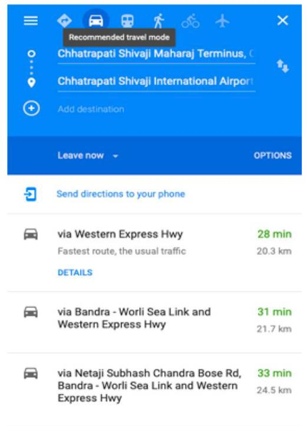
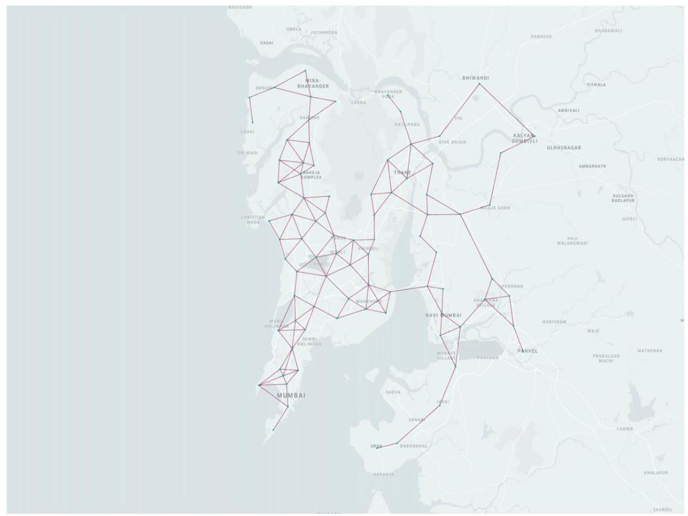
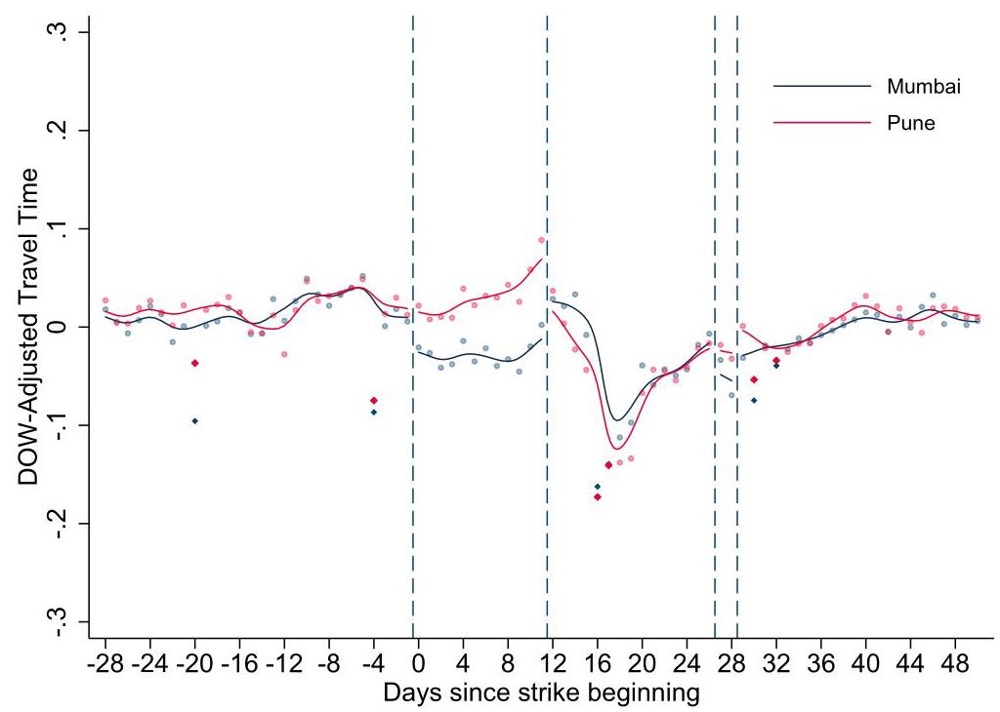
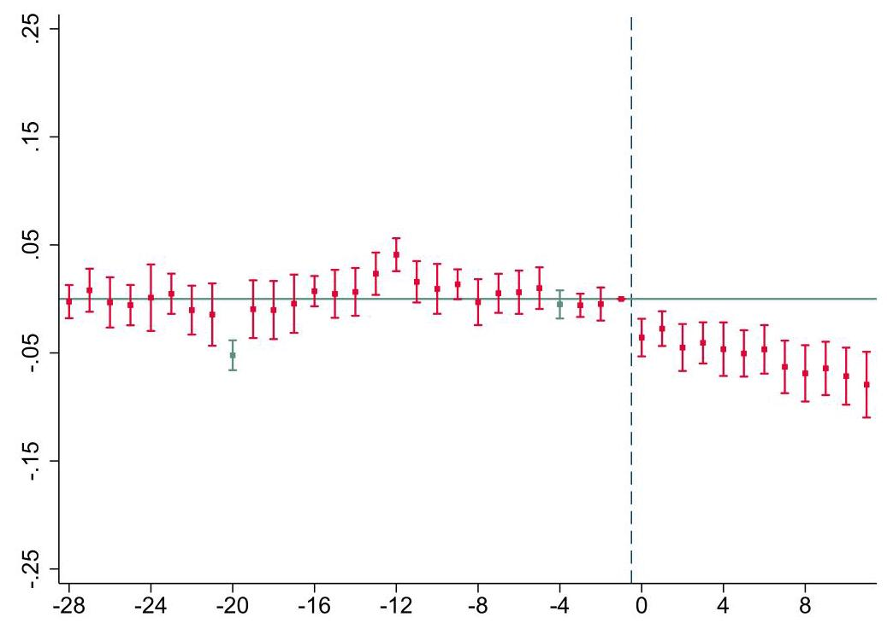
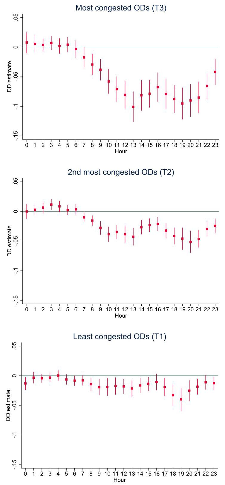
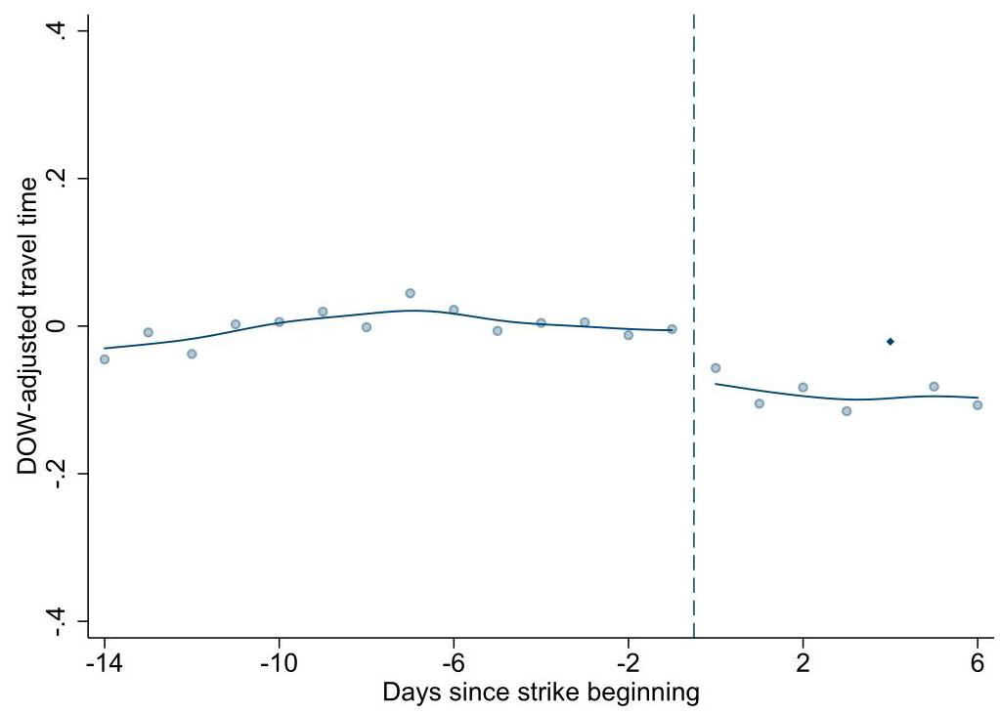
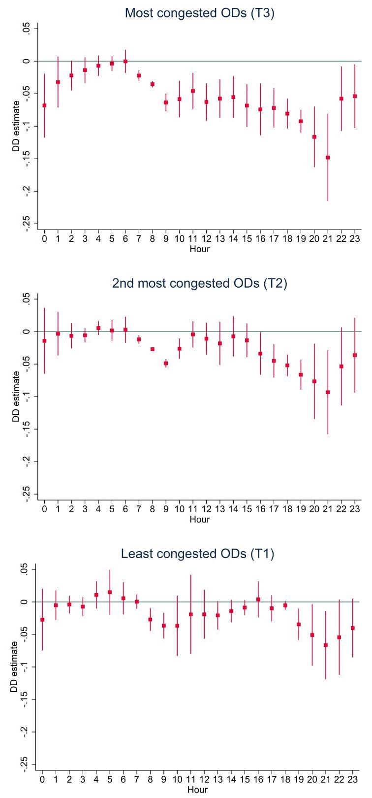
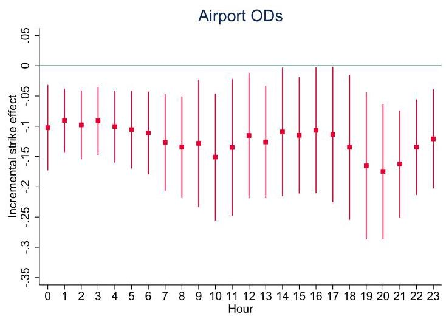
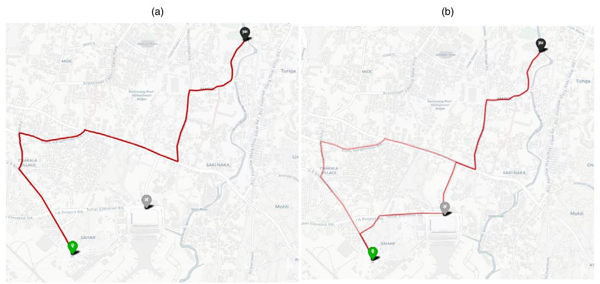
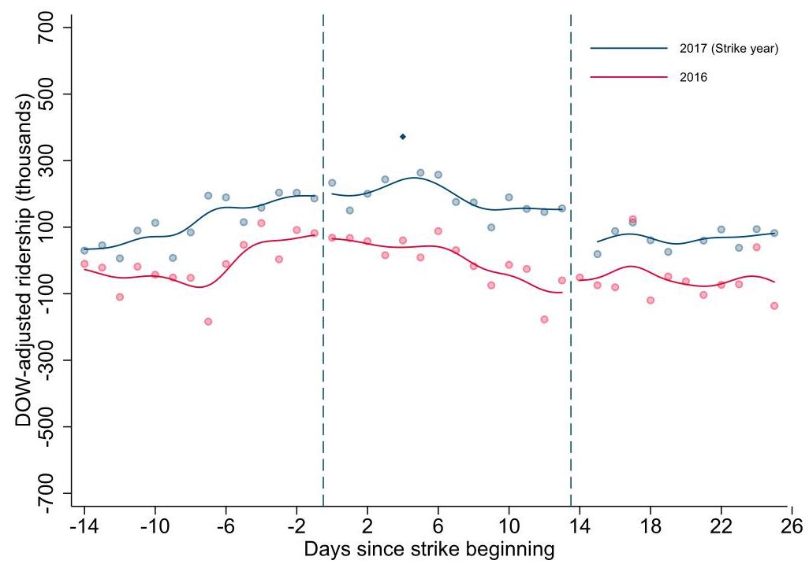

# The Impact of Ride-Hailing Services on Congestion: Evidence from Indian Cities

Saharsh Agarwal, \( {}^{a, * } \) Deepa Mani, \( {}^{a} \) Rahul Telang \( {}^{b} \)

\( {}^{a} \) Indian School of Business, Hyderabad, Telangana 500111, India; \( {}^{b} \) Heinz College, Carnegie Mellon University, Pittsburgh, Pennsylvania 15213 *Corresponding author

Contact: saharsh.ag21@gmail.com, https://orcid.org/0000-0002-4767-8930 (SA); deepa_mani@isb.edu, D https://orcid.org/0000-0002-2458-6961 (DM); rtelang@andrew.cmu.edu, D https://orcid.org/0000-0002-9353-7661 (RT)

---

Received: November 22, 2021

Revised: April 24, 2022; August 21, 2022

Accepted: September 9, 2022

Published Online in Articles in Advance: January 9, 2023

https://doi.org/10.1287/msom.2022.1158

Copyright: © 2023 INFORMS

---

Abstract. Problem definition: Early research has documented significant growth in ride-hailing services worldwide and allied benefits. However, growing evidence of their negative externalities is leading to significant policy scrutiny. Despite demonstrated socioeconomic benefits and consumer surplus worth billions of dollars, cities are choosing to curb these services in a bid to mitigate first order urban mobility problems. Existing studies on the congestion effects of ride-hailing are limited, report mixed evidence, and exclusively focus on the United States, where the supply consists primarily of part-time drivers. Methodology/results: We study how the absence of ride-hailing services affects congestion levels in three major cities in India, a market where most ride-hailing drivers participate full time. Using rich real-time traffic and route trajectory data from Google Maps, we show that in, all three cities, periods of ride-hailing unavailability due to driver strikes see a discernible drop in travel time. The effects are largest for the most congested regions during the busiest hours, which see 10.1%-14.8% reduction in travel times. Additionally, we provide suggestive evidence for some of the mechanisms behind the observed effects, including deadheading elimination, substitution with public transit, and opening up of shorter alternative routes. Managerial implications: These results suggest that despite their paltry modal share, ride-hailing vehicles are substituting more sustainable means of transport and are contributing significantly to congestion in the cities studied. The reported effect sizes quantify the maximum travel time gains that can be expected on curbing them.

---

Funding: This work was supported by the Srini Raju Center for Information Technology and the Networked Economy at Indian School of Business.

Supplemental Material: The online appendix is available at https://doi.org/10.1287/msom.2022.1158.

---

Keywords: ride-hailing \( \bullet \) externality \( \bullet \) ride-sharing \( \bullet \) ridesourcing \( \bullet \) transportation \( \bullet \) congestion \( \bullet \) sharing economy \( \bullet \) traffic \( \bullet \) Uber \( \bullet \) Ola

## 1. Introduction

In recent years, the growth of app-based ride-hailing services has visibly transformed the urban transportation landscape around the world. Banking on technology-enabled innovations such as dynamic pricing, efficient matching, and pooling of rides, ride-hailing services have promised to be an ally in the push toward sustainable mobility. A large stream of work has documented various positive socioeconomic effects of these services, such as the provision of opportunities for flexible work (Chen et al. 2019), improvement of service quality (Wallsten 2015, Athey et al. 2018), and reduction of driver moral hazard (Liu et al. 2021).

Despite these promises and demonstrated benefits, diverse governments around the world are adopting a conservative stance on these platforms and are looking to regulate them for their purported role in worsening urban congestion. For instance, New York recently became the first U.S. city to freeze new license registrations for ride-hailing, whereas ride-hailing congestion pricing plans have been passed in Seattle, Chicago, and New York City. These developments have led to a growing interest in examining the externalities and sustainability issues related to these services (Benjaafar and Hu 2020, Yu et al. 2020, Benjaafar et al. 2022). Yet, there is limited causal evidence on the relationship between ride-hailing and congestion, driven by paucity of data and identification challenges. Existing studies report contrasting findings and exclusively examine effects in the United States. Recognizing the current regulatory climate, our study examines the impact of ride-hailing services on congestion in three major Indian cities, with a particular focus on spatial and temporal heterogeneity in effects. Specifically, we provide reliable measures of the maximum travel time gains to be expected from curbing these services that can be weighed against allied welfare losses.

Existing research points to countervailing impacts of ride-hailing services on congestion. One class of studies has highlighted that these services can reduce congestion by (1) improving the utilization of transport infrastructure through demand pooling (Agatz et al. 2012, Alonso-Mora et al. 2017), (2) acting as a complement to public transit systems (Feigon and Murphy 2016, Hall et al. 2018), and (3) reducing private vehicle ownership (Hampshire et al. 2017). \( {}^{1} \) Backed by early optimism, ride-hailing services have enjoyed largely unchecked growth, even in cities that are very strict in regulating incumbent taxi services (e.g., New York City). However, recent studies paint a less sanguine picture by showing that ride-hailing services may be (1) adding vacant vehicle miles, commonly referred to as "deadheading" (Cramer and Krueger 2016, Schaller 2017, Henao and Marshall 2019), (2) substituting more efficient means of public transport (Rayle et al. 2016, Clewlow and Mishra 2017, Lavieri et al. 2018, Babar and Burtch 2020) and (3) inducing trips that would otherwise never have been made (Rayle et al. 2016, Clewlow and Mishra 2017, Tirachini and Gomez-Lobo 2020). This theoretical ambiguity renders the estimation of the congestion impact of ride-hailing an empirical question.

We study how ride-hailing services affect congestion using exogenous service disruptions, using an identification strategy similar to Anderson (2014). For three different time intervals in major Indian cities (Mumbai, New Delhi, and Bangalore), spread over a period of 1.5 years, drivers of Uber and Ola, the largest ride-hailing platforms in the country, went on a strike demanding better pay. Based on data availability, we use either (1) a difference-in-differences (DD) approach, by comparing the change in congestion levels in affected cities to either a control city that was not subject to the strike (for Mumbai), or similar dates from the next year (for Bangalore), or (2) a regression discontinuity style pre-post comparison, comparing the change in congestion during the strike relative to the prestrike period (for Delhi). We measure congestion using real-time, high-frequency travel time data for a set of fixed origin-destination pairs from Google Maps. In all three cities, we find that travel times were consistently lower during the periods of the strikes. On average, the reductions were highest for the most congested regions during peak hours, which are likely to witness maximum ride-hailing activity on a usual day. These results emphasize that ride-hailing services are contributing significantly to congestion in the cities studied and the effect sizes in our analyses quantify maximum travel time gains that can be expected in the long run on curbing them. Simple back-of-the-envelope calculations suggest that the lower congestion during periods of ride-hailing absence translated to Rs. 113 million to 154 million (USD 1.4 to 2 million) per day in terms of the value of time saved.

Although our data do not allow us to uncover all the mechanisms underlying the observed congestion effects, we provide suggestive evidence for the role of deadheading elimination, public transit substitution, and opening up of shorter routes. Specifically, we find congestion reduction to be significantly higher along airport routes, even during late night hours when public transit is not available. Given that trips to/ from the airport are less likely to be cancelled or shifted to nonmotorized modes, this suggests that the drop in congestion in these routes may have been driven by the elimination of empty ride-hailing vehicles deadheading near the airport. Using a panel of daily station-level data for ridership in rapid transit (Delhi Metro), we also find evidence for substitution with public transit during the period of disruption in the city of Delhi. \( {}^{2} \) Additionally, we find that ride-hailing induced congestion may have been leading people to take longer routes that avoided congested street segments. This is a novel insight that has not been identified previously and suggests the need to be cautious in approaching this question using speed-based measures, as is common in the literature. Studies that are based on speed data are likely to underestimate the true effect of ride-hailing services on travel times if they induce people to take longer alternative routes that put a smaller (or no) penalty on speed.

These results provide the most reliable measures yet of the causal relationship between ride-hailing and urban congestion and are especially valuable because of being based on an important context that is not only vastly understudied but is also very different in the organization of these services. The supply of drivers in the United States, which has almost exclusively been the focus of existing empirical studies on this topic, consists primarily of part-time workers (Hall and Krueger 2018, Chen et al. 2019). In contrast, high ownership costs coupled with regulatory barriers have led most Uber and Ola drivers in India to participate full time on these platforms (see Karnik (2017) for a detailed discussion). \( {}^{3} \) As shown in Benjaafar et al. (2022), this difference is likely to have implications for how these services affect congestion. As it becomes costlier to participate on these platforms, supply tends to shift primarily toward full-time drivers who operate empty even when demand is limited and thus increase deadheading miles. With the caveat that an apples-to-apples comparison is infeasible, we do find effects that are higher than those in existing studies (Tarduno 2021) along with indicative evidence of deadheading in ride-hailing hubs, lending support to the predictions in Benjaafar et al. (2022).

This paper also contributes to the growing literature on the societal impacts of sharing economy platforms more broadly (Burtch et al. 2018, Benjaafar and Hu 2020). With a growing chorus to regulate platforms such as Craigslist, Airbnb, and Uber (Malhotra and Van Alstyne 2014), the need to measure the externalities associated with these services becomes paramount, and this paper takes a step in that direction. Platforms such as Uber and Airbnb are proliferating around the world, yet we know little about their impact in ascendant economies. Given that India is the largest market for Uber outside the United States (Bhatia 2016), sees some of the worst congestion in the world, and has a complete nonavailability of publicly available traffic data or travel surveys (such as the National Household Travel Survey in the United States), this contribution is nontrivial.

The rest of this paper is organized as follows. We present a brief literature review in Section 2. In Section 3, we describe the empirical setting. Section 4 describes the data, and Section 5 discusses the analyses of congestion effects separately for each city. In the interest of brevity, the Bangalore results have been described only briefly in the main text. A more detailed exposition can be found in the online appendix. In Section 6, we provide suggestive evidence of deadheading elimination, opening up of shorter routes, and public transit substitution. Section 7 contains discussions on the observed effect size, concerns related to internal and external validity, and long-term outcomes. Section 8 concludes with implications for policy.

## 2. Related Literature

This paper contributes to two prominent streams of literature.

### 2.1. Ride-Hailing and Urban Mobility

Ride-hailing services have revolutionized urban mobility with various technological innovations that have attracted significant interest from researchers in operations management (OM) and related disciples (Benjaafar and Hu 2021). A large body of work has examined issues related to dynamic pricing (Cachon et al. 2017, Bimpikis et al. 2019, Guda and Subramanian 2019, Bai et al. 2019, Bernstein et al. 2021, Besbes et al. 2021), sharing of rides (Agatz et al. 2012, Alonso-Mora et al. 2017), and efficient matching of supply and demand (Akbar-pour et al. 2020, Feng et al. 2021), making ride-hailing arguably the most studied sharing economy application.

In response to the policy debate surrounding ride-hailing, a nascent stream of research in OM has emerged that deals with regulatory and sustainability issues related to these services. It is this stream of work that we contribute to most directly. In their survey of the ride-hailing literature in OM, Benjaafar and Hu (2020, p. 96) note that "Several large cities have raised concerns about the impact of growth in ride-hailing services on congestion and pollution.... This raises important research questions regarding the extent to which growth in on-demand services harms or benefits workers, customers, and the environment." However, researchers in OM have mostly broached this topic theoretically, with limited empirical investigations. Using a stylized model, Yu et al. (2020) show that in the absence of government intervention, ride-hailing services can drive out incumbent taxis from the market; moderate forms of regulation cannot only help the taxi industry to survive, but also enhance total social welfare. In a work that's closely related to ours, Benjaafar et al. (2022) theoretically examine the conditions that are likely to moderate the relationship between ride-hailing and congestion. They find that the relationship between ride-hailing and car-ownership/congestion would depend on how ride-hailing supply is organized (part-time/full-time workers). Our results thus add to this literature by reporting measures of ride-hailing congestion externality from a setting that is not just vastly different in terms of culture and geography, but also in the organization of ride-hailing. This contribution is also relevant given the growing calls for empirical research in the OM community (Fisher et al. 2020, Terwiesch et al. 2020).

A large body of interdisciplinary empirical work has sought to understand the impact of ride-hailing services on various aspects of urban mobility. \( {}^{4} \) As noted in Section 1, several works have highlighted individual mechanisms (e.g., relationship with public transit and deadheading) via which ride-hailing may be affecting mobility, but relatively few have examined congestion effects directly, and those that do report contrasting findings (Li et al. 2016, Erhardt et al. 2019, Diao et al. 2021, Tarduno 2021). This is mainly due to the challenges involved in finding granular traffic data, in isolating the causal effect of ride-hailing services in complex transport networks, and in explaining mechanisms behind observed effects. As noted in Section 1, these works do not account for rerouting behavior induced by ride-hailing driven congestion, which is a novel contribution of this work.

Li et al. (2016) and Diao et al. (2021) leverage the staggered entry of Uber across Metropolitan areas in the United States and Metropolitan Statistical Area-month level congestion measures to find that ride-hailing vehicles have reduced/increased congestion in the United States, respectively. As we show later in the paper, aggregating at the city level itself significantly understates the congestion effect of ride-hailing vehicles, and thus aggregating at an even higher level may obscure the true impact of these services. Additionally, the aggregate metrics are likely to obscure any within-day heterogeneity in effects. Given that most congestion-relief measures tend to be applied locally and during peak hours, it is important to reassess this question using granular measures. The causal identification in these papers is also heavily dependent on the assumption of entry exogeneity, and the results may be biased if the entry decisions of these companies are based on omitted variables that are correlated with congestion.

Comparing speed levels in San Francisco in 2016 to a counterfactual simulated using a traffic prediction model, Erhardt et al. (2019) find that ride-hailing vehicles have contributed to increased congestion in the city. The results of this paper depend heavily on the ability of the traffic model (calibrated in 2010) to account for all confounding changes over a long period time. Given the complex, intricate, and uncertain nature of evolution of urban traffic networks, it is worthwhile to revisit this question in a vastly different context, using a natural experiment design. This paper also highlights the difficulties involved in maintaining external validity while approaching this question using granular traffic metrics. The granular measures used in Erhardt et al. (2019) circumvent the data limitations of Li et al. (2016) and Diao et al. (2021), but it is unclear how their results generalize outside the city studied. The unique setting in our paper, where we report results from three of the biggest cities in India, strikes a balance between data granularity and external validity, providing confidence in the reported estimates.

Another related work is by Tarduno (2021), who finds that the exit of Uber and Lyft from Austin in 2016 led to modest congestion reduction in the city. This work is based on speed data from roadside blue-tooth sensors. Besides the difference in context and the magnitude of reported effects, our study improves on this paper in several ways. First, the traffic data used in Tarduno (2021) covers a relatively small road length in the city ( \( \sim  {72}\mathrm{\;{km}} \) ). In comparison, our data from Mumbai covers about 1,650 km even though Mumbai is a significantly smaller city. This allows us to get a more representative measure of ride-hailing's effect in the city and lets us examine rich within-city heterogeneity in effects, which is important because most congestion-relief measures tend to be applied locally. Second, our data allows us to also comment on some of the mechanisms behind the observed effects such as distance reduction, deadheading elimination, and public transit substitution. Third, providing estimates from three different cities enhances the external validity of our findings. The fact that we find similar effects for three major Indian cities for periods of ride-hailing unavailability at different points in time suggests that our results are likely to replicate qualitatively for cities that are similar. Finally, Google Maps travel time estimates are known to be highly precise (Hanna et al. 2017, Akbar and Duranton 2018, Kreindler 2018), whereas bluetooth sensor data are prone to be noisy (e.g., bias due to pedestrians using bluetooth phones), and their accuracy is yet unknown.

Additionally, all these studies report effects from 2016 or before. In contrast, our analyses are based on data until the end of 2018, which enhances the relevance of our results, given the breakneck growth of ride-hailing services and the recency of the regulatory debate.

### 2.2. Societal Impacts of Sharing Economy Platforms

The dramatic growth of sharing economy platforms such as Uber, Airbnb, and TaskRabbit has significantly disrupted many industries. A large stream of literature has examined the strategic interactions on these platforms and their various societal impacts (Fraiberger and Sundararajan 2017, Benjaafar et al. 2019, Abhishek et al. 2021, Tian et al. 2021, Agarwal and Sen 2022).

Specific to ride-hailing services, studies have documented various positive effects such as the provision of alternatives to low-quality entrepreneurial activity (Burtch et al. 2018), provision of opportunities for flexible work (Chen et al. 2019), improvement of service quality (Wallsten 2015, Athey et al. 2018), reduction of driver moral hazard (Liu et al. 2021), and generation of significant consumer surplus (Cohen et al. 2016).

Yet, a prominent criticism of these platforms is that they provide an avenue to engage in "regulatory arbitrage" by circumventing regulations that apply to traditional firms (Malhotra and Van Alstyne 2014). With increasing anecdotal evidence of the externalities associated these platforms, there is a growing chorus for the need to monitor them and to regulate their growth (Benjaafar and Hu 2020). Major cities in the world are looking to curb ride-hailing services in a bid to improve congestion levels. Our study, in providing insights into the causal relationship between ride-hailing platforms and congestion, lends critical empirical support to this literature and seeks to help cities better account for these platforms in their policies. Additionally, there is a notable dearth of evidence from developing economies in the literature on platform impacts, and we hope to stimulate research in this direction.

## 3. Empirical Context

Ola and Uber dominate the Indian ride-hailing market, together accounting for 95% market share (Bhatta-charya 2018). Since their inception in the country in 2010 and 2013, respectively, both platforms have seen exponential growth. In an effort to increase supply and leverage network effects, Uber and Ola offered lucrative financial incentives to bring drivers on board. Early drivers reported making as much as 100,000 rupees a month. As a point of comparison, the average software engineer in the country makes around 32,000 rupees a month. Driven by prospects of an improved standard of living, drivers joined the platforms in large numbers, many of them quitting low-paying jobs and incurring debt to buy new vehicles (Gong et al. 2017). Around the latter half of 2016, driver earnings reduced significantly, as Ola and Uber reduced rates charged to passengers, as well as bonuses offered to drivers.

Distress from reduced earnings, loan defaults, and limited access to credit led Ola and Uber drivers to go on a strike in New Delhi in February 2017. This was followed immediately by another strike in Bangalore. The last reported strike took place in Mumbai in October 2018, the analysis of which constitutes the central result of our study. We also report results from the strikes in Delhi and Bangalore, which took place in February 2017, and find similar effects.

## 4. Data

We source traffic data using the Distance Matrix Application Programming Interface provided by Goo-gle Maps. Google uses a proprietary algorithm that depends on historical records and live crowdsourced traffic data to provide real-time travel time predictions between any origin-destination pair (Figure 1). For each city, we fetch both the distance and the predicted travel time for the fastest route between a set of fixed origin-destination pairs (OD pair or OD, henceforth) throughout the day for many months.

#### 4.1.OD Selection

The travel time data for Delhi and Bangalore are the same as the ones used in Kreindler (2016) and Kreindler (2018), respectively, and were sourced from the author. We collected data for Mumbai (Figure 2) and Pune ourselves and selected OD pairs based on the same guiding principles, which we describe here.

Figure 1. (Color online) Google Maps User Interface

Note. We provide the travel time and distance corresponding to the fastest route (28 minutes and \( {20.3}\mathrm{\;{km}} \) in this case).

Ideally, we would have liked to place a large number of randomly selected endpoints in each city and choose all permutations of these as OD pairs for travel time data collection. However, this approach has some practical difficulties. First, these data are costly to collect. Because our aim was to collect data over a large period of time and at a high frequency, we had to limit the number of OD pairs. Second, randomly chosen endpoints would very frequently fall in locations that are not road segments (e.g., a water body, sanctuary, amusement park).

To circumvent these, we manually chose endpoints, with a view to getting coverage across the city. For instance, the city of Mumbai has areas like Dadar, Juhu, Andheri, Bandra, and so on, and the endpoints were placed to ensure that we have representation from all of them. We placed more endpoints in the busier, more central regions of the city and less in the outskirts. Similarly, we chose more OD pairs between the endpoints in the busier areas of the city compared with the outskirts to adequately capture the variations. Although some endpoints were placed next to important junctions and bus stops, the exact location for the majority of them was arbitrary. We also chose fewer ODs in Pune (136) compared with Mumbai (298) because it is a smaller city. The number of OD pairs were roughly chosen based on our research budget. The exact numbers were arbitrary. After manually choosing OD pairs by drawing line segments through the endpoints, we stopped when it seemed like we had covered the entire city.

### 4.2. Validity of Google Maps Estimates

Our measure of congestion is the estimated travel time (in seconds), defined at the date-time-OD level. Google Maps computes travel time estimates using historical records and real-time GPS traces from smartphone users. The algorithm behind the estimates is not publicly known, but the estimates are known to be highly accurate, with billions of users around the world relying on them for their mobility needs. Akbar et al. (2018) establish the validity of these measures for a large number of Indian cities (including some very small cities) by comparing the estimates to actual trip data collected using a mobile app. The use of historical records to generate travel time predictions may raise concerns that the estimates may not accurately reflect the effect of anomalous events. However, as described in Akbar et al. (2018) and confirmed in our analysis, the estimates are very extremely responsive to ad hoc disruptions. It is also important to note that failure to reflect sudden disruptions would have only biased the data against finding an effect during ride-hailing strikes.

Figure 2. (Color online) Mumbai: Map of OD Pairs

Notes. This figure shows the set of OD pairs in Mumbai for which we collect travel time data from Google Maps. There are 149 origin-destination combinations, which were queried in both directions, giving 298 unique ODs. The routes are shown as straight lines for ease of representation.

### 4.3. Defining OD Segments

We expect significant spatial and temporal heterogeneity in the effects because ride-hailing drivers tend to cluster in the busiest regions of a city and during peak hours (Feigon and Murphy 2016, Clewlow and Mishra 2017, Cooper et al. 2018, Erhardt et al. 2019). In the absence of trip logs, it is not possible to precisely rank the ODs according to the usual level of activity of Uber and Ola vehicles. Instead, we work at the aggregate level, by grouping the ODs in each city into ter-ciles, based on congestion levels in the prestrike period (postperiod in the case of Bangalore due to lack of sufficient preperiod data). Estimated travel time in itself is not comparable across ODs because a higher travel time may reflect more congestion or longer distance between the endpoints. To facilitate comparison for the creation of terciles, we normalize each estimated travel time observation by the free-flow travel time for the same OD. Following Erhardt et al. (2019), free-flow travel time is computed at the OD level by taking its minimum travel time in the entire data, including holidays and late-night hours. This normalized measure represents the factor by which the estimated travel time under live traffic exceeds the free-flow travel time and is thus comparable across ODs. Next, we split the ODs in each city into terciles, based on average normalized travel time between 8 a.m. and 11 p.m., excluding holidays. We refer to the highest congestion tercile as T3, the middle tercile as T2, and the lowest tercile as T1. We expect that ODs in T3 will see the highest impact of ride-hailing services, followed by T2 and T1. Within each tercile, we expect a higher impact for the busier hours of the day. The T3 effects are likely to be the most policy relevant, not only because of their having high ride-hailing activity but also because congestion relief policies tend to target the busiest areas of a city. Thus, after listing the average effects in each city, we study the heterogeneity in impact by OD tercile and hour, with a particular focus on the T3 ODs. Free-flow normalization was only done for the creation of terciles (to enable comparison across ODs). The reported regression estimates simply use the log of (raw) travel time as the dependent variable, without the free flow normalization.

Summary statistics for each city along with details of missing observations and exclusions are provided in Table 1.

Table 1. Summary Statistics

<table><tr><td>Variable</td><td>Observations</td><td>Mean</td><td>Standard deviation</td><td>Important dates</td><td>Missing observations/ exclusions</td></tr><tr><td colspan="6">Panel A: Mumbai (298 ODs)</td></tr><tr><td></td><td></td><td></td><td></td><td>Strikes: October 22 to November 2, 2018, and November 18 to 19, 2018</td><td rowspan="5">330 missing in travel time data</td></tr><tr><td>Distance (km)</td><td>941,350</td><td>5.55</td><td>2.29</td><td></td></tr><tr><td>Travel time (s)</td><td>941,350</td><td>991.59</td><td>412.48</td><td>Travel time data: September 22 to December 11,</td></tr><tr><td>Strike</td><td>941,350</td><td>0.15</td><td>0.36</td><td>2018</td></tr><tr><td>Holiday</td><td>941,350</td><td>0.08</td><td>0.26</td><td>GPS data: December 4, 2018, to September 13, 2019</td></tr><tr><td colspan="6">Panel B: Pune (136 ODs)</td></tr><tr><td>Distance (km)</td><td>429,616</td><td>5.09</td><td>1.99</td><td></td><td>44 missing in travel time data</td></tr><tr><td>Travel time (s)</td><td>429,616</td><td>766.57</td><td>287.91</td><td>Travel time data: September 24 to December 11, 2018</td><td></td></tr><tr><td>Strike</td><td>429,616</td><td>0.15</td><td>0.36</td><td></td><td></td></tr><tr><td>Holiday</td><td>429,616</td><td>0.08</td><td>0.26</td><td></td><td></td></tr><tr><td colspan="6">Panel C: Delhi (150 ODs)</td></tr><tr><td>Distance (km)</td><td>4,172,517</td><td>6.81</td><td>2.43</td><td>Strike: February 10 to February 23, 2017</td><td>428,283 missing in travel time</td></tr><tr><td>Travel time (s)</td><td>4,172,517</td><td>916.37</td><td>417.48</td><td>Travel time data: December 18, 2015 to February 16, 2017</td><td>data. 10,800 excluded due to   Kalindi Kunj gridlock.</td></tr><tr><td>Strike</td><td>4,172,517</td><td>0.02</td><td>0.12</td><td>Metro data: January 1 to March 31, 2016 and 2017</td><td></td></tr><tr><td>Holiday</td><td>4,172,517</td><td>0.05</td><td>0.22</td><td></td><td></td></tr><tr><td colspan="6">Panel D: Bangalore (178 ODs)</td></tr><tr><td>Distance (km)</td><td>4,770,283</td><td>2.87</td><td>1.35</td><td>Strike: February 22 to March 2, 2018</td><td rowspan="4">174,018 missing in travel time data. 2,675 outliers excluded (mean speed of 4,188 km/hr).</td></tr><tr><td>Travel time (s)</td><td>4,770,283</td><td>436.78</td><td>280.50</td><td>Travel time data: February 21, 2017, to March 13, 2018</td></tr><tr><td>Strike</td><td>4,770,283</td><td>0.02</td><td>0.15</td><td></td></tr><tr><td>Holiday</td><td>4,770,283</td><td>0.06</td><td>0.24</td><td></td></tr></table>

Notes. For each city, the summary statistics are computed using the entire data available to us, except the exclusions mentioned. For Delhi and Bangalore, most of the missing observations from the travel time data (99.9% and 98.5%, respectively) happen to be outside the periods which were used in the main analysis. These were mainly due to code or API errors which broke the script for multiple hours or days.

## 5. Analysis: Congestion Effects

### 5.1. Mumbai

Mumbai is one of the most populous cities in the country, with a population of more than 22 million. Not surprisingly, traffic congestion is a significant scourge of the city. Figure A1 in the online appendix shows that the average travel time during weekday evening peak hours in the sample period was around 2.2 times the free-flow travel time (translating to an average speed of less than 9 mph), which is clearly very slow.

Drivers of Ola and Uber went on an indefinite strike beginning the afternoon of October 22, 2018, citing falling pay. Because ride-hailing platforms do not treat the drivers as employees, there are not any formal employee unions, leading to significant logistical challenges involved in coordinating a successful protest at this scale. A section of drivers had met on October 20 and decided to peacefully protest outside the offices of Uber and Ola on October 22. Although drivers in the meeting on October 20 were in favor of a strike, it was decided to chart out the course of action depending on the proceedings of the protest (Korde 2018). This is an important detail, as it suggests that anticipatory behavior was unlikely to have been present, at least on a large scale. An indefinite strike was then called on the afternoon of October 22, effective immediately \( {}^{5} \) ; noncom-pliers were dealt with force, leading to high compliance. \( {}^{6} \) The strike ultimately ended on November 2, 2018, after the transport minister's intervention (but with a warning by the drivers that they would resume in the absence of prompt action), yielding a total of 12 days of strike period (Mahamulkar and Sen, 2018). The developments were widely covered on popular and social media, and a large assortment of social media anecdotes indicate that traffic was faster during the strike. \( {}^{7} \) Citing unmet promises, drivers of Uber and Ola started another instance of the strike on November 18, lasting 2 days. \( {}^{8} \)

For a fixed set of 298 OD pairs (Figure 2), chosen to cover the entire city, we collect travel time data from Google Maps every half hour between 7 a.m. and 11 p.m. and hourly between 11 p.m. and 7 a.m. from September 24 to December 11, 2018. We have a nearly perfectly balanced panel; less than 0.04% of the possible observations are missing (driven by glitches such as API errors in the data collection process).

We report results from a DD specification by comparing the change in travel times during the strike in Mumbai to that in Pune, a neighboring city. To this end, we also collect travel time data for 136 ODs in Pune, covering the entire city, for the same period (see Figure A6 in the online appendix for a map of OD pairs). We choose Pune as a control because it is the closest city to Mumbai, is in the same state, observes the same set of holidays, and thus is likely to have similar fluctuations in traffic levels. To measure the average effect of the strike in Mumbai, we estimate the following DD specification after pooling the Mum-bai and Pune travel time data, using the log of estimated travel time as the dependent variable.

\[
{\text{ ln\_travel\_time }}_{{ci}\text{ wth }} = {\alpha }_{cw} + {\phi }_{h} + {\rho }_{i} + {\beta }_{t} + \gamma \left( {{Strik}{e}_{t}}\right.
\]

\[
\times  {\text{ Mumbai }}_{c}) + {\epsilon }_{\text{ ciwth }} \tag{1}
\]

Table 2. Mumbai DD Estimates: All OD Pairs and All Hours of the Day

<table><tr><td>Variables</td><td>ln_travel_time</td></tr><tr><td>Strike \( \times \) Mumbai</td><td>-0.033***   (0.004)</td></tr><tr><td>Constant</td><td>6.757***   (0.001)</td></tr><tr><td>Fixed effects</td><td>Date, city \( \times \) DOW,</td></tr><tr><td></td><td>OD, hour</td></tr><tr><td>Observations</td><td>659,244</td></tr><tr><td>Adjusted \( {R}^{2} \)</td><td>0.910</td></tr></table>

Notes. This table reports estimates of Equation (1) using data from all OD pairs and all hours of the day. The sample includes observations from September 24 to November 2, 2018 (strike and prestrike period). Holidays have been excluded. Unit of observation is OD \( \times \) date \( \times \) time. Robust SEs clustered at the OD and date level are in parentheses.

***p< 0.001; **p< 0.01; *p < 0.05.

Cities are indexed by \( c \) , OD pairs by \( i \) , day-of-week (DOW) by \( w \) , date by \( t \) , and time of day by \( h \) . Strike is an indicator that is set to one for all days during the strike period. Mumbai is set to one for all ODs in Mumbai; \( \alpha \) refers to city by DOW fixed effects, which accounts for the fact that the day-of-week effect is likely to vary by city; and \( \beta \) operationalizes the parallel trends assumption by capturing daily shocks that are common to Mumbai and Pune. The effect of interest is captured by \( \gamma \) , which represents the percentage change in mean travel time across ODs in Mumbai during the strike, relative to Pune. For the first instance of the strike, we report results using all observations from the strike and prestrike periods (September 24 to November 2). Following the suggestion of Cameron et al. (2011), we report standard errors (SEs) clustered two-way at the OD and date levels, which are robust to within-day and within-OD serial correlation. Table 2 shows that on average, travel times dropped by 3.3% in Mumbai as a result of ride-hailing service unavailability. To assuage concerns of nonrandom OD selection, we estimate this regression after randomly sampling 50 ODs. We repeat this procedure by bootstrapping 100 such random samples of 50 ODs in Mumbai. We find that the bootstrap estimates are roughly in the same ballpark as the reported effect in Table 2, suggesting that our results are not very sensitive to the choice of ODs. Figure A7 in the online appendix plots the distribution of the bootstrap estimates.

Figure 3 plots ln_travel_time for Mumbai and Pune, averaged by date across all hours of the day for ODs in T3. Because travel time across days are not comparable due to day-of-week effects, we adjust ln_travel_time by subtracting the mean ln_travel_time in the respective city for the same day-of-week computed using the entire data available to us, excluding holidays and strike days. The fluctuations in traffic levels are due to the occurrence of major festivals in the vicinity of the strike (Dussehra, day -4; Diwali, days 16 and 17), which emphasizes the importance of having a control city to weed out seasonal trends. Although we see some volatility in travel time due to these seasonal fluctuations, Pune tracks the Mumbai trend well, suggesting that it is a good control. The figure also reveals a large and sustained drop in congestion in Mumbai during the first strike, which is absent in Pune. It should be noted that the figure understates the drop because the strike was not in effect on the morning of the first day (day 0). The end of the strike coincides with an abrupt increase in congestion in Mumbai. The second strike also led to a reduction in congestion in Mumbai, providing supporting evidence for our causal claim. Regression estimates for the second strike yield qualitatively similar results and are provided in the online appendix (Table A1).

Next, Figure 4 shows the result of estimating the following event study specification for the first strike. The point estimates in this figure correspond exactly to the vertical difference between the Mumbai and Pune measures in Figure 3 (relative to the base week). This enables us to test the parallel trends assumption more formally while revealing the dynamics in the treatment effect over time.

\[
\text{ ln\_travel\_time }{}_{\text{ cith }} = {\phi }_{h} + {\rho }_{i} + {\beta }_{t} + \mathop{\sum }\limits_{{k =  - {28}}}^{{50}}{\gamma }_{k}\left( {\text{ Mumbai }}_{c}\right.
\]

\[
\times  1\left\lbrack  {t - e = k}\right\rbrack  ) + {\epsilon }_{ith} \tag{2}
\]

OD pairs are indexed by \( i \) , date by \( t \) , city by \( c \) , and time of day by \( h;\phi ,\rho \) , and \( \beta \) represent hour, OD, and date fixed effects, respectively. We demean ln_ travel_time by DOW separately for each city because it is not possible to use city by DOW fixed effects in this specification due to perfect collinearity with the interaction terms. Mumbai \( {}_{i} \) is an indicator that is turned on if OD \( i \) is in Mumbai. The variable \( e \) represents the date of the beginning of the first strike (October 22, 2018). The expression \( 1\left\lbrack  {t - e = k}\right\rbrack \) is an indicator that is set to one if date \( t \) is \( k \) days from the strike beginning; \( t \in  \left\lbrack  {e - {28}, e + {50}}\right\rbrack \) covers all the days from September 24 to December 11 2018, and \( {\gamma }_{k}\mathrm{\;s} \) are the coefficients of interest. We normalize \( {\gamma }_{-1} \) to zero so that all other \( {\gamma }_{k}\mathrm{\;s} \) represent the percentage difference between average travel time in Mumbai and Pune on day \( k \) relative to the difference on day -1 (the day preceding the strike) after accounting for DOW effects. The estimates of \( {\gamma }_{k}\mathrm{\;s} \) are shown in Figure 4.

Figure 3. (Color online) Mumbai: Pune Parallel Trends

Notes. This figure plots the daily average of ln_travel_time (demeaned to remove day of week effects) for the highest OD tercile in Mumbai and Pune, averaged over the entire day. Holidays are represented by diamond markers, and nonholidays by circular markers. The points correspond to average levels on each day. Curves correspond to different kernel regressions (Gaussian kernel, buy 1.2) computed for days before, during and after the strikes in each city. The first strike began on October 22 (day 0) and ended on November 2 (day 11). The next one started on November 18 (day 27) and ended the next day. The holidays are as follows: Gandhi Jayanti (day -20), Dussehra (day -4), Diwali (days 16 and 17), Id-E-Milad (day 30), and Guru Nanak Jayanti (day 32) and have been excluded from the computation of the regression curves.

Figure 4 provides clear evidence that the absence of ride-hailing vehicles led to a significant reduction in congestion in Mumbai. The beginning of the strike coincided with a drop in traffic levels, and as soon as the strike ended, this trend got reversed. There is no discernible pretreatment trend, suggesting that Pune is a good control for Mumbai, and a DD specification can help us isolate the causal effect of interest.

The DD estimates reported in Table 2 take into account all OD pairs in the city and all hours of the day, which is likely to mask considerable spatial and temporal heterogeneity in effects. As outlined earlier, we expect to see the greatest impact of the strike in the most congested ODs during peak hours. It is also possible that the strike may have led to a drop in traffic in some regions and times and an increase in others. This could happen, if, for instance, people redistributed travel patterns in the absence of ride-hailing services (e.g., leaving to/from work earlier), and if true, can significantly alter the policy implications. To investigate these, we estimate the strike effect separately by OD tercile for every hour of the day. Figure 5 plots the DD estimates from Equation (1) for each of these subgroups (we exclude hour fixed effects because each regression uses data from a specific hour of the day).

Row 1 of Figure 5 plots the main DD estimate \( \left( \gamma \right) \) for the T3 ODs across hours of the day; rows 2 and 3 plot the same for T2 and T1, respectively. As evident, there exists significant heterogeneity in the effects, with T3 seeing the largest reduction, followed by T2 and T1, respectively. Within each OD tercile, the morning and evening peak hours see the greatest reduction. For ODs in T3, the effect first appears around 7 a.m. and persists until 11 p.m., reaching a maximum of around 10% in the morning and evening hours. A 10% reduction in travel time means that a trip that would have ordinarily taken 60 minutes can now be completed in 54 minutes. The late-night hours see a negligible effect. T2 and T1 follow a similar pattern, with smaller magnitudes. The T2 ODs see a reduction in travel time by up to 5% and the T1 ODs see a maximum effect of 4%.

Overall, these results provide granular and reliable measurement of the maximum possible congestion-relief benefits of curbing ride-hailing services in Mumbai. Importantly, they also call for the need to be cautious when measuring the effect of ride-hailing using aggregate metrics. Aggregating at the city level itself significantly obscures the effect of ride-hailing (the average city-wide effect in Table 2 is about one-third the maximum effect), and thus, it may not be prudent to rely on macro traffic measures.

Figure 4. (Color online) Mumbai: Pune Event Study

Notes. This figure plots the estimates of \( {\gamma }_{k} \) s from Equation (2), which represent the percentage difference in DOW-adjusted travel time between Mumbai and Pune on day \( k \) , relative to the difference on day \( - 1\left( {\gamma }^{-1}\right. \) is normalized to zero). Bars represent 99% confidence intervals. SEs are clustered by OD and date. Days -20 and -4 were official holidays.

#### 5.2.New Delhi

New Delhi provides an ideal context for the assessment of traffic congestion policies. The hourly congestion trends in Delhi (Figure A2 in the online appendix) shows the poor traffic conditions, which reveal a distinct lack of off-peak hours during the daytime. This corroborates public perception and the findings of the Center for Science and Environment, which reported that Delhi sees more than 12 hours of "peak hour traffic" (CSE 2017).

On February 10, 2017, drivers of Uber and Ola went on a strike in the city, demanding better pay. \( {}^{9} \) The strike was called off officially nearly two weeks later on February 23, although multiple reports suggest that the strike had lost effectiveness toward the end, with the last four days seeing business as usual. \( {}^{10} \) We obtain travel time data for 150 ODs (shown in Figure A4 in the online appendix) in the city at 20-minute intervals for the period of December 18, 2015, to February 16, 2017. Unfortunately, we do not have travel time data for the last few days of the strike and the period after. \( {}^{11} \) We also do not have GPS trace data of the recommended routes for Delhi. On November 14, 2017, there was a major traffic disruption when a truck broke down at the Kalindi Kunj bridge, leading to bumper-to-bumper traffic for more than 10 hours. \( {}^{12} \) Spillover effects were felt in far reaching areas, and the metro saw a huge spike in ridership (Figure 10). We exclude this date from the analysis to avoid spurious effects, leaving us with six days of data during the strike period.

Unlike Mumbai, the strike in Delhi happened to occur in a stable period, without official holidays and other cultural festivals. Thus, we feel more confident that seasonal effects are unimportant, and we can recover the impact of the strike by comparing the congestion levels during the disruption to the period just before it. We estimate the following regression using data from the strike and the two weeks preceding it (January 27 to February 16, 2017).

\[
\text{ ln\_travel\_time }{}_{iwth} = {\phi }_{h} + {\rho }_{i} + {\alpha }_{w} + \delta {x}_{t} + {\gamma S}\text{ trik }{e}_{t} + {\epsilon }_{iwth}
\]

(3)

The variables \( \phi ,\rho \) , and \( \alpha \) represent hour, OD, and DOW fixed effects, respectively. Strike is a dummy that is set to one for all observations in the strike period; \( x \) represents the number of days relative to the beginning of the strike ( \( x = 0 \) for February 10,2017), and thus \( \delta \) is a linear time trend, which controls for any linear trend in travel times, which could have led to a difference in travel times even in the absence of the strike. SEs are clustered at the OD and date level. Table 3 lists the regression results for all OD pairs in Delhi across all hours of the day, suggesting that the strike in Delhi saw a drop in congestion by 3.3% on average, similar to the effect observed in Mumbai.

Figure 5. (Color online) Mumbai DD Estimates: Spatial and Temporal Heterogeneity in Effects

Notes. This figure reports estimates of \( \gamma \) from Equation (1) by OD tercile-hour. The first row plots the effects for T3; the middle and last rows plot the same for T2 and T1, respectively. The sample includes observations from September 24 to November 2, 2018. Holidays have been excluded. Bars represent 95% confidence intervals, with standard errors clustered at the OD and date level.

Given that the strike occurred in a stable period, without any festivals and holidays, we can be confident that the results are not driven by seasonal fluctuations (Figure 6). Nonetheless, we carry out two additional falsification tests. First, we repeat the estimation using observations for the same date from the previous year. If our results are driven by unobserved seasonal events that repeat each year (such as school holidays, annual fairs, etc.) then we should see a similar effect in 2016. Table A2 in the online appendix confirms that there was no such drop in the previous year. Second, to ensure that the drop in congestion during the strike was not a chance occurrence, we run a random treatment or shuffle test in the spirit of Burtch et al. (2018) and Greenwood and Wattal (2017). We randomly select a set of 100 21-day periods in the preceding one year and code a pseudo or "placebo" strike on the last week for each of these to mimic the sample used in the main analysis. We then estimate regression 3 for each of these randomly chosen periods and collect the coefficients of Strike. The results are summarized in Table A3 in the online appendix, which confirm that the estimated random treatment effect is not significantly different from zero.

Table 3. Delhi Estimates: All OD Pairs and All Hours of the Day

<table><tr><td>Variables</td><td>ln_travel_time</td></tr><tr><td>\( x \)</td><td>-0.000   (0.001)</td></tr><tr><td>Strike</td><td>-0.033***</td></tr><tr><td></td><td>(0.007)</td></tr><tr><td>Constant</td><td>6.710***</td></tr><tr><td></td><td>(0.005)</td></tr><tr><td>Fixed effects</td><td>DOW, OD, hour</td></tr><tr><td>Observations</td><td>215,486</td></tr><tr><td>Adjusted \( {R}^{2} \)</td><td>0.896</td></tr></table>

Notes. This table reports estimates of Equation (3) using data from all OD pairs and all hours of the day. The sample is restricted to January 27 to February 16, 2017. The day of Kalindi Kunj Gridlock (February 14,2017) has been excluded. Unit of observation is \( \mathrm{{OD}} \times \) date \( \times \) time. Robust SE clustered at OD and, date level is in parentheses.

***p<0.001;**p<0.01;*p<0.05.

Next, we examine the spatial and temporal heterogeneity in effects. Consistent with expectations, Figure 7 shows that OD pairs in T3 saw the greatest impact, followed by T2 and T1. For T3, the effect appears around 7 a.m. in the morning and persists until 3 a.m. Unlike Mumbai, the effects during the daytime are at least as large as during the morning hours. The absence of ride-hailing led to a decrease in travel times by more than 7% during the day (2 p.m. to 4 p.m.), suggesting that the erosion of off-peak hours in Delhi can be attributed to some degree to Uber and Ola vehicles. The effects are also more pronounced in the evening, unlike Mumbai, which saw a nearly symmetric effect during the morning and evening hours. The maximum effect occurs at 9 p.m.: a reduction in travel times by 14.8%. T2 and T1 follow a similar pattern, but with smaller magnitudes (maximum reduction of 9.3% and 6.6%, respectively) and with the exception that there are peaks in the morning and evening and no impact late in the night.

Figure 6. (Color online) Delhi 2017 Congestion Trends

Notes. This figure plots the daily average of ln_travel_time (demeaned to remove DOW effects) for ODs in the highest congestion tercile in Delhi. The circles correspond to actual levels on each day. Curves correspond to different kernel regressions (Gaussian kernel, buw 1.2) computed for days before and during the strike dates in each year. The strike began on February 10 (day 0) and ended on February 23, 2017, but we have data only until February 16 (day 6). The day of the Kalindi Kunj gridlock (day 4 in the 2017 series) is marked with a diamond and has been excluded from the computation of the regression curve.

### 5.3. Bangalore

The analysis and the results for Bangalore closely parallel those of Mumbai. In the interest of brevity, the details of the setting, analysis, and results for this city are provided in the online appendix.

## 6. Suggestive Mechanisms

In this section, we provide indicative evidence of potential mechanisms underlying the observed reduction in travel times after the removal of ride-hailing services. These mechanisms include elimination of deadheading, opening up of shorter routes between points, and substitution of displaced ride-hailing trips with high occupancy public transit.

### 6.1. Effect in the Airport Region: Possible Role of Deadheading

A reduction in congestion due to ride-hailing absence can be attributed to a combination of dead-heading removal, modal substitution with high occupancy transit/nonmotorized modes, and trip cancellations. According to the framework of Benjaafar et al. (2022), in a regime with high ownership cost (such as India), ride-hailing supply will be provided primarily by fulltime participants, which is likely to add significantly to deadheading congestion. To provide suggestive evidence for deadheading, we analyze traffic close to the Mumbai airport, where we can rule out the other mechanisms with weak assumptions. We begin with the observation that most people would likely not stop flying to and from the city just because ride-hailing services are not operational. Furthermore, it is reasonable to assume that airport trips would not move to nonmotorized modes due to the unavailability of ride-hailing services. \( {}^{13} \) However, the degree of substitution of ride-hailing with public transit during certain time periods such as late night hours is infeasible. In such case, significant reduction in congestion during these time periods (when public transit services are not available) would suggest that at least as far as the airport routes are concerned, congestion reduction may be driven by deadheading elimination and that, in the absence of ride-hailing services, people redistributed travel using other modes that reduced congestion levels.

A challenge with the travel time data from Google Maps' Distance Matrix API is that we cannot observe the exact route that Google recommends for an OD pair, although we can observe the distance and estimated travel time. Thus, it is difficult to ascertain if an OD pair's recommended route(s) passes close to a specific point of interest, in this case, the city airport. Simply proxying for the route by the straight line joining the endpoints is likely to be misleading, something that we confirm in the data. To circumvent this problem, we supplement our analysis with an additional round of data collection, which allows us to disambiguate the entire GPS trajectory of the recommended routes in the originally collected travel time data with a high degree of confidence. Specifically, for the same 298 OD pairs in Mumbai, we query Google Maps Directions API once every 20 hours, from December 4, 2018, to September 13, 2019. In each query, we fetch the distance and the complete GPS trajectory of the fastest three routes per Google's estimates. Over a period of many months, this gives us a pool of unique routes for each OD pair, collected across different hours of the day. We then match the observations in the travel time data to the route in this pool that corresponds to the same OD and distance (up to the third decimal place, with a tolerance of \( \pm  {0.015}\mathrm{\;{km}} \) ). The assumption underlying this exercise is that for a given OD, if the recommended routes by Google Maps have the same (or very similar) distance even in two different time periods, the routes themselves must be the same. In this way, we can assign a route to 91% of the observations in the Mumbai travel time data. With this information, we can classify an OD as an "Airport OD" if its recommended route(s) is expected to pass within 200 meters of the airport. \( {}^{14} \) More details and justification for choices related to the route disambiguation procedure and OD classification can be found in the online appendix.

We use these travel time data from Mumbai for each hour of the day to test the impact of the strike on the airport ODs. Specifically, we estimate the following regression.

\[
\text{ ln\_travel\_time }{}_{iwt} = {\rho }_{i} + {\alpha }_{t} + \psi \left( {{\text{ Strike }}_{t} \times  }\right. \text{ air }\left. {{}^{ - }O{D}_{i}}\right)  + {\epsilon }_{iwt}
\]

(4)

OD pairs are indexed by \( i \) , date by \( t \) , and day of week by \( w \) ; air_OD \( = 1 \) identifies ODs whose route(s) can be expected to pass very close to the airport; \( \psi \) gives the effect of interest for the airport ODs, capturing the percentage change in travel times for the airport ODs during the strike, relative to the other (nonairport) ODs in the same city; and \( \rho \) and \( \alpha \) represent OD and date fixed effects, respectively. We do not include hour fixed effects because we are reporting results for every hour of the day. Figure 8 plots the main estimates from Equation (4) by hour, using observations from the strike and prestrike periods, excluding holidays.

There are two main takeaways from this figure. First, the airport ODs see a significantly larger congestion reduction than the other ODs, as confirmed by the negative coefficient estimates. The magnitude of the incremental effect is significantly large (an additional reduction in travel time of up to 13.6 percentage points in the morning hours). Second, congestion in the airport area dropped significantly even in the late night and very early morning hours, providing suggestive evidence for the role of deadheading elimination in the observed effects, based on the assumptions outlined previously.

Figure 7. (Color online) Delhi Estimates: Spatial and Temporal Heterogeneity in Effects

Notes. This figure reports estimates of \( \delta \) from Equation (3) by OD tercile-hour. The first row plots the effects for T3; the middle and last row plot the same for T2 and T1, respectively. The sample includes observations from January 27 to February 16, 2017. February 14 (Kalindi Kunj gridlock) has been excluded. Bars represent 95% confidence intervals, with standard errors clustered at the OD and date level.

Figure 8. (Color online) Mumbai Strike Estimates: Incremental Effect for Airport ODs

Notes. This figure reports estimates of \( \psi \) from Equation (1) by hour. The sample includes observations from September 24 to November 2, 2018. Holidays have been excluded. Bars represent 95% confidence intervals, with SEs clustered at the OD and date level.

These results of airport traffic provide support for the predictions of Benjaafar et al. (2022) and suggest that an unregulated operator may induce a higher level of ride-hailing vehicles than is socially efficient. Besides suggesting the potential need for airport-specific regulatory interventions, these results suggest that some of the congestion caused by ride-hailing vehicles may be due to deadheading that does not generate any surplus. Interventions that reduce deadheading can thus bring down congestion without adversely affecting welfare. Additionally, these results suggest that ride-hailing drivers tend to cluster in the busiest regions of the city, providing some scope for these platforms to self-regulate and manage supply more efficiently. Guda and Subramanian (2019) provide an example of how a ride-hailing platform can leverage information interventions along with surge pricing to manage supply.

### 6.2. Availability of Shorter Routes

Given the salience of the airport region and the large effects that we find, we extend our analyses to offer more granular insights. For each of the five airport ODs, we trace out the path of the recommended routes before and during the strike period. We find that before the strike, Google Maps recommended longer routes for these five ODs that avoided the airport road. During the strike, the road in front of the airport became clearer, because of which Google Maps was able to recommend a shorter route (Figure 9 provides an illustrative example; similar diagrams for the other four ODs are presented in Figure A16 in the online appendix).

Figure 9 leads us, therefore, to the insight that the absence of ride-hailing services may have opened up shorter routes between points instead of just reducing travel time along the same routes. Conversely, the presence of ride-hailing vehicles may have been inducing people to take longer routes that avoided congested segments. We investigate this more formally in Table 4, which shows that for the OD pairs that we consider, the distance of the fastest route reduced by 0.7% on average. The effect is driven by T3 and T2 ODs, which see a distance reduction of 1.6% and 0.5%, respectively. Thus, when considering the externalities of ride-hailing on urban mobility, it is important to account for costs in terms of additional distance that people may be choosing to travel to avoid congested streets in the center of the city and the associated costs such as pollution and fuel use. Additionally, this result suggests that studies that are based on speed data are likely to understate the effect of ride-hailing services on congestion if people substitute longer routes that put a smaller (or no) penalty on speed.

Figure 9. (Color online) Comparison of Routes Before and During the Strike for an Airport OD

Notes. (a) Routes recommended before the strike. (b) Routes recommended during the strike. The southernmost marker is the origin and the northernmost one is the destination. The middle one is the airport. In each figure, the opacity of the route is proportional to the percentage of times the route was recommended in the respective period. Before the strike (when ride-hailing vehicles were available), Google Maps recommended the route displayed in (a) almost all the time. During the strike, mainly two routes were recommended as shown in (b), with the shorter route passing in front of the airport being recommended majority of the time. Figure A16 in the online appendix provides similar diagrams for the other four airport ODs.

Our measure of distance pertains to the suggested (fastest) route by Google Maps. Whether people respond to a congested road segment by choosing a longer route depends on various factors such as the mode of transport, the landscape of the road network, and people's preference for optimizing travel time versus distance. In many cases, alternate routes may not even exist. We hope that future research will explore these issues in more detail.

### 6.3. Modal Substitution with Public Transit

One of the mechanisms that may lead to a reduction in congestion levels in the absence of ride-hailing services may be mode substitution with sustainable transit options (Babar and Burtch 2020). Here, we analyze ridership data from the Delhi Metro, the largest subway system in the country, to discern whether commuters in Delhi shifted to high-occupancy public transit in the absence of ride-hailing services.

To evaluate substitution patterns, we obtain daily station-level ridership data from Delhi Metro for the time periods of January 1 to March 31, 2016 and 2017. The Delhi metro is said to be the "lifeline of the city," with a daily ridership of around 2.4 million (computed using the data used in this study). It is the largest and busiest subway system in the country, with an average trip length of \( {20}\mathrm{\;{km}} \) (Goel and Tiwari 2016). We have data on daily ridership for all the stations in the city. The data are in the form of passenger entry counts in each origin station; we know how many people boarded Delhi Metro on a given date from each station, but we do not observe counts at the OD pair level.

To plot the trends in daily metro ridership, we first collapse the station \( \times \) date-level data to date level by computing the total ridership across stations for each date and then demean the total ridership numbers by DOW. Figure 10 plots the DOW-adjusted daily ridership for the period of January 27, 2016, to March 7, 2016 and 2017. The figure provides evidence for an increase in metro ridership during the period of ride-hailing unavailability, the effects of which are pronounced during the first week. We also see a sharp drop at the end of the disruption, suggesting that those who had substituted to the metro went back to ride-hailing when they became available. We report DD estimates by comparing the difference in average daily ridership during the strike and the preceding two weeks in 2017 to the same difference the year before. Because compliance with the strike was lower in the last few days, we will be understating the effects by considering the entire strike period.

Table 5 presents DD estimates using the log of daily station-level ridership as the dependent variable. We exclude February 14, 2017, because the abnormally high ridership on that day is likely to be significantly confounded by the Kalindi Kunj gridlock. The strike led to an average increase in daily ridership per station of 2.4%, translating to an increase in total daily ridership across all stations by 58,166, which is a conservative estimate due to the reasons outlined previously. Our analysis corroborates various media anecdotes, which talk about an increase in metro ridership during the disruption. \( {}^{15} \) These articles suggest that not only the metro but taxis, buses, and even auto-rickshaws absorbed the spike in demand in the absence of ride-hailing services. Although the percentage increase in total metro ridership during the strike was small (2.4%), we are more interested in the proportion of ride-hailing demand that shifted to the metro. Details of this analysis are provided in Section 7.3.

Table 4. Mumbai Effect on Optimal Distance

<table><tr><td rowspan="2">Variables</td><td colspan="4">ln_distance</td></tr><tr><td>All ODs</td><td>T3 ODs</td><td>T2 ODs</td><td>T1 ODs</td></tr><tr><td rowspan="2">Strike</td><td>-0.007***</td><td>-0.016***</td><td>-0.005***</td><td>0.001</td></tr><tr><td>(0.002)</td><td>(0.004)</td><td>(0.001)</td><td>(0.002)</td></tr><tr><td rowspan="2">Constant</td><td>8.556***</td><td>8.409***</td><td>8.577***</td><td>8.680***</td></tr><tr><td>(0.001)</td><td>(0.003)</td><td>(0.002)</td><td>(0.002)</td></tr><tr><td>Fixed effects</td><td>DOW, OD, hour</td><td>DOW, OD, hour</td><td>DOW, OD, hour</td><td>DOW, OD, hour</td></tr><tr><td>Observations</td><td>452,660</td><td>150,380</td><td>150,381</td><td>150,899</td></tr><tr><td>Adjusted \( {R}^{2} \)</td><td>0.979</td><td>0.964</td><td>0.976</td><td>0.989</td></tr></table>

Notes. This table reports estimates using Mumbai data from September 24 to November 2, 2018 (strike and prestrike period) for all hours of the day. Holidays have been excluded. The DV is ln(distance) of the fastest route at the OD \( \times \) date \( \times \) time level. Robust SEs clustered at OD and date level are in parentheses.

***p< 0.001; **p< 0.01; *p< 0.05.

Figure 10. (Color online) Delhi: Daily Metro Ridership

Notes. This figure plots the daily total metro ridership in Delhi (demeaned to remove DOW effects) for the period from January 27 to March 7, 2017 and 2016. The circles correspond to actual levels on each day. Curves correspond to different kernel regressions (Gaussian kernel, bw 1.2) computed for days before, during, and after the strike dates in each year. The holiday of Shiv Ratri (February 24 2017; day 14) has been excluded to preserve the scale. The day of the Kalindi Kunj gridlock (February 14, 2017) has been marked with a diamond and excluded from the computation of the regression curve.

Table 5. Metro Ridership: Station Level Ridership DD Estimates

<table><tr><td>Variables</td><td>ln_ridership</td></tr><tr><td>Y2017</td><td>0.063***   (0.008)</td></tr><tr><td>Strike</td><td>0.005   (0.005)</td></tr><tr><td>Y2017 × Strike</td><td>0.024***   (0.005)</td></tr><tr><td>Constant</td><td>9.476***   (0.005)</td></tr><tr><td>Fixed effects</td><td>Station, DOW</td></tr><tr><td>Observations</td><td>7,150</td></tr><tr><td>Adjusted \( {R}^{2} \)</td><td>0.968</td></tr><tr><td>Mean station-level daily ridership</td><td>18,643</td></tr></table>

Notes. This table reports DD estimates for station-level metro ridership. The dependent variable is total ridership at the station \( \times \) date level. Sample includes all days between January 27 and February 23, 2016 and 2017, except February 14, 2017 (Kalindi Kunj gridlock). The mean station-level daily ridership was computed using the prestrike period in 2017. SEs are clustered at the station level.

***p<0.001; **p<0.01; *p<0.05.

To examine the heterogeneity in effects across stations, we compute the DD effect reported in Table 5 individually for each station. Details of this analysis are provided in the online appendix. To summarize, we observe that most stations saw an increase in ridership, whereas some stations saw a decrease as well. The stations in the heart of the city, those near railway stations, and the terminal stations of each metro line saw a significant increase in ridership.

The analysis presented in this section provides evidence that, in the absence of ride-hailing services, many commuters shifted to the metro transit, lending validity to the concerns that ride-hailing may be substituting more efficient means of public transport. Another important takeaway is that even during a sudden, short-term absence of ride-hailing services, a large proportion of the riders found alternative modes of transport, which provides evidence against large-scale trip cancellations during the disruption and related welfare losses.

## 7. Discussion

### 7.1. Effect Size

How large was the magnitude of travel time savings due to lower congestion during the periods of ride-hailing unavailability? As a useful benchmark, we compare the strike effect in Delhi to the "Odd-Even" experiment. This was a stop-gap traffic rationing experiment by the Delhi government in response to increasing pollution and congestion, in which large scale driving restrictions were imposed based on the parity of vehicle number plates (Kreindler 2016). On odd numbered days, private vehicles whose last digit of the registration number were even were barred from the roads between 8 a.m. and 8 p.m. Private vehicles with odd digits were similarly restricted on "even" days. The first instance of Odd-Even ran from January 1 to 15, 2016, between 8 a.m. and 8 p.m. on weekdays. On average, travel times reduced by 5.3% during this period in the city. In comparison, the strike in Delhi led to a drop in travel times by 4.1% for the same hours of the day, which is 77% of the odd-even effect. The fact that the strike had such a large impact relative to the odd-even policy is remarkable. The odd-even restrictions were applicable to a much larger number of vehicles (although public transport and ride-hailing vehicles were exempt), suggesting that the marginal contribution of a ride-hailing vehicle to congestion is much more than that of an ordinary vehicle.

### 7.2. Cost of Congestion

How large was the value of time saved due to lower congestion during the periods of ride-hailing unavailability? Valuing costs of congestion is a difficult exercise, more so in the Indian context, where transportation data are not easily available. To provide some approximate estimates, we source data on total trips, average occupancy, trip length, and value of time for different modes in Delhi from Davis et al. (2017). Simple back-of-the-envelope calculations suggest that the lower congestion during the period of ride-hailing unavailability translates to a value of Rs. 113 million to 154 million (USD 1.4 to 2 million) per day. Policymakers can weigh these congestion relief benefits against potential welfare losses to arrive at policy decisions. The inputs used for this exercise as well as the detailed calculations have been listed in the online appendix.

### 7.3. Internal Validity

Here we discuss possible challenges to internal validity of our results and responses thereof.

Google Maps speed estimates are computed using historical data and real-time information from devices using the application. The strike led to a large set of regular users of these applications to go offline, leading to concerns that the estimates may be biased because Google Maps may not have sufficient real-time information to compute precise estimates. In response, we note that prior work has used similar data from cities as small as Varanasi to reliably compute speed estimates (Akbar et al. 2018). Given that Delhi's population is more than 15 times that of Varanasi, it is unlikely that the absence of ride-hailing vehicles would have any effect on the accuracy of the estimates. Nevertheless, if Google Maps did not have sufficient real-time information, the estimates would give greater weight to historical records, thus biasing us against finding any effect during the strike.

Furthermore, any experimental design depends critically on the assumption of no confounding effects. In our setting, it would be unrealistic to claim that the different strike periods are completely identical to the control periods even after accounting for seasonal trends using a control city or period. For transport networks as complex as the cities studied, numerous disturbances may arise, as evident from the various holidays and one-off events pointed out in the analysis. To ensure robustness against these, we run a thorough check of news articles for the period of study in each city. For any unaccounted disturbance to still be a concern, it would have to be large enough to affect traffic in a significant portion of the city and yet not feature in the popular media, the chances of which are extremely low. Additionally, the validity of Google Maps estimates has been established in prior research (Hanna et al. 2017, Akbar and Duranton 2018, Kreindler 2018), suggesting that measurement error should be minimal. Nonetheless, unaccounted for disturbances and measurement error will only be a concern if they are systematically different before and during the strike period and occur in a way that is correlated with ride-hailing activity to be able to explain the heterogeneity results.

Another concern is that the reduction in congestion during the strikes could simply have been a consequence of the cities coming to a halt due to heavy reliance on ride-hailing. We provide suggestive evidence that mitigates this concern.

First, Uber and Ola comprise an extremely small part of the transport modal share in the cities studied. The ride-hailing industry as a whole completed 142 million rides in the fourth quarter of 2016 in the country. \( {}^{16} \) Assuming a 95% market share for Uber and Ola (Bhattacharya 2018), 1.3 passengers per ride (Henao and Marshall 2019), and attribution of 15%-20% of these rides to the city of Delhi, \( {}^{17} \) we estimate about 285,000- 381,000 passenger-rides per day in the city for these two ride-hailing platforms. This is about 10%-14% of the daily metro ridership in the city, which, in turn, comprises 3% of the overall modal share. \( {}^{18} \) The analysis of substitution patterns led to a conservative estimate of an increase in average daily metro ridership of close to 58,000 during the strike, which is a sizable share of the usual Uber and Ola ridership. Given that the bulk of the demand was reported to have been redistributed to buses, traditional taxis, auto-rickshaws, and even private vehicles, it is unlikely that the city came to a standstill due to the absence of ride-hailing services. Although we do not observe substitution patterns in Mumbai and Bangalore, it is reasonable to expect similar effects in these cities that have well-developed transport infrastructure and similarly small modal share for ride-hailing services.

### 7.4. Long-Term Effects

Our analysis constitutes an evaluation of short-run effects of ride-hailing disruption. A limitation of our work is that we do not study long-run effects, or in other words, we cannot conclusively answer what would happen if Uber and Ola vehicles are permanently restricted. In the long run, several adjustments are possible that could influence travel demand in a way that is not possible in the short run. For instance, people could move closer to work, companies could relocate to more transit-friendly areas and/or change work timings, or the government could improve transit connectivity. It is difficult to anticipate what kind of responses these could engender, although the relatively small modal share for ride-hailing services, combined with the fact that these services are still relatively new, make it unlikely that the effects stated previously would be very pronounced.

It is also possible that those who had turned to public transit, nonmotorized modes, or had cancelled their trips during the strikes decide to purchase a private vehicle in the long run, attenuating the observed short-run congestion reduction. Whether and the extent to which these segments end up purchasing private vehicles over a longer-term absence of ride-hailing remains an empirical question. If these behavioral shifts do take place, then our short-run estimates will serve as upper bounds of the long-term effects. In other words, the observed effects are the maximum congestion relief that cities can expect on curbing Uber and Ola. Cities can weigh these benefits against the potential welfare losses to arrive at policy decisions. If the maximum possible congestion relief is itself not sufficient to negate the benefits of these services, then a more elaborate evaluation may not even be necessary.

## 8. Policy Implications and Conclusion

Numerous studies have highlighted various socioeconomic benefits associated with ride-hailing services. However, cities are still choosing to curb them to move toward more sustainable transportation goals. Our study, in providing insights into the congestion effects of ride-hailing platforms and suggestive mechanisms underlying these impacts, seeks to inform the growing OM literature on ride-hailing and sus-tainability while helping cities better account for the externalities of these platforms in their policies and planning processes. As platforms like Uber and Airbnb proliferate around the world, we hope that this paper stimulates research on the impact of these services in ascendant economies.

We find a significant reduction in travel times following the unavailability of ride-hailing services in three major Indian cities, the effects being largest for the most congested regions during peak hours. These results inform the ongoing policy debate and suggest that, despite their paltry modal share, Uber and Ola vehicles are contributing significantly to congestion. Our results plainly suggest that there are more ride-hailing vehicles operating in these cities than is socially efficient. With the caveat that policy prescriptions must carefully weigh the costs and benefits, this indicates that interventions that reduce ride-hailing supply (e.g., vehicle caps) may be beneficial. The deadheading related findings suggest that it may be possible to reduce supply in a way that loss of welfare is minimized. Should these services be curbed, our reported estimates can be interpreted as the best possible congestion reduction that is possible. Specific policy prescriptions require a comprehensive welfare evaluation of these services, which is a promising area of future research. Simple back of the envelop calculations suggest that the lower congestion during periods of ride-hailing absence translated to Rs. 113 million to 154 million (USD 1.4 to 2 million) per day in terms of the value of time saved.

Our findings also provide empirical support for the results of Benjaafar et al. (2022) on the role of high ownership costs in moderating the congestion effect of ride-hailing. Although an apples-to-apples comparison is infeasible, we find effect sizes that are higher than those reported in other studies based in the United States. High costs of participation coupled with regulatory barriers have induced most Uber and Ola drivers to participate full time on these platforms in India. Although the regulatory barriers help meet one set of policy goals (passenger safety, less polluting vehicles), they impose another set of significant costs by inducing drivers to operate full time, thus increasing deadheading miles. Empirically exploring the role of ride-hailing regulations and the associated costs in moderating the supply of ride-hailing drivers (full time/part time) and its downstream effect on congestion is an important topic that deserves additional empirical investigation.

The heterogeneity results combined with the airport-related findings suggest that ride-hailing drivers tend to flock in the busiest regions of the city. This provides some scope for platform self-regulation, which has been frequently discussed as a way to avoid the pitfalls associated with sharing economy platforms (Malhotra and Van Alstyne 2014, Sundararajan 2014). Given that management of supply is a core aspect of these platforms, they can consider leveraging informational interventions along with innovations such as surge pricing to ease out supply from these congested areas (Guda and Subramanian 2019).

The results related to the Delhi metro suggest that ride-hailing may be competing for public transit demand, confirming sustainability-related concerns associated with these services. One possible policy response to this can be to make the metro more attractive, for instance, by adding routes or reducing fares.

A limitation of our work is that we are unable to comment on the effect of curbing ride-hailing services on overall welfare, of which congestion reduction would be one component. Because we do not observe a continuous measure of ride-hailing supply over space and time, we are unable to compute the marginal congestion of a ride-hailing vehicle. Ride-hailing trip data will be essential for such an exercise. Other than an extension by context, an overall welfare evaluation and a longer-term evaluation, these and related issues can be fruitful avenues for future research.

## Acknowledgments

The authors thank Gabriel Kreindler for sharing Google Maps data for New Delhi and Bangalore; Delhi Metro Rail Corporation (DMRC) for providing the Delhi Metro ridership data; and NITI Aayog, Government of India, for early comments and feedback that guided the development of the paper. Naveen Basavaraj provided valuable research assistance. The authors also thank Prottoy Akbar, Bernhard Ganglmair, Kevin Hong, Akshaya Jha, Brian Kovak, Beibei Li, Neda Mirzaeian, Ananya Sen, Edson Severnini, Siddhartha Sharma, and seminar participants at Workshop on Information Systems and Economics (2020), ZEW (2020), Conference on Digital Experimentation (2019), and Conference on Information Systems and Technology (2019) for helpful suggestions and comments.

## Endnotes

1 Another possible mechanism by which ride-hailing services may reduce congestion is by freeing up parking space for traffic flow. This is unlikely to be relevant to India, where the demand for parking space far exceeds the supply (https://bit.ly/2LPe6Wv).Therefore, even if ride-hailing services were to reduce parking demand, the latent unmet demand is too high, because of which it is highly unlikely that parking space usage will reduce. However, this is a clear possibility in other contexts with better parking infrastructure and lower demand.

2 We do not have ridership data for alternate modes of transport in Mumbai and Bangalore.

\( {}^{3} \) Besides the inherently high car ownership costs in the country (car ownership rate in India is about 2% compared with 84% in the United States), ride-hailing regulations require participants on these platforms to acquire a commercially registered vehicle, a commercial driving license, additional insurance, and a green fuel kit. The vehicles also need to permanently display yellow-colored number plates, which announce them as being for-hire vehicles.

\( {}^{4} \) See Tirachini (2020) and Wang and Yang (2019) for comprehensive reviews.

\( {}^{5} \) See https://www.thehindu.com/news/cities/mumbai/ola-uber-drivers-off-the-road-over-base-fare-hike/article25291267.ece.

\( {}^{6} \) See https://www.economist.com/business/2018/11/03/mumbai-unions-force-uber-and-ola-into-a-corner.

\( {}^{7} \) See https://www.indiatoday.in/business/story/mumbai-commuter-woes-continue-ola-uber-strike-enters-day-3-1374202-2018-10-24.

\( {}^{8} \) See https://www.thequint.com/news/india/ola-uber-resume-strike-in-mumbai.

\( {}^{9} \) See https://www.outlookindia.com/website/story/commuters-hit-as-ola-uber-cab-drivers-go-on-strike-in-delhi-ncr/297887.

10 See https://gadgets.ndtv.com/apps/news/uber-ola-drivers-strike-in-delhi-ncr-loses-steam-as-availability-improves-1661294, https:// economictimes.indiatimes.com/small-biz/startups/ola-uber-drivers-call-off-strike/articleshow/57315542.cms.

11 This is the same data that were used in Kreindler (2016). It is not possible to collect data from Google Maps retroactively.

\( {}^{12} \) See https://www.hindustantimes.com/delhi/delhi-massive-traffic-jam-for-over-10-hours-at-kalindi-kunj-as-truck-breaks-down/story-cx6NEQtrIXJTq0XKFYIItO.html.

\( {}^{13} \) The caveat is that the airport roads may also be used to make some non-airport trips that may see these effects.

\( {}^{14} \) We also tried other cutoffs, and the results are robust. They are identical on using a cutoff of 100 meters and virtually indistinguishable on using a cutoff of 300, 400, or 500 meters.

\( {}^{15} \) See https://indianexpress.com/article/cities/delhi/delhi-cab-strike-refuses-to-die-down-footfall-on-metro-sees-a-spike-4530858/, https:// www.hindustantimes.com/delhi-news/manic-monday-morning-for-delhi-commuters-as-ola-uber-drivers-carry-on-strike/story-p4SUkoIpuiUEi8Uyf5aCkJ.html.

\( {}^{16} \) See https://redseer.com/wp-content/uploads/2017/10/12.-Analyst-Report_Online-Cabs_Q117.pdf.

\( {}^{17} \) Seventy-five percent of Ola’s ridership in 2015 came from the top seven cities (https://redseer.com/wp-content/uploads/2017/10/ 69.Ola-vs.-Uber-Competitive-Benchmarking-2015.pdf). We expect Delhi to be one of the top cities on the list.

\( {}^{18} \) The most common choice of travel is walking at 35%, followed by bus at 27% (http://www.indiaenvironmentportal.org.in/files/ file/Report%200n%20How%20to%20Decongest%20Delhi.pdf).

## References

Abhishek V, Guajardo JA, Zhang Z (2021) Business models in the sharing economy: Manufacturing durable goods in the presence of peer-to-peer rental markets. Inform. Systems Res. 32(4):1450-1469.

Agarwal S, Sen A (2022) Antiracist curriculum and digital platforms: Evidence from Black Lives Matter. Management Sci. 68(4):2932-2948.

Agatz N, Erera A, Savelsbergh M, Wang X (2012) Optimization for dynamic ride-sharing: A review. Eur. J. Oper. Res. 223(2):295-303.

Akbar PA, Duranton G (2018) Measuring congestion in a highly congested city: Bogotá. Unpublished working paper. https:// scholar.google.com/citations?view_op=view_citation&hl=en&user= O5_hc6EAAAAJ&citation_for_view=O5_hc6EAAAAJ:u5HHmVD_ uO8C.

Akbar PA, Couture V, Duranton G, Storeygard A (2018) Mobility and congestion in urban India. NBER Working Paper No. 25218, National Bureau of Economic Research, Cambridge, MA.

Akbarpour M, Li S, Gharan SO (2020) Thickness and information in dynamic matching markets. J. Political Econom. 128(3):783-815.

Alonso-Mora J, Samaranayake S, Wallar A, Frazzoli E, Rus D (2017) On-demand high-capacity ride-sharing via dynamic trip-vehicle assignment. Proc. National Acad. Sci. USA 114(3):462-467.

Anderson ML (2014) Subways, strikes, and slowdowns: The impacts of public transit on traffic congestion. Amer. Econom. Rev. 104(9): 2763-2796.

Athey S, Castillo JC, Knoepfle D (2018) Service quality in the gig economy. Working paper, Stanford Graduate School of Business, Stanford, CA.

Babar Y, Burtch G (2020) Examining the impact of ridehailing services on public transit use. Inform. Systems Res. 31(3):820-834.

Bai J, So KC, Tang CS, Chen X, Wang H (2019) Coordinating supply and demand on an on-demand service platform with impatient customers. Manufacturing Service Oper. Management 21(3):556-570.

Benjaafar S, Hu M (2020) Operations management in the age of the sharing economy: What is old and what is new? Manufacturing Service Oper. Management 22(1):93-101.

Benjaafar S, Hu M (2021) Introduction to the special issue on sharing economy and innovative marketplaces. Manufacturing Service Oper. Management 23(3):549-552.

Benjaafar S, Kong G, Li X, Courcoubetis C (2019) Peer-to-peer product sharing: Implications for ownership, usage, and social welfare in the sharing economy. Management Sci. 65(2):477-493.

Benjaafar S, Bernhard H, Courcoubetis C, Kanakakis M, Papafrag-kos S (2022) Drivers, riders, and service providers: The impact of the sharing economy on mobility. Management Sci. 68(1): 123-142.

Bernstein F, DeCroix GA, Keskin NB (2021) Competition between two-sided platforms under demand and supply congestion effects. Manufacturing Service Oper. Management 23(5):1043-1061.

Besbes O, Castro F, Lobel I (2021) Surge pricing and its spatial supply response. Management Sci. 67(3):1350-1367.

Bhatia G (2016) Can Uber win in India after China loss. Accessed June 29, 2019, https://cnb.cx/3gp4nji.

Bhattacharya A (2018) As Uber sputters, Ola is really stepping on the gas in India. Accessed June 29, 2019, https://bit.ly/ 3ezZwLS.

Bimpikis K, Candogan O, Saban D (2019) Spatial pricing in ride-sharing networks. Oper. Res. 67(3):744-769.

Burtch G, Carnahan S, Greenwood BN (2018) Can you gig it? An empirical examination of the gig economy and entrepreneurial activity. Management Sci. 64(12):5497-5520.

Cachon GP, Daniels KM, Lobel R (2017) The role of surge pricing on a service platform with self-scheduling capacity. Manufacturing Service Oper. Management 19(3):368-384.

Cameron AC, Gelbach JB, Miller DL (2011) Robust inference with multiway clustering. J. Bus. Econom. Statist. 29(2):238-249.

Chen KM, Rossi PE, Chevalier JA, Oehlsen E (2019) The value of flexible work: Evidence from Uber drivers. J. Political Econom. 127(6):2735-2794.

Clewlow RR, Mishra GS (2017) Disruptive transportation: The adoption, utilization, and impacts of ride-hailing in the United States. Research report, University of California, Davis.

Cohen P, Hahn R, Hall J, Levitt S, Metcalfe R (2016) Using big data to estimate consumer surplus: The case of Uber. Technical report, National Bureau of Economic Research, Cambridge, MA.

Cooper D, Castiglione J, Mislove A, Wilson C (2018) Profiling transport network company activity using big data. Transportation Res. Rec. 2672(42):192-202.

Cramer J, Krueger AB (2016) Disruptive change in the taxi business: The case of Uber. Amer. Econom. Rev. 106(5):177-182.

CSE (2017) Decoding Google map information on travel time to understand travel speed and congestion in Delhi. Accessed June 29, 2019, https://bit.ly/2BEAtsX.

Davis N, Joseph HR, Raina G, Jagannathan K (2017) Congestion costs incurred on Indian Roads: A case study for New Delhi. Preprint, submitted August 5, https://arxiv.org/abs/1708.08984.

Diao M, Kong H, Zhao J (2021) Impacts of transportation network companies on urban mobility. Nature Sustainability 4(6):494-500.

Erhardt GD, Roy S, Cooper D, Sana B, Chen M, Castiglione J (2019) Do transportation network companies decrease or increase congestion? Sci. Adv. 5(5):eaau2670.

Feigon S, Murphy C (2016) Shared mobility and the transformation of public transit number. Research report. https://trid.trb.org/ view/1416012.

Feng G, Kong G, Wang Z (2021) We are on the way: Analysis of on-demand ride-hailing systems. Manufacturing Service Oper. Management 23(5):1237-1256.

Fisher M, Olivares M, Staats BR (2020) Why empirical research is good for operations management, and what is good empirical operations management? Manufacturing Service Oper. Management 22(1):170-178.

Fraiberger SP, Sundararajan A (2017) Peer-to-peer rental markets in the sharing economy. Research paper, NYU Stern School of Business, New York University, New York.

Goel R, Tiwari G (2016) Access-egress and other travel characteristics of metro users in Delhi and its satellite cities. IATSS Res. 39(2):164-172.

Gong J, Greenwood BN, Song Y (2017) Uber might buy me a Mercedes Benz: An empirical investigation of the sharing economy and durable goods purchase. Preprint, submitted May 19, http://dx.doi.org/10.2139/ssrn.2971072.

Greenwood BN, Wattal S (2017) Show me the way to go home: An empirical investigation of ride-sharing and alcohol related motor vehicle fatalities. Management Inform. Systems Quart. 41(1):163-187.

Guda H, Subramanian U (2019) Your Uber is arriving: Managing on-demand workers through surge pricing, forecast communication, and worker incentives. Management Sci. 65(5):1995-2014.

Hall JD, Palsson C, Price J (2018) Is Uber a substitute or complement for public transit? J. Urban Econom. 108:36-50.

Hall JV, Krueger AB (2018) An analysis of the labor market for Uber's driver-partners in the United States. Industry Labor Related Rev. 71(3):705-732.

Hampshire R, Simek C, Fabusuyi T, Di X, Chen X (2017) Measuring the impact of an unanticipated disruption of Uber/Lyft in Austin, TX. Preprint, submitted May 31, http://dx.doi.org/10.2139/ ssrn.2977969.

Hanna R, Kreindler G, Olken BA (2017) Citywide effects of high-occupancy vehicle restrictions: Evidence from "three-in-one" in Jakarta. Science 357(6346):89-93.

Henao A, Marshall WE (2019) The impact of ride-hailing on vehicle miles traveled. Transportation 46(6):2173-2194.

Karnik M (2017) Uber in India is fundamentally different from Uber in the West. Accessed June 29, 2019, https://bit.ly/3n8yAX6.

Korde K (2018) Ola-Uber drivers may go on strike in Mumbai. Accessed June 29, 2019, https://bit.ly/2ZcukLD.

Kreindler G (2016) Driving Delhi? Behavioural responses to driving restrictions. Unpublished working paper. https://scholar.google.com/citations?view_op=view_citation&hl=en&user=jd3PTGAAA AAJ&citation_for_view=jd3PTGAAAAAJ:LkGwnXOMwfcC.

Kreindler G (2018) Peak-hour road congestion pricing: Experimental evidence and equilibrium implications. Working paper, Harvard University, Cambridge, MA.

Lavieri PS, Dias FF, Juri NR, Kuhr J, Bhat CR (2018) A model of ridesourcing demand generation and distribution. Transportation Res. Record 2672(46):31-40.

Li Z, Hong Y, Zhang Z (2016) An empirical analysis of on-demand ride sharing and traffic congestion. Proc. Internat. Conf. on Inform. Systems (Curran Associates, Red Hook, NY).

Liu M, Brynjolfsson E, Dowlatabadi J (2021) Do digital platforms reduce moral hazard? The case of Uber and taxis. Management Sci. 67(8):4665-4685.

Mahamulkar S, Sen S (2018) Ola, Uber drivers' strike called off in Mumbai. Accessed June 29, 2019, https://bit.ly/31KhVCv.

Malhotra A, Van Alstyne M (2014) The dark side of the sharing economy... and how to lighten it. Comm. ACM 57(11):24-27.

Rayle L, Dai D, Chan N, Cervero R, Shaheen S (2016) Just a better taxi? A survey-based comparison of taxis, transit, and ridesourc-ing services in San Francisco. Transportation Policy 45:168-178.

Schaller B (2017) Unsustainable? The Growth of App-Based Ride Services and Traffic, Travel and the Future of New York City (Schaller Consulting).

Sundararajan A (2014) Trusting the 'sharing economy' to regulate itself. New York Times (March 2014), https://archive.nytimes.com/economix.blogs.nytimes.com/2014/03/03/trusting-the-sharing-economy-to-regulate-itself/?smid=tw-share.

Tarduno M (2021) The congestion costs of Uber and Lyft. J. Urban Econom. 122:103318.

Terwiesch C, Olivares M, Staats BR, Gaur V (2020) OM forum: A review of empirical operations management over the last two decades. Manufacturing Service Oper. Management 22(4): 656-668.

Tian L, Jiang B, Xu Y (2021) Manufacturer's entry in the product-sharing market. Manufacturing Service Oper. Management 23(3):553-568.

Tirachini A (2020) Ride-hailing, travel behaviour and sustainable mobility: An international review. Transportation 47(4):2011-2047.

Tirachini A, Gomez-Lobo A (2020) Does ride-hailing increase or decrease vehicle kilometers traveled (VKT)? A simulation approach for Santiago de Chile. Internat. J. Sustainable Transportation 14(3):187-204.

Wallsten S (2015) The competitive effects of the sharing economy: How is Uber changing taxis. Technology Policy Inst. 22:1-21.

Wang H, Yang H (2019) Ridesourcing systems: A framework and review. Transportation Res. Part B: Methodological 129:122-155.

Yu JJ, Tang CS, Shen ZJM, Chen XM (2020) A balancing act of regulating on-demand ride services. Management Sci. 66(7):2975-2992.